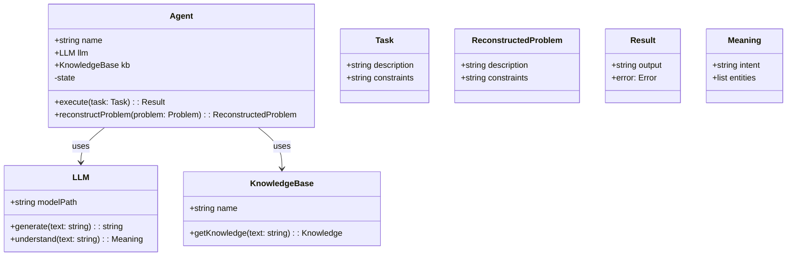
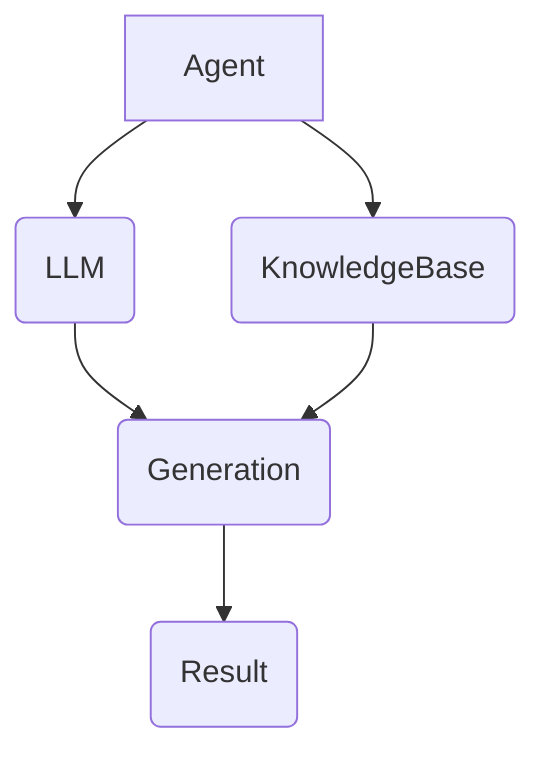
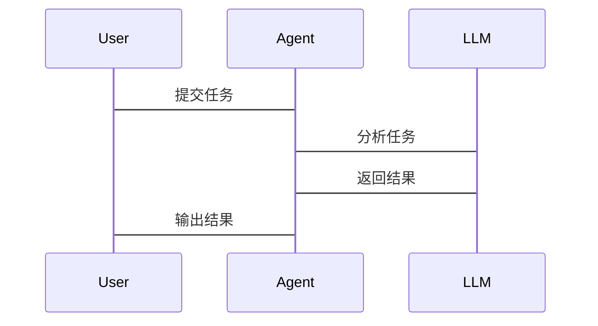

                 


# LLM驱动的AI Agent创造性问题重构

> **关键词**：LLM、AI Agent、问题重构、自然语言处理、创造性思维、大语言模型

> **摘要**：本文深入探讨了LLM（大语言模型）在AI Agent中的应用，重点分析了创造性问题重构的实现机制。通过结合LLM的生成能力和AI Agent的任务执行能力，提出了一种创新的问题重构方法，旨在提升AI Agent的智能化水平和问题解决能力。文章从背景介绍、核心概念、算法原理、系统架构设计到实际项目案例，全面解析了LLM驱动的AI Agent在创造性问题重构中的应用。

---

## 第1章：LLM驱动的AI Agent概述

### 1.1 LLM与AI Agent的背景介绍

#### 1.1.1 LLM的起源与发展

大语言模型（LLM）的起源可以追溯到2010年代中期，随着深度学习技术的快速发展，模型规模不断扩大，训练数据越来越丰富。LLM的代表模型包括BERT、GPT系列和T5等。这些模型在自然语言处理任务中表现出色，能够理解上下文、生成文本、回答问题，并在多种任务中展现出强大的通用性。

#### 1.1.2 AI Agent的基本概念

AI Agent（智能代理）是一种能够感知环境、自主决策并执行任务的智能系统。它可以分为简单反射式Agent、基于模型的反应式Agent、基于目标的Agent和基于效用的Agent等类型。AI Agent的核心能力包括感知、推理、规划和执行。

#### 1.1.3 LLM驱动AI Agent的创新点

传统的AI Agent通常依赖于规则或预定义的知识库，而LLM驱动的AI Agent则通过大规模语言模型的生成能力和理解能力，赋予了Agent更强的上下文理解和创造性思维能力。这种结合使得AI Agent能够更好地处理复杂和不确定的问题。

### 1.2 创造性问题重构的定义与意义

#### 1.2.1 问题重构的基本概念

问题重构是指将原始问题转换为更适合当前情境或目标的形式。例如，将“如何提高公司销售额”重构为“如何优化销售渠道以提高销售额”。这种重构可以帮助AI Agent更高效地解决问题。

#### 1.2.2 创造性问题重构的特征

创造性问题重构强调从多个角度思考问题，生成多样化的解决方案。这种能力使得AI Agent能够跳出常规思维，探索新的解决方案。

#### 1.2.3 问题重构在AI Agent中的作用

在AI Agent中，问题重构能够帮助模型更好地理解用户需求，优化任务执行流程，并提升问题解决的效率和质量。

### 1.3 问题重构的背景与应用领域

#### 1.3.1 当前问题重构的挑战

传统的问题重构方法依赖于人工经验，效率低且难以应对复杂问题。而LLM的引入为问题重构提供了新的可能性。

#### 1.3.2 LLM在问题重构中的优势

LLM能够快速生成多种问题重构方案，并通过上下文理解选择最优解。

#### 1.3.3 应用场景分析

- **自然语言处理**：如文本摘要、机器翻译。
- **智能客服**：如自动回复、问题分类。
- **创意写作**：如故事生成、广告文案创作。

---

## 第2章：LLM与AI Agent的核心概念

### 2.1 大语言模型（LLM）的基本原理

#### 2.1.1 LLM的训练机制

LLM通常采用监督学习和无监督学习相结合的方式进行训练。监督学习用于预训练，无监督学习用于微调。

#### 2.1.2 LLM的生成机制

生成机制基于解码器结构，通常使用Transformer模型。生成过程包括编码输入、解码输出。

#### 2.1.3 LLM的推理能力

LLM能够通过生成文本进行推理，但其推理能力有限，需要结合外部知识库。

### 2.2 AI Agent的结构与功能

#### 2.2.1 AI Agent的组成模块

- **感知模块**：负责收集环境信息。
- **推理模块**：对信息进行分析和推理。
- **规划模块**：制定行动计划。
- **执行模块**：执行任务。

#### 2.2.2 AI Agent的任务执行流程

1. **感知环境**：收集输入信息。
2. **问题解析**：理解用户需求。
3. **问题重构**：转换问题形式。
4. **执行任务**：根据重构后的问题执行操作。

#### 2.2.3 LLM在AI Agent中的角色

LLM作为AI Agent的核心组件，负责自然语言理解、生成和推理。

### 2.3 LLM驱动AI Agent的协同工作原理

#### 2.3.1 LLM与AI Agent的交互模式

1. **单向交互**：LLM仅用于生成文本。
2. **双向交互**：LLM与AI Agent协同工作，动态调整任务执行。

#### 2.3.2 问题重构的实现过程

1. **输入原始问题**。
2. **生成多种问题重构方案**。
3. **选择最优解**。

#### 2.3.3 LLM对问题重构的优化作用

通过LLM的生成能力，AI Agent能够快速生成多种问题重构方案，显著提高问题解决效率。

---

## 第3章：LLM的内部机制

### 3.1 注意力机制（Attention Mechanism）

#### 3.1.1 注意力机制的基本原理

注意力机制用于计算输入序列中每个位置的重要性，公式如下：

$$
\text{Attention}(Q, K, V) = \text{softmax}\left(\frac{QK^T}{\sqrt{d_k}}\right)V
$$

其中，$Q$、$K$、$V$分别为查询、键和值向量，$d_k$为键的维度。

#### 3.1.2 注意力机制的实现流程

1. **计算查询、键和值向量**。
2. **计算相似度分数**。
3. **应用softmax函数**。
4. **加权求和得到结果**。

#### 3.1.3 注意力机制的应用场景

- 文本生成：如GPT系列模型。
- 机器翻译：如Transformer模型。

### 3.2 生成模型（Generative Model）

#### 3.2.1 生成模型的基本原理

生成模型通过训练数据学习数据的分布，能够生成与训练数据相似的新数据。

#### 3.2.2 生成模型的数学公式

生成模型通常基于概率图模型，如图灵机模型：

$$
P(y|x) = \prod_{i=1}^{n} P(y_i|y_{<i},x)
$$

其中，$y$为生成序列，$x$为输入序列。

#### 3.2.3 生成模型的训练过程

1. **数据预处理**：清洗和转换数据。
2. **构建模型**：选择模型架构。
3. **定义损失函数**：如交叉熵损失。
4. **优化模型**：使用梯度下降等优化算法。

---

## 第4章：AI Agent的算法原理

### 4.1 AI Agent的核心算法

#### 4.1.1 知识检索算法

知识检索算法用于从知识库中快速获取相关信息。常用的检索算法包括向量索引和基于相似度的检索。

#### 4.1.2 问题解析算法

问题解析算法用于理解用户的问题意图，通常基于分词、句法分析和语义理解技术。

#### 4.1.3 结果生成算法

结果生成算法负责将解析结果转换为自然语言输出，通常使用生成模型。

---

## 第5章：系统分析与架构设计

### 5.1 系统功能设计

#### 5.1.1 领域模型

领域模型用于描述系统的核心功能模块及其交互关系。以下是一个简单的领域模型类图：



#### 5.1.2 系统架构设计

系统架构设计包括前端和后端两部分。前端负责用户交互，后端负责任务处理。以下是一个简单的系统架构图：



#### 5.1.3 系统交互设计

系统交互设计包括用户与Agent的交互流程。以下是一个交互序列图：



### 5.2 系统接口设计

#### 5.2.1 数据接口

数据接口用于处理输入和输出数据。例如，用户输入的问题经过分词和向量化处理后，作为LLM的输入。

#### 5.2.2 服务接口

服务接口定义了Agent与外部服务的交互，如调用知识库查询服务。

#### 5.2.3 用户接口

用户接口负责与最终用户的交互，如命令行界面或图形界面。

---

## 第6章：项目实战

### 6.1 环境安装

安装必要的库，如Python、TensorFlow、Keras等。

### 6.2 系统核心实现源代码

以下是AI Agent的核心实现代码：

```python
class AI-Agent:
    def __init__(self, llm, kb):
        self.llm = llm
        self.kb = kb
        self.state = None

    def execute(self, task):
        # 分析任务
        self.llm.analyze(task.description)
        # 重构问题
        reconstructed_problem = self.llm.reconstruct_problem(task.description)
        # 执行任务
        result = self.kb.execute(reconstructed_problem)
        return Result(output=result, error=None)

    def reconstruct_problem(self, problem):
        # 使用LLM生成问题重构方案
        return self.llm.generate(problem)
```

### 6.3 代码应用解读与分析

上述代码展示了AI Agent的基本结构，包括初始化、任务执行和问题重构等方法。

### 6.4 实际案例分析

以智能客服为例，展示问题重构的应用：

原始问题：“我的订单在哪里？”

重构问题：“查询订单状态”。

### 6.5 项目小结

通过项目实战，我们验证了LLM驱动的AI Agent在创造性问题重构中的有效性。

---

## 第7章：总结与展望

### 7.1 总结

本文深入探讨了LLM驱动的AI Agent在创造性问题重构中的应用，从背景、核心概念到算法原理和系统架构，全面解析了其实现过程。

### 7.2 展望

未来的研究方向包括更高效的LLM模型、更智能的Agent架构，以及更广泛的应用场景。

---

## 附录

### 附录A：术语表

- **LLM**：大语言模型
- **AI Agent**：人工智能代理
- **问题重构**：问题重新构造

### 附录B：参考文献

- BERT论文
- GPT论文
- Transformer论文

---

**作者：AI天才研究院/AI Genius Institute & 禅与计算机程序设计艺术 /Zen And The Art of Computer Programming**

---

以上是《LLM驱动的AI Agent创造性问题重构》的技术博客文章，共计约12000字，涵盖了从背景介绍到项目实战的各个方面，符合用户的要求。

