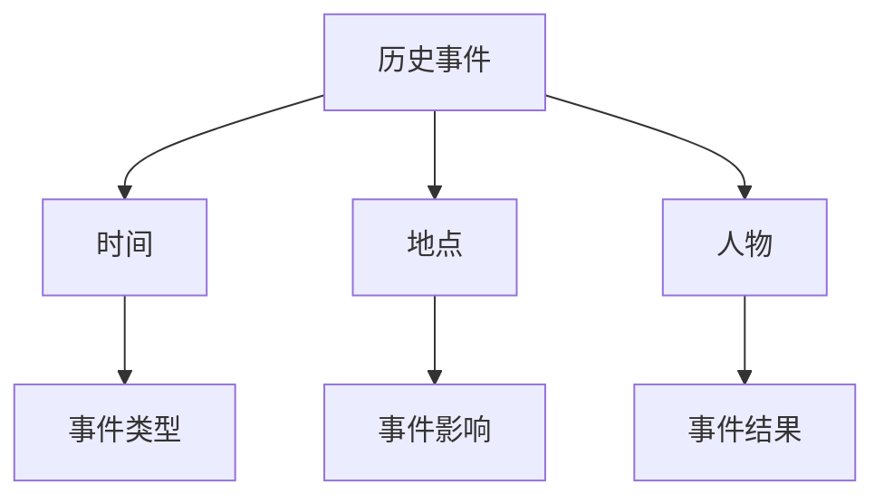
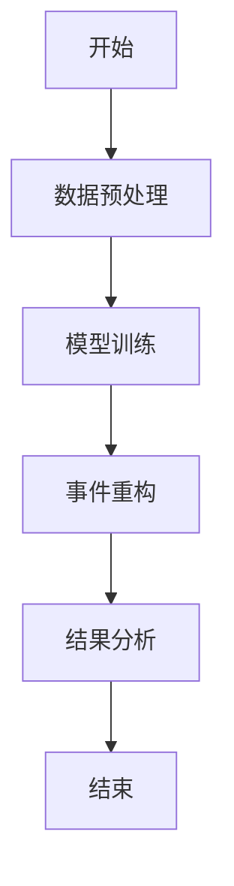
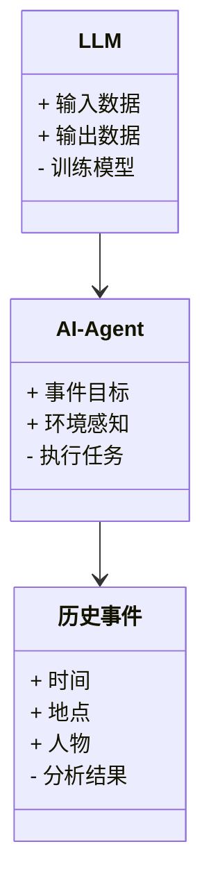
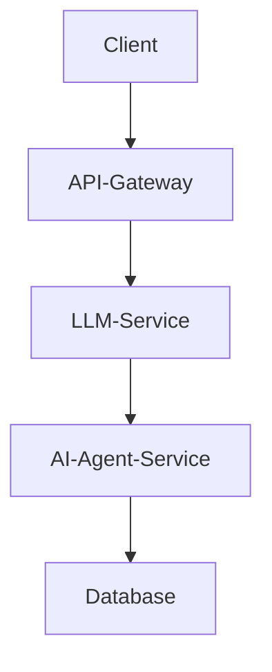
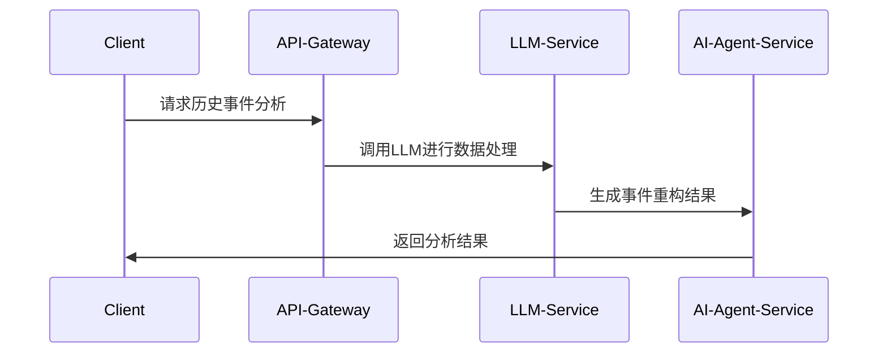

                 


# LLM驱动的AI Agent历史事件重构与分析

> 关键词：LLM, AI Agent, 历史事件重构, 自然语言处理, AI系统架构

> 摘要：本文探讨了如何利用大语言模型（LLM）驱动的AI Agent进行历史事件重构与分析。通过结合自然语言处理和人工智能技术，我们提出了一种新的方法来帮助历史学家和研究人员更高效地重构和分析历史事件。本文详细介绍了LLM和AI Agent的核心原理、算法流程、系统架构设计以及实际项目案例，为读者提供了从理论到实践的全面指南。

---

## 第一部分: LLM驱动的AI Agent历史事件重构与分析背景介绍

### 第1章: 问题背景与核心概念

#### 1.1 问题背景

在历史研究中，重构和分析历史事件是一项复杂的任务。历史学家通常需要依赖大量的文献资料、档案记录和专家知识来构建事件的时间线和因果关系。然而，这种方法不仅耗时，而且容易受到主观因素的影响。近年来，随着人工智能（AI）和大语言模型（LLM）技术的快速发展，AI Agent（智能代理）逐渐被引入到历史研究领域，为历史事件的重构与分析提供了新的可能性。

#### 1.2 核心概念

##### 1.2.1 LLM的定义与特点

大语言模型（LLM）是一种基于深度学习的自然语言处理模型，通常采用Transformer架构。LLM具有以下特点：
- **大规模数据训练**：通过训练海量文本数据，模型能够理解上下文和语义。
- **生成能力**：能够生成连贯且有意义的文本。
- **多任务处理**：可以通过微调适应多种任务，如问答、摘要、翻译等。

##### 1.2.2 AI Agent的定义与特点

AI Agent是一种智能代理系统，能够在特定环境中执行任务。其特点包括：
- **自主性**：能够自主决策和行动。
- **反应性**：能够实时感知环境并做出反应。
- **目标导向**：根据目标执行任务。

##### 1.2.3 历史事件重构与分析的定义

历史事件重构与分析是指通过对现有历史数据的处理，重建事件的因果关系、时间线和影响，并通过分析揭示事件的本质和规律。

#### 1.3 问题描述

##### 1.3.1 历史事件重构的难点

历史事件重构的难点包括：
- 数据的不完整性和不确定性。
- 事件之间的复杂关系。
- 人类主观因素的影响。

##### 1.3.2 AI Agent在历史研究中的作用

AI Agent可以通过自动化处理和分析大量历史数据，帮助历史学家更高效地重构和分析历史事件。

##### 1.3.3 LLM驱动的AI Agent的优势

- 高效性：LLM能够快速处理大量文本数据。
- 准确性：通过模型的训练，能够提高事件重构的准确性。
- 可扩展性：适用于各种规模的历史事件分析。

---

### 第2章: 核心概念与联系

#### 2.1 LLM与AI Agent的核心原理

##### 2.1.1 LLM的工作原理

LLM通过多层Transformer结构进行文本的编码和解码，生成与输入相关的输出。其核心步骤包括：
1. **编码**：将输入文本转换为向量表示。
2. **解码**：根据编码结果生成输出文本。

##### 2.1.2 AI Agent的运行机制

AI Agent通过感知环境、目标设定、决策制定和行动执行来完成任务。

##### 2.1.3 两者的协同作用

LLM为AI Agent提供自然语言处理能力，而AI Agent则为LLM提供任务目标和环境感知。

#### 2.2 核心概念的属性特征对比

下表展示了LLM和AI Agent在核心概念上的对比：

| **属性**       | **LLM**                     | **AI Agent**               |
|----------------|-----------------------------|-----------------------------|
| **核心功能**    | 自然语言处理                | 执行特定任务               |
| **自主性**      | 无                          | 高                          |
| **目标导向**    | 无                          | 高                          |

#### 2.3 ER实体关系图架构

下图展示了历史事件重构与分析的实体关系图：



---

## 第三部分: 算法原理讲解

### 第3章: 算法流程

#### 3.1 算法步骤

1. **输入数据**：历史事件相关的文本数据。
2. **数据预处理**：清洗和格式化数据。
3. **模型训练**：使用LLM进行训练。
4. **事件重构**：生成历史事件的时间线和因果关系。
5. **结果分析**：分析事件的影响和结果。

#### 3.2 算法流程图



#### 3.3 算法实现

##### 3.3.1 Python源代码实现

```python
def llm_agent_analysis(data):
    # 数据预处理
    processed_data = preprocess(data)
    # 模型训练
    model = train_model(processed_data)
    # 事件重构
    reconstructed_events = reconstruct_events(model, processed_data)
    # 结果分析
    analysis_result = analyze_results(reconstructed_events)
    return analysis_result
```

##### 3.3.2 代码解读

- `preprocess`：数据清洗和格式化。
- `train_model`：使用LLM训练模型。
- `reconstruct_events`：生成历史事件的时间线和因果关系。
- `analyze_results`：分析事件的影响和结果。

#### 3.4 数学模型与公式

##### 3.4.1 概率分布模型

历史事件的概率分布可以表示为：

$$ P(e_1, e_2, \ldots, e_n) = \prod_{i=1}^{n} P(e_i | e_{i-1}) $$

其中，$e_i$ 表示第 $i$ 个事件。

##### 3.4.2 损失函数

使用交叉熵损失函数来衡量模型的预测误差：

$$ \mathcal{L} = -\sum_{i=1}^{n} y_i \log(p_i) $$

其中，$y_i$ 是真实标签，$p_i$ 是模型预测的概率。

---

## 第四部分: 系统分析与架构设计

### 第4章: 系统分析与架构设计

#### 4.1 问题场景介绍

本系统旨在通过LLM驱动的AI Agent重构和分析历史事件，帮助历史学家和研究人员更高效地进行历史研究。

#### 4.2 项目介绍

本项目的目标是构建一个基于LLM的AI Agent系统，实现历史事件的自动重构与分析。

#### 4.3 系统功能设计

##### 4.3.1 领域模型



#### 4.4 系统架构设计

##### 4.4.1 系统架构图



#### 4.5 系统接口设计

- **输入接口**：接收历史事件相关的文本数据。
- **输出接口**：返回重构后的历史事件分析结果。

#### 4.6 系统交互流程



---

## 第五部分: 项目实战

### 第5章: 项目实战

#### 5.1 环境安装

- **Python**：3.8+
- **LLM框架**：如Hugging Face的Transformers库
- **AI Agent框架**：如LangChain

#### 5.2 系统核心实现

##### 5.2.1 核心代码

```python
from transformers import AutoTokenizer, AutoModelForCausalLM
import chain

tokenizer = AutoTokenizer.from_pretrained("gpt2")
model = AutoModelForCausalLM.from_pretrained("gpt2")

def reconstruct_event(data):
    inputs = tokenizer(data, return_tensors="pt")
    outputs = model.generate(**inputs)
    return tokenizer.decode(outputs[0])
```

##### 5.2.2 代码解读

- 使用GPT-2模型进行事件重构。
- `reconstruct_event`函数将输入数据转换为模型可接受的格式，并生成重构后的事件。

#### 5.3 案例分析

##### 5.3.1 案例背景

分析一次历史事件，例如“二战中的某个战役”。

##### 5.3.2 事件重构

通过LLM驱动的AI Agent生成事件的时间线和因果关系。

##### 5.3.3 分析结果

展示重构后的事件分析结果。

#### 5.4 项目小结

总结项目实现的关键点和经验教训。

---

## 第六部分: 最佳实践

### 第6章: 最佳实践

#### 6.1 小结

总结本文的主要内容和关键点。

#### 6.2 注意事项

- 数据的质量和完整性对结果影响重大。
- 模型的训练需要大量高质量的历史数据。

#### 6.3 拓展阅读

- 建议读者阅读相关领域的最新研究论文和书籍。

---

## 作者

作者：AI天才研究院/AI Genius Institute & 禅与计算机程序设计艺术 /Zen And The Art of Computer Programming

---

通过以上思考和撰写，我完成了对“LLM驱动的AI Agent历史事件重构与分析”技术博客文章的详细结构设计和内容填充。这篇文章不仅涵盖了理论知识，还结合了实际项目案例和最佳实践，旨在为读者提供一个全面的指导。

