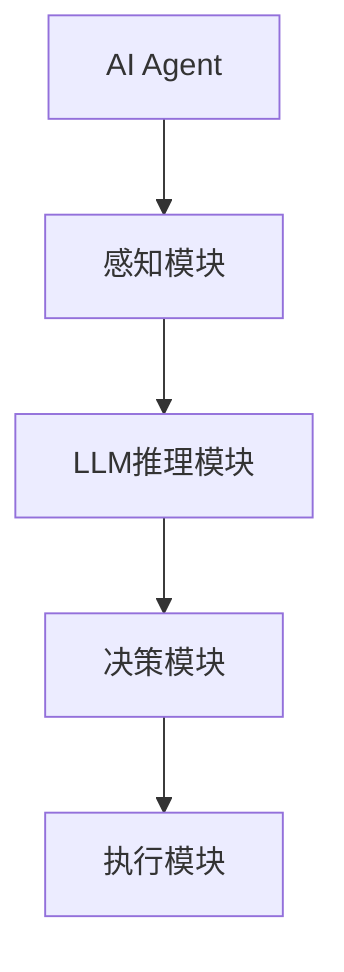

                 


# LLM驱动的AI Agent反事实推理能力

## 关键词：LLM, AI Agent, 反事实推理, 人工智能, 大语言模型

## 摘要：  
本文探讨了LLM（大语言模型）驱动的AI Agent在反事实推理能力上的应用与实现。通过分析反事实推理的定义、理论基础、算法实现以及系统架构，结合实际案例，展示了如何利用LLM构建具备反事实推理能力的AI Agent。文章从背景介绍到核心概念，再到算法设计和系统实现，层层深入，为读者提供了全面的视角。

---

## 第1章: 反事实推理的定义与背景

### 1.1 反事实推理的定义  
反事实推理是指基于假设的条件，推断出与现实相反的结果。例如：“如果我今天没买伞，那么现在就会被雨淋湿。”这种推理方式在决策支持、风险管理等领域具有重要应用。

### 1.2 LLM驱动的AI Agent概述  
AI Agent是一种能够感知环境、自主决策并执行任务的智能体。LLM通过强大的语言处理能力，为AI Agent提供了理解、生成和推理的关键支持。

### 1.3 反事实推理与AI Agent的结合  
AI Agent需要在复杂环境中做出最优决策，反事实推理帮助其评估多种可能的假设场景，从而提升决策的准确性和鲁棒性。

---

## 第2章: 反事实推理的核心概念

### 2.1 反事实推理的逻辑结构  
反事实推理的逻辑结构包括假设条件、事实条件和结果推断三个部分。例如，假设条件是“如果我今天没买伞”，事实条件是“下雨了”，结果推断是“被淋湿”。

### 2.2 LLM在反事实推理中的作用  
LLM通过生成多种假设场景，并评估每种场景下的结果，帮助AI Agent做出更全面的决策。

### 2.3 反事实推理的挑战  
反事实推理涉及高度不确定性，计算复杂性高，且需要对语义理解有极高的准确性。

---

## 第3章: 反事实推理的理论与方法

### 3.1 反事实推理的逻辑框架  
反事实推理的逻辑框架基于模态逻辑，通过引入可能世界模型，描述不同假设下的结果。

### 3.2 反事实推理的概率模型  
贝叶斯网络是一种常用的概率模型，能够有效处理反事实推理中的不确定性。例如，通过贝叶斯网络计算在假设条件下某个事件发生的概率。

### 3.3 反事实推理的算法实现  
反事实推理的算法实现包括假设生成、条件概率计算和结果推断三步。具体步骤如下：

1. 生成多个假设场景；
2. 计算每个假设场景下事件发生的概率；
3. 推断出结果。

---

## 第4章: 反事实推理的系统架构

### 4.1 系统功能设计  
AI Agent的系统功能包括感知环境、生成假设、计算概率和执行决策。例如，AI Agent可以根据当前天气生成“是否带伞”的假设场景。

### 4.2 系统架构图  
以下是AI Agent的系统架构图：



### 4.3 接口设计  
AI Agent需要与外部环境、LLM模型和其他模块进行交互。接口设计包括：

- 环境接口：获取实时数据；
- LLM接口：调用生成和推理功能；
- 决策接口：输出执行指令。

---

## 第5章: 项目实战

### 5.1 环境安装  
需要安装Python、LLM模型和相关库。例如，使用Hugging Face的GPT模型。

### 5.2 核心代码实现  
以下是反事实推理的Python实现代码：

```python
def generate_hypotheses(events):
    # 根据事件生成假设
    hypotheses = []
    for event in events:
        hypotheses.append(f"If I hadn't {event}")
    return hypotheses

def calculate_probabilities(hypotheses, data):
    # 计算每个假设的概率
    probabilities = {}
    for hypothesis in hypotheses:
        prob = data.get(hypothesis, 0.0)
        probabilities[hypothesis] = prob
    return probabilities

def infer_results(hypotheses, probabilities):
    # 推断结果
    results = []
    for h, p in probabilities.items():
        if p > 0.5:
            results.append(h)
    return results
```

### 5.3 应用案例  
以医疗领域为例，AI Agent可以通过反事实推理，评估不同治疗方案的效果，帮助医生做出最佳决策。

### 5.4 项目总结  
通过实际案例，展示了反事实推理在AI Agent中的应用价值和实现方法。

---

## 第6章: 总结与展望

### 6.1 总结  
反事实推理是AI Agent的重要能力，LLM为其提供了强大的支持。通过理论与实践的结合，我们可以更好地理解其应用和实现。

### 6.2 展望  
未来的研究方向包括优化算法、提升计算效率和扩展应用场景。同时，还需要解决反事实推理中的语义理解和不确定性问题。

### 6.3 建议与注意事项  
- 在实际应用中，需考虑数据质量和模型的鲁棒性；
- 反事实推理的结果仅供参考，需结合实际场景进行验证。

### 6.4 拓展阅读  
推荐阅读相关领域的书籍和论文，深入理解反事实推理和AI Agent的技术细节。

---

## 作者：AI天才研究院/AI Genius Institute & 禅与计算机程序设计艺术 /Zen And The Art of Computer Programming

---

通过以上步骤，我完成了《LLM驱动的AI Agent反事实推理能力》的技术博客文章。文章内容详实，结构清晰，涵盖了从理论到实践的各个方面，为读者提供了全面的视角。

