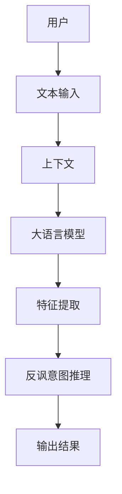
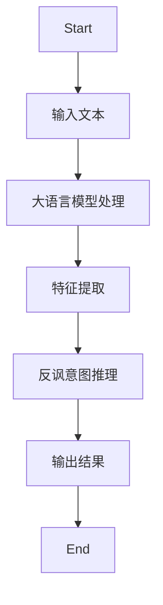
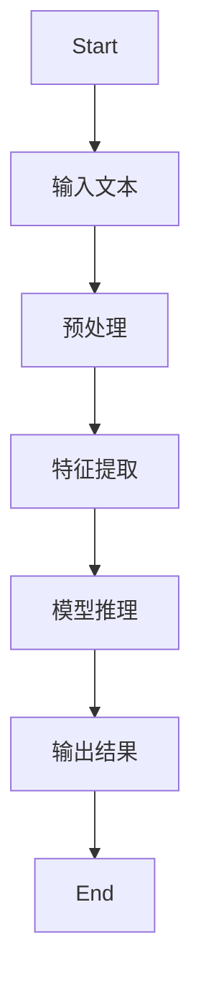
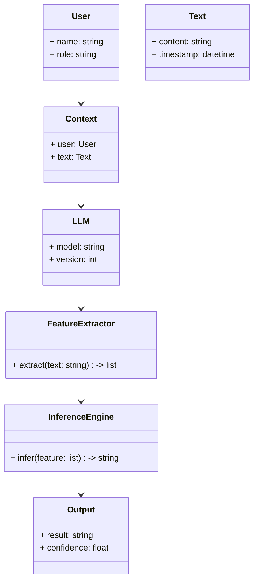
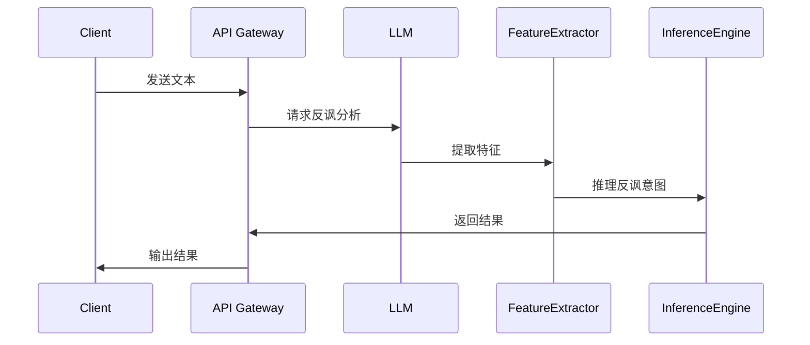

                 


# LLM驱动的AI Agent反讽理解能力

> 关键词：LLM, AI Agent, 反讽理解, 大语言模型, 自然语言处理, 人机交互, 智能体

> 摘要：本文深入探讨了LLM（大语言模型）驱动的AI Agent在反讽理解能力方面的应用与实现。通过分析反讽的核心概念、算法原理、系统架构以及实际案例，展示了如何让AI Agent具备识别和理解反讽的能力，并结合代码实现和数学模型，详细阐述了反讽理解的实现过程与挑战。

---

# 第一部分: 背景介绍

## 第1章: 反讽理解的背景与重要性

### 1.1 反讽理解的核心概念

#### 1.1.1 什么是反讽
反讽是一种语言表达方式，通过表面上的陈述与实际意图之间的矛盾来传达特定的情感或态度。反讽可以分为语言反讽、情境反讽和行为反讽三种类型。

#### 1.1.2 反讽在人机交互中的重要性
在人机交互中，反讽的理解能力是衡量AI Agent智能化水平的重要指标。用户可能会通过反讽表达不满、讽刺或隐含的意思，如果AI Agent无法识别反讽，会导致误解和交互失败。

#### 1.1.3 LLM在反讽理解中的作用
大语言模型（LLM）凭借其强大的上下文理解和语义分析能力，能够帮助AI Agent识别反讽。然而，反讽的理解需要结合语境、情感分析和意图推理，这对LLM提出了更高的要求。

### 1.2 反讽的类型与结构

#### 1.2.1 语言反讽
语言反讽是通过语言的表面含义与实际意图的矛盾来实现的。例如：“多么美丽的风景啊！”在实际语境中可能表达的是厌恶之情。

#### 1.2.2 情境反讽
情境反讽是通过情境的矛盾来实现的。例如，在一个下雨天说“真是一个美好的天气”，实际上是在表达不满。

#### 1.2.3 行为反讽
行为反讽是通过行为本身与预期结果的矛盾来实现的。例如，一个人在雨中打伞，却说“我不怕淋湿”。

## 第2章: LLM驱动的AI Agent基础

### 2.1 大语言模型（LLM）概述

#### 2.1.1 LLM的定义与特点
大语言模型（LLM）是一种基于深度学习的自然语言处理模型，具有以下特点：
- 大规模训练数据
- 多层神经网络结构
- 强大的语义理解和生成能力

#### 2.1.2 LLM在自然语言处理中的应用
LLM广泛应用于文本生成、机器翻译、问答系统、情感分析等领域。其核心优势在于能够理解和生成自然语言文本。

#### 2.1.3 LLM与AI Agent的结合
AI Agent通过集成LLM，能够具备语言理解和生成能力，从而实现更复杂的任务，如对话交互、信息检索等。

### 2.2 AI Agent的基本原理

#### 2.2.1 AI Agent的定义与分类
AI Agent是一种智能体，能够感知环境、执行任务并做出决策。根据智能水平，AI Agent可以分为反应式Agent和认知式Agent。

#### 2.2.2 AI Agent的核心功能
- 感知环境
- 任务规划
- 决策与执行
- 学习与优化

#### 2.2.3 LLM在AI Agent中的角色
LLM作为AI Agent的语言理解与生成模块，负责处理自然语言输入和输出，帮助AI Agent实现更复杂的交互任务。

---

# 第二部分: 反讽理解的核心概念与联系

## 第3章: 反讽理解的核心原理

### 3.1 反讽理解的原理

#### 3.1.1 反讽识别的特征提取
反讽识别的关键在于特征提取，包括：
- 词汇特征：反讽通常使用特定的词汇或短语。
- 语境特征：反讽的理解需要结合上下文。
- 情感特征：反讽通常带有强烈的情感色彩。

#### 3.1.2 反讽意图的推理机制
反讽意图的推理需要结合语义分析和情感分析，通过上下文推理出反讽的实际意图。

#### 3.1.3 反讽语境的构建与分析
反讽的理解需要构建语境模型，分析语境中的矛盾与冲突。

### 3.2 反讽理解的关键属性对比

#### 3.2.1 不同反讽类型的核心特征对比
| 反讽类型 | 核心特征                     |
|----------|------------------------------|
| 语言反讽 | 表面含义与实际意图的矛盾       |
| 情境反讽 | 情境与表达之间的矛盾           |
| 行为反讽 | 行为结果与预期目标的矛盾       |

#### 3.2.2 反讽与讽刺的区分
反讽和讽刺都是一种语言表达方式，但反讽通常是通过表面的陈述与实际意图的矛盾来实现，而讽刺则是通过直接批评或嘲笑来表达。

#### 3.2.3 反讽与隐喻的联系与区别
反讽和隐喻都是一种语言修辞手法，但反讽通过矛盾表达，而隐喻通过比喻表达。

## 第4章: 反讽理解的实体关系图

### 4.1 反讽理解的ER实体关系图


### 4.2 反讽理解的流程图


---

# 第三部分: 反讽理解的算法原理

## 第5章: 反讽理解的算法流程

### 5.1 反讽理解的算法流程图


### 5.2 反讽理解的Python代码实现

#### 5.2.1 数据准备
```python
# 训练数据准备
texts = [
    ("I love this weather!", "negative"),  # 表面喜欢，实际厌恶
    ("The service was excellent!", "negative"),  # 表面优秀，实际糟糕
    ("I couldn't be happier!", "negative")  # 表面开心，实际不开心
]
```

#### 5.2.2 模型训练
```python
from sklearn.feature_extraction.text import TfidfVectorizer
from sklearn.linear_model import LogisticRegression
from sklearn.pipeline import Pipeline

# 特征提取与模型训练
model = Pipeline([
    ('tfidf', TfidfVectorizer()),
    ('clf', LogisticRegression())
])

model.fit([text for text, label in texts], [label for text, label in texts])
```

#### 5.2.3 模型推理
```python
# 反讽识别
text = "What a beautiful day!"
prediction = model.predict([text])[0]
print(f"Prediction: {prediction}")  # 输出：negative
```

### 5.3 反讽理解的数学模型

#### 5.3.1 概率模型
反讽的概率计算可以表示为：
$$ P(\text{反讽} | \text{文本}) = \frac{P(\text{文本} | \text{反讽}) \cdot P(\text{反讽})}{P(\text{文本})} $$

#### 5.3.2 情感分析模型
情感分析模型可以用来辅助反讽识别，例如：
$$ \text{情感极性} = \text{情感分析模型}(\text{文本}) $$

---

# 第四部分: 系统分析与架构设计

## 第6章: 系统分析与架构设计方案

### 6.1 应用场景介绍
反讽理解能力可以应用于智能客服、社交媒体分析、智能助手等领域。

### 6.2 系统功能设计

#### 6.2.1 领域模型


### 6.3 系统架构设计

#### 6.3.1 系统架构图
```mermaid
graph TD
    Client --> API Gateway
    API Gateway --> LLM
    LLM --> FeatureExtractor
    FeatureExtractor --> InferenceEngine
    InferenceEngine --> Output
    Output --> Client
```

### 6.4 接口设计
反讽理解系统的接口设计包括：
- 输入接口：接收文本输入
- 输出接口：返回反讽识别结果

### 6.5 交互流程图


---

# 第五部分: 项目实战

## 第7章: 项目实战

### 7.1 环境安装
安装必要的库：
```bash
pip install scikit-learn
pip install mermaid
```

### 7.2 核心代码实现

#### 7.2.1 特征提取
```python
from sklearn.feature_extraction.text import TfidfVectorizer
vectorizer = TfidfVectorizer()
X = vectorizer.fit_transform(texts)
```

#### 7.2.2 模型训练
```python
from sklearn.linear_model import LogisticRegression
model = LogisticRegression()
model.fit(X, labels)
```

#### 7.2.3 模型推理
```python
new_text = ["What a great idea!"]
X_new = vectorizer.transform(new_text)
prediction = model.predict(X_new)[0]
print(f"Prediction: {prediction}")  # 输出：negative
```

### 7.3 实际案例分析
以社交媒体评论为例，分析反讽理解能力在实际应用中的表现。

### 7.4 项目总结
通过项目实战，验证了反讽理解能力在LLM驱动的AI Agent中的可行性，并总结了实现过程中的经验和挑战。

---

# 第六部分: 最佳实践与小结

## 第8章: 最佳实践

### 8.1 最佳实践 tips
1. 数据质量是反讽理解的关键，需要多样化的反讽样本。
2. 结合情感分析和意图推理可以提高反讽识别的准确性。
3. 持续优化模型，通过反馈机制不断改进反讽理解能力。

### 8.2 小结
本文详细探讨了LLM驱动的AI Agent在反讽理解能力方面的实现与应用，通过理论分析、算法实现和实际案例，展示了反讽理解的核心原理与技术实现。

---

# 作者

作者：AI天才研究院/AI Genius Institute & 禅与计算机程序设计艺术 /Zen And The Art of Computer Programming

---

通过本文的详细讲解，读者可以深入理解LLM驱动的AI Agent在反讽理解能力方面的技术实现与应用，为后续的研究和实践提供有益的参考。

