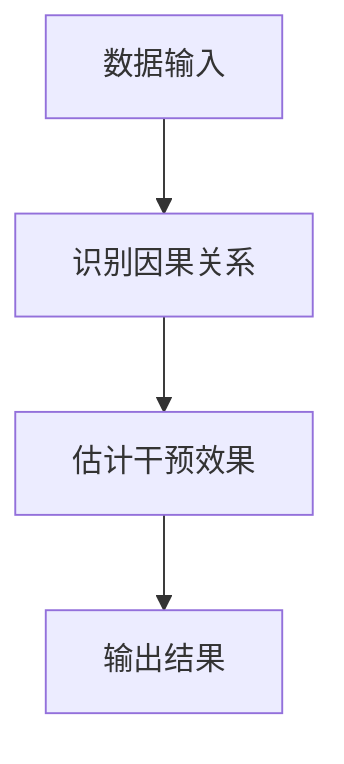
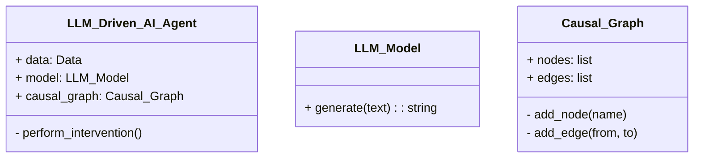

                 


# LLM驱动的AI Agent因果推理与干预

> 关键词：LLM，AI Agent，因果推理，干预，因果图，结构方程模型，潜在结果框架

> 摘要：本文将探讨如何利用大语言模型（LLM）驱动的AI Agent进行因果推理与干预。通过分析因果推理的核心原理、算法实现、系统架构设计以及实际案例，本文旨在为读者提供从理论到实践的全面指导，帮助他们理解如何通过因果推理提升AI Agent的决策能力，并实现有效的干预策略。

---

## 第一部分: 背景介绍

### 第1章: LLM与AI Agent概述

#### 1.1 LLM驱动的AI Agent基本概念
- **大语言模型（LLM）**：LLM是指基于深度学习的大规模语言模型，如GPT系列、BERT系列等。这些模型通过大量的训练数据，能够理解和生成人类语言，并在多种任务中表现出色。
- **AI Agent**：AI Agent是一种智能体，能够感知环境、执行任务并做出决策。它可以是一个软件系统，通过与用户或环境交互，完成特定目标。
- **结合方式**：LLM驱动的AI Agent通过将LLM作为核心组件，利用其语言理解和生成能力，提升AI Agent的自然语言处理和决策能力。

#### 1.2 因果推理与干预的背景
- **因果推理**：因果推理是指从数据中推断因果关系的能力，例如确定变量之间的因果关系。与相关关系不同，因果推理关注的是“为什么”某个现象发生，而不仅仅是“相关”。
- **干预**：干预是指在因果关系中，主动改变某个变量以观察其对其他变量的影响。干预是因果推理的重要应用，能够帮助我们更好地理解变量之间的关系，并做出更有效的决策。
- **应用场景**：在医疗领域，因果推理可以帮助确定某种药物对患者的具体影响；在金融领域，可以用于风险评估和投资决策；在教育领域，可以用于优化教学策略。

#### 1.3 问题背景与问题描述
- **当前AI Agent的局限性**：传统的AI Agent通常依赖于基于统计的相关性分析，无法有效理解和处理因果关系，导致在复杂场景下的决策能力有限。
- **因果推理的必要性**：因果推理能够帮助AI Agent理解变量之间的因果关系，从而做出更合理的决策。
- **干预的重要性**：干预是因果推理的核心应用之一，能够帮助我们验证因果关系，并在实际场景中实现目标优化。

#### 1.4 问题解决与边界
- **如何提升AI Agent的决策能力**：通过引入因果推理，AI Agent能够更好地理解和处理因果关系，从而做出更合理的决策。
- **干预的边界**：干预的有效性依赖于对因果关系的准确理解，而因果关系的复杂性可能限制干预的效果。此外，干预可能涉及伦理和法律问题，需要谨慎处理。
- **可行性分析**：基于LLM的AI Agent在因果推理与干预方面具有潜力，但需要克服技术、数据和伦理等多方面的挑战。

---

## 第二部分: 核心概念与联系

### 第2章: 因果推理的核心原理
- **因果关系的定义与特征**：因果关系是指一个事件（原因）导致另一个事件（结果）发生的必然联系。因果关系具有方向性、可传递性和可逆性等特征。
- **因果图的基本结构与解释**：因果图（Causal Graph）是一种用于表示因果关系的图形模型。节点表示变量，边表示因果关系。通过分析因果图的结构，可以推断因果关系。
- **结构方程模型（SEM）**：结构方程模型是一种用于描述因果关系的数学模型，通过方程组的形式表示变量之间的因果关系。

### 第3章: 干预的数学模型与因果关系
- **潜在结果框架（Potential Outcome Framework）**：潜在结果框架是一种用于分析干预效果的数学模型。通过定义每个单位在干预和对照组下的潜在结果，可以估计干预的平均效果。
- **因果效应的计算公式**：
  - 平均治疗效应（ATE）：$$ATE = E[Y^{t} - Y^{c}]$$
  - 平均净效应（ANQ）：$$ANQ = E[Y^{t} \cdot D - Y^{c} \cdot (1-D)]$$
  - 其中，$$D$$表示干预变量，$$Y^{t}$$和$$Y^{c}$$分别表示干预和对照组下的结果变量。
- **干预在因果推理中的数学表达**：通过潜在结果框架和结构方程模型，可以将干预的效果表示为变量之间的数学关系。

### 第4章: LLM与因果推理的结合
- **LLM在因果推理中的作用**：LLM可以用于生成因果关系的自然语言描述，并帮助构建因果图和结构方程模型。
- **基于LLM的因果推理模型构建**：通过将LLM与因果推理算法结合，可以实现对因果关系的自动识别和建模。
- **干预策略生成**：基于因果推理的结果，LLM可以生成干预策略，并评估其效果。

---

## 第三部分: 算法原理讲解

### 第5章: 因果推理算法原理
- **基本算法**：
  - **Do-Why算法**：通过观察数据，识别因果关系，并估计干预效果。
  - **Backdoor Criterion**：通过调整控制变量，消除混杂因素，识别因果效应。
  - **Frontdoor Criterion**：通过观察和干预，识别因果效应。
- **基于LLM的改进算法**：通过结合LLM的自然语言理解和生成能力，改进因果推理算法的性能和可解释性。

#### 5.1 Do-Why算法的mermaid流程图


#### 5.2 基于LLM的因果推理算法改进
- **改进点**：通过LLM生成因果关系的自然语言描述，并辅助算法进行因果关系的识别和建模。
- **代码示例**：
  ```python
  def do_while_algorithm(data):
      # 识别因果关系
      causal_relationships = identify_causal_links(data)
      # 估计干预效果
      intervention_effect = estimate_effect(causal_relationships)
      return intervention_effect
  ```

---

## 第四部分: 系统分析与架构设计

### 第6章: 系统功能设计
- **领域模型**：通过mermaid类图展示系统的功能模块和交互流程。
- **系统架构设计**：通过mermaid架构图展示系统的整体架构和模块之间的关系。
- **系统接口设计**：定义系统与外部组件的接口，如数据输入、模型调用和结果输出。

#### 6.1 系统功能设计的mermaid类图


---

## 第五部分: 项目实战

### 第7章: 项目实战与案例分析
- **环境安装**：安装必要的库，如Python的`numpy`、`pandas`、`scikit-learn`和`networkx`。
- **核心代码实现**：
  ```python
  import networkx as nx

  def build_causal_graph(data):
      graph = nx.DiGraph()
      for cause, effect in identify_causal_links(data):
          graph.add_edge(cause, effect)
      return graph
  ```
- **案例分析**：以医疗领域为例，展示如何利用LLM驱动的AI Agent进行因果推理与干预。
- **结果解读**：分析干预效果，并验证因果关系的正确性。

---

## 第六部分: 最佳实践与总结

### 第8章: 最佳实践与总结
- **小结**：总结全文的核心内容和主要观点。
- **注意事项**：在实际应用中，需要注意数据质量、因果关系的复杂性以及伦理问题。
- **未来研究方向**：探索更高效的因果推理算法，以及如何将因果推理应用于更多领域。

---

## 作者信息

作者：AI天才研究院/AI Genius Institute & 禅与计算机程序设计艺术 /Zen And The Art of Computer Programming

---

通过以上思考过程，我们可以系统地理解如何利用LLM驱动的AI Agent进行因果推理与干预，并通过实际案例和系统设计，帮助读者更好地掌握相关知识和技能。

