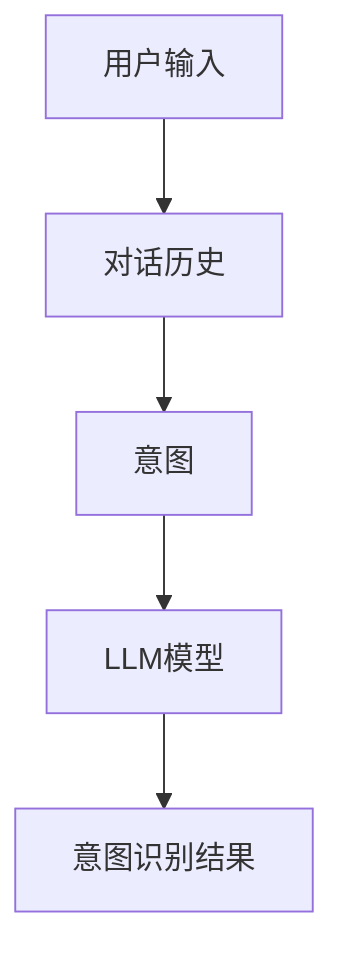
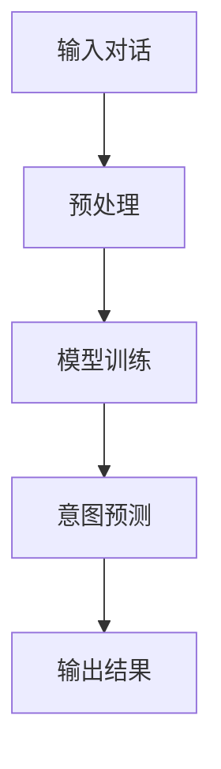

                 

# LLM驱动的AI Agent对话意图识别

> 关键词：LLM, AI Agent, 对话意图识别, 大语言模型, 人机交互, 自然语言处理, 智能对话系统

> 摘要：本文详细探讨了大语言模型（LLM）驱动的AI Agent在对话意图识别中的应用。通过分析对话意图识别的核心问题，阐述了LLM在其中的关键作用，并结合实际案例，讲解了算法原理、系统架构和项目实现。文章内容涵盖背景介绍、核心概念、算法流程、系统设计、项目实战及总结，旨在为读者提供全面的技术指导。

---

# 第一部分: 背景与概念

## 第1章: 背景介绍

### 1.1 问题背景
#### 1.1.1 当前对话系统的发展现状
随着自然语言处理技术的飞速发展，对话系统逐渐从简单的规则匹配转向基于深度学习的复杂模型。然而，现有的对话系统在意图识别和上下文理解方面仍存在诸多不足，难以应对复杂多变的用户需求。

#### 1.1.2 大语言模型的崛起与应用
大语言模型（LLM）如GPT-3、GPT-4的出现，为对话系统带来了革命性的变化。LLM的强大生成能力和上下文理解能力，使其在对话意图识别中展现出巨大潜力。

#### 1.1.3 AI Agent在人机交互中的作用
AI Agent作为人机交互的核心桥梁，能够通过意图识别、上下文理解和任务执行，为用户提供更智能、更自然的对话体验。

### 1.2 问题描述
#### 1.2.1 对话意图识别的核心问题
对话意图识别旨在理解用户在对话中的真实需求和目标，这是实现智能对话系统的关键一步。

#### 1.2.2 LLM在对话意图识别中的优势
LLM具有强大的语义理解和生成能力，能够处理复杂的上下文信息，显著提升了意图识别的准确性和鲁棒性。

#### 1.2.3 当前技术的局限性与挑战
现有技术在处理多轮对话、模糊意图和领域迁移方面仍存在不足，如何进一步优化LLM驱动的意图识别算法，是当前研究的热点和难点。

### 1.3 问题解决
#### 1.3.1 LLM驱动AI Agent的解决方案
通过将LLM嵌入AI Agent系统，构建高效的对话意图识别模块，能够显著提升对话系统的智能性和用户体验。

#### 1.3.2 对话意图识别的实现路径
从数据准备、模型训练到结果优化，系统化地构建意图识别流程，确保每一步骤的准确性和高效性。

#### 1.3.3 技术实现的关键点
重点包括数据预处理、模型调优、意图分类和结果反馈等关键环节。

### 1.4 边界与外延
#### 1.4.1 对话意图识别的边界条件
明确意图识别的适用范围和限制条件，避免超出模型能力的应用场景。

#### 1.4.2 相关技术的外延分析
探讨与意图识别相关的技术，如实体识别、情感分析和对话生成等，分析其对整体系统的影响。

#### 1.4.3 与其他任务的区分与联系
明确意图识别与其他对话任务的区分与联系，避免混淆和误用。

### 1.5 概念结构与核心要素
#### 1.5.1 对话意图识别的核心要素
包括用户输入、对话历史、意图标签和模型输出等关键要素。

#### 1.5.2 LLM在其中的角色与作用
作为意图识别的核心模块，LLM负责理解和生成对话内容，是系统的关键驱动力。

#### 1.5.3 AI Agent的整体架构
介绍AI Agent的总体架构，包括输入处理、意图识别、任务执行和输出反馈等模块。

### 1.6 本章小结
总结本章内容，强调LLM在对话意图识别中的重要性，为后续章节的展开奠定基础。

---

## 第2章: 核心概念与联系

### 2.1 LLM与AI Agent的关系
#### 2.1.1 LLM作为AI Agent的核心模块
详细探讨LLM在AI Agent中的地位和作用，分析其如何通过自然语言处理能力提升对话体验。

#### 2.1.2 AI Agent的其他组成部分
介绍AI Agent的其他关键模块，如对话管理、任务执行和反馈机制等。

#### 2.1.3 LLM与AI Agent的协同工作
分析LLM与其他模块的协同工作模式，探讨如何通过优化各模块的交互提升整体性能。

### 2.2 对话意图识别的核心原理
#### 2.2.1 对话上下文的构建
阐述如何通过对话历史和上下文信息构建完整的对话场景，为意图识别提供必要的信息支持。

#### 2.2.2 意图识别的算法流程
详细讲解意图识别的算法流程，包括数据预处理、特征提取和模型训练等关键步骤。

#### 2.2.3 输出结果的处理与反馈
探讨意图识别结果的处理方式，以及如何通过反馈机制优化系统性能。

### 2.3 核心概念对比表格
| 对比维度 | LLM | 传统NLP模型 |
|----------|-----|-------------|
| 处理能力 | 强大语义理解 | 基于规则或浅层特征 |
| 训练数据 | 大规模文本数据 | 小规模标注数据 |
| 灵活性 | 高度灵活，支持多任务 | 任务独立性较强 |
| 资源需求 | 高计算资源需求 | 较低计算资源需求 |

### 2.4 ER实体关系图

### 2.5 本章小结
总结本章内容，强调LLM与AI Agent协同工作的核心原理，为后续算法实现提供理论基础。

---

## 第3章: 算法原理讲解

### 3.1 对话意图识别的算法流程
#### 3.1.1 数据预处理
包括数据清洗、分词、去停用词等步骤，为模型训练提供高质量的数据支持。

#### 3.1.2 模型训练
详细讲解模型训练的流程，包括数据加载、模型初始化、正向传播和反向传播等步骤。

#### 3.1.3 意图预测与优化
介绍意图预测的具体方法，如基于概率的分类和损失函数优化策略。

### 3.2 基于LLM的意图识别算法
#### 3.2.1 模型输入与输出
详细描述模型输入的格式和输出的结果，确保数据传递的准确性和高效性。

#### 3.2.2 意图分类的实现
探讨意图分类的具体实现方法，包括特征提取、分类器设计和模型调优等。

#### 3.2.3 模型调优与评估
介绍模型调优的策略和评估指标，如准确率、召回率和F1值等。

### 3.3 算法流程图

### 3.4 数学模型与公式
#### 3.4.1 概率模型
$$ P(y|x) = \frac{P(x|y)P(y)}{P(x)} $$

#### 3.4.2 损失函数
$$ \text{Loss} = -\sum_{i=1}^{n} \log P(y_i|x_i) $$

### 3.5 本章小结
总结算法实现的关键步骤和优化策略，为后续系统设计提供技术支持。

---

## 第4章: 系统架构与设计

### 4.1 问题场景介绍
#### 4.1.1 项目背景
介绍项目的背景和目标，明确系统需要解决的问题和实现的功能。

#### 4.1.2 项目介绍
详细描述项目的整体架构和核心模块，为后续设计提供清晰的方向。

### 4.2 系统功能设计
#### 4.2.1 领域模型设计
使用Mermaid类图展示系统各模块之间的关系和交互流程。

#### 4.2.2 系统架构设计
通过Mermaid架构图展示系统的整体架构，包括前端、后端和数据库等部分。

#### 4.2.3 系统接口设计
详细描述系统接口的设计，包括输入格式、输出格式和API调用方式等。

### 4.3 系统交互设计
#### 4.3.1 交互流程
使用Mermaid序列图展示系统的交互流程，明确各模块之间的调用顺序和数据传递方式。

#### 4.3.2 交互优化
探讨如何通过优化交互流程提升系统的响应速度和用户体验。

### 4.4 本章小结
总结系统架构设计的核心内容，强调各模块之间的协同工作和优化策略。

---

## 第5章: 项目实战与实现

### 5.1 环境安装与配置
#### 5.1.1 安装Python和相关库
介绍如何安装Python和必要的第三方库，确保环境配置正确。

#### 5.1.2 安装LLM模型
指导读者如何安装和配置大语言模型，如Hugging Face库中的GPT模型。

### 5.2 系统核心实现
#### 5.2.1 数据预处理代码
提供数据清洗和分词的代码示例，展示如何处理原始数据。

#### 5.2.2 模型训练代码
详细讲解模型训练的代码实现，包括数据加载、模型初始化和训练循环等步骤。

#### 5.2.3 意图识别代码
展示意图识别的具体实现，包括特征提取、分类器设计和结果输出等。

### 5.3 代码应用解读
#### 5.3.1 代码结构分析
分析代码的整体结构，帮助读者理解各模块的功能和作用。

#### 5.3.2 代码实现细节
详细解读代码中的关键部分，如数据预处理、模型调优和结果反馈等。

### 5.4 案例分析与解读
#### 5.4.1 案例场景
通过具体案例展示系统的实际应用，如电商客服对话中的意图识别。

#### 5.4.2 实际结果与分析
分析案例的执行结果，探讨系统的准确性和鲁棒性。

### 5.5 本章小结
总结项目实现的关键步骤和注意事项，为读者提供宝贵的实践经验。

---

## 第6章: 总结与展望

### 6.1 总结
#### 6.1.1 核心内容回顾
总结本文的核心内容，重申LLM在对话意图识别中的重要性。

#### 6.1.2 关键技术总结
总结实现过程中的关键技术点，如数据预处理、模型调优和系统架构设计等。

### 6.2 未来展望
#### 6.2.1 技术发展趋势
探讨对话意图识别领域的未来发展方向，如多模态对话、跨领域应用等。

#### 6.2.2 挑战与机遇
分析当前技术面临的挑战和未来可能的机遇，为读者提供前瞻性思考。

### 6.3 最佳实践Tips
#### 6.3.1 数据处理建议
提供数据处理的最佳实践建议，如数据清洗、特征提取等。

#### 6.3.2 模型优化建议
分享模型优化的经验，如参数调整、训练策略等。

#### 6.3.3 系统设计建议
提出系统设计的优化建议，如模块划分、接口设计等。

### 6.4 本章小结
总结全文内容，强调LLM驱动的AI Agent在对话意图识别中的应用前景，为读者提供全面的技术指导。

---

## 附录

### 附录A: 代码实现细节
提供完整的代码实现，包括数据预处理、模型训练和意图识别等模块的代码示例。

### 附录B: 系统架构图
展示系统的整体架构图和交互流程图，帮助读者更好地理解系统设计。

### 附录C: 参考文献
列出本文参考的相关文献和资料，为读者提供进一步学习的资源。

---

# 作者：AI天才研究院/AI Genius Institute & 禅与计算机程序设计艺术 /Zen And The Art of Computer Programming

