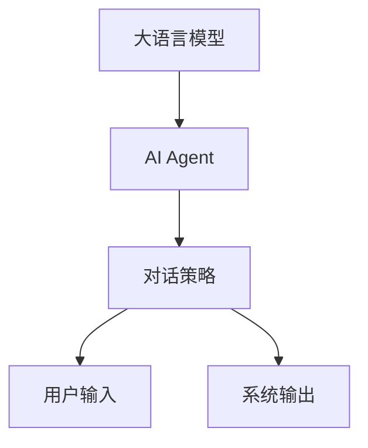
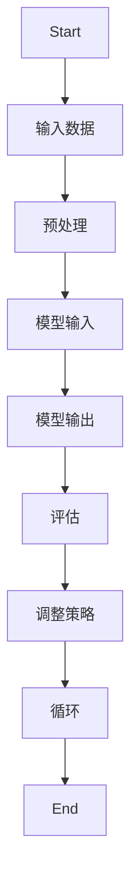
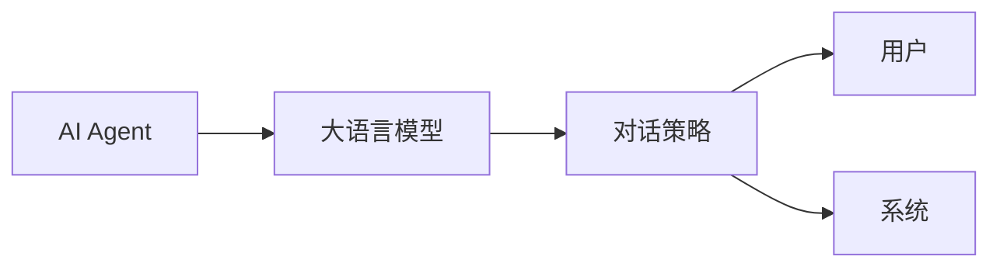
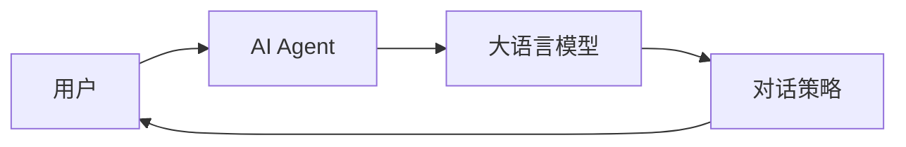

                 


# LLM驱动的AI Agent对话策略学习

## 关键词：LLM、AI Agent、对话策略、自然语言处理、强化学习

## 摘要：  
本文探讨如何利用大语言模型（LLM）驱动AI Agent的对话策略学习，通过理论分析、算法推导和实际案例，详细阐述了LLM在对话策略中的应用及其优势。文章从背景、核心概念、算法原理、系统架构到项目实战，全面解析了LLM驱动AI Agent对话策略学习的实现过程，为读者提供了深入的技术指导和实践参考。

---

## 第1章：LLM驱动的AI Agent对话策略概述

### 1.1 问题背景与问题描述  
- **问题背景**：随着自然语言处理技术的快速发展，对话系统逐渐从规则驱动向数据驱动转变。传统的基于规则的对话系统难以应对复杂多变的用户需求，而大语言模型（LLM）的出现为对话系统带来了新的可能性。  
- **问题描述**：现有的对话系统在处理复杂对话场景时，常常面临对话策略不够灵活、生成内容不够自然、难以适应多轮对话等问题。  
- **问题解决**：通过利用LLM的强大生成能力和上下文理解能力，AI Agent可以更高效地学习对话策略，实现更自然、更智能的对话交互。  

### 1.2 问题解决与边界定义  
- **问题解决**：LLM驱动的AI Agent通过监督微调、强化学习等方法，不断优化对话策略，提升对话系统的性能。  
- **边界与外延**：虽然LLM在对话策略学习中表现出色，但其依赖大量数据和计算资源，且在实时性要求极高的场景下可能表现不佳。  

### 1.3 核心概念与组成要素  
- **LLM**：大语言模型，如GPT系列，具有强大的文本生成和理解能力。  
- **AI Agent**：智能体，能够感知环境并采取行动以实现目标。  
- **对话策略**：AI Agent在对话过程中采取的行动序列，旨在实现对话目标。  

---

## 第2章：LLM与AI Agent的关系

### 2.1 核心概念原理  
- **LLM的生成机制**：基于概率分布生成文本，通过最大似然估计优化模型参数。  
- **AI Agent的决策过程**：通过感知环境和目标，选择最优行动策略。  

### 2.2 核心概念对比  
- **LLM与传统NLP模型的对比**（表格）：  
  | 特性       | LLM                     | 传统NLP模型             |  
  |------------|--------------------------|--------------------------|  
  | 参数量      | 大（ billions of params）| 小（ millions of params）|  
  | 模型能力    | 强大，支持多任务         | 较弱，通常针对单一任务   |  

- **AI Agent与传统对话系统的对比**（表格）：  
  | 特性       | AI Agent                | 传统对话系统             |  
  |------------|--------------------------|--------------------------|  
  | 灵活性      | 高，支持动态调整策略     | 低，基于固定规则         |  
  | 学习能力    | 强，支持在线学习         | 弱，依赖人工规则设计     |  

### 2.3 实体关系图  


---

## 第3章：LLM驱动的对话策略学习算法

### 3.1 算法原理  
- **监督微调（Supervised Fine-tuning）**：基于标注数据，对LLM进行微调，使其生成符合对话策略的回复。  
- **强化学习（Reinforcement Learning）**：通过奖励机制，优化AI Agent的对话策略，提升对话质量。  
- **对抗训练（Adversarial Training）**：通过生成器（LLM）和判别器的对抗，提升对话策略的多样性和鲁棒性。  

### 3.2 算法流程图  


### 3.3 数学模型与公式  
- **损失函数**：  
  $$ \text{Loss} = -\sum_{i=1}^{n} \log p(y_i|x_i) $$  
  其中，$p(y_i|x_i)$ 是模型在输入$x_i$下生成$y_i$的概率。  

- **奖励函数**：  
  $$ R(s, a) = r_1 s_1 + r_2 s_2 + \dots + r_k s_k $$  
  其中，$s_i$ 是奖励项，$r_i$ 是对应的权重。  

---

## 第4章：系统分析与架构设计

### 4.1 系统架构设计  


### 4.2 系统交互流程图  


---

## 第5章：项目实战

### 5.1 环境安装  
- 安装Python和相关库：`pip install transformers torch`  

### 5.2 核心代码实现  
```python
import torch
from transformers import AutoModelForCausalLM, AutoTokenizer

# 初始化模型和分词器
model = AutoModelForCausalLM.from_pretrained("gpt2")
tokenizer = AutoTokenizer.from_pretrained("gpt2")

# 定义对话策略函数
def generate_response(input_text):
    inputs = tokenizer(input_text, return_tensors="pt")
    outputs = model.generate(inputs.input_ids, max_length=50)
    response = tokenizer.decode(outputs[0], skip_special_tokens=True)
    return response

# 实际对话
user_input = "今天天气怎么样？"
response = generate_response(user_input)
print(response)
```

### 5.3 实际案例分析  
- 案例：智能客服系统  
  - 用户输入：我的订单在哪里？  
  - 系统回复：您可以在“我的订单”页面查看详细信息。  

---

## 第6章：最佳实践与总结

### 6.1 最佳实践  
- **数据质量**：确保训练数据多样且高质量。  
- **计算资源**：使用高性能计算资源优化训练效率。  
- **模型调优**：通过微调和优化参数提升模型性能。  

### 6.2 小结  
本文详细探讨了LLM驱动的AI Agent对话策略学习的实现过程，从理论到实践，为读者提供了全面的技术指导。  

### 6.3 注意事项  
- LLM的训练需要大量数据和计算资源，需注意数据隐私和计算成本。  
- 对话策略的优化需要结合具体场景，避免“一刀切”的解决方案。  

### 6.4 拓展阅读  
- 建议读者进一步学习强化学习在对话系统中的应用，以及多模态对话系统的前沿研究。  

---

## 作者：AI天才研究院/AI Genius Institute & 禅与计算机程序设计艺术 /Zen And The Art of Computer Programming

