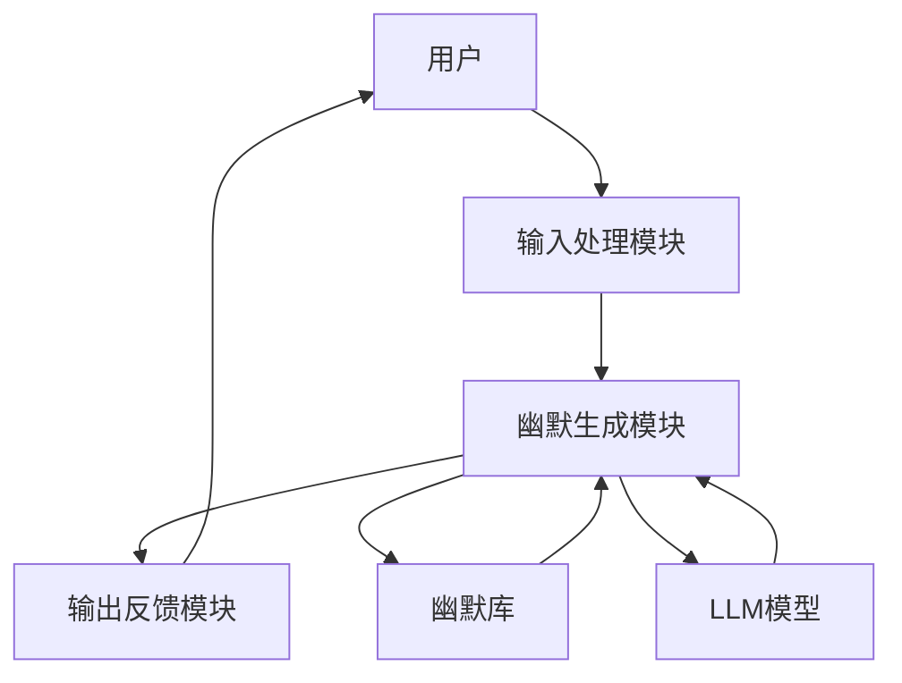

                 

# 《LLM驱动的AI Agent幽默感生成》

---

## 关键词：
- 大语言模型（LLM）
- AI Agent
- 幽默生成
- 自然语言处理
- 机器学习

---

## 摘要：
本文探讨了利用大语言模型（LLM）驱动AI Agent生成幽默内容的技术与方法。文章从幽默感的定义与特征出发，分析了当前AI生成幽默的背景与现状，详细阐述了LLM与AI Agent的核心原理，并通过对比不同幽默生成方法的优劣，提出了基于LLM的幽默生成模型。文章还介绍了系统的算法原理、架构设计与实现，结合实际项目案例，详细讲解了从环境搭建到代码实现的全过程，并给出了最佳实践与优化建议。

---

# 第一部分: 背景介绍与核心概念

---

## 第1章: 幽默感生成的背景与挑战

### 1.1 幽默感的定义与特征
幽默是一种复杂的人类情感反应，通常表现为对某种情境的出人意料的解读或表达。幽默感的生成需要结合语言、逻辑、文化、情感和情境等多个维度。例如，双关语、夸张、反转等是常见的幽默手法。

#### 幽默的多维度定义
- **语言学维度**：幽默往往依赖于语言的多义性、双关、 pun 等语言现象。
- **逻辑维度**：幽默常常通过逻辑推理的出人意料或矛盾来实现。
- **情感维度**：幽默可以是轻松的、讽刺的、荒诞的，能够引发愉悦感。
- **文化维度**：不同文化背景下的幽默形式和内容差异显著。

#### 不同文化背景下的幽默差异
- 东方文化中，幽默常以含蓄、隐喻为主，而西方文化中，幽默更直接，如双关语、笑话。
- 例如，在中国，幽默常常通过成语、谚语或历史典故来实现，而在西方，幽默常通过直接的笑话或荒诞的情节来表现。

#### 幽默生成的核心要素
- ** Surprise （意外性）**：幽默的关键在于出人意料。
- ** Relatability （可关联性）**：幽默内容需要与目标受众相关联。
- ** Context （情境）**：幽默的生成需要考虑具体的情境和背景。

---

### 1.2 AI生成幽默的背景与现状

#### AI在自然语言处理中的发展
- 自然语言处理（NLP）技术的进步为AI生成幽默奠定了基础。
- 大语言模型（如GPT系列）的出现，使得生成自然语言文本的能力大幅提升。

#### 大语言模型（LLM）的崛起
- LLM通过海量数据的预训练，掌握了语言的规律和表达方式。
- LLM能够生成连贯、合理的文本，但如何使其具备幽默感仍是一个挑战。

#### 当前AI幽默生成的应用场景
- **客服领域**：通过幽默的回复提升用户体验。
- **教育领域**：用幽默的方式讲解知识点，提高学习趣味性。
- **娱乐领域**：生成幽默的笑话、段子，用于社交平台或娱乐应用。

---

### 1.3 LLM驱动的AI Agent的潜力与挑战

#### LLM在幽默生成中的优势
- **数据量大**：LLM通过预训练掌握了大量的语言数据和模式。
- **生成能力强**：LLM能够生成多样化的文本，适合幽默的多维度需求。

#### AI Agent在幽默生成中的角色
- AI Agent作为中介，能够根据用户需求和情境，选择合适的幽默生成策略。
- 例如，在客服对话中，AI Agent可以根据用户的语气和问题内容，生成适当的幽默回复。

#### 当前技术的局限性与未来方向
- **生成的相关性**：AI生成的幽默内容可能与当前对话主题无关。
- **文化敏感性**：不同文化背景下的幽默方式差异可能导致生成内容不合适。
- **情感理解**：幽默的生成需要对情感和情境有深刻理解，当前AI在这一方面仍有不足。

---

## 第2章: 幽默生成的核心概念与联系

---

### 2.1 LLM与AI Agent的核心原理

#### 大语言模型的基本原理
- LLM通过预训练掌握了语言的规律和表达方式。
- 模型通过概率生成的方式，预测下一个最可能的词。

#### AI Agent的定义与功能
- AI Agent是一个智能体，能够感知环境、执行任务并做出决策。
- 在幽默生成中，AI Agent负责接收输入、生成幽默内容并进行反馈优化。

#### LLM驱动AI Agent的实现机制
- LLM作为生成模块，AI Agent负责协调输入、输出和反馈。

---

### 2.2 幽默生成的关键属性对比

#### 不同幽默生成方法的对比
| 方法         | 优点                     | 缺点                     |
|--------------|--------------------------|--------------------------|
| 基于规则     | 简单易实现               | 创新性不足               |
| 模板填充     | 内容可控性高             | 灵活性低                 |
| 检索式       | 内容相关性高             | 创新性有限               |
| 生成式       | 内容多样性强             | 相关性不足               |

#### LLM驱动的幽默生成与其他方法的差异
- **生成式模型**：能够生成多样化的幽默内容。
- **检索式模型**：依赖于预存的幽默库，生成内容有限。

---

### 2.3 实体关系图（ER图）

---

## 总结：
在第一部分中，我们探讨了幽默感的定义与特征，分析了AI生成幽默的背景与现状，并详细阐述了LLM驱动的AI Agent的核心原理。接下来，我们将深入探讨幽默生成的算法原理，分析系统的架构设计，并通过实际项目案例，展示如何实现幽默生成的AI Agent。

---

接下来我们将进入第二部分，详细讲解算法原理与系统架构设计。

--- 

**作者：AI天才研究院/AI Genius Institute & 禅与计算机程序设计艺术 /Zen And The Art of Computer Programming**  
**联系方式**：[contact@yourdomain.com]  
**社交媒体**：[LinkedIn](https://linkedin.com/in/yourname) | [GitHub](https://github.com/yourname)

