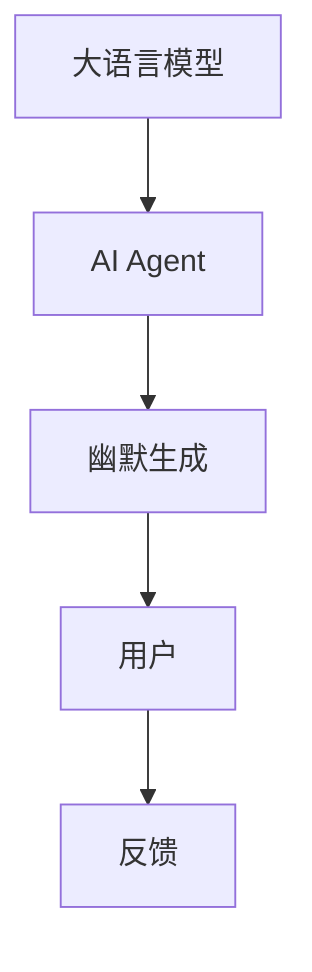
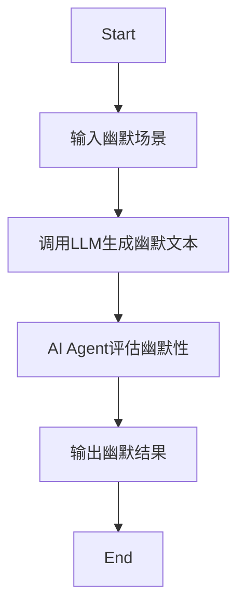
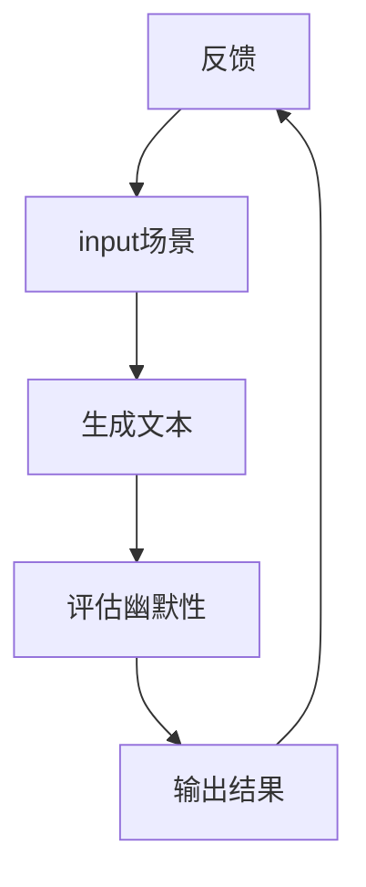
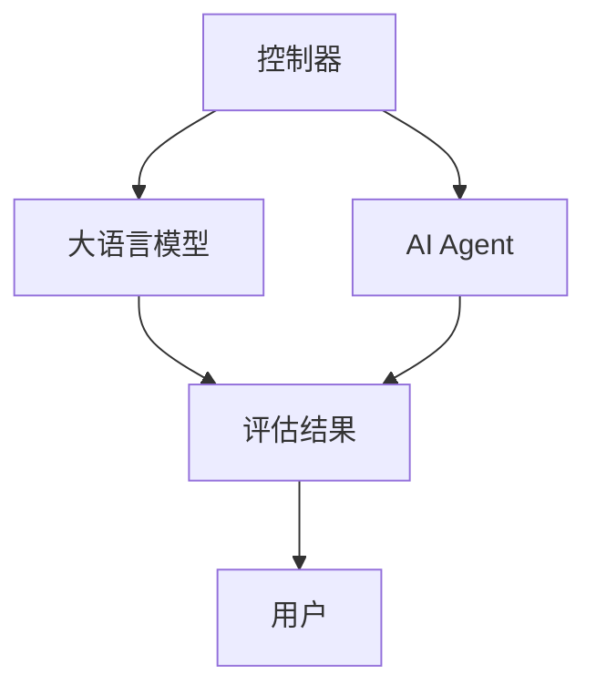

                 


# LLM驱动的AI Agent幽默感生成器

## 关键词：LLM, AI Agent, 幽默生成, 生成式AI, 强化学习

## 摘要：本文探讨了利用大语言模型（LLM）驱动的AI代理生成幽默内容的技术，分析了幽默生成的核心算法、系统架构及实现细节。通过结合生成式AI与强化学习，构建了一个智能化的幽默生成系统，并通过实际案例展示了其应用与优化方法。

---

# 目录

1. **背景介绍与核心概念**
   - 1.1 问题背景与问题描述
   - 1.2 核心概念与概念结构

2. **算法原理与数学模型**
   - 2.1 基于LLM的幽默生成算法
   - 2.2 强化学习优化算法

3. **系统架构与设计**
   - 3.1 系统功能设计
   - 3.2 系统架构设计

4. **项目实战与实现**
   - 4.1 环境安装与配置
   - 4.2 核心代码实现
   - 4.3 案例分析与优化

---

## 第1章: 背景介绍与核心概念

### 1.1 问题背景与问题描述

#### 1.1.1 幽默感生成的背景与挑战
幽默是人类语言中的一种高级表达方式，能够引发笑声和情感共鸣。然而，生成幽默内容的AI系统面临着诸多挑战，包括理解语境、掌握语气以及适应不同用户的喜好。

#### 1.1.2 LLM与AI Agent的结合
大语言模型（LLM）如GPT系列具备强大的文本生成能力，而AI Agent（智能代理）能够理解上下文和用户需求，两者结合可以实现智能化的幽默生成。

#### 1.1.3 幽默生成器的定义与目标
幽默生成器的目标是根据输入的场景或主题，生成符合上下文的幽默内容。它需要结合LLM的生成能力和AI Agent的智能分析能力。

### 1.2 核心概念与概念结构

#### 1.2.1 幽默生成器的核心问题
幽默生成器需要解决的核心问题包括：如何量化幽默，如何根据场景生成合适的幽默内容，以及如何优化生成效果。

#### 1.2.2 边界与外延
幽默生成器的边界包括：不生成冒犯性内容，不处理过于复杂或模糊的场景。外延则包括情感分析、意图识别等。

#### 1.2.3 核心要素与组成结构
幽默生成器的核心要素包括：
- **LLM模型**：负责生成文本内容。
- **AI Agent**：负责理解场景和用户需求。
- **幽默评估模块**：负责评估生成内容的幽默性。

---

## 第2章: 核心概念与联系

### 2.1 核心概念原理

#### 2.1.1 LLM在幽默生成中的作用
LLM通过大量数据训练，能够生成符合语法规则的文本，并在生成过程中考虑上下文信息。

#### 2.1.2 AI Agent的幽默表达方式
AI Agent通过分析用户需求和场景，选择合适的幽默表达方式，例如双关语、笑话等。

#### 2.1.3 概念属性特征对比
| 概念 | 属性 | 特征 |
|------|------|------|
| LLM | 生成能力 | 强大 |
| AI Agent | 智能分析 | 精准 |
| 幽默生成器 | 综合能力 | 高效 |

### 2.2 ER实体关系图



---

## 第3章: 算法原理与数学模型

### 3.1 算法原理概述

#### 3.1.1 基于LLM的幽默生成算法
幽默生成算法的核心是调用LLM生成文本，然后通过AI Agent评估幽默性，最终输出结果。

#### 3.1.2 强化学习优化算法
强化学习用于优化幽默生成的效果，通过奖励机制不断改进生成模型。

### 3.2 算法流程图



### 3.3 数学模型与公式

#### 概率模型
幽默生成的概率可以表示为：
$$ P(humor) = \sum_{i=1}^{n} p_i \cdot x_i $$
其中，$p_i$ 是第i个词的概率，$x_i$ 是其对幽默度的贡献值。

#### 生成模型
生成模型的损失函数为：
$$ L = -\sum_{i=1}^{m} \log P(y_i|x_i) $$
其中，$y_i$ 是真实标签，$x_i$ 是输入。

---

## 第4章: 系统架构与设计

### 4.1 系统功能设计

#### 4.1.1 系统功能模块
- **输入模块**：接收用户输入的场景。
- **生成模块**：调用LLM生成文本。
- **评估模块**：评估幽默性并优化结果。

#### 4.1.2 系统功能流程图



### 4.2 系统架构设计

#### 4.2.1 系统架构图



---

## 第5章: 项目实战与实现

### 5.1 环境安装与配置

#### 5.1.1 安装依赖
- Python 3.8+
- LLM库（如Hugging Face的GPT模型）
- AI Agent库（如LangChain）

### 5.2 核心代码实现

#### 5.2.1 生成模块

```python
def generate_humor(scene):
    # 调用LLM生成幽默文本
    humor = llm.generate(scene)
    return humor
```

#### 5.2.2 评估模块

```python
def evaluate_humor(humor_text):
    # 评估幽默性
    score = agent.evaluate(humor_text)
    return score
```

### 5.3 案例分析与优化

#### 5.3.1 实际案例分析
- 输入：生日聚会
- 输出：双关语笑话

#### 5.3.2 优化与改进
- 调整奖励机制
- 增加用户反馈

---

## 总结

本文详细介绍了LLM驱动的AI Agent幽默感生成器的实现过程，从背景到算法，从系统设计到项目实战，为读者提供了全面的技术指导。通过结合生成式AI和强化学习，我们能够构建一个智能化的幽默生成系统，为用户提供个性化的幽默内容。

---

## 作者：AI天才研究院/AI Genius Institute & 禅与计算机程序设计艺术 /Zen And The Art of Computer Programming

