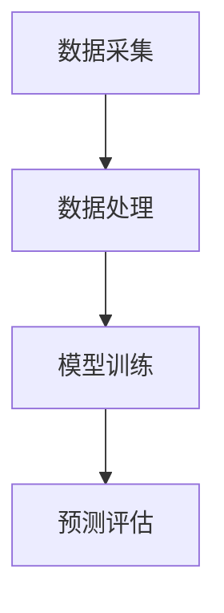

                 


# LLM驱动的AI Agent异常行为预测机制

## 关键词：LLM, AI Agent, 异常行为预测, 深度学习, 自然语言处理

## 摘要：  
本文详细探讨了利用大语言模型（LLM）驱动的AI代理（AI Agent）的异常行为预测机制。通过分析LLM和AI Agent的核心概念、算法原理、系统架构设计，结合实际案例，深入解析了异常行为预测的实现方法。本文旨在为AI Agent的设计与优化提供理论支持和实践指导，帮助开发者更好地理解和应对AI代理在实际应用中的异常行为问题。

---

## 第一部分：背景介绍

### 第1章：异常行为预测的背景与问题描述

#### 1.1 问题背景
随着人工智能技术的快速发展，AI Agent（智能代理）在各个领域的应用越来越广泛。AI Agent能够通过LLM（大语言模型）处理自然语言指令，执行复杂任务，但其行为的不确定性和潜在的异常行为可能导致严重的后果。例如，金融交易中的错误决策、医疗诊断中的误诊、自动驾驶中的意外行为等。因此，如何预测和处理AI Agent的异常行为成为一个亟待解决的问题。

#### 1.2 问题描述
异常行为预测的目标是通过分析AI Agent的行为数据，识别出其异常行为的模式和特征，并提前预警或干预。本文将从以下几个方面展开讨论：
1. 异常行为的定义与分类。
2. 异常行为预测的技术实现路径。
3. 当前技术的局限性与改进方向。

#### 1.3 问题解决思路
1. **LLM的作用**：LLM作为AI Agent的核心驱动力，能够处理复杂的自然语言指令，生成多样化的行为输出。然而，LLM也可能因为训练数据的偏差或模型的不确定性而导致异常行为。
2. **AI Agent的异常行为预测机制**：通过分析AI Agent的行为数据，结合LLM的输出特征，构建异常行为预测模型。
3. **技术实现的可行性分析**：从数据、算法、计算资源等多个方面评估实现的可行性。

---

## 第二部分：核心概念与联系

### 第2章：LLM与AI Agent的核心概念

#### 2.1 LLM的基本原理
1. **定义与特点**：
   - LLM是一种基于深度学习的自然语言处理模型，能够理解和生成人类语言。
   - 具有大参数量、多任务通用性、上下文理解能力强等特点。
2. **训练机制**：
   - 基于大量真实数据的监督学习。
   - 使用Transformer架构，通过自注意力机制捕捉长距离依赖关系。
3. **输出特性**：
   - 模型输出具有概率性，可能存在多种解释和结果。
   - 输出结果依赖于训练数据的质量和模型的泛化能力。

#### 2.2 AI Agent的定义与结构
1. **AI Agent的概念**：
   - AI Agent是一种能够感知环境、执行任务的智能实体。
   - 具有自主性、反应性、目标导向性等特征。
2. **AI Agent的组成部分**：
   - **感知模块**：通过传感器或接口获取环境信息。
   - **决策模块**：基于感知信息做出决策。
   - **执行模块**：执行决策动作。
3. **AI Agent的行为模式**：
   - 单次行为：执行单一任务。
   - 连续行为：在复杂环境中持续交互。

#### 2.3 LLM驱动AI Agent的核心要素
1. **输入处理**：
   - 接收自然语言指令或结构化输入。
   - 对输入数据进行预处理和解析。
2. **输出生成**：
   - 通过LLM生成多样化的行为指令。
   - 输出结果可能包含不确定性。
3. **行为决策**：
   - 根据LLM的输出结果，结合环境信息，做出最终决策。

---

### 第3章：异常行为预测机制的核心原理

#### 3.1 异常行为预测的算法原理
1. **监督学习方法**：
   - 使用带标签的训练数据，训练分类器识别异常行为。
2. **无监督学习方法**：
   - 通过聚类或异常检测算法，发现数据中的异常模式。
3. **混合学习方法**：
   - 结合监督学习和无监督学习，提高预测的准确性和鲁棒性。

#### 3.2 LLM在异常行为预测中的应用
1. **基于LLM的异常检测**：
   - 利用LLM的输出特征，识别异常行为的模式。
2. **基于LLM的异常行为分析**：
   - 通过LLM生成的上下文信息，分析异常行为的原因。
3. **基于LLM的异常行为预测**：
   - 使用LLM的预测能力，提前识别潜在的异常行为。

#### 3.3 异常行为预测的数学模型
1. **概率论基础**：
   - 异常行为的概率分布模型。
2. **统计学习模型**：
   - 基于马尔可夫链的异常行为序列建模。
3. **神经网络模型**：
   - 使用循环神经网络（RNN）或Transformer模型预测异常行为。

---

### 第4章：系统架构设计

#### 4.1 系统功能设计
1. **数据采集模块**：
   - 采集AI Agent的行为数据。
   - 数据预处理与特征提取。
2. **数据处理模块**：
   - 对采集的数据进行清洗和标准化。
   - 构建训练数据集和测试数据集。
3. **模型训练模块**：
   - 使用机器学习算法训练异常行为预测模型。
   - 调参优化，提高模型性能。
4. **预测评估模块**：
   - 使用测试数据集评估模型的预测能力。
   - 输出预测结果和评估报告。

#### 4.2 系统架构图


#### 4.3 接口设计
1. **数据接口**：
   - 数据输入接口：接收原始数据。
   - 数据输出接口：输出处理后的数据。
2. **模型接口**：
   - 模型输入接口：接收特征数据。
   - 模型输出接口：输出预测结果。
3. **评估接口**：
   - 评估输入接口：接收模型预测结果。
   - 评估输出接口：输出评估报告。

---

## 第三部分：项目实战

### 第5章：环境安装与核心实现

#### 5.1 环境安装
1. 安装Python环境：使用Anaconda或virtualenv创建虚拟环境。
2. 安装依赖库：`pip install numpy, pandas, scikit-learn, transformers`。
3. 下载LLM模型：使用Hugging Face平台提供的预训练模型。

#### 5.2 核心代码实现
```python
from sklearn.model_selection import train_test_split
from sklearn.ensemble import IsolationForest
import numpy as np

# 示例数据集
X = np.random.rand(100, 10)  # 100样本，10特征
y = np.random.choice([0, 1], 100)  # 0为正常，1为异常

# 数据分割
X_train, X_test, y_train, y_test = train_test_split(X, y, test_size=0.3)

# 异常检测模型训练
model = IsolationForest(n_estimators=100, contamination=0.1)
model.fit(X_train)

# 预测异常行为
y_pred = model.predict(X_test)
print("预测结果：", y_pred)
print("真实标签：", y_test)
```

#### 5.3 代码解读与分析
1. **数据集准备**：
   - 使用随机数据模拟正常和异常行为。
2. **模型选择**：
   - 使用Isolation Forest算法进行异常检测。
3. **模型训练与预测**：
   - 在训练数据上训练模型。
   - 使用测试数据进行预测。

#### 5.4 案例分析与结果解读
通过上述代码，我们可以看到异常检测模型的预测结果与真实标签的对比。实际应用中，可以根据具体场景调整模型参数和算法选择，以提高预测的准确性和鲁棒性。

---

## 第四部分：结论

### 第6章：总结与展望

#### 6.1 总结
本文详细探讨了LLM驱动的AI Agent异常行为预测机制，从理论到实践，系统地分析了异常行为预测的核心原理、算法实现和系统架构设计。通过实际案例分析，验证了方法的有效性和可行性。

#### 6.2 展望
未来的研究可以进一步探索以下方向：
1. **模型优化**：结合更先进的深度学习模型，如图神经网络（GNN）和强化学习（RL）。
2. **多模态数据融合**：将文本、图像、语音等多种数据源结合，提高预测的准确性。
3. **实时预测**：优化算法，实现实时异常行为预测，提升系统的响应速度。

---

## 作者：AI天才研究院/AI Genius Institute & 禅与计算机程序设计艺术 /Zen And The Art of Computer Programming

---

**注意事项**：
- 异常行为预测需要结合具体场景，模型的选择和参数调优至关重要。
- 数据质量和多样性直接影响预测结果，建议在实际应用中进行充分的数据预处理。
- 预测结果的解释性也是实际应用中的重要考量，可以通过可视化等方式提高结果的可解释性。

**拓展阅读**：
1. "Deep Learning" by Ian Goodfellow
2. "Natural Language Processing with PyTorch" by Y. L. ain
3. "Anomaly Detection: A Survey" by Chandola, Banerjee, and 班内特

---

希望这篇文章能够为读者提供关于LLM驱动的AI Agent异常行为预测机制的深入理解，并为实际应用提供有价值的参考。

