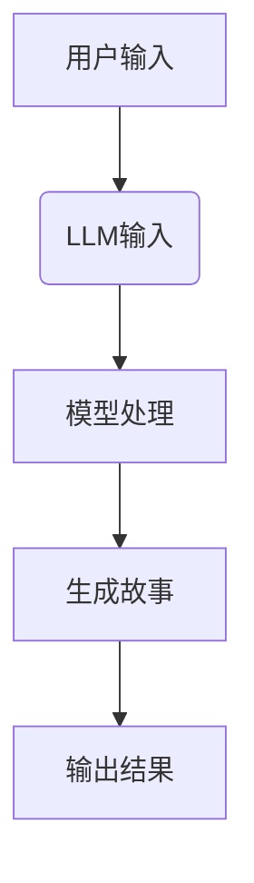
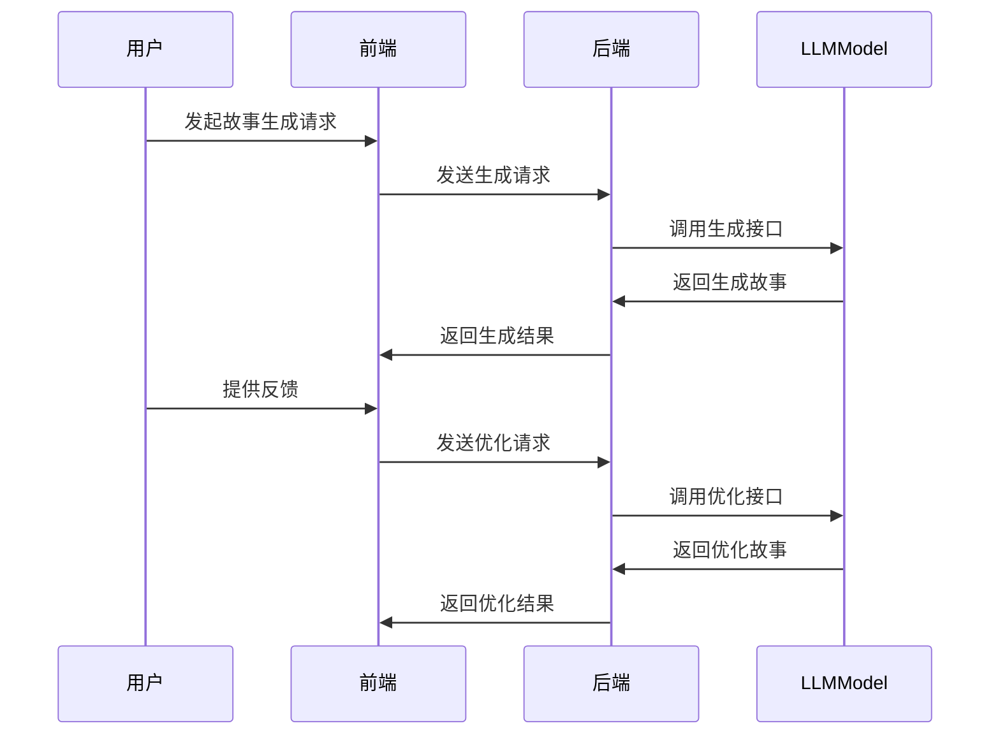

                 


# LLM驱动的AI Agent故事生成与叙事能力

---

## 关键词：LLM, AI Agent, 故事生成, 叙事能力, 大语言模型, AI智能体, 自然语言处理

---

## 摘要：  
本文探讨了大语言模型（LLM）驱动的AI Agent在故事生成与叙事能力方面的应用。通过分析LLM的核心原理、AI Agent的叙事能力，结合系统架构设计和实际案例，详细讲解了如何利用LLM构建具备复杂叙事能力的AI Agent。文章内容涵盖背景介绍、技术原理、系统实现和项目实战，为读者提供了从理论到实践的全面指导。

---

## 目录大纲

1. **背景介绍：LLM与AI Agent的故事生成基础**
   - 1.1 LLM的定义与特点
   - 1.2 AI Agent的定义与特点
   - 1.3 LLM驱动的AI Agent在故事生成中的应用

2. **核心概念：LLM与AI Agent的原理与联系**
   - 2.1 LLM的模型结构与训练方法
   - 2.2 AI Agent的叙事理解与生成机制
   - 2.3 LLM与AI Agent的协同工作原理

3. **算法原理：LLM驱动的叙事生成算法**
   - 3.1 基于LLM的故事生成算法流程图
   - 3.2 算法的数学模型与公式推导
   - 3.3 算法实现的代码示例

4. **系统架构：AI Agent故事生成系统的构建**
   - 4.1 系统功能设计与领域模型
   - 4.2 系统架构设计与接口实现
   - 4.3 系统交互流程与序列图

5. **项目实战：构建一个LLM驱动的AI Agent**
   - 5.1 项目环境搭建
   - 5.2 核心功能实现
   - 5.3 实际案例分析与优化

6. **高级应用与优化：提升叙事能力**
   - 6.1 多模态叙事生成
   - 6.2 外部知识库的集成
   - 6.3 高质量故事生成的优化策略

---

## 正文

### 第一部分：背景介绍

#### 1.1 LLM的定义与特点
- **定义**：大语言模型（LLM）是一种基于深度学习的自然语言处理模型，能够理解和生成人类语言。
- **特点**：
  - **大规模训练**：通常使用海量数据进行预训练，具备广泛的知识覆盖。
  - **上下文理解**：通过注意力机制，能够捕捉文本中的语义关系。
  - **生成能力**：支持文本生成、翻译、问答等多种任务。

#### 1.2 AI Agent的定义与特点
- **定义**：AI Agent是一种智能体，能够感知环境并执行任务以实现目标。
- **特点**：
  - **自主性**：能够在没有人工干预的情况下执行任务。
  - **反应性**：能够实时响应环境变化。
  - **学习能力**：通过与环境交互不断优化自身的行为。

#### 1.3 LLM驱动的AI Agent在故事生成中的应用
- **应用场景**：
  - **文学创作**：辅助作家生成故事情节、角色对话。
  - **教育领域**：用于教学辅助、故事讲解。
  - **娱乐行业**：生成互动故事、游戏剧情。
- **边界与外延**：
  - **边界**：专注于文本生成，不涉及图像或视频。
  - **外延**：可扩展至多模态生成，结合视觉元素增强叙事。

### 第二部分：核心概念

#### 2.1 LLM的模型结构与训练方法
- **模型结构**：
  - **Transformer架构**：由编码器和解码器组成，支持并行处理。
  - **自注意力机制**：通过权重计算词与词之间的关系。
- **训练方法**：
  - **预训练**：使用大规模数据进行无监督学习。
  - **微调**：针对特定任务进行有监督微调。

#### 2.2 AI Agent的叙事理解与生成机制
- **叙事理解**：
  - **故事结构分析**：识别故事的开端、发展、高潮和结局。
  - **角色分析**：理解角色的性格、动机和关系。
- **生成机制**：
  - **基于LLM的生成**：利用大语言模型生成连贯的故事文本。
  - **多样性控制**：通过参数调节生成多种风格的故事。

#### 2.3 LLM与AI Agent的协同工作原理
- **协同过程**：
  - **输入处理**：AI Agent接收用户的输入，解析需求。
  - **生成故事**：调用LLM生成符合需求的故事内容。
  - **反馈优化**：根据用户反馈优化生成结果。

### 第三部分：算法原理

#### 3.1 基于LLM的故事生成算法流程图


#### 3.2 算法的数学模型与公式推导
- **自注意力机制公式**：
  $$\text{Attention}(Q, K, V) = \text{softmax}\left(\frac{QK^T}{\sqrt{d_k}}\right)V$$
- **前馈网络公式**：
  $$f(x) = \text{ReLU}(Wx + b)$$

#### 3.3 算法实现的代码示例
```python
def generate_story(llm_model, prompt):
    response = llm_model.generate(
        prompt=prompt,
        max_length=500,
        temperature=0.7
    )
    return response
```

### 第四部分：系统架构

#### 4.1 系统功能设计与领域模型
- **功能设计**：
  - **用户交互**：接收用户输入，解析需求。
  - **故事生成**：调用LLM生成故事内容。
  - **反馈优化**：根据用户反馈优化生成结果。
- **领域模型**：
  ```mermaid
  classDiagram
      class LLMModel {
          generate(string prompt) -> string
          analyze(string text) -> dict
      }
      class AI-Agent {
          prompt -> LLMModel
          generateStory() -> string
          optimizeStory(string feedback) -> string
      }
  ```

#### 4.2 系统架构设计与接口实现
- **架构设计**：
  - **前端**：接收用户输入，展示生成结果。
  - **后端**：处理业务逻辑，调用LLM生成内容。
  - **接口设计**：
    - `POST /generate-story`
    - `POST /optimize-story`

#### 4.3 系统交互流程与序列图


### 第五部分：项目实战

#### 5.1 项目环境搭建
- **工具安装**：
  - 安装Python
  - 安装Hugging Face库
  - 安装Flask框架

#### 5.2 核心功能实现
- **故事生成功能**：
  ```python
  from transformers import GPT2LMHeadModel, GPT2Tokenizer

  model = GPT2LMHeadModel.from_pretrained('gpt2')
  tokenizer = GPT2Tokenizer.from_pretrained('gpt2')

  def generate_story(prompt):
      inputs = tokenizer.encode(prompt, return_tensors='pt')
      outputs = model.generate(inputs, max_length=500, temperature=0.7)
      story = tokenizer.decode(outputs[0], skip_special_tokens=True)
      return story
  ```

#### 5.3 实际案例分析与优化
- **案例分析**：
  - **输入**：生成一个科幻小说的开头。
  - **输出**：生成的故事内容。
  - **优化**：根据用户反馈调整生成风格，增加悬疑元素。

### 第六部分：高级应用与优化

#### 6.1 多模态叙事生成
- **实现方式**：
  - 结合图像生成模型，生成与故事配的插图。
  - 使用语音合成技术，生成有声故事。

#### 6.2 外部知识库的集成
- **知识库集成**：
  - 集成维基百科数据，丰富故事背景。
  - 使用人物数据库，生成立体的角色形象。

#### 6.3 高质量故事生成的优化策略
- **优化策略**：
  - **温度参数调整**：通过调节温度参数控制生成的多样性和创造性。
  - **惩罚机制**：避免重复词汇，提升文本质量。
  - **反馈机制**：根据用户反馈不断优化生成模型。

---

## 结语

本文系统地探讨了大语言模型（LLM）驱动的AI Agent在故事生成与叙事能力方面的应用。从理论基础到技术实现，再到实际案例分析，全面展示了如何利用LLM构建具备复杂叙事能力的AI Agent。通过本文的指导，读者可以深入了解LLM与AI Agent的核心原理，并掌握构建相关系统的实用技能。

---

## 作者：AI天才研究院/AI Genius Institute & 禅与计算机程序设计艺术/Zen And The Art of Computer Programming

---

**感谢您的阅读！**

