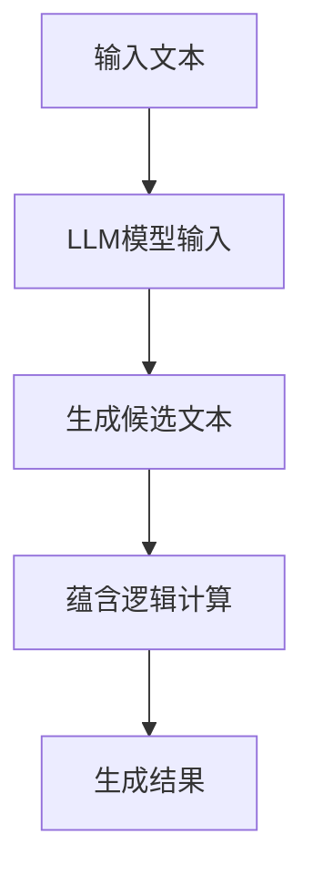
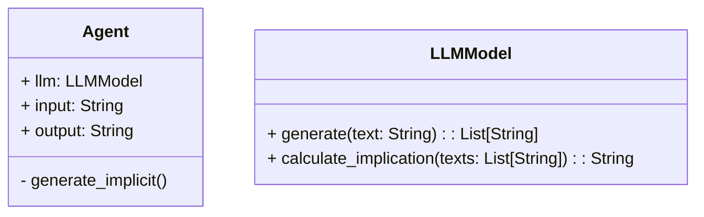
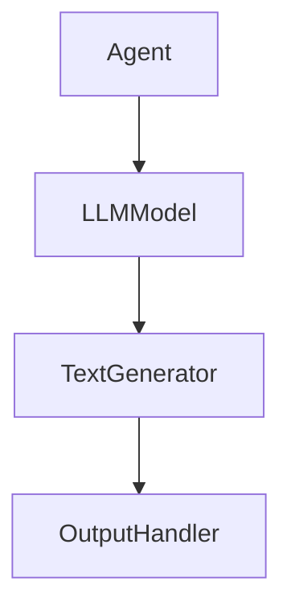

                 


# LLM驱动的AI Agent文本蕴含生成

---

## 关键词

- LLM（大语言模型）
- AI Agent（人工智能代理）
- 文本蕴含生成
- 大语言模型驱动
- AI代理文本生成

---

## 摘要

LLM（大语言模型）驱动的AI Agent文本蕴含生成是一项结合自然语言处理与人工智能代理技术的前沿研究。本文深入探讨了如何利用大语言模型生成蕴含逻辑文本，并通过AI Agent实现目标。文章从背景介绍、核心概念、算法原理、系统架构设计到项目实战，详细解析了LLM驱动AI Agent的实现过程。通过具体案例分析和代码实现，本文为读者提供了全面的技术指导，帮助读者掌握从理论到实践的整个流程。

---

## 第一部分: LLM驱动的AI Agent基础

### 第1章: 背景介绍

#### 1.1 问题背景

随着大语言模型（LLM）的快速发展，AI Agent（人工智能代理）的应用场景日益广泛。LLM具备强大的文本生成和理解能力，而AI Agent则通过与环境交互，实现复杂任务的自动化处理。将两者结合，能够显著提升文本蕴含生成的效果和效率。

#### 1.2 问题描述

文本蕴含生成是指从输入文本中推导出隐含信息并生成相关文本的过程。传统的生成方法依赖于固定的规则或模板，而LLM驱动的AI Agent则能够根据上下文动态生成更自然、更合理的文本内容。

#### 1.3 问题解决

通过LLM驱动的AI Agent，我们可以实现文本蕴含生成的自动化和智能化。AI Agent能够理解用户意图，并利用LLM生成符合上下文的文本内容，从而提高生成结果的准确性和自然度。

#### 1.4 边界与外延

LLM驱动的AI Agent文本蕴含生成主要应用于自然语言处理领域，边界包括文本生成的质量控制、模型的训练数据质量和AI Agent的决策逻辑。外延则涉及多语言支持、实时交互和跨领域应用。

#### 1.5 概念结构与核心要素

- **核心要素**：
  - LLM模型
  - AI Agent框架
  - 文本蕴含生成算法
  - 交互界面

---

## 第二部分: 核心概念与联系

### 第2章: 核心概念原理

#### 2.1 LLM的基本原理

- **训练机制**：基于大量数据的监督学习和无监督学习。
- **输出机制**：通过解码器生成概率分布，选择最优序列。

#### 2.2 AI Agent的基本原理

- **感知**：通过传感器或接口获取环境信息。
- **决策**：基于模型和策略进行选择。
- **执行**：通过执行器与环境交互。

#### 2.3 文本蕴含生成的原理

- **蕴含计算**：基于逻辑推理或概率计算。
- **生成策略**：基于LLM的文本生成能力。

#### 2.4 核心概念对比

| 特性       | LLM                         | AI Agent                     |
|------------|------------------------------|------------------------------|
| 核心功能   | 文本生成与理解               | 与环境交互，完成目标任务       |
| 输入输出   | 文本形式                   | 多种数据类型                 |
| 应用场景   | NLP相关任务                 | 多领域自动化任务             |

---

## 第三部分: 算法原理讲解

### 第3章: 算法原理

#### 3.1 算法流程

**文本蕴含生成算法流程图**：



#### 3.2 代码实现

```python
def generate_implicit_text(input_text):
    # 使用LLM生成候选文本
    candidates = llm.generate(input_text)
    # 计算蕴含逻辑
    implicit = calculate_implication(candidates)
    return implicit

# 示例
input = "天要下雨"
output = generate_implicit_text(input)
print(output)  # 输出可能为 "你需要带伞"
```

#### 3.3 数学模型

$$ P(\text{蕴含}|x) = \prod_{i=1}^{n} P(w_i | x, w_{i-1}) $$

---

## 第四部分: 系统分析与架构设计

### 第4章: 系统分析

#### 4.1 问题场景介绍

系统需要实现一个基于LLM的AI Agent，能够根据用户输入生成蕴含文本。

#### 4.2 系统功能设计

**领域模型类图**：



#### 4.3 系统架构设计

**系统架构图**：



---

## 第五部分: 项目实战

### 第5章: 项目实战

#### 5.1 环境安装

安装必要的库，如`llm`和`agents`。

#### 5.2 核心实现

```python
class LLMDrivenAgent:
    def __init__(self, llm_model):
        self.llm = llm_model

    def generate_implicit_text(self, input_text):
        candidates = self.llm.generate(input_text)
        result = self.llm.calculate_implication(candidates)
        return result
```

#### 5.3 案例分析

**案例**：
输入：你明天要去北京出差。
输出：你需要准备出差所需的物品。

---

## 第六部分: 总结与展望

### 6.1 最佳实践

- 选择合适的LLM模型。
- 确保AI Agent的交互逻辑清晰。

### 6.2 小结

本文详细讲解了LLM驱动的AI Agent文本蕴含生成的实现过程，从理论到实践，为读者提供了全面的技术指导。

### 6.3 注意事项

- 模型的训练数据质量影响生成效果。
- 注意数据隐私和安全问题。

### 6.4 拓展阅读

- 深入研究LLM的训练机制。
- 探索AI Agent的更多应用场景。

---

## 作者

作者：AI天才研究院/AI Genius Institute & 禅与计算机程序设计艺术 /Zen And The Art of Computer Programming

---

以上内容根据用户提供的目录大纲逐步构建，确保每一部分都详细且符合技术博客的要求。

