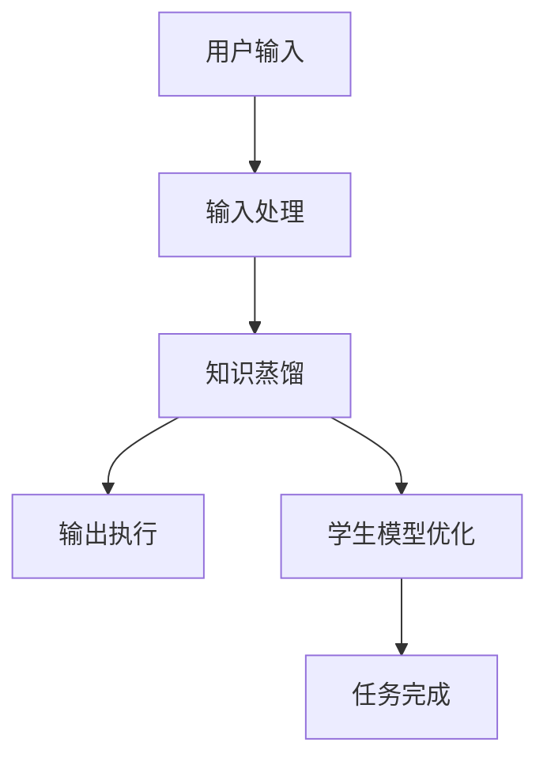

                 


# LLM驱动的AI Agent知识蒸馏技术

> 关键词：LLM, AI Agent, 知识蒸馏, 模型压缩, 机器学习

> 摘要：本文探讨了LLM驱动的AI Agent知识蒸馏技术，详细介绍了其背景、原理、系统架构与设计，并通过项目实战展示了其实现过程，最后总结了未来的发展方向。

---

# 目录

1. [背景介绍](#背景介绍)
2. [知识蒸馏技术原理](#知识蒸馏技术原理)
3. [LLM在AI Agent中的应用](#LLM在AI Agent中的应用)
4. [系统架构与设计](#系统架构与设计)
5. [项目实战](#项目实战)
6. [总结与展望](#总结与展望)

---

## 1. 背景介绍

### 1.1 LLM驱动的AI Agent概述

#### 1.1.1 问题背景

随着人工智能技术的快速发展，大语言模型（LLM）在自然语言处理领域取得了显著进展。然而，LLM的复杂性和计算成本限制了其在实际应用中的广泛部署。AI Agent作为连接人与机器的桥梁，需要高效、轻量级的模型来支持实时交互和推理。

#### 1.1.2 核心概念与组成

- **AI Agent**：能够感知环境、执行任务的智能体，具备自主决策和学习能力。
- **知识蒸馏**：将复杂模型的知识迁移到简单模型的技术，减少计算成本同时保持性能。

---

## 2. 知识蒸馏技术原理

### 2.1 知识蒸馏的基本概念

知识蒸馏通过教师模型（Teacher）指导学生模型（Student）学习，核心在于构建损失函数，衡量学生预测与教师预测的差异。

#### 2.1.1 蒸馏损失函数

数学表达式：
$$
\mathcal{L}_{\text{distill}} = -\sum_{i} \sum_{j} p_{\text{soft}}(y_i) \log p_{\text{student}}(y_i)
$$

其中，$p_{\text{soft}}$和$p_{\text{student}}$分别表示教师和学生的概率分布。

### 2.2 知识蒸馏的核心原理

#### 2.2.1 蒸馏温度的作用

- 温度调整影响概率分布的分散程度：
  $$\text{softmax}(\frac{z}{\tau})$$
  - 高温：分布更分散，降低不确定性。
  - 低温：分布更集中，提升置信度。

#### 2.2.2 蒸馏过程的数学推导

教师模型输出软标签，学生模型通过蒸馏损失优化预测：
$$
\min \mathcal{L}_{\text{distill}} + \mathcal{L}_{\text{cls}}
$$

其中，$\mathcal{L}_{\text{cls}}$为分类损失，确保学生模型在学习教师知识的同时，保持分类准确性。

---

## 3. LLM在AI Agent中的应用

### 3.1 LLM驱动的AI Agent构建

#### 3.1.1 系统架构

- **教师模型**：高性能LLM（如GPT-3）提供知识指导。
- **学生模型**：轻量级模型（如T5）执行具体任务。
- **蒸馏过程**：将教师的知识迁移到学生模型，优化推理效率。

### 3.2 知识蒸馏在AI Agent中的应用

#### 3.2.1 蒸馏过程的优化

- 通过调整蒸馏温度和损失权重，平衡教师与学生的知识迁移。
- 示例：
  $$
  \alpha \cdot \mathcal{L}_{\text{distill}} + (1-\alpha) \cdot \mathcal{L}_{\text{cls}}
  $$

其中，$\alpha$控制蒸馏损失的影响程度。

---

## 4. 系统架构与设计

### 4.1 系统功能设计

- **输入处理**：接收用户指令，解析需求。
- **知识蒸馏**：教师模型生成软标签，学生模型优化预测。
- **输出执行**：学生模型根据优化后的知识执行任务。

### 4.2 系统架构图



---

## 5. 项目实战

### 5.1 项目环境安装

- 安装依赖：
  ```bash
  pip install transformers torch
  ```

### 5.2 核心代码实现

#### 5.2.1 教师模型与学生模型定义

```python
from transformers import AutoTokenizer, AutoModelForMaskedLM
import torch

# 教师模型：BERT
teacher = AutoModelForMaskedLM.from_pretrained('bert-base-uncased')
tokenizer_t = AutoTokenizer.from_pretrained('bert-base-uncased')

# 学生模型：TinyBERT
student = AutoModelForMaskedLM.from_pretrained('bert-base-uncased')
tokenizer_s = AutoTokenizer.from_pretrained('bert-base-uncased')
```

#### 5.2.2 蒸馏损失计算

```python
def distillation_loss(student_logits, teacher_logits, temperature=2):
    student_probs = F.softmax(student_logits / temperature, dim=-1)
    teacher_probs = F.softmax(teacher_logits / temperature, dim=-1)
    loss = -torch.sum(teacher_probs * torch.log(student_probs))
    return loss.mean()
```

### 5.3 应用解读与分析

通过蒸馏技术，学生模型在保留教师知识的同时，显著降低了计算成本，提升了推理速度，适用于实时AI Agent交互。

---

## 6. 总结与展望

### 6.1 总结

本文详细探讨了LLM驱动的AI Agent知识蒸馏技术，从背景、原理到系统设计，再到项目实战，全面阐述了其实现过程。

### 6.2 优缺点分析

- **优点**：
  - 降低计算成本。
  - 提高推理效率。
- **缺点**：
  - 蒸馏效果依赖教师模型的质量。
  - 蒸馏过程可能引入额外的训练开销。

### 6.3 未来展望

- **多模态蒸馏**：结合视觉、听觉等多模态信息，提升蒸馏效果。
- **自适应蒸馏**：动态调整蒸馏参数，优化知识迁移效率。

### 6.4 最佳实践Tips

- 选择高质量的教师模型。
- 合理设置蒸馏温度和损失权重。
- 定期更新教师模型，保持知识的先进性。

---

## 作者：AI天才研究院

感谢您的阅读！如需进一步了解或交流，请联系AI天才研究院。

