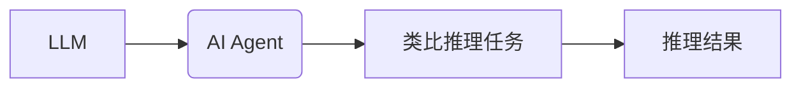
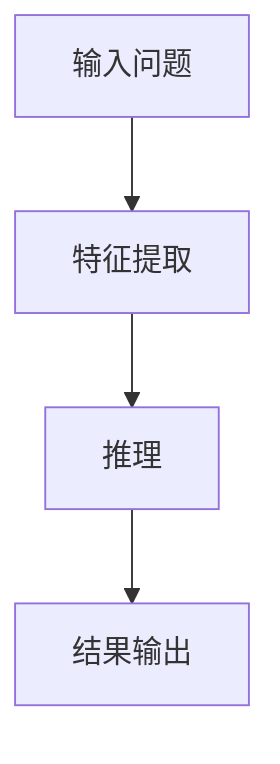
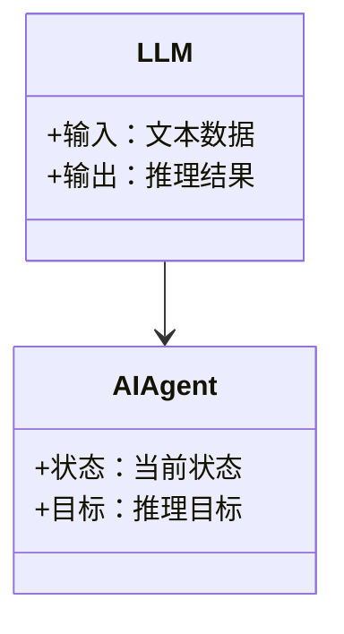
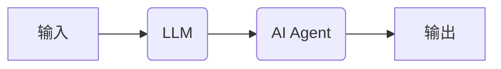
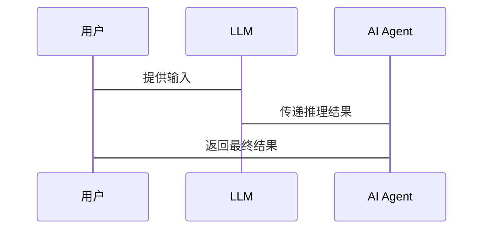

                 


```markdown
# LLM驱动的AI Agent类比推理能力增强

> 关键词：LLM, AI Agent, 类比推理, 人工智能, 自然语言处理

> 摘要：本文深入探讨了如何利用大语言模型（LLM）增强AI Agent的类比推理能力。通过分析类比推理的核心概念、算法原理、系统架构设计以及实际项目实施，本文为读者提供了从理论到实践的全面指导。文章还结合了丰富的案例分析和代码示例，帮助读者更好地理解和应用这些技术。

---

# 第1章: 背景介绍

## 1.1 问题背景
### 1.1.1 当前AI Agent的类比推理挑战
- 当前AI Agent在类比推理任务中面临的主要挑战包括：
  - 数据稀疏性：类比推理任务需要大量高质量的数据，而实际场景中数据可能不足。
  - 上下文理解：AI Agent需要理解复杂的上下文关系，而现有方法在某些场景下表现不足。
  - 实时推理能力：在动态环境中，AI Agent需要快速进行类比推理，这对计算资源和算法效率提出了更高要求。

### 1.1.2 LLM在类比推理中的优势
- LLM（大语言模型）在自然语言处理方面的优势：
  - 强大的上下文理解能力。
  - 能够处理复杂的语义关系。
  - 可以通过预训练快速适应多种任务。

### 1.1.3 问题解决的必要性
- 解决AI Agent类比推理能力不足的问题，可以提升其在实际应用中的表现，例如：
  - 智能客服：更准确地理解用户需求。
  - 自动化系统：提高决策的准确性。
  - 教育领域：辅助学生进行学习推理。

## 1.2 问题描述
### 1.2.1 类比推理的核心概念
- 类比推理：一种通过比较不同事物之间的相似性，推导出未知信息的推理方式。
- 核心特点：
  - 基于相似性。
  - 需要理解语义关系。
  - 适用于多种场景。

### 1.2.2 LLM在类比推理中的应用场景
- 常见场景：
  - 问答系统中的类比推理。
  - 自然语言理解中的语义相似性计算。
  - 生成式任务中的类比推理。

### 1.2.3 边界与外延
- 边界：
  - 类比推理仅适用于特定类型的问题。
  - 需要足够的数据支持。
- 外延：
  - 结合其他推理方法（如逻辑推理）可以进一步提升能力。

## 1.3 核心概念与联系
### 1.3.1 LLM与AI Agent的关系
- LLM为AI Agent提供了强大的语言理解和生成能力，AI Agent利用这些能力进行类比推理。
- 两者结合可以实现更复杂的任务。

### 1.3.2 类比推理能力的增强方法
- 方法一：利用预训练模型的迁移学习能力。
- 方法二：结合领域知识进行微调。

### 1.3.3 核心要素组成
- 核心要素：
  - 数据：高质量的训练数据。
  - 模型：强大的LLM。
  - 算法：有效的类比推理算法。

---

# 第2章: 核心概念与联系

## 2.1 LLM与AI Agent的协作机制
### 2.1.1 LLM的类比推理能力
- LLM如何支持类比推理：
  - 通过上下文理解提供相似性计算。
  - 生成相关的推理结果。

### 2.1.2 AI Agent的决策过程
- AI Agent如何利用LLM进行类比推理：
  - 分析问题。
  - 调用LLM进行推理。
  - 根据推理结果做出决策。

### 2.1.3 两者结合的协同效应
- 协同效应：
  - 提高推理的准确性和效率。
  - 扩展AI Agent的能力范围。

## 2.2 实体关系图


## 2.3 属性特征对比
| 特性 | LLM | AI Agent |
|------|-----|----------|
| 输入 | 文本数据 | 状态、目标、环境 |
| 输出 | 推理结果 | 行动决策 |
| 优势 | 大数据处理能力 | 环境适应性 |

---

# 第3章: 算法原理讲解

## 3.1 类比推理算法
### 3.1.1 基于相似度的类比推理
- 方法：通过计算文本的相似度进行类比推理。
- 示例：余弦相似度计算。

### 3.1.2 基于逻辑推理的类比推理
- 方法：利用逻辑规则进行推理。
- 示例：基于规则的语义分析。

### 3.1.3 混合式类比推理
- 方法：结合相似度和逻辑推理。
- 示例：混合模型的应用。

## 3.2 算法流程图


## 3.3 算法实现
### 3.3.1 代码示例
```python
def calculate_cosine_similarity(vector1, vector2):
    dot_product = np.dot(vector1, vector2)
    magnitude1 = np.linalg.norm(vector1)
    magnitude2 = np.linalg.norm(vector2)
    return dot_product / (magnitude1 * magnitude2)
```

### 3.3.2 数学模型
$$ \text{相似度} = \frac{\vec{a} \cdot \vec{b}}{|\vec{a}| |\vec{b}|} $$

---

# 第4章: 系统分析与架构设计

## 4.1 项目介绍
### 4.1.1 项目背景
- 提升AI Agent的类比推理能力。

### 4.1.2 项目目标
- 实现一个基于LLM的类比推理系统。

## 4.2 系统功能设计
### 4.2.1 领域模型


### 4.2.2 系统架构


## 4.3 接口设计
### 4.3.1 接口描述
- 输入接口：接受类比推理任务。
- 输出接口：返回推理结果。

### 4.3.2 交互流程


---

# 第5章: 项目实战

## 5.1 环境安装
- 安装Python和相关库：
  ```bash
  pip install numpy
  pip install transformers
  ```

## 5.2 核心代码实现
### 5.2.1 类比推理实现
```python
from transformers import AutoTokenizer, AutoModel

model_name = "bert-base-uncased"
tokenizer = AutoTokenizer.from_pretrained(model_name)
model = AutoModel.from_pretrained(model_name)
```

### 5.2.2 推理过程
```python
def generate_response(prompt):
    inputs = tokenizer.encode(prompt, return_tensors="pt")
    outputs = model.generate(inputs, max_length=100)
    return tokenizer.decode(outputs[0], skip_special_tokens=True)
```

## 5.3 案例分析
### 5.3.1 实际案例
- 示例：给定两个句子，生成第三个相关的句子。

### 5.3.2 分析与解读
- 分析代码实现。
- 解读推理过程。

---

# 第6章: 最佳实践与注意事项

## 6.1 小结
- 总结全文内容。

## 6.2 注意事项
- 数据隐私问题。
- 计算资源限制。

## 6.3 拓展阅读
- 推荐相关书籍和论文。

---

# 作者：AI天才研究院/AI Genius Institute & 禅与计算机程序设计艺术 /Zen And The Art of Computer Programming
```

