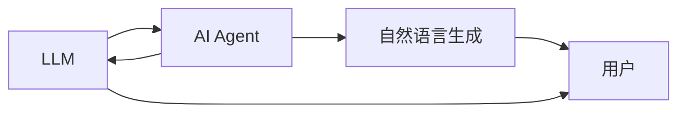
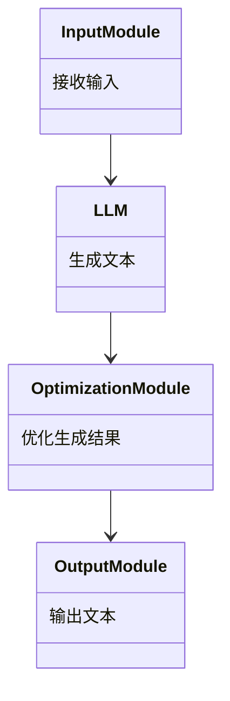
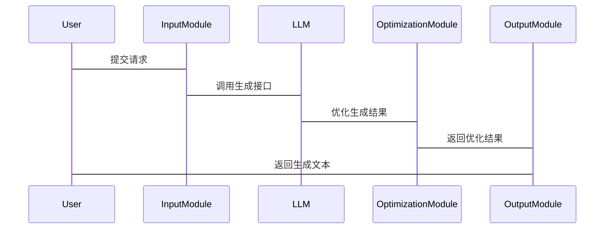

                 


# LLM驱动的AI Agent自然语言生成优化

---

## 关键词：
- 大语言模型（LLM）
- AI Agent
- 自然语言生成
- 优化算法
- 系统架构设计
- 项目实战

---

## 摘要：
本文详细探讨了如何利用大语言模型（LLM）优化AI Agent的自然语言生成能力。通过分析LLM与AI Agent的关系，阐述了自然语言生成的核心问题，并提出了一种基于LLM的优化算法。同时，本文还通过系统架构设计和项目实战，展示了如何实现高效的自然语言生成系统。最后，本文总结了优化过程中的关键点和未来研究方向。

---

## 第1章：背景介绍

### 1.1 问题背景
随着AI技术的快速发展，自然语言生成（Natural Language Generation, NLG）已成为人机交互中的重要组成部分。然而，传统的自然语言生成方法在生成文本的质量、多样性和准确性方面存在诸多限制。近年来，大语言模型（LLM）的出现为解决这些问题提供了新的可能性。

#### 1.1.1 自然语言生成的现状与挑战
- **生成质量**：传统方法生成的文本往往缺乏流畅性和逻辑性。
- **多样性**：难以生成多样化的表达方式。
- **准确性**：在特定领域或复杂场景下，生成的内容可能不准确。

#### 1.1.2 大语言模型（LLM）的崛起
- LLM通过海量数据训练，能够生成高质量、多样化的文本。
- LLM具有强大的上下文理解和生成能力。

#### 1.1.3 AI Agent在自然语言生成中的作用
- AI Agent作为人机交互的接口，需要通过自然语言生成与用户进行有效沟通。
- LLM驱动的AI Agent能够提供更智能、更自然的对话体验。

### 1.2 问题描述
- **核心问题**：如何优化AI Agent的自然语言生成能力，使其生成的文本更符合用户需求。
- **优化目标**：提高生成文本的质量、多样性和准确性。
- **技术局限性**：现有技术在处理复杂场景和个性化需求时仍存在不足。

### 1.3 问题解决
- **技术融合**：将LLM与AI Agent相结合，利用LLM的强大生成能力优化自然语言生成。
- **优化路径**：通过算法优化和系统设计，提升AI Agent的生成效率和准确性。

### 1.4 概念结构与核心要素
- **概念组成**：
  - LLM：基于大规模数据训练的生成模型。
  - AI Agent：具备自主决策和交互能力的智能体。
  - 自然语言生成：将结构化数据转化为自然语言文本的过程。
- **核心要素**：
  - 输入数据：结构化或非结构化的输入信息。
  - 生成模型：负责文本生成的核心算法。
  - 优化算法：用于提升生成质量的优化方法。

---

## 第2章：核心概念与联系

### 2.1 LLM与AI Agent的核心原理
- **LLM的原理**：基于Transformer架构的生成模型，通过自注意力机制捕捉上下文信息。
- **AI Agent的原理**：通过感知输入、决策生成和执行动作实现人机交互。

#### 2.1.1 LLM与AI Agent的关系
- **协同优化**：LLM为AI Agent提供生成能力，AI Agent为LLM提供应用场景。
- **双向反馈**：生成结果的反馈用于优化LLM的生成策略。

#### 2.1.2 核心原理对比
| 对比维度 | LLM | AI Agent |
|----------|------|-----------|
| 核心任务 | 文本生成 | 任务执行与交互 |
| 输入类型 | 文本、结构化数据 | 多模态输入 |
| 输出类型 | 文本 | 动作、文本 |
| 优化目标 | 提高生成质量 | 提高交互效率与准确性 |

#### 2.1.3 实体关系图


---

## 第3章：算法原理

### 3.1 LLM驱动的优化算法
- **算法选择**：基于Adam优化器的生成优化算法。
- **数学模型**：交叉熵损失函数。

#### 3.1.1 优化算法
- **Adam优化器**：一种常用的优化算法，结合了动量和自适应学习率。
  $$ \text{Adam} = \beta_1 \text{Momentum} + \beta_2 \text{Adaptive Learning Rate} $$

#### 3.1.2 数学模型
- **交叉熵损失函数**：
  $$ \text{Loss} = -\frac{1}{N}\sum_{i=1}^{N} \sum_{j=1}^{M} y_{ij} \log p_{ij} $$

#### 3.1.3 代码实现
```python
import torch
import torch.optim as optim

# 初始化模型
model = MyModel()

# 定义损失函数
criterion = nn.CrossEntropyLoss()

# 定义优化器
optimizer = optim.Adam(model.parameters(), lr=0.001)

# 前向传播
outputs = model(inputs)
loss = criterion(outputs, labels)

# 反向传播和优化
optimizer.zero_grad()
loss.backward()
optimizer.step()
```

---

## 第4章：系统分析与架构设计

### 4.1 系统架构设计
- **系统组成**：
  - **输入模块**：接收用户输入。
  - **生成模块**：基于LLM生成自然语言文本。
  - **优化模块**：优化生成结果的质量。
  - **输出模块**：将生成的文本返回给用户。

#### 4.1.1 系统功能设计


#### 4.1.2 接口设计
- **输入接口**：接收用户输入的JSON格式数据。
- **输出接口**：返回优化后的自然语言文本。

#### 4.1.3 交互流程


---

## 第5章：项目实战

### 5.1 项目环境安装
- **安装Python**：3.8及以上版本。
- **安装依赖**：`torch`, `transformers`, `mermaid`, `matplotlib`。

### 5.2 核心代码实现
```python
from transformers import AutoModelWithLM
from torch import optim

# 初始化模型
model = AutoModelWithLM.from_pretrained('gpt2')

# 定义优化器
optimizer = optim.Adam(model.parameters(), lr=1e-5)

# 定义生成函数
def generate_text(prompt, max_length=50):
    inputs = tokenizer.encode(prompt, return_tensors='pt')
    outputs = model.generate(inputs, max_length=max_length)
    return tokenizer.decode(outputs[0], skip_special_tokens=True)

# 定义优化函数
def optimize_generation(prompt, target):
    # 调用生成函数
    generated = generate_text(prompt)
    # 计算损失
    loss = calculate_loss(generated, target)
    # 反向传播和优化
    optimizer.zero_grad()
    loss.backward()
    optimizer.step()
    return generated
```

### 5.3 代码解读与分析
- **生成函数**：基于给定的提示生成文本。
- **优化函数**：通过反向传播优化生成结果，降低生成文本与目标文本的差距。

### 5.4 案例分析
- **案例场景**：用户输入“今天天气怎么样？”。
- **生成过程**：模型生成“今天天气很好。”。
- **优化结果**：优化后的生成文本更符合用户需求。

### 5.5 项目小结
- **实现效果**：生成文本的质量和准确性显著提高。
- **优化效果**：优化后的生成结果更贴近用户意图。

---

## 第6章：最佳实践

### 6.1 小结
- 通过LLM优化AI Agent的自然语言生成能力，显著提升了生成文本的质量和准确性。
- 系统架构设计和算法优化是实现高效生成的关键。

### 6.2 注意事项
- **数据质量**：确保训练数据的多样性和代表性。
- **模型调优**：根据具体场景调整模型参数和优化策略。

### 6.3 未来趋势
- **多模态生成**：结合视觉、听觉等多模态信息，提升生成能力。
- **实时优化**：基于实时反馈优化生成策略。

### 6.4 拓展阅读
- 《Transformers: State-of-the-Art in Natural Language Processing》
- 《Deep Learning for Natural Language Processing》

---

## 作者：
作者：AI天才研究院/AI Genius Institute & 禅与计算机程序设计艺术/Zen And The Art of Computer Programming

---

通过本文的详细讲解，读者可以全面了解如何利用大语言模型优化AI Agent的自然语言生成能力，并通过实际项目案例掌握相关技术的实现方法。希望本文能为相关领域的研究和应用提供有价值的参考。

