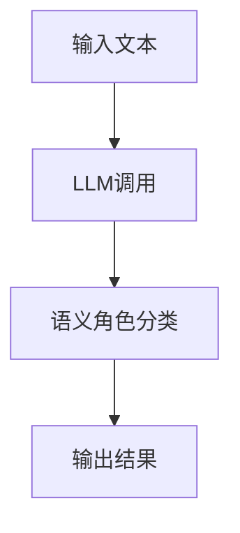
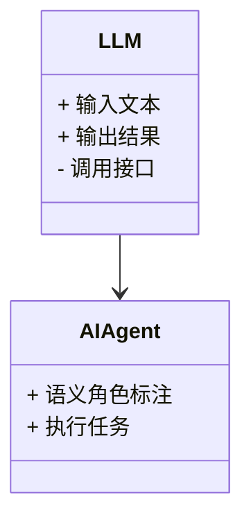
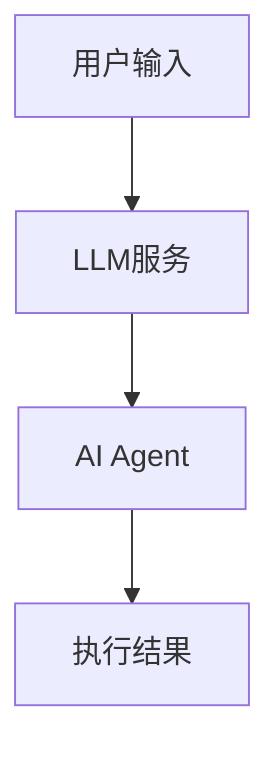
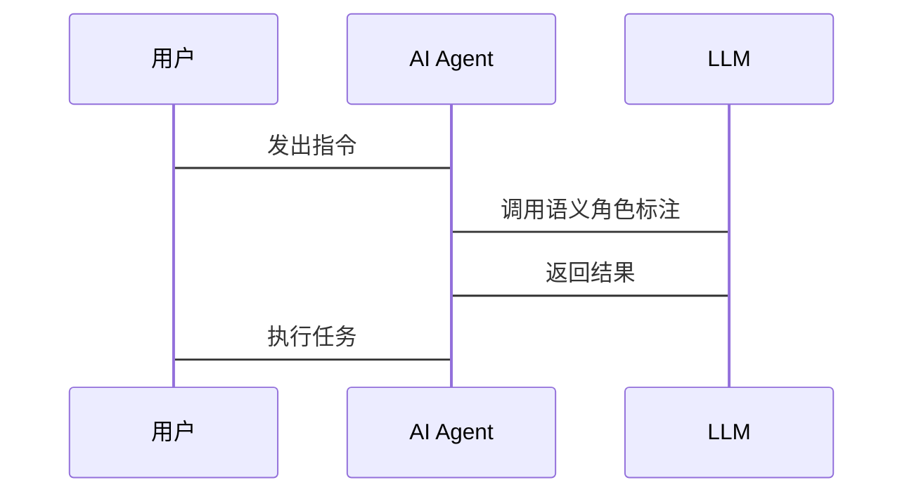

                 


# LLM驱动的AI Agent语义角色标注

> **关键词**：LLM、AI Agent、语义角色标注、自然语言处理、智能系统设计、算法优化

> **摘要**：  
本文深入探讨了LLM（Large Language Model）驱动的AI Agent语义角色标注技术，从背景与基础、核心概念与联系、算法原理与数学模型、系统分析与架构设计到项目实战与案例分析，全面解析了这一技术的实现细节和应用场景。文章内容丰富，逻辑严谨，旨在为技术读者提供系统的知识和实践指导。

---

## 第一部分：背景与基础

### 第1章：LLM驱动的AI Agent概述

#### 1.1 问题背景与目标
语义角色标注是自然语言处理中的重要任务，旨在识别文本中的语义角色，如“动作”、“主语”、“宾语”等。随着LLM的崛起，AI Agent能够更高效地处理复杂任务，而语义角色标注为其提供了理解上下文的能力。

#### 1.2 AI Agent与LLM的结合
AI Agent通过LLM实现语义理解，LLM则通过语义角色标注为AI Agent提供更精准的语义信息。两者结合，使得AI Agent能够更好地理解和执行用户的指令。

#### 1.3 语义角色标注的核心概念
语义角色标注是对文本中的语义角色进行分类，帮助AI Agent理解句子的结构和含义。核心概念包括语义角色的定义、分类和标注流程。

---

## 第二部分：核心概念与联系

### 第2章：语义角色标注的核心原理

#### 2.1 语义角色标注的原理
语义角色标注基于LLM的语义分析能力，结合上下文推理，实现语义角色的识别和分类。

#### 2.2 核心概念对比与ER实体关系图
| 核心概念 | 属性特征 |
|----------|----------|
| 语义角色 | 定义、分类、上下文依赖 |
| LLM     | 模型能力、输入输出方式、训练数据 |


---

## 第三部分：算法原理与数学模型

### 第3章：基于LLM的语义角色标注算法

#### 3.1 算法原理
算法流程如下：



#### 3.2 算法实现与优化
数学模型如下：

$$P(y|x) = \frac{P(x|y)P(y)}{P(x)}$$

损失函数：

$$\text{损失函数} = \sum_{i=1}^{n} \text{交叉熵}(y_i, \hat{y}_i)$$

---

## 第四部分：系统分析与架构设计

### 第4章：系统架构与功能设计

#### 4.1 系统功能设计
领域模型设计如下：



系统架构设计如下：



#### 4.2 系统交互流程
系统交互流程如下：



---

## 第五部分：项目实战与案例分析

### 第5章：LLM驱动的AI Agent语义角色标注实战

#### 5.1 项目环境与工具安装
开发环境包括Python、LLM库（如Hugging Face）、AI Agent框架（如LangChain）。

#### 5.2 核心代码实现
代码实现如下：

```python
def semantic_role标注算法(x):
    response = LLM(x)
    role = 分类器(response)
    return role
```

#### 5.3 案例分析
以一个实际案例为例，展示如何通过LLM驱动的AI Agent实现语义角色标注，并分析其效果和优化方向。

---

## 第六部分：总结与展望

### 第6章：总结与展望

#### 6.1 总结
本文全面介绍了LLM驱动的AI Agent语义角色标注技术，从原理到实现，再到系统设计，为读者提供了系统的知识体系。

#### 6.2 展望
未来，随着LLM技术的不断发展，语义角色标注在AI Agent中的应用将更加广泛，可能的研究方向包括更高效的算法优化和更智能化的系统设计。

---

**作者：AI天才研究院/AI Genius Institute & 禅与计算机程序设计艺术 /Zen And The Art of Computer Programming**

