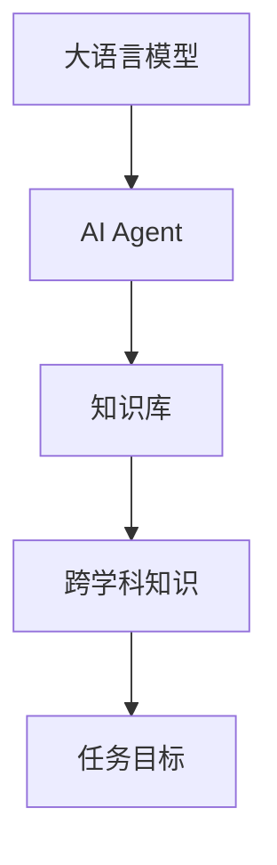
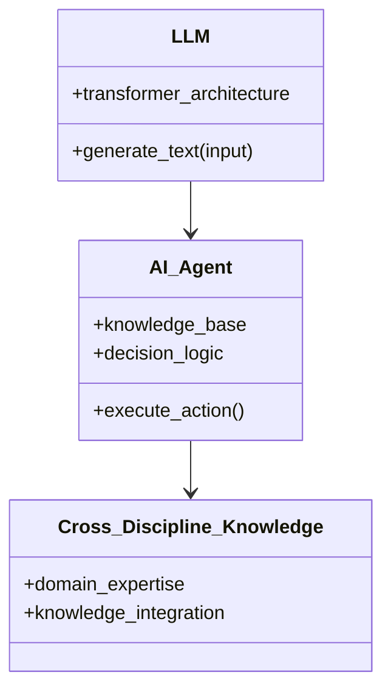

                 


# LLM驱动的AI Agent跨学科知识整合器

> 关键词：LLM, AI Agent, 跨学科知识整合, 人工智能, 大语言模型

> 摘要：本文探讨了LLM驱动的AI Agent作为跨学科知识整合器的核心概念、算法原理、系统架构设计以及实际应用。通过详细分析LLM与AI Agent的结合方式，展示了如何利用大语言模型的强大能力，实现跨学科知识的高效整合与应用。本文旨在为技术从业者和研究者提供深入的理论指导和实践参考。

---

# 第一部分: LLM驱动的AI Agent基础

## 第1章: LLM与AI Agent概述

### 1.1 LLM驱动的AI Agent的概念

#### 1.1.1 大语言模型（LLM）的基本概念
大语言模型（Large Language Model, LLM）是指基于深度学习训练的大型神经网络模型，能够理解和生成人类语言。LLM的核心在于其庞大的参数量和复杂的数据训练过程，使其具备强大的自然语言处理能力。例如，GPT系列模型通过大量文本数据的训练，能够生成连贯且符合语境的文本。

#### 1.1.2 AI Agent的定义与特点
AI Agent（人工智能代理）是指能够感知环境、自主决策并执行任务的智能体。AI Agent的核心特征包括自主性、反应性、目标导向性和社交能力。AI Agent能够通过与环境交互，动态调整其行为以实现特定目标。

#### 1.1.3 LLM驱动的AI Agent的核心优势
LLM驱动的AI Agent结合了大语言模型的自然语言处理能力和AI Agent的自主决策能力，能够在复杂环境中实现高效的知识整合与任务执行。LLM为AI Agent提供了强大的语言理解和生成能力，使其能够处理多领域的知识和任务。

---

### 1.2 跨学科知识整合的背景与意义

#### 1.2.1 跨学科整合的必要性
现代社会的问题往往涉及多个学科领域，例如医疗领域的疾病诊断需要结合医学知识和数据分析技术。传统的单一学科方法难以应对复杂问题，跨学科整合成为必然趋势。

#### 1.2.2 LLM在跨学科整合中的作用
LLM具备处理多领域知识的能力，能够将分散在不同学科的知识进行整合和关联，为跨学科问题提供解决方案。例如，LLM可以将医学、生物学和化学的知识结合，辅助药物研发。

#### 1.2.3 AI Agent作为知识整合器的价值
AI Agent通过LLM驱动，能够实时获取和整合跨学科知识，快速响应复杂问题。这种能力使得AI Agent成为跨学科知识整合的核心工具。

---

## 第2章: LLM驱动的AI Agent核心概念与联系

### 2.1 核心概念原理

#### 2.1.1 LLM的基本原理
LLM基于 transformer 架构，通过自注意力机制（Self-Attention）和前馈神经网络（FFN）实现语言模型的训练和推理。自注意力机制使模型能够关注输入文本中的重要部分，从而生成连贯的输出。

#### 2.1.2 AI Agent的行为决策机制
AI Agent通过感知环境信息，利用知识库和推理能力，生成目标导向的行为。例如，AI Agent可以通过分析用户需求，调用不同领域的知识库，生成解决方案。

#### 2.1.3 跨学科知识整合的实现方式
跨学科知识整合通过将不同领域的知识表示为结构化的数据，利用LLM进行语义理解和关联推理。例如，将医学和生物学的知识图谱整合，用于疾病机制的研究。

---

### 2.2 核心概念对比表

| 概念         | 特性1       | 特性2       | 特性3       |
|--------------|------------|------------|------------|
| LLM          | 参数量大    | 自然语言处理能力强大 | 需大量计算资源 |
| AI Agent     | 行为驱动    | 环境交互能力     | 任务导向性   |
| 跨学科整合   | 知识融合    | 多领域适用性     | 动态适应性   |

---

### 2.3 实体关系图



---

# 第二部分: LLM驱动的AI Agent算法原理

## 第3章: LLM的算法原理

### 3.1 LLM的核心算法

#### 3.1.1 变压器（Transformer）架构

Transformer由编码器（Encoder）和解码器（Decoder）组成，通过自注意力机制实现全局上下文感知。编码器将输入序列转换为高维向量，解码器根据编码器输出生成目标序列。

#### 3.1.2 自注意力机制

自注意力机制通过计算输入序列中每个位置的权重，生成上下文表示。公式如下：

$$
\text{Attention}(Q, K, V) = \text{softmax}\left(\frac{QK^T}{\sqrt{d_k}}\right)V
$$

其中，\( Q \) 是查询向量，\( K \) 是键向量，\( V \) 是值向量，\( d_k \) 是键的维度。

---

## 第4章: AI Agent的决策算法

### 4.1 基于LLM的决策模型

AI Agent通过LLM生成多种可能的解决方案，利用环境反馈选择最优行为。例如，AI Agent可以通过LLM生成多个药物研发方案，并根据实验结果选择最佳方案。

---

# 第三部分: 系统架构设计

## 第5章: 跨学科知识整合系统设计

### 5.1 知识库构建

跨学科知识整合需要构建结构化的知识库，将不同领域的知识表示为图结构。例如，将医学和生物学的知识表示为知识图谱，便于LLM进行语义理解和推理。

### 5.2 系统功能设计



---

## 第6章: 项目实战

### 6.1 环境配置

安装必要的依赖：

```bash
pip install transformers
pip install torch
pip install matplotlib
```

---

### 6.2 核心代码实现

```python
from transformers import AutoTokenizer, AutoModelForCausalLM
import torch

# 初始化模型和tokenizer
tokenizer = AutoTokenizer.from_pretrained("gpt2")
model = AutoModelForCausalLM.from_pretrained("gpt2")

# 定义输入
input_ids = tokenizer("这是一个测试输入。", return_tensors="pt").input_ids

# 生成输出
output = model.generate(input_ids, max_length=50)
print(tokenizer.decode(output[0], skip_special_tokens=True))
```

---

## 第7章: 最佳实践与总结

### 7.1 实践经验总结

1. 在实际应用中，建议使用更复杂的LLM模型（如GPT-3或更大）以提高生成质量。
2. 要确保知识库的准确性和及时更新，以保证跨学科整合的可靠性。

---

### 7.2 注意事项

- LLM驱动的AI Agent需要大量的计算资源，建议使用云服务进行部署。
- 在跨学科应用中，需要考虑不同领域知识的兼容性问题。

---

### 7.3 未来展望

随着AI技术的进步，LLM驱动的AI Agent将更加智能化，能够处理更复杂的跨学科问题。未来的研究方向包括优化LLM的推理能力，提升AI Agent的自主决策能力。

---

作者：AI天才研究院/AI Genius Institute & 禅与计算机程序设计艺术 /Zen And The Art of Computer Programming

