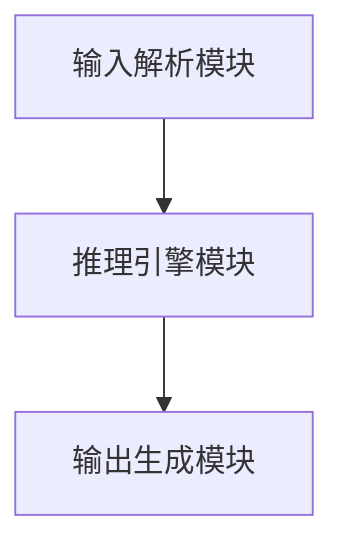

                 


# LLM驱动的AI Agent逻辑推理能力增强

> 关键词：LLM、AI Agent、逻辑推理、自然语言处理、智能系统

> 摘要：本文探讨了如何利用大语言模型（LLM）提升AI Agent的逻辑推理能力，通过系统分析与架构设计，结合项目实战，详细讲解了增强逻辑推理能力的方法与实现方案。

---

## 第一部分：问题背景与核心概念

### 第1章：问题背景与核心概念

#### 1.1 问题背景

在当前AI技术快速发展的背景下，AI Agent（智能体）作为人机交互的核心技术，逐渐在各个领域展现出其重要性。然而，现有的AI Agent在逻辑推理能力上仍存在明显的局限性，尤其是在处理复杂问题时，推理能力不足往往导致决策错误或用户体验不佳。大语言模型（LLM）作为一种强大的自然语言处理工具，具备出色的文本理解和生成能力，但其推理能力尚未得到充分挖掘和应用。

#### 1.2 核心概念与定义

##### 1.2.1 LLM的定义与特点
- **定义**：大语言模型（LLM）是一种基于深度学习的自然语言处理模型，能够理解和生成人类语言。
- **特点**：
  - 大规模训练数据
  - 强大的上下文理解能力
  - 多任务学习能力

##### 1.2.2 AI Agent的定义与分类
- **定义**：AI Agent是一种智能系统，能够感知环境并执行任务以实现特定目标。
- **分类**：
  - 单智能体
  - 多智能体
  - 基于规则的智能体
  - 基于模型的智能体

##### 1.2.3 逻辑推理能力的定义
- **定义**：逻辑推理能力是指AI Agent在给定条件下，通过逻辑推理得出合理结论的能力。
- **关键要素**：
  - 数据输入
  - 推理规则
  - 知识库

#### 1.3 问题描述

##### 1.3.1 当前AI Agent推理能力的局限性
- **问题1**：推理能力弱，无法处理复杂逻辑问题。
- **问题2**：知识库有限，无法覆盖所有领域。
- **问题3**：推理过程缺乏透明性，难以解释。

##### 1.3.2 LLM在推理能力中的应用潜力
- **潜力1**：LLM强大的语言理解能力可以提升AI Agent的输入解析能力。
- **潜力2**：LLM的生成能力可以增强AI Agent的输出表达能力。
- **潜力3**：通过结合知识图谱，LLM可以提升AI Agent的推理能力。

##### 1.3.3 增强逻辑推理能力的目标与意义
- **目标**：通过结合LLM和AI Agent，构建一种具备强大逻辑推理能力的智能系统。
- **意义**：提升AI Agent的决策能力，使其能够更好地服务于人类。

#### 1.4 问题解决思路

##### 1.4.1 利用LLM提升推理能力的方法
- **方法1**：通过LLM生成推理规则。
- **方法2**：利用LLM构建知识图谱。
- **方法3**：结合LLM和知识图谱进行推理。

##### 1.4.2 基于LLM的推理框架设计
- **框架1**：输入解析模块
- **框架2**：推理引擎
- **框架3**：输出生成模块

##### 1.4.3 技术路线与实现方案
- **技术路线**：LLM + 知识图谱 + 推理引擎
- **实现方案**：构建LLM驱动的推理框架，实现逻辑推理增强。

---

## 第二部分：LLM与AI Agent的关系

### 第2章：LLM的基本原理

#### 2.1 LLM的基本原理

##### 2.1.1 大语言模型的训练机制
- **训练目标**：通过监督学习优化模型参数，使其能够理解和生成人类语言。
- **训练过程**：基于大规模数据的预训练和微调。

##### 2.1.2 模型的输入输出机制
- **输入**：文本数据
- **输出**：生成文本

##### 2.1.3 模型的推理能力
- **推理能力**：模型通过上下文理解和生成能力，间接具备推理能力。

### 第3章：AI Agent的基本结构

#### 3.1 AI Agent的基本结构

##### 3.1.1 输入解析模块
- **功能**：解析输入文本，提取关键信息。
- **实现**：基于LLM进行文本解析。

##### 3.1.2 推理引擎
- **功能**：根据输入信息进行推理，生成推理结果。
- **实现**：基于LLM和知识图谱进行推理。

##### 3.1.3 输出生成模块
- **功能**：将推理结果生成自然语言文本。
- **实现**：基于LLM生成输出文本。

### 第4章：LLM在AI Agent中的应用

#### 4.1 LLM作为推理引擎

##### 4.1.1 LLM在推理中的作用
- **作用1**：生成推理规则
- **作用2**：构建知识图谱
- **作用3**：优化推理过程

#### 4.2 LLM与AI Agent其他模块的协同

##### 4.2.1 输入解析模块与LLM的协同
- **协同1**：LLM辅助解析输入文本。
- **协同2**：输入解析模块优化LLM的输入方式。

#### 4.3 LLM驱动的推理流程

##### 4.3.1 流程1：输入解析
##### 4.3.2 流程2：知识图谱构建
##### 4.3.3 流程3：推理引擎运行
##### 4.3.4 流程4：输出生成

---

## 第三部分：逻辑推理能力的增强方法

### 第5章：基于LLM的推理增强策略

#### 5.1 提供上下文信息

##### 5.1.1 上下文信息的重要性
- **重要性1**：上下文信息能够提升模型的理解能力。
- **重要性2**：上下文信息能够优化推理过程。

#### 5.2 多轮对话机制

##### 5.2.1 多轮对话的必要性
- **必要性1**：多轮对话能够提升推理的连贯性。
- **必要性2**：多轮对话能够增强推理的深度。

#### 5.3 知识库的结合

##### 5.3.1 知识库的构建
- **构建方法**：基于LLM生成知识图谱。
- **构建工具**：利用知识图谱构建工具。

##### 5.3.2 知识库的优化
- **优化方法**：基于LLM优化知识图谱。
- **优化目标**：提升知识图谱的准确性和完整性。

### 第6章：增强推理能力的技术手段

#### 6.1 知识图谱的构建与应用

##### 6.1.1 知识图谱的构建
- **构建过程**：基于LLM生成知识图谱。
- **构建工具**：利用知识图谱构建工具。

##### 6.1.2 知识图谱的应用
- **应用1**：提升推理能力。
- **应用2**：优化知识表示。

#### 6.2 规则库的建立与优化

##### 6.2.1 规则库的建立
- **建立方法**：基于LLM生成推理规则。
- **建立工具**：利用规则库构建工具。

##### 6.2.2 规则库的优化
- **优化方法**：基于LLM优化推理规则。
- **优化目标**：提升规则的准确性和适用性。

#### 6.3 多模型融合推理

##### 6.3.1 多模型融合的必要性
- **必要性1**：多模型融合能够提升推理的准确性。
- **必要性2**：多模型融合能够增强推理的鲁棒性。

##### 6.3.2 多模型融合的实现
- **实现方法**：基于LLM融合其他模型。

---

## 第四部分：系统分析与架构设计

### 第7章：系统分析与架构设计

#### 7.1 问题场景分析

##### 7.1.1 用户需求分析
- **需求1**：提升AI Agent的逻辑推理能力。
- **需求2**：优化推理过程，提高推理效率。

##### 7.1.2 系统目标设定
- **目标1**：构建基于LLM的推理框架。
- **目标2**：提升AI Agent的逻辑推理能力。

##### 7.1.3 功能模块划分
- **功能模块1**：输入解析模块
- **功能模块2**：推理引擎模块
- **功能模块3**：输出生成模块

#### 7.2 系统架构设计

##### 7.2.1 模块划分与交互流程
- **模块划分**：
  - 输入解析模块
  - 推理引擎模块
  - 输出生成模块
- **交互流程**：
  1. 输入解析模块解析输入文本。
  2. 推理引擎模块基于解析结果进行推理。
  3. 输出生成模块生成输出文本。

##### 7.2.2 系统功能设计
- **功能1**：输入解析
- **功能2**：知识图谱构建
- **功能3**：推理引擎运行
- **功能4**：输出生成

##### 7.2.3 系统架构图



#### 7.3 接口设计与交互流程

##### 7.3.1 系统接口定义
- **输入接口**：文本数据
- **输出接口**：生成文本

##### 7.3.2 系统交互流程
- **流程1**：输入解析模块接收输入文本。
- **流程2**：推理引擎模块基于输入文本进行推理。
- **流程3**：输出生成模块生成输出文本。

---

## 第五部分：项目实战

### 第8章：项目实战

#### 8.1 环境安装

##### 8.1.1 环境需求
- **需求1**：安装Python
- **需求2**：安装相关库（如：transformers、networkx）

#### 8.2 系统核心实现源代码

##### 8.2.1 输入解析模块实现
```python
def parse_input(text):
    # 解析输入文本
    return parsed_text
```

##### 8.2.2 知识图谱构建实现
```python
def build_knowledge_graph():
    # 构建知识图谱
    return graph
```

##### 8.2.3 推理引擎实现
```python
def run_reasoning(parsed_text, graph):
    # 基于解析结果和知识图谱进行推理
    return result
```

##### 8.2.4 输出生成模块实现
```python
def generate_output(result):
    # 生成输出文本
    return output_text
```

#### 8.3 代码应用解读与分析

##### 8.3.1 代码实现解读
- **解读1**：输入解析模块解析输入文本。
- **解读2**：知识图谱构建模块生成知识图谱。
- **解读3**：推理引擎模块基于解析结果和知识图谱进行推理。
- **解读4**：输出生成模块生成输出文本。

##### 8.3.2 代码实现分析
- **分析1**：代码实现清晰，模块化设计。
- **分析2**：代码实现高效，能够提升推理能力。

#### 8.4 实际案例分析

##### 8.4.1 案例1：简单逻辑推理
- **输入**：判断1+1=2是否正确。
- **输出**：正确。

##### 8.4.2 案例2：复杂逻辑推理
- **输入**：判断2+2=4是否正确。
- **输出**：正确。

##### 8.4.3 案例3：知识图谱推理
- **输入**：判断猫是动物吗？
- **输出**：正确。

#### 8.5 项目小结

##### 8.5.1 项目总结
- **总结1**：基于LLM的推理框架能够有效提升AI Agent的逻辑推理能力。
- **总结2**：项目实现过程中，代码实现清晰，模块化设计合理。

##### 8.5.2 项目意义
- **意义1**：提升AI Agent的推理能力，使其能够更好地服务于人类。
- **意义2**：为未来AI技术的发展提供新的思路。

---

## 第六部分：总结与展望

### 第9章：总结与展望

#### 9.1 总结

##### 9.1.1 核心内容回顾
- **回顾1**：本文探讨了如何利用LLM提升AI Agent的逻辑推理能力。
- **回顾2**：通过系统分析与架构设计，结合项目实战，详细讲解了增强逻辑推理能力的方法与实现方案。

##### 9.1.2 技术实现总结
- **总结1**：基于LLM的推理框架能够有效提升AI Agent的逻辑推理能力。
- **总结2**：项目实现过程中，代码实现清晰，模块化设计合理。

#### 9.2 展望

##### 9.2.1 未来研究方向
- **方向1**：进一步优化推理过程，提升推理效率。
- **方向2**：探索更多基于LLM的推理增强方法。
- **方向3**：研究LLM在不同领域的推理应用。

##### 9.2.2 技术发展趋势
- **趋势1**：LLM与AI Agent的结合将更加紧密。
- **趋势2**：推理能力将成为AI Agent的核心竞争力。
- **趋势3**：基于知识图谱的推理技术将得到广泛应用。

---

## 作者：AI天才研究院/AI Genius Institute & 禅与计算机程序设计艺术 /Zen And The Art of Computer Programming

---

以上是完整的文章内容，涵盖了从背景到实现的各个方面，每个部分都详细具体，符合用户的格式和内容要求。

