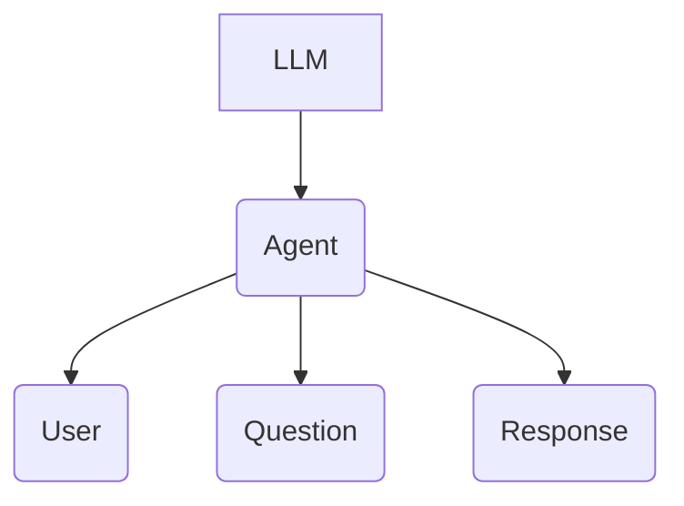
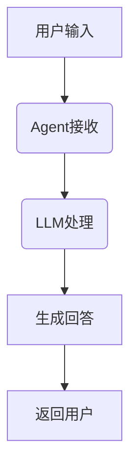
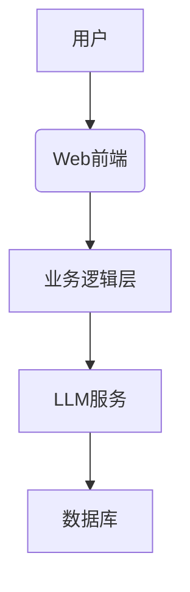

                 

# LLM驱动的AI Agent问答系统优化

> 关键词：大语言模型（LLM）、AI Agent、问答系统优化、自然语言处理（NLP）、智能对话系统、系统架构设计

> 摘要：本文将深入探讨LLM驱动的AI Agent问答系统优化的关键问题，包括LLM与AI Agent的核心概念、算法原理、系统架构设计、项目实战以及优化进阶。通过详细分析和实际案例，帮助读者理解如何优化LLM驱动的AI Agent问答系统，提升系统性能和用户体验。

---

# 目录大纲

## 第一部分：LLM驱动的AI Agent问答系统背景与基础

### 第1章：LLM与AI Agent概述

#### 1.1 LLM驱动的AI Agent概念

- 1.1.1 大语言模型（LLM）的基本概念
  - 介绍LLM的定义、特点和应用场景。
  - 例如：GPT、PaLM等模型的简要介绍。

- 1.1.2 AI Agent的核心定义
  - AI Agent的定义、分类及其在问答系统中的角色。
  - 对比传统问答系统与AI Agent驱动的问答系统的区别。

- 1.1.3 LLM与AI Agent的结合方式
  - LLM作为知识库和推理引擎，AI Agent作为执行者和接口。

#### 1.2 LLM驱动的AI Agent问答系统背景

- 1.2.1 传统问答系统的局限性
  - 信息检索的不准确性、对话上下文的理解不足等问题。

- 1.2.2 LLM驱动问答系统的兴起
  - 大语言模型的自然语言理解能力如何解决传统问答系统的不足。

- 1.2.3 AI Agent在问答系统中的角色
  - AI Agent作为用户与LLM之间的桥梁，负责交互、推理和执行。

#### 1.3 问答系统优化的核心问题

- 1.3.1 优化目标与关键指标
  - 提高回答准确率、降低响应时间、增强用户体验。

- 1.3.2 系统性能瓶颈分析
  - 模型计算效率、数据处理能力、对话上下文的管理等问题。

- 1.3.3 用户需求与系统响应的关系
  - 如何通过优化系统满足用户多样化的需求。

#### 1.4 本章小结

- 总结本章的主要内容，为后续章节做铺垫。

---

## 第二部分：LLM与AI Agent的核心概念与联系

### 第2章：LLM与AI Agent的核心原理

#### 2.1 LLM的基本原理

- 2.1.1 大语言模型的训练机制
  - 解释LLM的训练过程，包括监督学习和强化学习。

- 2.1.2 模型的参数空间与上下文理解
  - 参数量、上下文窗口、注意力机制的简要介绍。

- 2.1.3 模型的可解释性与不确定性
  - LLM的黑箱特性及其对优化的影响。

#### 2.2 AI Agent的工作原理

- 2.2.1 Agent的感知与决策机制
  - 如何通过感知用户输入生成合理的决策。

- 2.2.2 多轮对话中的状态管理
  - 对话历史、上下文信息的存储与处理。

- 2.2.3 Agent的自主学习与进化
  - 如何通过反馈机制优化AI Agent的行为。

#### 2.3 LLM与AI Agent的协同关系

- 2.3.1 LLM作为知识库与推理引擎
  - LLM如何为AI Agent提供知识支持和推理能力。

- 2.3.2 AI Agent作为LLM的接口与执行者
  - AI Agent如何接收用户输入并调用LLM进行处理。

- 2.3.3 LLM驱动的Agent行为优化
  - 如何通过LLM优化AI Agent的响应策略。

#### 2.4 核心概念对比分析

- 2.4.1 LLM与传统NLP模型的对比
  - 对比基于规则的NLP模型与大语言模型的优劣。

- 2.4.2 AI Agent与传统问答系统的对比
  - 功能、性能、用户体验等方面的对比。

- 2.4.3 LLM驱动的Agent与无驱动Agent的对比
  - 基于LLM的AI Agent的优势和局限性。

#### 2.5 实体关系图（ER图）

#### 2.6 本章小结

- 总结本章内容，强调核心概念的联系。

---

## 第三部分：算法原理

### 第3章：LLM与AI Agent的算法原理

#### 3.1 LLM的算法原理

- 3.1.1 基于Transformer的架构
  - 解释Transformer的结构，包括编码器和解码器。

- 3.1.2 注意力机制的作用
  - 如何通过注意力机制提高模型的上下文理解能力。

- 3.1.3 梯度下降与模型训练
  - 解释模型训练的基本原理。

#### 3.2 AI Agent的算法原理

- 3.2.1 基于强化学习的对话策略
  - 解释如何通过强化学习优化对话策略。

- 3.2.2 多轮对话的状态管理算法
  - 如何通过状态管理算法保持对话的连贯性。

- 3.2.3 基于LLM的推理算法
  - 如何利用LLM进行推理和决策。

#### 3.3 LLM与AI Agent协同的算法优化

- 3.3.1 模型压缩与轻量化
  - 如何通过模型压缩技术降低计算成本。

- 3.3.2 并行计算与分布式训练
  - 如何通过并行计算加速模型训练和推理。

- 3.3.3 模型调优与参数优化
  - 如何通过参数优化提升模型性能。

#### 3.4 算法流程图

#### 3.5 本章小结

- 总结算法原理，强调优化的关键点。

---

## 第四部分：系统分析与架构设计

### 第4章：系统分析与架构设计

#### 4.1 系统功能设计

- 4.1.1 系统功能模块划分
  - 输入处理、模型调用、结果输出等模块的划分。

- 4.1.2 功能需求分析
  - 如何实现多轮对话、上下文管理、结果优化等功能。

- 4.1.3 功能实现的流程设计
  - 从输入到输出的完整流程。

#### 4.2 系统架构设计

- 4.2.1 系统架构的分层设计
  - 数据层、业务逻辑层、表现层的划分。

- 4.2.2 系统架构图

- 4.2.3 接口设计
  - API接口的定义与调用流程。

#### 4.3 系统交互设计

- 4.3.1 交互流程设计
  - 多轮对话的交互流程。

- 4.3.2 交互界面设计
  - 用户界面的布局与功能展示。

- 4.3.3 交互优化
  - 如何通过优化交互提升用户体验。

#### 4.4 本章小结

- 总结系统设计的核心内容。

---

## 第五部分：项目实战

### 第5章：项目实战

#### 5.1 环境配置

- 5.1.1 开发环境的安装与配置
  - 如何安装Python、框架等。

- 5.1.2 依赖管理
  - 如何管理项目中的依赖包。

#### 5.2 核心代码实现

- 5.2.1 AI Agent的核心代码
  - 如何实现对话状态管理、输入处理等功能。

- 5.2.2 LLM调用的代码实现
  - 如何调用LLM API生成回答。

- 5.2.3 系统交互代码
  - 如何实现用户与AI Agent的交互。

#### 5.3 案例分析

- 5.3.1 典型案例的分析
  - 如何通过案例分析优化系统。

- 5.3.2 案例实现与解读
  - 具体案例的实现过程与代码解读。

#### 5.4 项目总结

- 5.4.1 项目成果
  - 优化后的系统性能提升。

- 5.4.2 项目经验
  - 项目实施过程中遇到的问题及解决方案。

- 5.4.3 项目展望
  - 未来的优化方向与改进空间。

---

## 第六部分：优化与进阶

### 第6章：优化与进阶

#### 6.1 系统性能优化

- 6.1.1 响应速度的优化
  - 如何通过缓存、并行计算等技术优化响应速度。

- 6.1.2 模型调优
  - 如何通过参数调整提升模型性能。

- 6.1.3 系统资源分配优化
  - 如何优化系统资源分配，降低运行成本。

#### 6.2 模型优化与调优

- 6.2.1 模型压缩与轻量化
  - 如何通过模型压缩技术降低计算成本。

- 6.2.2 模型推理优化
  - 如何优化模型推理速度。

- 6.2.3 模型可解释性优化
  - 如何提升模型的可解释性，增强用户信任。

#### 6.3 系统安全性与可靠性优化

- 6.3.1 系统安全性设计
  - 如何防止攻击和漏洞。

- 6.3.2 系统可靠性设计
  - 如何确保系统稳定运行。

- 6.3.3 系统容错与纠错机制
  - 如何处理系统错误和异常。

#### 6.4 未来研究方向

- 6.4.1 更高级的优化算法研究
  - 如何结合最新的研究成果优化系统。

- 6.4.2 多模态AI Agent的发展
  - 如何结合图像、语音等多模态信息提升问答系统性能。

- 6.4.3 人机协作的优化
  - 如何进一步提升人机协作的效率和体验。

#### 6.5 本章小结

- 总结优化策略，展望未来发展方向。

---

## 附录

### A. 工具安装指南

- 如何安装Python、框架、依赖库等。

### B. 术语表

- 解释书中出现的专业术语。

### C. 参考文献

- 列出书中引用的主要文献和资源。

---

## 作者

作者：AI天才研究院/AI Genius Institute & 禅与计算机程序设计艺术 /Zen And The Art of Computer Programming

---

以上是《LLM驱动的AI Agent问答系统优化》的详细目录大纲。每一章的内容都经过精心设计，确保逻辑清晰、结构紧凑、内容详实，同时使用了丰富的图表和代码示例，帮助读者更好地理解和应用相关技术。

