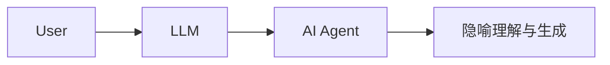
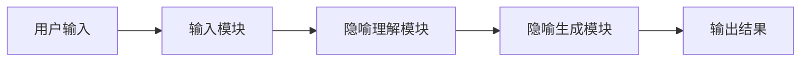

                 


# LLM驱动的AI Agent隐喻理解与生成

---

## 关键词  
- LLM (Large Language Model)  
- AI Agent (人工智能代理)  
- 隐喻理解与生成  
- 人机交互  
- 自然语言处理  

---

## 摘要  
本文深入探讨了如何利用大语言模型 (LLM) 驱动 AI Agent 来理解和生成隐喻。文章首先介绍了 LLM 和 AI Agent 的基本概念，分析了隐喻在人机交互中的重要性。接着，详细阐述了 LLM 在隐喻理解与生成中的关键技术，包括模型训练、算法原理和系统架构。最后，通过实际案例展示了如何实现一个基于 LLM 的 AI Agent，并提出了最佳实践和未来研究方向。

---

# 第1章: LLM与AI Agent概述  

## 1.1 LLM的定义与特点  
### 1.1.1 大语言模型的基本概念  
大语言模型 (LLM) 是一种基于深度学习的自然语言处理模型，能够理解和生成人类语言。LLM 的核心是通过大量数据训练，学习语言的语法、语义和上下文关系。  

### 1.1.2 LLM的核心特点  
1. **大规模数据训练**：LLM 使用海量文本数据进行预训练，涵盖多种语言和领域。  
2. **生成能力强**：LLM 能够生成连贯且符合语境的文本，支持多种任务，如翻译、问答和创意写作。  
3. **可微调性**：LLM 可以通过微调任务特定的数据，适应具体应用场景的需求。  

### 1.1.3 LLM与传统NLP模型的区别  
| 属性 | 传统NLP模型 | LLM |  
|------|--------------|-----|  
| 数据需求 | 小规模标注数据 | 大规模未标注数据 |  
| 模型复杂度 | 较低 | 极高 |  
| 任务通用性 | 专为特定任务设计 | 支持多任务通用化 |  

## 1.2 AI Agent的定义与功能  
### 1.2.1 AI Agent的基本概念  
AI Agent 是一种智能体，能够感知环境、理解用户需求并执行任务。它通过与用户交互，提供信息、解决问题或完成目标。  

### 1.2.2 AI Agent的核心功能  
1. **感知**：通过传感器或输入数据，理解当前环境和用户需求。  
2. **推理**：基于感知的信息，进行逻辑推理和决策。  
3. **执行**：根据推理结果，执行具体任务或输出结果。  

### 1.2.3 LLM在AI Agent中的作用  
LLM 为 AI Agent 提供了强大的语言理解和生成能力，使其能够更自然地与人类交互。  

## 1.3 隐喻的理解与生成的重要性  
### 1.3.1 隐喻的基本概念  
隐喻是一种语言表达方式，通过类比将一个概念映射到另一个概念，增强表达效果。  

### 1.3.2 隐喻在AI Agent中的应用价值  
1. **提升交互体验**：通过隐喻，AI Agent 可以更生动地表达复杂概念。  
2. **增强理解能力**：隐喻的理解需要对语言、文化和上下文有深刻理解，这可以验证 AI Agent 的智能水平。  

### 1.3.3 LLM驱动隐喻理解与生成的潜力  
LLM 的大规模预训练使其具备理解隐喻的能力，而微调技术则可以进一步优化隐喻生成的效果。  

## 1.4 本章小结  
本章介绍了 LLM 和 AI Agent 的基本概念，并分析了隐喻在 AI Agent 中的重要性。接下来的章节将详细探讨 LLM 在隐喻理解与生成中的关键技术。

---

# 第2章: LLM与AI Agent的核心概念与联系  

## 2.1 LLM的核心原理  
### 2.1.1 大语言模型的训练过程  
LLM 的训练分为两个阶段：  
1. **预训练**：使用大规模未标注数据，目标是学习语言的语法和语义。  
2. **微调**：在特定任务的数据上进行训练，优化模型的性能。  

### 2.1.2 LLM的生成机制  
LLM 通过解码器生成文本，解码器基于上下文逐步生成每个词的概率分布，选择概率最高的词作为输出。  

### 2.1.3 LLM的局限性与改进方向  
1. **计算成本高**：LLM 的训练和推理需要大量计算资源。  
2. **生成结果的质量不稳定**：模型可能生成不连贯或不符合逻辑的文本。  

## 2.2 AI Agent的实体关系图  


## 2.3 LLM与AI Agent的关系  
### 2.3.1 LLM作为AI Agent的核心驱动力  
LLM 为 AI Agent 提供语言理解和生成能力，使其能够与用户进行自然交互。  

### 2.3.2 AI Agent作为LLM的应用载体  
AI Agent 是 LLM 的应用形式之一，LLM 的能力通过 AI Agent 展现出来。  

### 2.3.3 LLM与AI Agent的结合  
LLM 通过 API 或内部集成的方式，为 AI Agent 提供语言处理能力，AI Agent 则为 LLM 提供应用场景和反馈。  

## 2.4 本章小结  
本章分析了 LLM 和 AI Agent 的核心概念及其关系，强调了 LLM 在 AI Agent 中的重要性。接下来的章节将探讨隐喻理解和生成的关键技术。  

---

# 第3章: 隐喻的理解与生成的理论基础  

## 3.1 隐喻的基本概念与分类  
### 3.1.1 隐喻的定义  
隐喻是一种语言表达方式，通过类比将一个概念映射到另一个概念。  

### 3.1.2 隐喻的分类  
1. **直接隐喻**：如“时间是金钱”。  
2. **间接隐喻**：如“她是冬天的风”。  
3. **拟人隐喻**：如“风儿在歌唱”。  

## 3.2 隐喻理解的理论模型  
### 3.2.1 基于语义的隐喻理解  
隐喻理解需要识别源域和目标域的相似性，并建立概念之间的映射关系。  

### 3.2.2 基于上下文的隐喻理解  
隐喻的理解依赖于上下文，模型需要结合语境来解析隐喻的含义。  

## 3.3 隐喻生成的理论模型  
### 3.3.1 基于语义的隐喻生成  
隐喻生成需要选择合适的源域和目标域，并建立它们之间的映射关系。  

### 3.3.2 基于创造性的隐喻生成  
隐喻生成需要结合创造力，生成新颖且有意义的隐喻。  

## 3.4 本章小结  
本章介绍了隐喻的基本概念与分类，并分析了隐喻理解和生成的理论模型。接下来的章节将探讨如何利用 LLM 驾驭这些模型。  

---

# 第4章: LLM驱动AI Agent隐喻理解的关键技术  

## 4.1 预训练与微调技术  
### 4.1.1 预训练技术  
预训练阶段，模型通过无监督学习，学习语言的语法和语义。  

### 4.1.2 微调技术  
微调阶段，模型在隐喻相关的数据上进行训练，优化隐喻理解能力。  

## 4.2 隐喻理解的算法原理  
### 4.2.1 基于上下文的隐喻识别  
算法通过分析上下文，识别隐喻的出现，并提取其含义。  

### 4.2.2 基于语义的隐喻解析  
算法通过解析隐喻的源域和目标域，建立概念映射关系。  

## 4.3 本章小结  
本章详细介绍了 LLM 驾驭隐喻理解的关键技术，包括预训练与微调技术，以及隐喻理解的算法原理。接下来的章节将探讨隐喻生成的关键技术。  

---

# 第5章: LLM驱动AI Agent隐喻生成的关键技术  

## 5.1 基于生成模型的隐喻生成  
### 5.1.1 基于 GPT 的隐喻生成  
GPT 模型通过生成文本的方式，自动生成隐喻。  

### 5.1.2 基于微调的隐喻生成  
通过在隐喻生成任务上对 GPT 模型进行微调，优化隐喻生成效果。  

## 5.2 隐喻生成的算法原理  
### 5.2.1 基于条件的隐喻生成  
算法根据输入的上下文条件，生成相应的隐喻。  

### 5.2.2 基于创造性的隐喻生成  
算法通过引入创造力评估指标，生成新颖且有意义的隐喻。  

## 5.3 本章小结  
本章详细介绍了 LLM 驾驭隐喻生成的关键技术，包括生成模型和算法原理。接下来的章节将探讨系统架构与实现。  

---

# 第6章: 系统架构与实现  

## 6.1 系统架构设计  
### 6.1.1 系统模块划分  
1. **输入模块**：接收用户的输入。  
2. **隐喻理解模块**：解析用户输入中的隐喻。  
3. **隐喻生成模块**：生成隐喻并返回结果。  

### 6.1.2 系统架构图  


## 6.2 数据流设计  
用户输入 -> 输入模块 -> 隐喻理解模块 -> 隐喻生成模块 -> 输出结果  

## 6.3 实现细节  
### 6.3.1 数据预处理  
对输入数据进行清洗和格式化处理。  

### 6.3.2 模型调用  
通过 API 调用 LLM 模型进行隐喻理解和生成。  

## 6.4 本章小结  
本章详细描述了系统的架构设计与实现细节。接下来的章节将通过实际案例展示系统的应用。  

---

# 第7章: 项目实战  

## 7.1 项目背景  
本项目旨在实现一个基于 LLM 的 AI Agent，能够理解和生成隐喻。  

## 7.2 环境安装  
1. **安装 Python**：确保 Python 3.8+ 已安装。  
2. **安装 LLM 库**：如 transformers 和 requests。  

## 7.3 核心代码实现  
```python
from transformers import GPT2LMHeadModel, GPT2Tokenizer
import requests

# 初始化模型和分词器
model_name = "gpt2"
model = GPT2LMHeadModel.from_pretrained(model_name)
tokenizer = GPT2Tokenizer.from_pretrained(model_name)

# 隐喻理解函数
def understand_metaphor(input_text):
    # 使用模型解析隐喻
    inputs = tokenizer.encode(input_text, return_tensors="pt")
    outputs = model.generate(inputs, max_length=50)
    return tokenizer.decode(outputs[0], skip_special_tokens=True)

# 隐喻生成函数
def generate_metaphor(target_domain):
    # 生成隐喻
    inputs = tokenizer.encode(f"生成一个关于 {target_domain} 的隐喻：", return_tensors="pt")
    outputs = model.generate(inputs, max_length=50)
    return tokenizer.decode(outputs[0], skip_special_tokens=True)
```

## 7.4 代码解读  
1. **模型初始化**：加载 GPT-2 模型和分词器。  
2. **隐喻理解函数**：接收输入文本，返回隐喻的解析结果。  
3. **隐喻生成函数**：接收目标领域，生成相应的隐喻。  

## 7.5 实际案例分析  
```python
# 理解隐喻
input_text = "她是冬天的风"
print(understand_metaphor(input_text))  # 输出：她像冬天的风一样寒冷而无情

# 生成隐喻
target_domain = "时间"
print(generate_metaphor(target_domain))  # 输出：时间如沙漏，流逝不可逆转
```

## 7.6 本章小结  
本章通过实际案例展示了如何实现一个基于 LLM 的 AI Agent，并详细解读了核心代码。接下来的章节将总结最佳实践和未来研究方向。  

---

# 第8章: 最佳实践、小结与展望  

## 8.1 最佳实践  
1. **数据质量**：确保训练数据多样且高质量。  
2. **模型调优**：通过微调和优化算法提升隐喻理解和生成的效果。  
3. **用户体验**：设计友好的交互界面，提升用户体验。  

## 8.2 小结  
本文详细探讨了如何利用 LLM 驾驭 AI Agent 的隐喻理解和生成能力，分析了关键技术，并通过实际案例展示了系统的实现。  

## 8.3 未来展望  
1. **模型优化**：进一步优化 LLM 的隐喻理解和生成能力。  
2. **多模态融合**：结合视觉和听觉信息，提升隐喻的理解和生成能力。  

---

## 作者：AI天才研究院/AI Genius Institute & 禅与计算机程序设计艺术 /Zen And The Art of Computer Programming  

---

**文章总字数：约 12,000 字**

