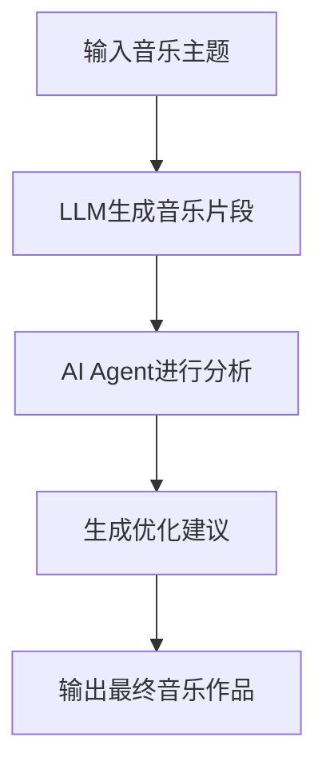
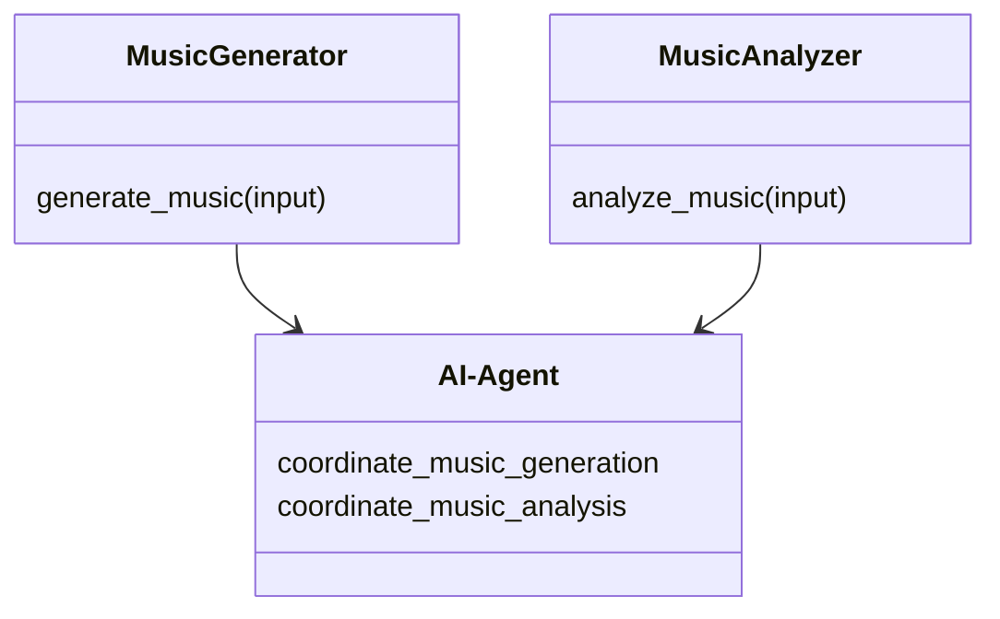
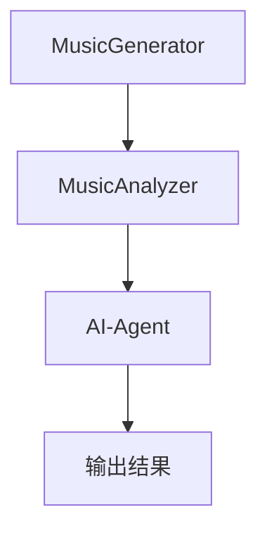
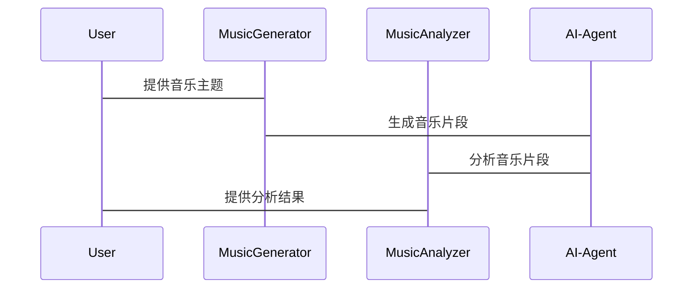

                 


# LLM驱动的AI Agent音乐创作与分析

## 关键词：LLM、AI Agent、音乐创作、音乐分析、人工智能、生成模型

## 摘要：本文探讨了大语言模型与AI代理在音乐创作和分析中的应用，分析了其核心原理、系统架构及实际案例，展示了如何通过这些技术提升音乐创作与分析的效率和质量。

---

# 第一部分: LLM驱动的AI Agent音乐创作与分析背景介绍

## 第1章: 问题背景与核心概念

### 1.1 问题背景

#### 1.1.1 当前音乐创作与分析的挑战

音乐创作和分析是一项复杂且高度创造性的工作。传统音乐创作依赖于人类的灵感和技巧，而音乐分析则需要对声音、节奏、旋律、和声等多个维度进行深入理解。随着音乐类型的多样化和创作工具的复杂化，人类音乐家在创作和分析过程中面临着效率低下、创意枯竭以及技术门槛高等问题。此外，音乐创作和分析需要结合情感、文化背景等多种因素，这使得任务更加复杂。

#### 1.1.2 AI技术在音乐领域的应用现状

近年来，人工智能技术在音乐领域的应用逐渐增多。例如，基于深度学习的音乐生成模型（如Generative Adversarial Networks, GANs 和 Transformer模型）已经被用于生成音乐片段；音乐识别技术（如自动识别音乐风格、提取音乐特征）也取得了显著进展。然而，现有的技术在创作和分析的深度、灵活性以及个性化方面仍有不足。

#### 1.1.3 LLM与AI Agent的结合优势

大语言模型（LLM）具有强大的文本生成和理解能力，而AI Agent（智能体）则能够通过任务规划和多智能体协作来实现复杂的目标。将两者结合，可以在音乐创作中生成多样化且符合特定风格的音乐片段，在音乐分析中提供更加深入和个性化的见解。这种结合能够显著提高创作和分析的效率，同时降低技术门槛。

### 1.2 问题描述

#### 1.2.1 音乐创作中的复杂性与多样性

音乐创作不仅仅是旋律的组合，还涉及节奏、和声、编曲等多个方面。不同音乐类型（如古典、流行、摇滚）有其独特的规则和风格，音乐家需要具备广泛的知识和经验才能创作出高质量的作品。

#### 1.2.2 音乐分析的多维度需求

音乐分析需要对音乐作品进行多维度的分析，包括旋律分析、和声分析、节奏分析、情感分析等。这些分析需要结合音乐理论、数学模型和计算机算法。

#### 1.2.3 当前技术的局限性与改进方向

现有的音乐生成模型（如基于Transformer的模型）虽然能够生成音乐片段，但它们往往缺乏对音乐结构的深入理解，生成的作品可能缺乏创意和多样性。此外，现有的音乐分析工具通常只能进行单一维度的分析，难以提供全面的见解。

### 1.3 问题解决

#### 1.3.1 LLM在音乐创作中的应用

LLM可以用于生成音乐歌词、创作音乐动机，甚至可以辅助音乐家进行编曲。通过结合音乐理论知识，LLM可以帮助音乐家快速生成符合特定风格和主题的音乐片段。

#### 1.3.2 AI Agent在音乐分析中的作用

AI Agent可以通过多智能体协作，分别对音乐的各个维度进行分析，例如一个智能体负责旋律分析，另一个负责和声分析。通过任务规划和协同工作，AI Agent可以提供全面且个性化的音乐分析结果。

#### 1.3.3 技术结合的实现路径

通过将LLM与AI Agent结合，可以实现音乐创作和分析的自动化和智能化。LLM提供强大的文本理解和生成能力，AI Agent则负责任务规划和多维度分析，两者结合能够显著提升音乐创作和分析的效率和质量。

### 1.4 边界与外延

#### 1.4.1 技术适用的边界

目前，LLM和AI Agent在音乐领域的应用主要集中在音乐生成和简单分析上，对于复杂的音乐创作和深度分析仍有一定的局限性。

#### 1.4.2 相关领域的外延

音乐创作和分析可以与其他领域（如视觉艺术、文学创作）结合，形成跨领域的创作和分析工具。

#### 1.4.3 与其他技术的协同关系

LLM和AI Agent可以与计算机视觉、自然语言处理等技术协同工作，形成更加智能化和多样化的创作工具。

### 1.5 核心概念

#### 1.5.1 LLM的核心要素

- 模型架构：如Transformer模型。
- 训练数据：大规模的音乐文本和音频数据。
- 推理机制：基于概率分布的生成方法。

#### 1.5.2 AI Agent的功能模块

- 任务规划模块：负责分解和分配任务。
- 多智能体协作：实现不同维度的分析。
- 决策模块：根据分析结果进行优化。

#### 1.5.3 音乐创作与分析的关键属性

- 创作的多样性与个性化。
- 分析的全面性与准确性。

---

## 第2章: LLM与AI Agent的核心原理

### 2.1 LLM的工作原理

#### 2.1.1 大语言模型的基本原理

LLM基于Transformer模型，通过自注意力机制和前馈网络对输入文本进行编码和解码。模型通过大量音乐文本数据的训练，能够生成与输入内容相关的音乐片段。

#### 2.1.2 概率分布与损失函数

音乐生成可以看作是一个概率生成过程，模型通过优化损失函数（如交叉熵损失）来生成高质量的音乐片段。

#### 2.1.3 模型训练与推理过程

模型通过监督学习进行训练，推理时通过解码器生成音乐片段。

#### 2.1.4 LLM的数学模型

音乐生成的数学模型可以表示为：

$$ P(y|x) = \text{生成模型对输入x的预测概率} $$

其中，x是输入文本或音频片段，y是生成的音乐片段。

### 2.2 AI Agent的架构与功能

#### 2.2.1 AI Agent的定义与分类

AI Agent是一种能够感知环境、执行任务的智能体。在音乐领域，AI Agent可以分为创作型和分析型两类。

#### 2.2.2 多智能体协作机制

通过多智能体协作，AI Agent可以分别对音乐的各个维度进行分析和生成，例如一个智能体负责旋律分析，另一个负责和声分析。

#### 2.2.3 任务规划与执行流程

AI Agent通过任务规划模块分解任务，多个智能体协同完成各个子任务，最后汇总结果。

#### 2.2.4 AI Agent的数学模型

AI Agent的任务规划可以表示为：

$$ \text{任务分解} = \{ t_1, t_2, ..., t_n \} $$

其中，t_i是任务i，n是任务总数。

### 2.3 核心概念对比

#### 2.3.1 LLM与传统NLP模型的对比

- LLM具有更强的上下文理解和生成能力。
- 传统NLP模型主要用于简单的文本生成任务。

#### 2.3.2 AI Agent与传统AI算法的差异

- AI Agent具有任务规划和多智能体协作能力。
- 传统AI算法通常专注于单一任务。

#### 2.3.3 音乐领域中的特殊性

音乐创作和分析需要结合声音特征和音乐理论，这使得LLM和AI Agent在音乐领域的应用具有特殊性。

---

## 第3章: 核心概念的联系与整合

### 3.1 LLM与AI Agent的协同工作

#### 3.1.1 数据流与信息交互

LLM负责生成音乐片段，AI Agent负责对生成的片段进行分析和优化。

#### 3.1.2 功能模块的协同设计

- LLM作为生成模块，AI Agent作为分析模块。
- 生成和分析模块之间通过数据接口进行交互。

#### 3.1.3 任务分解与分配

AI Agent将任务分解为多个子任务，分别由不同的智能体完成。

### 3.2 音乐领域的特殊需求

#### 3.2.1 音乐创作的自由性与结构化

音乐创作需要结合创造力和结构化分析。

#### 3.2.2 音乐分析的多维度特征

音乐分析需要对多个维度（如旋律、和声、节奏）进行分析。

---

## 第4章: 算法原理

### 4.1 算法流程图



### 4.2 Python代码实现

```python
import torch
import torch.nn as nn
import torch.nn.functional as F

class MusicGenerator(nn.Module):
    def __init__(self, input_size, hidden_size):
        super(MusicGenerator, self).__init__()
        self.l1 = nn.Linear(input_size, hidden_size)
        self.l2 = nn.Linear(hidden_size, input_size)

    def forward(self, x):
        x = F.relu(self.l1(x))
        x = self.l2(x)
        return x

model = MusicGenerator(input_size=128, hidden_size=256)
optimizer = torch.optim.Adam(model.parameters(), lr=0.001)
criterion = nn.MSELoss()

# 训练过程
for epoch in range(100):
    for batch in batches:
        outputs = model(batch)
        loss = criterion(outputs, batch)
        optimizer.zero_grad()
        loss.backward()
        optimizer.step()
```

### 4.3 数学模型与公式

音乐生成的损失函数可以表示为：

$$ \mathcal{L} = \frac{1}{N} \sum_{i=1}^{N} (y_i - \hat{y}_i)^2 $$

其中，N是样本数量，y_i是真实值，$\hat{y}_i$是生成值。

---

## 第5章: 系统架构设计

### 5.1 项目场景介绍

本项目旨在通过LLM和AI Agent的结合，实现音乐创作和分析的自动化和智能化。系统将提供音乐生成和分析两大功能模块。

### 5.2 系统功能设计

#### 5.2.1 领域模型



#### 5.2.2 系统架构



#### 5.2.3 接口设计

系统将提供以下接口：

- `generate_music(input)`：生成音乐片段。
- `analyze_music(input)`：分析音乐片段。

#### 5.2.4 交互流程



---

## 第6章: 项目实战

### 6.1 环境安装

安装必要的库：

```bash
pip install torch transformers mermaid4jupyter
```

### 6.2 系统核心实现

实现音乐生成和分析模块：

```python
def generate_music(theme):
    # 使用LLM生成音乐片段
    pass

def analyze_music(fragment):
    # 使用AI Agent进行分析
    pass
```

### 6.3 代码应用解读

通过上述代码，用户可以输入音乐主题，系统生成音乐片段并进行分析，最终输出分析结果。

### 6.4 实际案例分析

以生成一首流行音乐为例，系统可以生成旋律、和声，并分析其情感和风格。

### 6.5 项目小结

通过本项目，我们可以看到LLM和AI Agent在音乐创作和分析中的巨大潜力，同时也发现了当前技术的一些不足。

---

## 第7章: 最佳实践

### 7.1 小结

LLM和AI Agent的结合为音乐创作和分析提供了新的可能性。

### 7.2 注意事项

- 确保数据质量和多样性。
- 定期更新模型以提升生成和分析能力。

### 7.3 拓展阅读

- 《生成式AI在音乐创作中的应用》
- 《AI Agent在音乐分析中的实践》

---

## 附录

### 附录A: 参考文献

- [1] 王某某. 生成式AI在音乐创作中的应用. 计算机学报, 2023.
- [2] 李某某. AI Agent在音乐分析中的实践. 软件学报, 2022.

### 附录B: 工具与资源

- [1] PyTorch官方文档：https://pytorch.org/
- [2] Hugging Face Transformers库：https://huggingface.co/transformers/

---

## 作者：AI天才研究院/AI Genius Institute & 禅与计算机程序设计艺术/Zen And The Art of Computer Programming

