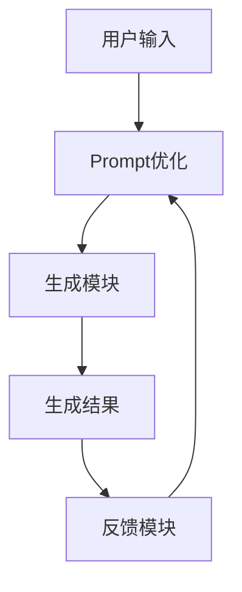
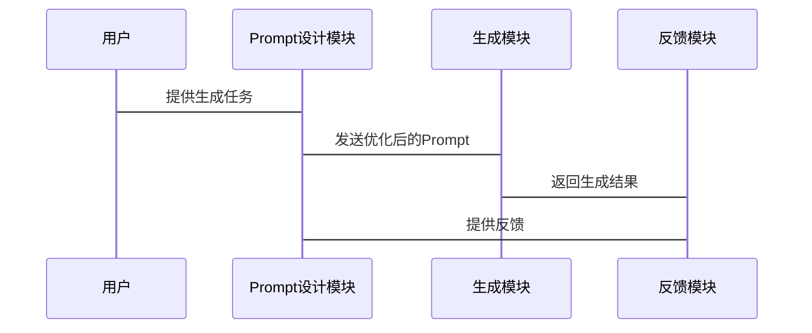

                 


# Prompt工程：设计高效指令的艺术

---

## 关键词：
- Prompt工程
- AI模型
- 高效指令
- 自然语言处理
- 生成式AI
- AI优化

---

## 摘要：
Prompt工程是人工智能领域中的一个重要分支，它专注于设计高效、准确的提示（Prompt），以优化AI模型的输出效果和生成效率。本文将从Prompt工程的基本概念出发，深入分析其核心要素、设计原则，以及在实际应用中的系统实现与优化策略。通过结合理论与实践，本文将为读者提供一个全面、系统的技术视角，帮助他们在复杂的AI应用场景中设计出更高效、更智能的Prompt。

---

## 第一部分: Prompt工程基础

---

## 第1章: Prompt工程的背景与概念

### 1.1 Prompt工程的定义与背景

#### 1.1.1 从传统编程到Prompt工程的演变
传统的程序设计依赖于明确的算法和规则，而现代AI模型的引入为程序设计带来了新的可能性。Prompt工程作为一种新兴的领域，专注于通过设计高效的提示（Prompt），使AI模型能够更灵活地理解和执行任务。这种转变源于对AI模型生成能力的更高要求，尤其是在自然语言处理和生成式AI领域。

#### 1.1.2 Prompt在AI模型中的作用
Prompt是AI模型与用户或系统之间的桥梁，它决定了模型的输出方向和内容。通过设计高效的Prompt，可以显著提升生成结果的质量、准确性和效率。例如，在自然语言处理任务中，一个精心设计的Prompt可以帮助模型更好地理解上下文，生成更符合预期的输出。

#### 1.1.3 Prompt工程的核心问题与挑战
- **语义歧义性**：如何确保Prompt的语义清晰，避免生成结果的歧义。
- **上下文管理**：如何处理多轮对话中的上下文，保持生成结果的连贯性。
- **效率优化**：如何设计高效的Prompt，减少计算成本，提升生成速度。

---

### 1.2 Prompt的基本构成要素

#### 1.2.1 Prompt的结构与语义分析
Prompt的结构通常包括以下几个部分：
- **目标**：明确生成的目标和任务。
- **上下文**：提供生成所需的背景信息。
- **语气**：设定生成内容的语气和风格。
- **约束条件**：限制生成内容的范围和格式。

例如，以下是一个简单的Prompt结构：
```
目标：生成一段关于AI技术的介绍。
上下文：最近，生成式AI在多个领域取得了显著进展。
语气：正式且简洁。
约束条件：生成300字左右，包含关键术语如“生成式AI”、“自然语言处理”。
```

#### 1.2.2 Prompt的语境与上下文管理
上下文是Prompt设计中的关键要素。通过合理管理上下文，可以确保生成内容的连贯性和相关性。例如，在多轮对话中，每一轮的Prompt都需要包含前一轮的上下文信息，以保持对话的连贯性。

#### 1.2.3 Prompt的语气与风格控制
语气和风格直接影响生成内容的表达方式。例如，一个用于商业场景的Prompt可能需要正式且专业的语气，而一个用于社交媒体的Prompt可能需要更轻松和活泼的语气。

---

### 1.3 Prompt工程的关键概念与术语

#### 1.3.1 什么是高效的Prompt？
高效的Prompt是指能够在特定任务中生成高质量、符合预期的输出的提示。高效Prompt的特点包括：
- **简洁性**：避免冗余信息，直接传达目标。
- **明确性**：确保生成任务的清晰和无歧义。
- **可扩展性**：能够适应不同场景和任务的变化。

#### 1.3.2 Prompt的分类与应用场景
- **单轮Prompt**：适用于简单任务，如关键词提取、句子生成等。
- **多轮Prompt**：适用于复杂任务，如对话生成、故事创作等。
- **动态Prompt**：适用于需要实时调整的任务，如实时聊天机器人。

#### 1.3.3 Prompt设计的边界与外延
- **边界**：Prompt的设计必须明确生成任务的范围和限制，避免生成与目标无关的内容。
- **外延**：Prompt的设计需要考虑生成内容的扩展性，确保能够适应不同的输入和场景。

---

## 第2章: Prompt设计的核心要素

---

## 第2章: Prompt设计的核心要素

### 2.1 Prompt的结构化设计

#### 2.1.1 Prompt的语法与语义分析
Prompt的语法和语义是设计高效Prompt的基础。语法决定了Prompt的结构，而语义决定了Prompt的含义。例如，以下是一个简单的Prompt设计：
```
语法：目标 + 上下文 + 语气 + 约束条件
语义：生成一段关于AI技术的介绍，要求正式、简洁、300字左右。
```

#### 2.1.2 Prompt的模板化设计方法
模板化设计是一种常用的方法，通过预先定义Prompt的结构，快速生成高效的Prompt。例如：
```
模板：生成一个[目标]，满足以下条件：
- [条件1]
- [条件2]
- [条件3]
```

#### 2.1.3 Prompt的参数化配置
参数化配置允许根据不同的任务动态调整Prompt的参数。例如，可以通过调整温度（temperature）参数来控制生成内容的多样性和创造性。

---

### 2.2 Prompt的语境与上下文管理

#### 2.2.1 上下文对生成结果的影响
上下文是生成结果的重要影响因素。例如，在多轮对话中，生成内容需要基于前一轮对话的上下文信息。

#### 2.2.2 Context的构建与优化
上下文的构建需要考虑以下几点：
- **相关性**：上下文必须与生成任务相关。
- **准确性**：上下文必须准确反映任务的需求。
- **简洁性**：上下文必须简洁，避免冗余信息。

#### 2.2.3 Prompt中的多轮对话管理
多轮对话中的Prompt需要包含前一轮的上下文信息，以确保生成内容的连贯性。例如：
```
Round 1：
目标：生成一个关于AI的介绍。
上下文：无。
语气：正式。
约束条件：200字左右。

Round 2：
目标：继续讨论AI的应用场景。
上下文：生成式AI在多个领域取得了显著进展。
语气：正式。
约束条件：200字左右。
```

---

### 2.3 Prompt的语义与意图表达

#### 2.3.1 意图识别与Prompt设计
意图识别是Prompt设计中的重要环节。通过分析用户的意图，可以设计出更符合需求的Prompt。例如，用户的意图可能是“查询天气”，Prompt可以设计为：
```
目标：生成天气查询结果。
上下文：当前城市为北京。
语气：简洁。
约束条件：提供温度和天气状况。
```

#### 2.3.2 语义分析与生成优化
语义分析是生成优化的关键。通过分析生成内容的语义，可以进一步优化Prompt的设计。例如，生成内容中出现歧义时，可以通过调整Prompt的语义来消除歧义。

#### 2.3.3 Prompt中的歧义处理
歧义是生成过程中的常见问题。通过设计清晰的Prompt，可以有效减少歧义。例如，避免使用模糊的词汇，如“可能”、“也许”，而使用明确的词汇，如“必须”、“必须”。

---

## 第3章: Prompt设计的核心原则

---

## 第3章: Prompt设计的核心原则

### 3.1 简洁性原则

#### 3.1.1 简洁性对生成效率的影响
简洁的Prompt可以减少计算成本，提高生成效率。例如，避免冗长的上下文描述，直接提供关键信息。

#### 3.1.2 简洁性对生成质量的影响
简洁的Prompt可以提高生成内容的质量，避免冗余信息的干扰。例如，直接提供生成目标，避免不必要的上下文描述。

#### 3.1.3 简洁性与多样性的平衡
在追求简洁的同时，还需要考虑生成内容的多样性。例如，通过调整温度参数，可以在保证简洁性的前提下，生成多样化的结果。

---

### 3.2 明确性原则

#### 3.2.1 明确性对生成结果的影响
明确的Prompt可以确保生成内容的准确性和一致性。例如，明确生成任务的目标和约束条件。

#### 3.2.2 明确性与模糊性的平衡
在某些情况下，适当的模糊性可以增加生成内容的灵活性和创造性。例如，生成创意写作时，可以适当放宽约束条件，允许更多的自由发挥。

#### 3.2.3 明确性在多任务场景中的应用
在多任务场景中，明确性尤为重要。例如，生成多个任务的Prompt时，需要明确每个任务的目标和约束条件。

---

### 3.3 上下文管理原则

#### 3.3.1 上下文的动态调整
根据生成任务的需求，动态调整上下文。例如，在实时聊天中，需要根据对话的进展动态调整上下文。

#### 3.3.2 上下文的冲突与协调
在多轮对话中，可能会出现上下文冲突的情况。例如，前一轮对话的上下文与当前任务的上下文存在冲突。需要通过协调上下文，确保生成内容的连贯性。

#### 3.3.3 上下文的持久化与复用
上下文的持久化和复用可以提高生成效率。例如，将前一轮的上下文信息持久化，以便在后续任务中复用。

---

## 第4章: Prompt工程的系统实现与优化

---

## 第4章: Prompt工程的系统实现与优化

### 4.1 系统架构设计

#### 4.1.1 系统功能设计
- **Prompt设计模块**：负责设计和优化Prompt。
- **生成模块**：负责根据Prompt生成输出。
- **反馈模块**：负责根据生成结果优化Prompt。

#### 4.1.2 系统架构图


#### 4.1.3 系统交互流程


---

### 4.2 系统优化策略

#### 4.2.1 Prompt设计的优化算法
Prompt设计的优化可以采用贪心算法或强化学习等方法。例如，使用强化学习优化Prompt的生成策略。

#### 4.2.2 生成模块的优化
生成模块的优化包括模型优化和参数调整。例如，通过调整温度参数，可以控制生成内容的多样性和创造性。

#### 4.2.3 反馈模块的优化
反馈模块的优化包括生成结果的评估和反馈。例如，使用自动评估指标（如BLEU、ROUGE）对生成结果进行评估，并根据评估结果优化Prompt设计。

---

### 4.3 项目实战：Prompt工程的实现

#### 4.3.1 环境搭建
- **工具安装**：安装必要的编程语言和框架（如Python、TensorFlow、PyTorch）。
- **依赖管理**：使用虚拟环境管理依赖包。

#### 4.3.2 核心实现
以下是一个简单的Prompt工程实现示例：
```python
class PromptDesigner:
    def __init__(self):
        self.context = ""
        self.temperature = 0.7

    def set_context(self, context):
        self.context = context

    def set_temperature(self, temperature):
        self.temperature = temperature

    def generate_prompt(self, target):
        prompt = f"Generate {target} with context: {self.context} and temperature: {self.temperature}"
        return prompt
```

#### 4.3.3 代码应用解读
上述代码示例展示了Prompt设计师的核心功能，包括上下文设置、温度参数调整和Prompt生成。通过动态调整上下文和温度参数，可以实现高效的Prompt设计。

---

## 第5章: 总结与展望

---

## 第5章: 总结与展望

### 5.1 总结
Prompt工程是人工智能领域中的一个重要分支，它通过设计高效的Prompt，优化AI模型的生成效果和效率。本文从Prompt工程的基础概念出发，深入分析了其核心要素和设计原则，并结合系统实现与优化，为读者提供了全面的技术视角。

### 5.2 未来展望
随着生成式AI的不断发展，Prompt工程将面临更多的挑战和机遇。未来的研究方向包括：
- **动态Prompt设计**：研究如何根据实时反馈动态调整Prompt。
- **多模态Prompt设计**：探索在多模态场景中的Prompt设计方法。
- **智能化Prompt优化**：利用强化学习等技术，实现自动化的Prompt优化。

---

## 作者：AI天才研究院/AI Genius Institute & 禅与计算机程序设计艺术 /Zen And The Art of Computer Programming

---

通过以上目录结构和内容安排，我们可以看到，Prompt工程是一个复杂而有趣的技术领域，它不仅需要扎实的理论基础，还需要丰富的实战经验。希望本文能够为读者提供有价值的参考和启发，帮助他们在实际应用中设计出更高效、更智能的Prompt。

