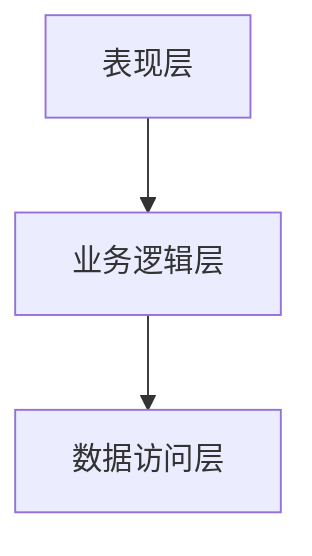
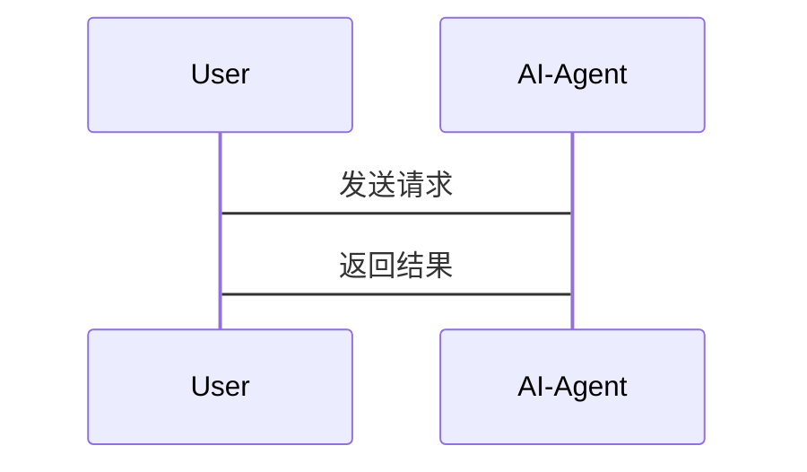

                 


# Web集成：将AI Agent嵌入到网页应用中

## 关键词：Web集成，AI Agent，人工智能，网页应用，系统架构

## 摘要：本文探讨了将AI Agent嵌入到网页应用中的方法，从背景、核心概念、算法原理、系统架构设计到项目实战，全面分析了AI Agent在Web中的应用，帮助读者理解如何在实际项目中集成和实现AI Agent。

---

# 第1章: Web集成与AI Agent的背景

## 1.1 AI Agent的基本概念

### 1.1.1 AI Agent的定义与特点

AI Agent（人工智能代理）是指能够感知环境并采取行动以实现目标的智能体。AI Agent可以是软件程序，也可以是物理机器人，但本文关注的是将其嵌入到Web应用中的AI Agent。其特点包括自主性、反应性、目标导向性和社交能力。

### 1.1.2 Web应用中的AI Agent

AI Agent在Web应用中可以作为推荐系统、聊天机器人或智能客服。例如，Netflix使用推荐系统来建议用户可能喜欢的电影，而Siri和Alexa则是典型的智能语音助手。

### 1.1.3 AI Agent与传统Web应用的区别

传统的Web应用通常是静态的，依赖于用户输入和预定义的逻辑。而AI Agent能够通过学习和适应，提供动态、个性化的服务。

---

## 1.2 Web集成的必要性

### 1.2.1 Web应用的现状与挑战

随着互联网的发展，Web应用越来越复杂，用户期望更高的智能化服务。传统Web应用的静态性和缺乏智能化成为瓶颈。

### 1.2.2 AI Agent在Web集成中的作用

AI Agent通过智能化处理，提升Web应用的用户体验和效率。例如，智能客服能够自动处理用户的问题，减少人工干预。

### 1.2.3 Web集成的优势与劣势

优势：提高用户体验，自动化处理任务。劣势：技术实现复杂，数据隐私问题。

---

## 1.3 AI Agent在Web中的优势

### 1.3.1 提高用户体验

AI Agent能够提供个性化的推荐和智能交互，使用户感到更舒适和高效。

### 1.3.2 提升应用效率

通过自动化处理任务，AI Agent可以减少用户操作，提高应用的整体效率。

### 1.3.3 增强应用智能性

AI Agent能够通过学习和适应，提供更准确和相关的信息，增强应用的智能性。

---

## 1.4 AI Agent在Web中的挑战

### 1.4.1 技术实现的复杂性

将AI Agent嵌入到Web应用中需要处理数据输入、智能处理和输出结果等多个环节，技术实现较为复杂。

### 1.4.2 数据隐私与安全问题

AI Agent需要处理大量的用户数据，如何保护这些数据的隐私和安全是一个重要挑战。

### 1.4.3 用户接受度与信任问题

用户对AI Agent的决策是否信任，以及如何确保AI Agent的决策透明和可解释，是实现广泛应用的关键。

---

## 1.5 本章小结

本章介绍了AI Agent的基本概念，分析了Web集成的必要性及其在Web中的优势和挑战。通过这些背景知识的了解，读者可以更好地理解后续章节的内容。

---

# 第2章: AI Agent的核心概念与原理

## 2.1 AI Agent的定义与分类

### 2.1.1 AI Agent的定义

AI Agent是一种能够感知环境、自主决策并采取行动以实现目标的智能体。

### 2.1.2 AI Agent的分类

AI Agent可以根据智能水平分为基于规则的AI Agent和基于机器学习的AI Agent。基于规则的AI Agent依赖于预定义的规则，而基于机器学习的AI Agent能够通过数据学习和适应。

---

## 2.2 AI Agent的工作原理

### 2.2.1 信息处理流程

1. **数据输入**：接收用户的输入，如文本、语音或图像。
2. **智能处理**：通过算法处理数据，生成决策或响应。
3. **输出结果**：将处理结果输出给用户，可能是文本、语音或图形。

### 2.2.2 决策机制

AI Agent的决策机制可以是基于规则的决策树或机器学习模型，如随机森林或神经网络。

### 2.2.3 交互方式

AI Agent可以通过文本、语音或图形界面与用户交互。例如，自然语言处理（NLP）技术用于文本交互，语音识别技术用于语音交互。

---

## 2.3 AI Agent在Web中的角色和功能模块

### 2.3.1 AI Agent在Web中的角色

AI Agent在Web应用中可以作为推荐系统、智能客服或聊天机器人。

### 2.3.2 AI Agent的功能模块

1. **数据输入模块**：接收用户输入，如搜索查询或用户反馈。
2. **智能处理模块**：处理数据，生成决策或响应。
3. **用户交互模块**：将处理结果输出给用户，可能是文本、语音或图形。

---

## 2.4 AI Agent的核心要素

### 2.4.1 数据输入

数据输入是AI Agent工作的基础，包括用户输入和系统数据。

### 2.4.2 智能处理

智能处理是AI Agent的核心，通过算法处理数据，生成决策或响应。

### 2.4.3 输出结果

输出结果是AI Agent与用户交互的桥梁，确保用户能够理解并使用AI Agent的决策。

---

## 2.5 本章小结

本章详细介绍了AI Agent的核心概念和工作原理，分析了其在Web中的角色和功能模块。理解这些内容对于后续章节的系统设计和实现至关重要。

---

# 第3章: AI Agent的算法原理与实现

## 3.1 常见算法

### 3.1.1 基于规则的决策树

基于规则的决策树是一种简单的算法，通过预定义的规则进行决策。

### 3.1.2 基于机器学习的算法

基于机器学习的算法包括随机森林、支持向量机（SVM）和深度学习模型。

---

## 3.2 算法实现步骤

### 3.2.1 数据预处理

数据预处理包括数据清洗、特征提取和数据归一化。

### 3.2.2 算法选择

根据问题类型选择合适的算法，如分类、回归或聚类。

### 3.2.3 训练模型

使用训练数据训练模型，调整模型参数以优化性能。

### 3.2.4 部署到Web

将训练好的模型部署到Web应用中，提供API接口供其他模块调用。

---

## 3.3 数学模型与公式

### 3.3.1 决策树分类

决策树是一种常用的分类算法，其数学模型可以表示为一棵树，每个内部节点表示一个判断条件，叶子节点表示一个类别。

### 3.3.2 机器学习模型

机器学习模型如随机森林的数学模型可以表示为多个决策树的集成。

---

## 3.4 代码实现

### 3.4.1 基于规则的AI Agent实现

```python
def handle_request(request):
    if request == 'help':
        return "Please provide more details."
    elif request == 'status':
        return "System is running."
    else:
        return "Invalid request."
```

### 3.4.2 基于机器学习的AI Agent实现

```python
from sklearn.ensemble import RandomForestClassifier

model = RandomForestClassifier()
model.fit(X_train, y_train)
prediction = model.predict(X_test)
```

---

## 3.5 案例分析

### 3.5.1 推荐系统实现

通过分析用户的行为数据，使用协同过滤算法为用户推荐相关内容。

---

## 3.6 本章小结

本章详细介绍了AI Agent的常见算法和实现步骤，展示了如何在Web应用中集成AI Agent。

---

# 第4章: 系统架构设计

## 4.1 需求分析

### 4.1.1 功能需求

- 用户与AI Agent交互
- AI Agent处理用户请求
- 输出结果

### 4.1.2 性能需求

- 响应时间小于1秒
- 支持高并发请求

---

## 4.2 系统功能设计

### 4.2.1 领域模型

用户、AI Agent、数据源之间的关系可以通过类图表示。

### 4.2.2 用例分析

用户与AI Agent的交互流程，如用户输入请求，AI Agent处理并返回结果。

---

## 4.3 系统架构设计

### 4.3.1 分层架构

- 表现层：用户界面
- 业务逻辑层：AI Agent处理逻辑
- 数据访问层：数据存储和检索

### 4.3.2 架构图



---

## 4.4 接口设计

### 4.4.1 RESTful API

定义API接口，如`POST /api/agent/process`，接收请求并返回处理结果。

### 4.4.2 数据格式

使用JSON格式传递数据，确保数据结构一致。

---

## 4.5 交互设计

### 4.5.1 序列图

用户与AI Agent的交互流程可以用序列图表示。



---

## 4.6 本章小结

本章详细分析了AI Agent系统的架构设计，包括功能模块、接口设计和交互流程。

---

# 第5章: 项目实战

## 5.1 环境搭建

### 5.1.1 安装Python和相关库

安装Python 3.x，以及Flask、scikit-learn等库。

### 5.1.2 安装开发工具

安装Jupyter Notebook或PyCharm进行开发。

---

## 5.2 核心代码实现

### 5.2.1 AI Agent的实现

```python
from flask import Flask, request, jsonify

app = Flask(__name__)

@app.route('/api/agent/process', methods=['POST'])
def process_request():
    data = request.json
    # 处理请求
    result = handle_request(data)
    return jsonify({'result': result})

def handle_request(data):
    # 实现具体的处理逻辑
    pass

if __name__ == '__main__':
    app.run(debug=True)
```

### 5.2.2 数据处理和模型训练

```python
import pandas as pd
from sklearn.model_selection import train_test_split
from sklearn.ensemble import RandomForestClassifier

# 加载数据
data = pd.read_csv('data.csv')
X = data.drop('target', axis=1)
y = data['target']

# 划分训练集和测试集
X_train, X_test, y_train, y_test = train_test_split(X, y, test_size=0.2)

# 训练模型
model = RandomForestClassifier()
model.fit(X_train, y_train)
```

---

## 5.3 案例分析

### 5.3.1 实际项目案例

通过一个推荐系统案例，展示如何在Web应用中集成AI Agent。

---

## 5.4 项目总结

### 5.4.1 实践经验

总结项目中的经验，如数据预处理的重要性，模型选择的影响。

### 5.4.2 遇到的问题及解决方案

讨论项目中遇到的问题，如数据不足、模型性能不佳，并提出解决方案。

---

## 5.5 本章小结

本章通过项目实战，详细展示了如何在Web应用中集成AI Agent，包括环境搭建、代码实现和案例分析。

---

# 第6章: 总结与展望

## 6.1 总结

### 6.1.1 回顾全文

总结全文内容，强调AI Agent在Web中的重要性。

### 6.1.2 核心要点

AI Agent的核心概念、算法原理和系统架构设计。

---

## 6.2 展望

### 6.2.1 未来的发展趋势

AI Agent将更加智能化，人机交互将更加自然。

### 6.2.2 技术进步的影响

技术的进步将推动AI Agent在Web中的广泛应用。

---

## 6.3 最佳实践tips

### 6.3.1 数据处理

建议在数据处理阶段进行充分的数据清洗和特征工程。

### 6.3.2 模型选择

根据具体问题选择合适的算法，避免盲目使用复杂模型。

### 6.3.3 交互设计

确保用户交互界面简洁直观，提升用户体验。

---

## 6.4 小结

本章总结了全文的核心内容，并展望了AI Agent在Web中的未来发展。

---

# 作者：AI天才研究院 & 禅与计算机程序设计艺术

---

**感谢您的阅读！**

