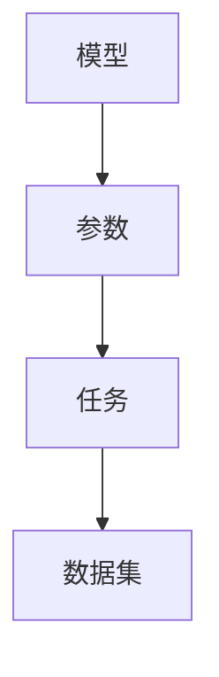
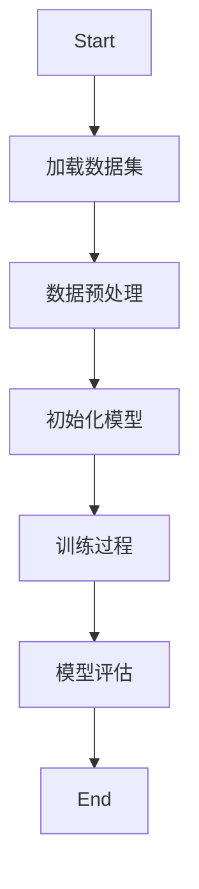
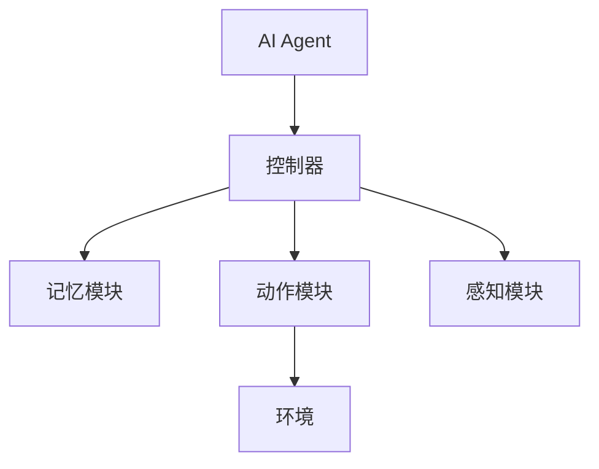
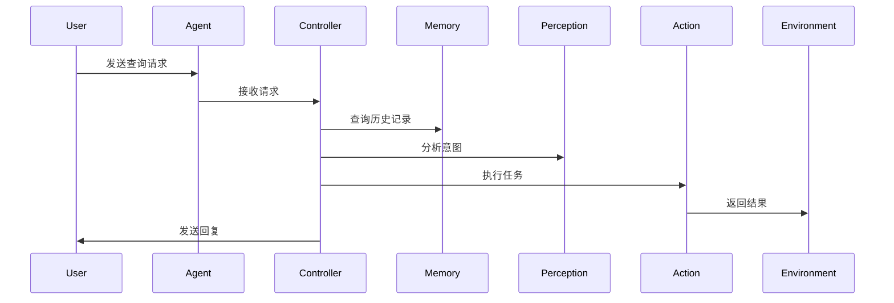

                 


# Fine-tuning LLM模型：提升AI Agent性能的关键

---

## 关键词：  
- Fine-tuning  
- LLM模型  
- AI Agent  
- 模型优化  
- 机器学习  

---

## 摘要：  
本文探讨了如何通过微调（Fine-tuning）大型语言模型（LLM）来提升AI Agent的性能。文章从背景、原理、算法、系统架构到实战案例，全面分析了Fine-tuning在AI Agent中的应用，帮助读者理解其核心概念、实现方法和实际价值。

---

# 第一部分：Fine-tuning LLM模型的背景与核心概念  

---

## 第1章：Fine-tuning LLM模型概述  

### 1.1 Fine-tuning的基本概念  

#### 1.1.1 什么是Fine-tuning？  
Fine-tuning是一种模型优化技术，通过在特定任务上对预训练模型进行进一步训练，使其适应具体的应用场景。与从头训练模型不同，微调利用了预训练模型的迁移能力，仅调整部分参数，降低了计算成本和时间。

#### 1.1.2 Fine-tuning与模型优化的关系  
模型优化通常指通过调整模型结构或训练策略来提升性能，而Fine-tuning更专注于在预训练模型的基础上，通过任务特定的训练数据，优化模型在特定任务上的表现。

#### 1.1.3 Fine-tuning在AI Agent中的作用  
AI Agent需要执行复杂的任务，如对话生成、问题解答和决策支持。Fine-tuning使LLM模型更好地适应这些任务，提升了AI Agent的智能化水平和用户体验。

---

### 1.2 AI Agent的定义与特点  

#### 1.2.1 AI Agent的定义  
AI Agent是一种能够感知环境、自主决策并执行任务的智能实体，通常用于自动化服务、智能助手等领域。

#### 1.2.2 AI Agent的核心特点  
1. **自主性**：无需人工干预，自主完成任务。  
2. **反应性**：能够实时感知环境并做出响应。  
3. **学习能力**：通过经验或数据优化自身性能。  
4. **交互性**：与用户或其他系统进行高效交互。  

#### 1.2.3 AI Agent与传统AI的区别  
AI Agent更注重动态环境下的自主决策和交互能力，而传统AI更多关注特定任务的解决。

---

### 1.3 Fine-tuning LLM模型的背景  

#### 1.3.1 大语言模型的局限性  
虽然LLM模型在通用任务上表现优异，但在特定领域或任务上可能存在过拟合或欠拟合的问题。  

#### 1.3.2 Fine-tuning的必要性  
通过Fine-tuning，可以在保持模型通用能力的同时，提升其在特定任务上的性能。

#### 1.3.3 Fine-tuning的现状与挑战  
尽管Fine-tuning在许多场景中表现出色，但其依赖高质量数据、计算资源需求大等问题仍需解决。

---

## 第2章：Fine-tuning的原理与方法  

### 2.1 Fine-tuning的原理  

#### 2.1.1 参数微调  
调整模型的权重参数，使其更适应特定任务。  

#### 2.1.2 非参数微调  
不调整模型参数，而是通过引入新的模块或规则来提升性能。  

#### 2.1.3 微调与零样本学习的对比  
微调需要少量任务特定数据，而零样本学习依赖通用知识。

---

### 2.2 Fine-tuning的核心概念  

#### 2.2.1 模型参数的可训练性  
模型参数的可训练性决定了微调的灵活性和效果。  

#### 2.2.2 任务适配性  
微调使模型更适应特定任务，提升了性能。

#### 2.2.3 数据分布的迁移性  
数据分布的迁移性影响微调的效果，数据预处理和清洗至关重要。

---

### 2.3 Fine-tuning的实体关系图  



---

## 第三部分：Fine-tuning LLM模型的算法原理  

---

## 第3章：Fine-tuning的算法流程  

### 3.1 Fine-tuning的流程图  



---

### 3.2 Fine-tuning的数学模型  

#### 3.2.1 损失函数  
交叉熵损失函数用于分类任务：  
$$L = -\frac{1}{N}\sum_{i=1}^{N} \sum_{k=1}^{C} y_{i,k} \log(p_{i,k})$$  

#### 3.2.2 优化器  
Adam优化器结合了动量和自适应学习率：  
$$\theta_{t+1} = \theta_t - \eta \frac{m_t}{\sqrt{s_t + \epsilon}}$$  

---

## 第四部分：系统分析与架构设计  

---

## 第4章：Fine-tuning LLM模型的系统架构  

### 4.1 项目介绍  

#### 4.1.1 项目背景  
本项目旨在通过微调LLM模型，构建一个高效的AI Agent，用于智能客服场景。

---

### 4.2 系统功能设计  

#### 4.2.1 功能模块划分  
1. **数据预处理模块**：加载和清洗数据。  
2. **模型微调模块**：执行Fine-tuning训练。  
3. **模型评估模块**：评估微调后的模型性能。  
4. **交互模块**：与用户进行对话交互。  

---

### 4.3 系统架构设计  



---

### 4.4 系统接口设计  

1. **输入接口**：接收用户的自然语言输入。  
2. **输出接口**：生成自然语言回复或执行指令。  
3. **数据接口**：与数据库或其他系统交互。  

---

### 4.5 系统交互流程  



---

## 第五部分：Fine-tuning LLM模型的项目实战  

---

## 第5章：Fine-tuning的实战案例  

### 5.1 环境安装  

#### 5.1.1 安装Python和依赖  
```bash
pip install torch transformers numpy
```

---

### 5.2 系统核心实现  

#### 5.2.1 数据预处理  
```python
def preprocess_data(data):
    input_ids = []
    labels = []
    for example in data:
        input_ids.append(tokenizer.encode(example['input']))
        labels.append(tokenizer.encode(example['output']))
    return input_ids, labels
```

---

#### 5.2.2 模型微调  
```python
def fine_tune(model, input_ids, labels, optimizer, num_epochs):
    model.train()
    for epoch in range(num_epochs):
        optimizer.zero_grad()
        outputs = model(input_ids=input_ids, labels=labels)
        loss = outputs.loss
        loss.backward()
        optimizer.step()
    return model
```

---

### 5.3 代码应用解读  

1. **数据预处理**：将原始数据转换为模型可接受的格式。  
2. **模型微调**：在特定任务数据上优化模型参数。  
3. **模型评估**：验证微调后的模型性能。  

---

### 5.4 实际案例分析  

#### 5.4.1 案例背景  
构建一个智能客服AI Agent，用于处理用户咨询。

#### 5.4.2 案例分析  
通过Fine-tuning微调后的模型，AI Agent能够更准确地理解用户需求，提高回复质量。

---

## 第六部分：Fine-tuning LLM模型的最佳实践  

---

## 第6章：Fine-tuning的技巧与注意事项  

### 6.1 最佳实践  

#### 6.1.1 数据质量的重要性  
高质量的数据是微调成功的关键。  

#### 6.1.2 模型评估的方法  
采用准确率、F1分数等指标评估微调效果。  

#### 6.1.3 模型优化的技巧  
1. 逐步调整学习率。  
2. 使用早停防止过拟合。  

---

### 6.2 小结  

通过本文的分析，读者可以全面理解Fine-tuning LLM模型的核心概念和实现方法，为构建高效的AI Agent提供有力支持。

---

## 作者：AI天才研究院 & 禅与计算机程序设计艺术  

---

**本文由AI天才研究院（AI Genius Institute）与“禅与计算机程序设计艺术”联合出品。我们致力于探索人工智能的无限可能，为技术爱好者提供高质量的内容和深度的技术洞察。**

