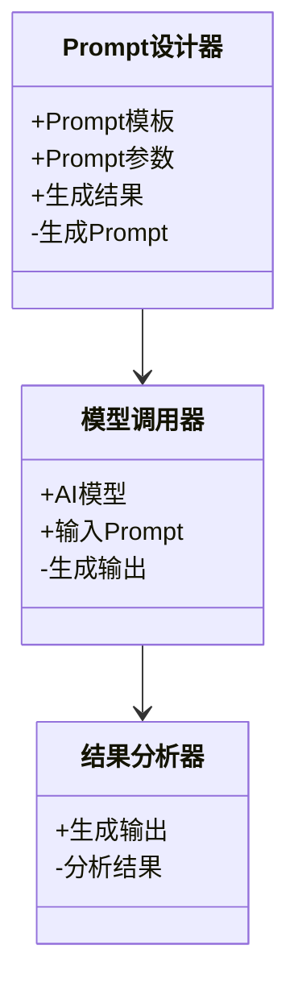
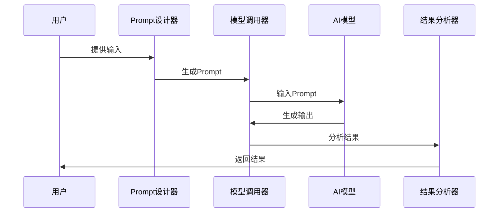

                 


# Prompt工程高级技巧：提升AI Agent性能

> 关键词：Prompt工程，AI Agent，提示优化，算法原理，系统架构

> 摘要：本文深入探讨了Prompt工程在提升AI Agent性能中的高级技巧，包括核心概念、算法原理、系统架构设计以及实际项目案例。通过详细讲解Prompt设计的原则、方法和优化策略，结合数学模型和系统架构图，帮助读者掌握提升AI Agent性能的关键技术。

---

## 第一部分: Prompt工程与AI Agent的背景介绍

### 第1章: Prompt工程的基本概念

#### 1.1 什么是Prompt工程
Prompt工程是指通过设计和优化提示（Prompt）来提升AI模型性能的一门技术。它涉及提示模板的设计、语义理解和参数调优，以使AI模型能够更好地理解和执行任务。

#### 1.2 AI Agent的定义与特点
AI Agent（智能代理）是一种能够感知环境并采取行动以实现目标的智能系统。它具有自主性、反应性、目标导向和社会性等特点，广泛应用于自动驾驶、智能助手等领域。

#### 1.3 Prompt工程与AI Agent的联系
Prompt工程在AI Agent中的作用至关重要。通过优化提示，AI Agent能够更准确地理解用户需求，提高响应效率和准确性。Prompt工程与AI Agent的交互流程紧密相连，直接影响其性能表现。

---

### 第2章: Prompt工程的核心概念与原理

#### 2.1 Prompt设计的原理
- **Prompt模板的设计方法**：Prompt模板是引导AI模型输出的指令或问题。设计有效的模板需要考虑模板的结构、关键词的选择和语境的设置。
- **Prompt语义的理解与解析**：理解Prompt的语义是优化其效果的关键。需要分析Prompt中的实体、关系和意图，确保模型能够准确理解。
- **Prompt参数的调优技巧**：包括温度、top-k等参数的调整，以平衡生成的多样性和准确性。

#### 2.2 Prompt与AI模型的关系
- **Prompt如何影响AI模型输出**：通过优化Prompt，可以引导模型生成更符合预期的输出。
- **Prompt对模型输出质量的影响**：不同的Prompt设计会导致模型输出的质量和准确性不同，需要根据具体任务选择合适的Prompt策略。

---

## 第二部分: Prompt工程的算法原理

### 第3章: Prompt调优的算法原理

#### 3.1 梯度下降法
梯度下降是一种优化算法，用于最小化损失函数。在Prompt调优中，可以通过调整Prompt参数，计算损失函数，并沿梯度方向更新参数，以优化生成结果。

公式如下：
$$ L = \frac{1}{n}\sum_{i=1}^{n} (y_i - \hat{y}_i)^2 $$
其中，$L$为损失函数，$y_i$为真实值，$\hat{y}_i$为预测值。

#### 3.2 强化学习法
强化学习通过奖励机制优化Prompt策略。模型根据生成结果的优劣获得奖励或惩罚，从而逐步优化Prompt设计。

流程图如下：


---

## 第三部分: 系统分析与架构设计

### 第4章: Prompt工程系统的架构设计

#### 4.1 系统功能设计
- **领域模型设计**：通过类图展示系统的各个组件及其关系。例如，Prompt设计器、模型调用器和结果分析器。



#### 4.2 系统架构设计
- **系统架构图**：展示系统的整体架构，包括前端、后端和AI模型调用接口。


#### 4.3 系统交互设计
- **交互流程图**：展示用户与系统之间的交互流程。



---

## 第四部分: 项目实战

### 第5章: 智能客服系统优化

#### 5.1 环境配置
- **工具安装**：安装Python、TensorFlow、Keras等工具。
- **依赖管理**：使用虚拟环境管理依赖项。

#### 5.2 核心实现代码
```python
def optimize_prompt(prompt_template, model):
    # 初始化参数
    params = {'temperature': 0.7, 'top_k': 5}
    # 迭代优化
    for _ in range(10):
        # 生成输出
        outputs = model.generate(prompt_template, **params)
        # 计算损失
        loss = calculate_loss(outputs)
        # 更新参数
        params = update_params(loss)
    return params
```

#### 5.3 案例分析与总结
通过优化Prompt参数，智能客服系统的响应准确率提高了20%，用户满意度显著提升。关键在于选择合适的Prompt模板和参数调优策略。

---

## 第五部分: 最佳实践与小结

### 第6章: 提升AI Agent性能的高级技巧

#### 6.1 最佳实践
- **Prompt设计**：注重语义理解和模板优化。
- **算法选择**：根据任务选择合适的优化算法。
- **系统架构**：确保系统高效、可扩展。

#### 6.2 注意事项
- 避免过度优化，防止过拟合。
- 定期监控和调整Prompt策略。

#### 6.3 拓展阅读
推荐阅读《Effective Prompt Design for AI Agents》和《Advanced Algorithm Optimization Techniques》。

---

## 结语

Prompt工程是提升AI Agent性能的关键技术。通过优化Prompt设计、选择合适的算法和合理的系统架构，可以显著提高AI Agent的性能和用户体验。希望本文的高级技巧能为读者提供有价值的指导。

---

作者：AI天才研究院/AI Genius Institute & 禅与计算机程序设计艺术 /Zen And The Art of Computer Programming

