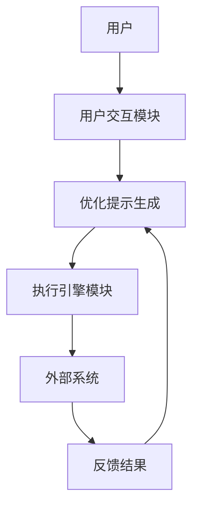

                 


# Prompt链：构建复杂AI Agent工作流

> 关键词：AI Agent、Prompt链、工作流、自然语言处理、自动化系统、任务分解

> 摘要：本文深入探讨了Prompt链在构建复杂AI Agent工作流中的作用，分析了其核心概念、算法原理、系统架构以及实际应用。通过详细的技术分析和案例研究，展示了如何利用Prompt链实现高效的AI Agent任务分解与执行。

---

## 第一部分: Prompt链与AI Agent工作流基础

### 第1章: Prompt链与AI Agent概述

#### 1.1 AI Agent的基本概念
- **1.1.1 AI Agent的定义**  
  AI Agent（人工智能代理）是指能够感知环境、自主决策并执行任务的智能实体。它可以是一个软件程序、机器人或任何能够与环境交互的智能系统。

- **1.1.2 AI Agent的核心特征**  
  - 自主性：无需外部干预，自主决策。  
  - 反应性：能够实时感知环境并做出反应。  
  - 目标导向：基于目标驱动行为。  
  - 学习能力：通过经验改进性能。

- **1.1.3 AI Agent的工作原理**  
  AI Agent通过感知环境、分析信息、制定计划、执行任务并根据反馈调整行为，完成特定目标。

#### 1.2 Prompt链的基本概念
- **1.2.1 Prompt链的定义**  
  Prompt链是一种基于自然语言处理的提示机制，用于分解和执行复杂任务的序列。它通过提示生成任务分解、任务执行和结果优化，构建AI Agent的工作流。

- **1.2.2 Prompt链的作用与优势**  
  - 提供任务分解能力，简化复杂任务。  
  - 支持多模态交互，增强人机协作。  
  - 可扩展性强，适用于多种场景。

- **1.2.3 Prompt链与AI Agent的关系**  
  Prompt链作为AI Agent的核心组件，负责任务分解和执行，是AI Agent实现复杂工作流的关键。

#### 1.3 构建复杂AI Agent工作流的背景
- **1.3.1 当前AI Agent应用的挑战**  
  - 任务复杂性：单一AI模型难以处理多步骤任务。  
  - 模块化需求：需要灵活的任务分解和协作机制。  
  - 反馈优化：动态调整任务执行策略。

- **1.3.2 复杂工作流的必要性**  
  随着AI应用的扩展，单点AI模型难以应对复杂场景，构建模块化、可扩展的工作流成为必然趋势。

- **1.3.3 Prompt链在复杂工作流中的关键作用**  
  Prompt链通过自然语言处理和任务分解，为AI Agent提供了高效的协作机制，能够处理复杂场景。

### 1.4 本章小结  
本章介绍了AI Agent和Prompt链的基本概念，分析了构建复杂AI Agent工作流的背景和必要性，为后续内容奠定了基础。

---

### 第2章: Prompt链的核心概念与原理

#### 2.1 Prompt链的结构与组成
- **2.1.1 输入层**  
  接收用户输入的自然语言提示，例如“帮我安排明天的会议”。

- **2.1.2 解析层**  
  对输入提示进行语义解析，分解任务为具体子任务，例如“创建会议提醒”和“发送邮件通知”。

- **2.1.3 执行层**  
  根据分解的子任务，调用相应的系统或服务执行操作，例如创建日历事件或发送邮件。

- **2.1.4 反馈层**  
  收集任务执行结果，提供反馈用于优化后续任务。

#### 2.2 Prompt链的类型与特点
- **2.2.1 简单型Prompt链**  
  适用于单一任务的分解和执行，结构简单，效率高。

- **2.2.2 复杂型Prompt链**  
  适用于多步骤、多模块的任务分解，能够处理复杂的场景。

- **2.2.3 混合型Prompt链**  
  结合简单型和复杂型的特点，适用于混合型任务。

| 类型       | 特点               | 适用场景                     |
|------------|--------------------|------------------------------|
| 简单型     | 任务单一，结构简单 | 单步骤任务                   |
| 复杂型     | 任务复杂，模块化   | 多步骤、多模块任务           |
| 混合型     | 结合简单和复杂特点 | 混合型任务                   |

#### 2.3 Prompt链与相关技术的对比
- **2.3.1 与RPA技术的对比**  
  - RPA（机器人流程自动化）：基于规则的自动化工具，适用于重复性任务。  
  - Prompt链：基于自然语言处理的任务分解，适用于复杂场景。

- **2.3.2 与低代码平台的对比**  
  - 低代码平台：通过可视化工具快速构建应用，适用于快速开发。  
  - Prompt链：基于提示的任务分解，适用于动态调整任务流程。

- **2.3.3 与传统工作流引擎的对比**  
  - 传统工作流引擎：基于规则的任务流程管理。  
  - Prompt链：基于自然语言处理的任务分解，灵活性更高。

#### 2.4 本章小结  
本章详细介绍了Prompt链的结构、类型及其与相关技术的对比，为后续章节的分析奠定了基础。

---

### 第3章: Prompt链的算法原理与数学模型

#### 3.1 Prompt链的核心算法
- **3.1.1 基于提示的自然语言处理算法**  
  使用预训练语言模型（如GPT）生成任务分解提示，例如将“安排会议”分解为“创建日历事件”和“发送邮件通知”。

- **3.1.2 基于规则的任务分解算法**  
  根据预定义的规则，将复杂任务分解为子任务，例如“预订酒店”可以分解为“搜索可用房间”和“确认预订”。

- **3.1.3 基于反馈的优化算法**  
  根据执行结果的反馈，优化提示生成策略，例如调整提示模板以提高任务分解的准确性。

#### 3.2 Prompt链的数学模型
- **3.2.1 任务分解的数学模型**  
  任务分解可以通过概率分布模型表示，例如：  
  $$ P(task_i | prompt) = \frac{exp(\theta \cdot prompt)}{\sum_{j} exp(\theta \cdot prompt_j)} $$  

- **3.2.2 提示生成的概率分布模型**  
  提示生成的概率可以通过语言模型的损失函数优化，例如：  
  $$ L = -\sum_{i=1}^{n} \log P(word_i | context) $$  

- **3.2.3 优化过程的损失函数模型**  
  使用交叉熵损失函数优化提示生成策略，例如：  
  $$ L = -\sum_{i=1}^{m} \log P(action_i | state) $$  

#### 3.3 算法实现的详细步骤
- **3.3.1 提示生成阶段**  
  - 接收用户输入的自然语言提示。  
  - 使用预训练语言模型生成任务分解提示。

- **3.3.2 任务分解阶段**  
  - 根据提示生成的任务分解规则，分解任务为子任务。  
  - 使用规则引擎或机器学习模型进行任务分解。

- **3.3.3 任务执行阶段**  
  - 调用相应的系统或服务执行子任务，例如调用日历API创建会议提醒。

- **3.3.4 反馈优化阶段**  
  - 收集任务执行结果的反馈。  
  - 根据反馈优化提示生成策略，例如调整提示模板或参数。

#### 3.4 本章小结  
本章分析了Prompt链的核心算法及其数学模型，详细讲解了任务分解和优化的实现步骤。

---

### 第4章: Prompt链的系统架构与设计

#### 4.1 系统架构概述
- **4.1.1 分层架构设计**  
  - 用户交互层：接收用户输入并显示结果。  
  - 任务分解层：解析提示并生成子任务。  
  - 执行层：调用外部系统执行任务。  
  - 反馈优化层：收集反馈并优化提示生成策略。

- **4.1.2 模块化设计原则**  
  - 每个模块独立开发和测试，便于维护和扩展。  
  - 模块之间通过接口通信，确保系统的可扩展性。

- **4.1.3 可扩展性设计**  
  - 支持多种任务分解算法，例如基于规则和基于机器学习的分解。  
  - 支持多种执行引擎，例如RESTful API和本地脚本。

#### 4.2 系统功能设计
- **4.2.1 用户交互模块**  
  提供自然语言输入界面，显示任务执行结果和反馈。

- **4.2.2 任务分解模块**  
  解析用户提示并生成子任务，支持多种任务分解策略。

- **4.2.3 执行引擎模块**  
  调用外部系统或服务执行子任务，例如调用日历API或发送邮件。

- **4.2.4 反馈优化模块**  
  收集任务执行结果的反馈，优化提示生成策略。

#### 4.3 系统架构图（Mermaid）



#### 4.4 本章小结  
本章详细设计了Prompt链的系统架构，分析了各模块的功能和交互关系，为后续的实现提供了指导。

---

## 第二部分: 项目实战与优化

### 第5章: 项目实战：构建一个智能客服系统

#### 5.1 项目背景与目标
- 智能客服系统需要处理多种任务，例如预约、咨询和投诉处理。

#### 5.2 环境配置
- **编程语言**：Python 3.9+  
- **框架**：Flask（Web框架）  
- **AI模型**：GPT-3.5-turbo  
- **依赖管理**：pip install flask openai

#### 5.3 核心代码实现
```python
from flask import Flask, request, jsonify
import openai

app = Flask(__name__)
openai.api_key = "your_openai_api_key"

@app.route('/prompt-chain', methods=['POST'])
def prompt_chain():
    prompt = request.json['prompt']
    model = "gpt-3.5-turbo"
    
    completion = openai.ChatCompletion.create(
        model=model,
        messages=[{"role": "user", "content": prompt}]
    )
    
    response = completion.choices[0].message.content
    return jsonify({"result": response})

if __name__ == '__main__':
    app.run(debug=True)
```

#### 5.4 代码解读与分析
- **用户输入**：接收自然语言提示，例如“帮我预约明天的会议”。  
- **任务分解**：通过GPT-3.5-turbo生成子任务，例如“创建日历事件”和“发送邮件提醒”。  
- **任务执行**：调用日历API和邮件服务执行子任务。  
- **反馈优化**：收集执行结果的反馈，优化提示生成策略。

#### 5.5 测试与优化
- **功能测试**：测试任务分解和执行的准确性。  
- **性能测试**：测试系统的响应时间和处理能力。  
- **优化策略**：根据反馈优化提示生成策略，例如调整提示模板或参数。

#### 5.6 项目小结
通过构建智能客服系统，展示了Prompt链在实际项目中的应用，验证了其有效性和可扩展性。

---

## 第三部分: 总结与展望

### 第6章: 总结与展望

#### 6.1 核心知识点回顾
- Prompt链的基本概念和原理。  
- 任务分解的算法和数学模型。  
- 系统架构设计与实现。

#### 6.2 当前技术的局限性
- **可解释性**：部分任务分解决策缺乏可解释性。  
- **安全性**：可能存在安全漏洞，例如恶意提示攻击。  
- **性能瓶颈**：复杂任务的执行效率有待提升。

#### 6.3 未来技术的发展趋势
- **可解释性增强**：开发更透明的任务分解算法。  
- **多模态交互**：结合视觉、语音等多种交互方式。  
- **智能化优化**：利用强化学习优化提示生成策略。

#### 6.4 本章小结
本文总结了Prompt链的核心知识点，分析了当前技术的局限性和未来的发展趋势，为读者提供了全面的视角。

---

## 附录

### A. 相关工具与资源

- **Python框架**：Flask、Django  
- **AI模型**：GPT系列（OpenAI）、PaLM（Google）  
- **任务分解工具**：Rasa、Zapier  

### B. 代码示例

```python
import openai

def generate_prompt(task):
    # 生成提示
    prompt = f"帮我完成{task}。"
    completion = openai.ChatCompletion.create(
        model="gpt-3.5-turbo",
        messages=[{"role": "user", "content": prompt}]
    )
    return completion.choices[0].message.content
```

---

## 作者

作者：AI天才研究院/AI Genius Institute & 禅与计算机程序设计艺术 /Zen And The Art of Computer Programming

---

通过本文的详细分析和案例研究，我们深入探讨了Prompt链在构建复杂AI Agent工作流中的应用。从核心概念到算法实现，再到系统设计和项目实战，我们展示了Prompt链的强大功能和实际价值。未来，随着技术的不断进步，Prompt链将在更多领域发挥重要作用。

