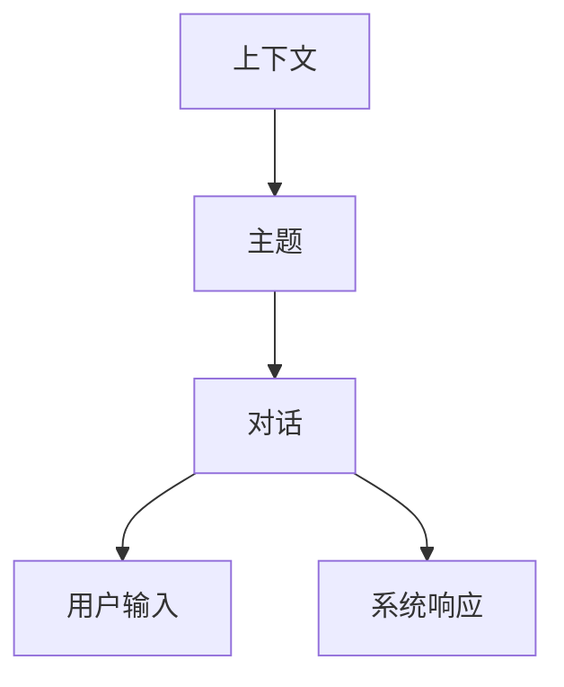
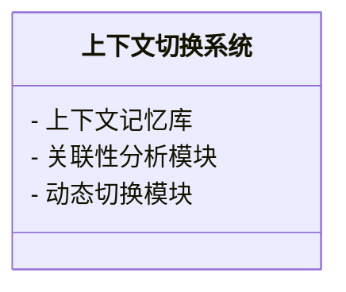
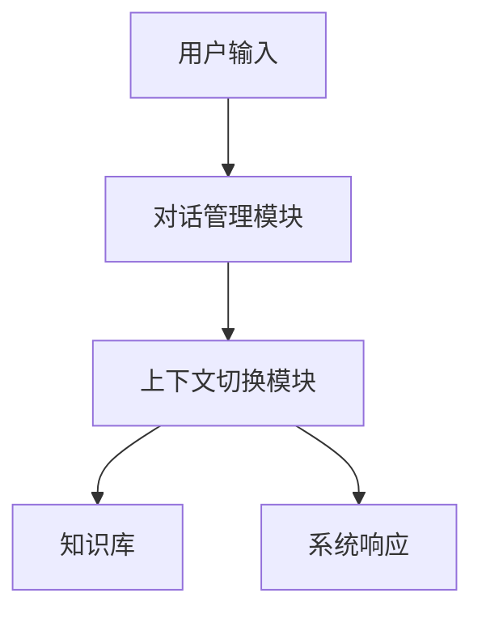
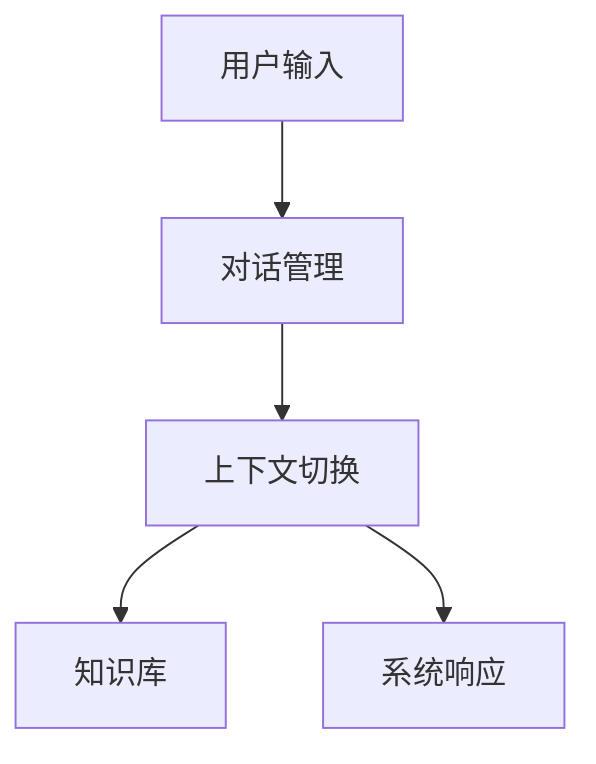
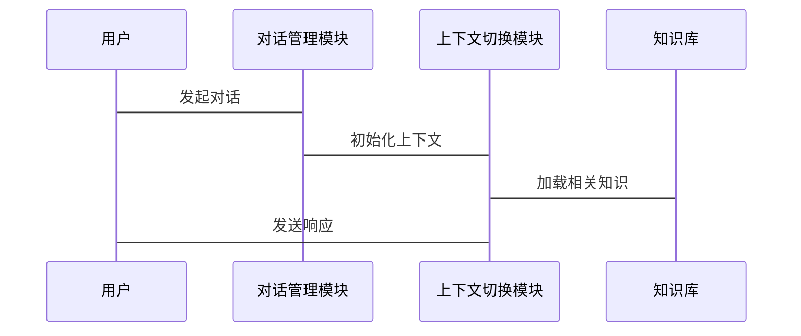

                 


# 上下文切换：让AI Agent灵活应对多主题对话

> 关键词：上下文切换，AI Agent，多主题对话，记忆机制，注意力机制，动态切换

> 摘要：本文深入探讨了上下文切换在AI Agent中的重要性及其在多主题对话中的应用。通过分析上下文切换的核心概念、算法原理、系统架构设计以及项目实战，展示了如何实现灵活的上下文切换机制，使得AI Agent能够应对复杂的多主题对话场景。

---

# 第一部分: 上下文切换的背景与核心概念

## 第1章: 上下文切换的背景与问题背景

### 1.1 什么是上下文切换

#### 1.1.1 上下文切换的定义
上下文切换是指在多主题对话过程中，AI Agent能够根据当前对话的主题和上下文信息，动态调整其知识库、模型参数或关注点，以保持对话的连贯性和准确性。

#### 1.1.2 上下文切换的重要性
在多主题对话中，AI Agent需要能够快速切换焦点，从一个主题转移到另一个主题，同时保持对上下文的理解。这不仅提高了对话的效率，还增强了用户体验。

#### 1.1.3 AI Agent在上下文切换中的角色
AI Agent作为对话的核心，负责管理上下文切换的过程，包括记忆、关联性分析和动态切换策略的执行。

### 1.2 问题背景与问题描述

#### 1.2.1 多主题对话的挑战
多主题对话中，AI Agent需要处理多个不相关的主题，这可能导致信息混淆和上下文丢失。

#### 1.2.2 AI Agent在多主题对话中的局限性
传统的AI Agent在处理多主题对话时，往往无法有效管理上下文，导致对话中断或回答错误。

#### 1.2.3 上下文切换的核心问题
上下文切换的核心问题是如何在多主题对话中，快速定位和切换到正确的上下文，同时保持对话的连贯性。

### 1.3 上下文切换的解决思路

#### 1.3.1 上下文记忆机制
通过记忆机制，AI Agent可以存储和检索与当前对话相关的上下文信息。

#### 1.3.2 上下文关联性分析
通过关联性分析，AI Agent可以识别当前对话主题与其他主题之间的关系。

#### 1.3.3 多主题对话的动态切换策略
动态切换策略允许AI Agent根据对话的进展，实时调整其关注点和上下文。

### 1.4 上下文切换的边界与外延

#### 1.4.1 上下文切换的适用场景
适用于需要处理多个不相关主题的对话场景，如客服、教育、医疗等。

#### 1.4.2 上下文切换的限制条件
受限于当前技术，上下文切换在处理高度复杂或模糊的主题时可能表现不佳。

#### 1.4.3 上下文切换与其他技术的关系
上下文切换与自然语言处理、知识图谱、注意力机制等技术密切相关。

### 1.5 核心概念结构与组成

#### 1.5.1 上下文切换的组成要素
- 上下文记忆：存储与当前对话相关的上下文信息。
- 关联性分析：识别当前主题与其他主题之间的关系。
- 动态切换策略：根据对话进展调整上下文。

#### 1.5.2 各要素之间的关系
上下文记忆为关联性分析提供数据支持，关联性分析为动态切换策略提供决策依据。

#### 1.5.3 核心概念的系统性分析
通过系统性分析，可以更好地理解上下文切换的整体架构和实现机制。

## 第2章: 上下文切换的核心概念与联系

### 2.1 核心概念原理

#### 2.1.1 上下文记忆机制的原理
通过存储和检索上下文信息，AI Agent可以快速切换到正确的上下文。

#### 2.1.2 上下文关联性分析的原理
通过分析对话主题之间的关系，AI Agent可以识别上下文切换的时机。

#### 2.1.3 多主题对话的动态切换原理
通过动态调整关注点，AI Agent可以实现实时的上下文切换。

### 2.2 核心概念属性对比表格

| 核心概念 | 定义 | 作用 | 示例 |
|----------|------|------|------|
| 上下文记忆机制 | 存储和检索上下文信息 | 快速切换到正确的上下文 | 根据对话主题切换到相关知识库 |

### 2.3 ER实体关系图



---

# 第二部分: 上下文切换的算法原理

## 第3章: 上下文切换的算法原理

### 3.1 上下文记忆机制

#### 3.1.1 记忆机制的实现原理
通过存储上下文信息，AI Agent可以在需要时快速检索和恢复上下文。

#### 3.1.2 基于概率的上下文记忆模型
使用概率模型，计算上下文之间的关联性。

#### 3.1.3 记忆机制的优化策略
通过优化存储和检索效率，提升上下文切换的速度和准确性。

### 3.2 上下文关联性分析

#### 3.2.1 关联性分析的数学模型
使用注意力机制，计算当前主题与其他主题之间的关联性。

#### 3.2.2 基于注意力机制的关联性分析
通过计算关键词的权重，识别上下文之间的关联性。

#### 3.2.3 关联性分析的优化策略
通过引入领域知识，提升关联性分析的准确性和效率。

### 3.3 动态切换策略

#### 3.3.1 动态切换策略的实现原理
通过实时分析对话进展，动态调整上下文切换的时机。

#### 3.3.2 基于时间窗口的切换策略
根据对话的时间窗口，自动切换到最新的上下文。

#### 3.3.3 动态切换策略的优化
通过引入反馈机制，动态调整切换策略，提升对话的连贯性。

---

# 第三部分: 系统分析与架构设计方案

## 第4章: 系统分析与架构设计

### 4.1 系统功能设计

#### 4.1.1 领域模型设计
通过领域模型，描述系统的核心功能和模块。

#### 4.1.2 领域模型类图


#### 4.1.3 系统架构设计


### 4.2 系统架构设计

#### 4.2.1 系统架构图


#### 4.2.2 系统接口设计
- 用户输入接口：接收用户的对话输入。
- 系统响应接口：输出AI Agent的对话响应。

#### 4.2.3 系统交互流程图


---

# 第四部分: 项目实战

## 第5章: 项目实战

### 5.1 项目介绍

#### 5.1.1 项目背景
本项目旨在实现一个多主题对话系统，其中AI Agent能够灵活切换上下文。

#### 5.1.2 项目目标
通过实现上下文切换机制，提升AI Agent在多主题对话中的表现。

### 5.2 环境安装

#### 5.2.1 系统要求
- Python 3.8+
- TensorFlow 2.0+
- transformers库

#### 5.2.2 安装依赖
```bash
pip install numpy
pip install transformers
pip install matplotlib
```

### 5.3 核心实现

#### 5.3.1 上下文记忆机制实现
```python
class ContextMemory:
    def __init__(self):
        self.context = {}
```

#### 5.3.2 关联性分析实现
```python
def calculate_attention(input_text, context):
    # 使用注意力机制计算关联性
    pass
```

#### 5.3.3 动态切换策略实现
```python
def dynamic_switch(current_context, new_context):
    # 根据关联性分析结果切换上下文
    pass
```

### 5.4 代码解读与分析

#### 5.4.1 代码实现细节
详细解读上下文记忆机制、关联性分析和动态切换策略的实现细节。

#### 5.4.2 代码优化建议
基于实际运行效果，提出代码优化建议。

### 5.5 案例分析与详细讲解

#### 5.5.1 案例分析
通过具体案例，展示上下文切换机制的实际应用。

#### 5.5.2 详细讲解
详细分析上下文切换机制在多主题对话中的表现。

---

# 第五部分: 最佳实践与总结

## 第6章: 最佳实践与总结

### 6.1 小结

#### 6.1.1 上下文切换的关键点
- 上下文记忆机制的实现
- 关联性分析的准确性
- 动态切换策略的优化

### 6.2 注意事项

#### 6.2.1 开发注意事项
- 确保上下文记忆机制的高效性
- 提升关联性分析的准确性
- 优化动态切换策略的响应速度

#### 6.2.2 使用注意事项
- 确保上下文切换机制的安全性
- 提升用户体验
- 定期更新知识库

### 6.3 拓展阅读

#### 6.3.1 推荐技术
- 自然语言处理
- 注意力机制
- 知识图谱

#### 6.3.2 推荐书籍
- 《深度学习》
- 《自然语言处理入门》
- 《Transformer变体与应用》

---

# 作者：AI天才研究院/AI Genius Institute & 禅与计算机程序设计艺术 /Zen And The Art of Computer Programming

