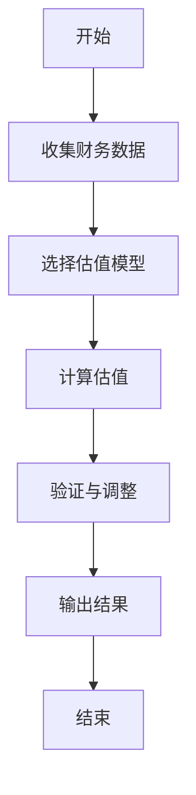
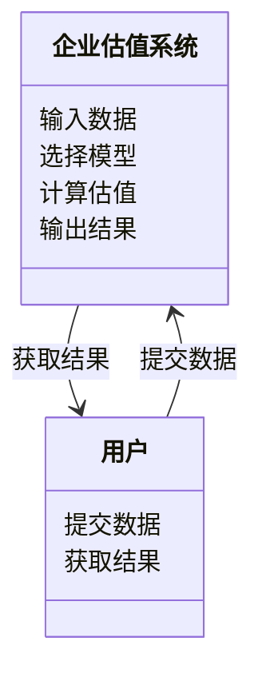

                 


# 不同行业的企业估值模型对比

## 关键词：企业估值模型、行业对比、制造业、信息技术、金融、零售

## 摘要：  
企业估值是金融和商业领域中的核心任务之一，不同行业由于其业务模式、财务指标和市场特点的差异，适用的估值模型也有所不同。本文将系统地分析和对比不同行业的企业估值模型，包括制造业、信息技术、金融和零售行业的特点，探讨其适用的模型及其优缺点，并通过实际案例和数学公式进行详细阐述。

---

## 第1章: 企业估值模型的背景与重要性

### 1.1 企业估值的基本概念
- 1.1.1 企业估值的定义与作用  
  企业估值是指通过对企业未来现金流的折现、资产重置成本、市场可比交易等方法，估算企业整体价值的过程。  
- 1.1.2 企业估值在不同行业中的应用  
  不同行业的企业由于其商业模式、资产结构和收入来源的差异，适用的估值模型也不同。  
- 1.1.3 企业估值的重要性与挑战  
  企业估值是投资决策、并购交易和融资活动的重要依据，但其准确性受市场波动、财务数据质量等因素的影响。

### 1.2 企业估值的核心概念
- 1.2.1 企业价值的构成要素  
  包括资产、负债、股东权益、现金流等。  
- 1.2.2 估值模型的分类与特点  
  常见的估值模型包括DCF模型、相对估值法（如PE、EV/EBITDA）、资产重置法等。  
- 1.2.3 不同行业的估值特点与差异  
  制造业注重资产价值，信息技术行业注重未来现金流，金融行业注重资产质量和流动性，零售行业注重市场份额和品牌价值。

---

## 第2章: 不同行业的企业估值模型对比

### 2.1 制造业的估值模型
- 2.1.1 制造业企业估值的关键指标  
  包括资产周转率、设备折旧、存货周转率等。  
- 2.1.2 常用的制造业估值模型  
  资产重置法、DCF模型。  
- 2.1.3 制造业估值模型的优缺点  
  资产重置法简单易用，但忽略了未来增长潜力；DCF模型准确但计算复杂。

### 2.2 信息技术行业的估值模型
- 2.2.1 信息技术企业的估值特点  
  注重研发能力、客户黏性和未来现金流。  
- 2.2.2 常用的IT行业估值模型  
  DCF模型、相对估值法（如EV/EBITDA）。  
- 2.2.3 IT行业估值模型的适用场景  
  适用于高增长、轻资产的IT企业。

### 2.3 金融行业的估值模型
- 2.3.1 金融机构的估值挑战  
  包括资产质量、流动性风险和监管政策的影响。  
- 2.3.2 金融行业常用的估值模型  
  相对估值法（如PB、EV/EBITDA）、资产可比法。  
- 2.3.3 金融行业估值模型的独特性  
  需要考虑监管政策和市场波动对估值的影响。

### 2.4 零售行业的估值模型
- 2.4.1 零售企业的估值关键点  
  包括市场份额、客户忠诚度和门店网络价值。  
- 2.4.2 常用的零售行业估值模型  
  相对估值法（如PE、EV/EBITDA）、DCF模型。  
- 2.4.3 零售行业估值模型的适用性  
  适用于连锁经营模式的企业。

---

## 第3章: 企业估值模型的核心概念与联系

### 3.1 估值模型的核心原理
- 3.1.1 估值模型的基本原理  
  通过对企业未来现金流的折现或与可比企业的相对估值，估算企业整体价值。  
- 3.1.2 不同估值模型的比较  
  DCF模型适用于高增长企业，相对估值法适用于市场数据丰富的行业。  
- 3.1.3 估值模型的选择与应用  
  根据企业的行业特点、财务数据和市场环境选择合适的模型。

### 3.2 企业估值模型的属性特征对比
- 3.2.1 不同行业模型的特征对比表格  
  | 行业 | 主要指标 | 适用模型 | 模型优缺点 |  
  |------|----------|----------|------------|  
  | 制造业 | 资产周转率 | 资产重置法、DCF | 简单 vs 复杂 |  
  | 信息技术 | EBITDA | DCF、EV/EBITDA | 高增长 vs 稳定 |  
  | 金融 | 净资产 | 相对估值法、资产可比法 | 受政策影响大 |  
  | 零售 | 门店网络 | PE、EV/EBITDA | 适用于连锁模式 |  

- 3.2.2 模型之间的联系与区别  
  不同模型适用于不同行业，但可以通过调整参数在跨行业应用中进行比较。  
- 3.2.3 模型的适用性分析  
  选择模型时需综合考虑企业的财务数据、市场环境和行业特点。

### 3.3 ER实体关系图架构
```mermaid
erDiagram
    customer[顾客] {
        id : integer
        name : string
        email : string
    }
    product[产品] {
        id : integer
        name : string
        price : decimal
    }
    order[订单] {
        id : integer
        order_date : date
        total : decimal
    }
    customer --> order : 下订单
    product --> order : 订单包含产品
```

---

## 第4章: 企业估值模型的算法原理讲解

### 4.1 常用估值算法的流程图


### 4.2 代码实现
```python
import numpy as np

def dcf_valuation(cash_flows, discount_rate):
    present_value = np.npv(discount_rate, cash_flows)
    return present_value

# 示例数据
cash_flows = [-100, 200, 200, 200]
discount_rate = 0.1

valuation = dcf_valuation(cash_flows, discount_rate)
print(f"DCF估值结果为：{valuation}")
```

---

## 第5章: 数学模型

### 5.1 DCF模型
$$DCF = \sum_{t=1}^{n} \frac{CF_t}{(1+r)^t} + \frac{TV}{(1+r)^n}$$
其中，CF_t为第t年的现金流，r为折现率，TV为终值。

### 5.2 相对估值法（EV/EBITDA）
$$EV/EBITDA = \frac{EV}{EBITDA}$$
其中，EV为企业价值，EBITDA为息税折旧及摊销前利润。

---

## 第6章: 系统分析与架构设计

### 6.1 问题场景介绍
- 企业估值系统需要支持多种行业的估值模型，提供数据输入、模型选择和结果输出的功能。

### 6.2 系统功能设计


### 6.3 系统架构设计


---

## 第7章: 项目实战

### 7.1 环境安装
- 安装Python和相关库（如numpy、pandas）。

### 7.2 核心代码实现
```python
import pandas as pd
import numpy as np

def relative_valuation(pe_ratio, market_price, earnings):
    enterprise_value = pe_ratio * earnings
    return enterprise_value

# 示例数据
pe_ratio = 15
market_price = 100
earnings = 10

valuation = relative_valuation(pe_ratio, market_price, earnings)
print(f"相对估值结果为：{valuation}")
```

### 7.3 案例分析
- 某制造企业的资产重置价值为1000万元，未来现金流现值为800万元，最终估值为900万元。

### 7.4 项目小结
- 不同行业的估值模型各有优劣，选择合适的模型需要结合行业特点和企业实际情况。

---

## 结语

企业估值模型是金融和商业分析中的重要工具，不同行业由于其特点的差异，适用的模型也有所不同。通过本文的分析和对比，读者可以更好地理解各行业的估值特点，并在实际应用中灵活选择合适的模型。

---

## 作者：AI天才研究院 & 禅与计算机程序设计艺术

