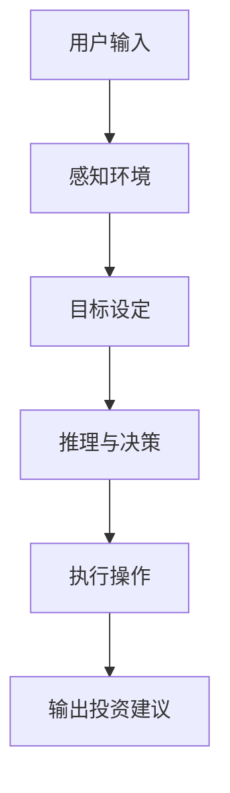
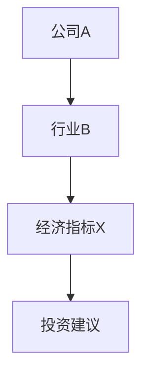
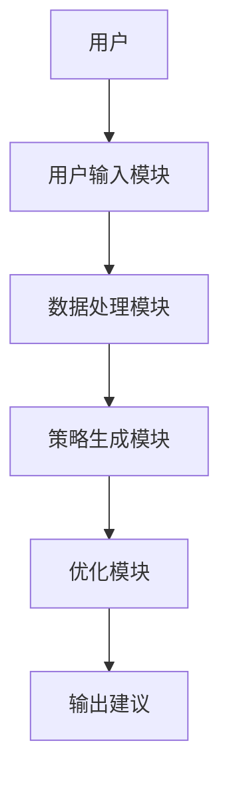

                 


# 个人理财顾问：AI Agent的智能投资建议

## 关键词：AI Agent，个人理财，智能投资，机器学习，自然语言处理，知识图谱

## 摘要：  
随着人工智能技术的飞速发展，AI Agent（智能代理）在金融领域的应用越来越广泛。本文将详细探讨AI Agent如何作为个人理财顾问，为投资者提供智能、个性化的投资建议。从AI Agent的核心原理到其在投资策略中的具体应用，再到系统的实现细节，本文将全面解析这一技术在个人理财中的潜力与价值。通过实际案例和代码实现，本文将展示如何利用AI Agent构建一个高效、可靠的智能理财系统。

---

## 第一部分: AI Agent的基本原理与技术基础

### 第1章: AI Agent的核心概念与工作原理

#### 1.1 AI Agent的定义与分类
- **AI Agent的定义**: AI Agent是一种能够感知环境、自主决策并执行任务的智能系统。  
- **分类**:  
  - **简单反应式AI Agent**: 基于当前输入做出即时反应，不依赖历史信息。  
  - **基于模型的AI Agent**: 使用内部模型（如知识图谱、机器学习模型）进行决策。  
  - **目标驱动的AI Agent**: 具有明确的目标，通过优化算法实现目标。  

#### 1.2 AI Agent的工作流程
1. **感知环境**: 通过输入数据（如市场数据、用户信息）感知环境。  
2. **目标设定**: 根据用户需求或系统目标，设定具体的任务目标。  
3. **推理与决策**: 使用算法对数据进行分析，生成可行的解决方案。  
4. **执行操作**: 根据决策结果执行操作（如生成投资建议）。  

**示例**: 一个AI Agent理财顾问的工作流程如下图所示：



---

### 第2章: AI Agent的核心技术

#### 2.1 自然语言处理（NLP）
- **NLP的作用**: 将用户的自然语言输入转化为可计算的结构化数据。  
- **关键技术**:  
  - 分词（Tokenization）  
  - 语法分析（Parsing）  
  - 情感分析（Sentiment Analysis）  
  - 对话生成（Dialog Generation）  

#### 2.2 机器学习与深度学习
- **机器学习的作用**: 通过历史数据训练模型，预测市场趋势和用户需求。  
- **关键技术**:  
  - 线性回归（Linear Regression）  
  - 支持向量机（SVM）  
  - 随机森林（Random Forest）  
  - 循环神经网络（RNN）  
  - Transformer模型（如BERT）  

#### 2.3 知识图谱与推理引擎
- **知识图谱的作用**: 建立金融领域的知识库，支持复杂推理。  
- **推理引擎**:  
  - 基于规则的推理（Rule-based Reasoning）  
  - 基于逻辑的推理（Logic-based Reasoning）  
  - 基于概率的推理（Probability-based Reasoning）  

---

## 第三部分: AI Agent在投资建议中的应用

### 第3章: 投资策略与模型设计

#### 3.1 基于机器学习的投资策略
- **数据准备**: 收集历史市场数据（如股票价格、经济指标）。  
- **特征提取**: 提取影响投资决策的特征（如波动率、市盈率）。  
- **模型训练**: 使用监督学习算法训练投资策略模型。  
- **模型评估**: 通过回测（Backtesting）验证模型的性能。  

**代码示例**: 使用Python训练一个简单的股票预测模型

```python
import pandas as pd
from sklearn.model_selection import train_test_split
from sklearn.linear_model import LinearRegression

# 加载数据
data = pd.read_csv('stock_data.csv')

# 特征与目标分离
X = data[['open', 'high', 'low', 'volume']]
y = data['close']

# 划分训练集与测试集
X_train, X_test, y_train, y_test = train_test_split(X, y, test_size=0.2)

# 训练模型
model = LinearRegression()
model.fit(X_train, y_train)

# 预测与评估
y_pred = model.predict(X_test)
print('预测结果:', y_pred)
print('真实结果:', y_test)
```

#### 3.2 基于知识图谱的策略生成
- **知识图谱构建**: 使用金融领域的实体（如公司、行业、经济指标）构建知识图谱。  
- **策略生成**: 基于知识图谱推理生成投资策略。  

**示例**: 下图展示了知识图谱推理的过程：



---

## 第四部分: 系统实现与优化

### 第4章: 系统架构设计

#### 4.1 系统功能模块
- **用户输入模块**: 收集用户的财务状况和投资目标。  
- **数据处理模块**: 处理市场数据和用户输入。  
- **策略生成模块**: 生成投资策略并输出建议。  
- **优化模块**: 动态调整策略以应对市场变化。  

#### 4.2 系统架构图


#### 4.3 系统接口设计
- **输入接口**: REST API，接收用户的财务数据和投资目标。  
- **输出接口**: 返回投资建议和风险提示。  

---

## 第五部分: 项目实战与优化

### 第5章: 项目实现与测试

#### 5.1 项目环境搭建
- **工具安装**: 安装Python、TensorFlow、Keras、自然语言处理库（如spaCy、NLTK）。  
- **数据准备**: 收集股票数据、经济指标、新闻文本等。  

#### 5.2 核心代码实现
```python
import numpy as np
from tensorflow.keras import layers

# 定义一个简单的神经网络模型
def build_model(input_shape):
    model = tf.keras.Sequential()
    model.add(layers.Dense(64, activation='relu', input_shape=input_shape))
    model.add(layers.Dense(32, activation='relu'))
    model.add(layers.Dense(1, activation='sigmoid'))
    return model

# 训练模型
model = build_model((4,))
model.compile(optimizer='adam', loss='binary_crossentropy', metrics=['accuracy'])
model.fit(X_train, y_train, epochs=10, batch_size=32)
```

---

## 第六部分: 总结与展望

### 6.1 项目总结
- **技术总结**: 介绍了AI Agent在个人理财中的核心技术和应用场景。  
- **实际价值**: 展示了AI Agent如何通过智能投资建议帮助用户实现财富管理目标。  

### 6.2 未来展望
- **技术优化**: 探讨如何进一步优化AI Agent的算法和系统架构。  
- **应用场景扩展**: 展望AI Agent在更多金融领域的应用潜力。  

---

## 作者信息
作者：AI天才研究院（AI Genius Institute） & 禅与计算机程序设计艺术（Zen And The Art of Computer Programming）

---

**注意事项**:  
- 本文仅用于技术探讨，不构成实际的投资建议。  
- 如需转载请注明出处。  

**感谢阅读！**

