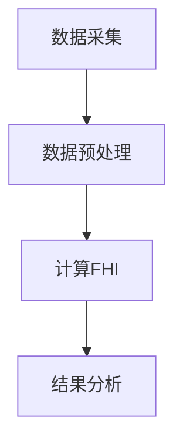
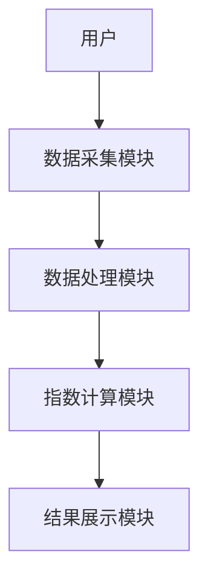
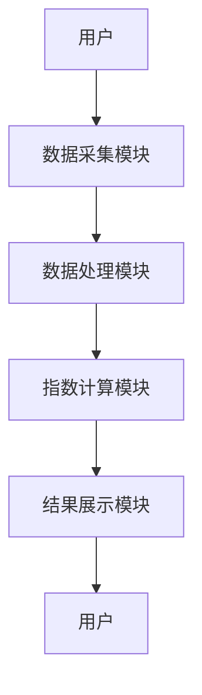

                 


# 个人财务健康指数动态跟踪系统

> 关键词：个人财务管理、财务健康指数、动态跟踪、机器学习、系统架构

> 摘要：本文详细介绍了个人财务健康指数动态跟踪系统的构建与实现，从背景、核心概念、算法实现到系统架构设计，再到项目实战，全面解析了如何通过技术手段实现个人财务健康的智能化管理。本文适合对个人财务管理感兴趣的技术人员和对机器学习、系统架构设计感兴趣的读者阅读。

---

# 第一部分: 个人财务健康指数动态跟踪系统概述

## 第1章: 个人财务健康指数的背景与意义

### 1.1 个人财务健康的重要性

#### 1.1.1 财务健康的核心概念

财务健康是衡量个人经济状况的重要指标，它不仅包括收入与支出的平衡，还包括资产与负债的合理配置。财务健康指数（Financial Health Index, FHI）是通过量化分析个人的财务状况，评估其经济安全性和可持续性的指标。

#### 1.1.2 个人财务管理的现状与挑战

- 传统财务管理方式的局限性：手动记录、计算复杂、缺乏动态跟踪。
- 数字化财务管理的需求：实时监控、智能分析、个性化建议。

#### 1.1.3 财务健康指数动态跟踪的必要性

动态跟踪财务健康指数可以帮助个人及时发现和解决问题，优化财务结构，实现长期财务目标。

### 1.2 个人财务健康指数的定义与特点

#### 1.2.1 财务健康指数的定义

财务健康指数是一个综合性的量化指标，反映了个人在一段时间内的收入、支出、资产和负债的平衡状况。

#### 1.2.2 财务健康指数的核心属性

- **实时性**：能够动态更新，反映最新的财务状况。
- **综合性**：综合考虑收入、支出、资产、负债等多个维度。
- **可操作性**：通过指数结果提供具体的财务优化建议。

#### 1.2.3 动态跟踪的特点与优势

- **实时反馈**：通过数据采集和处理，快速生成财务健康指数。
- **智能分析**：基于机器学习算法，提供个性化建议。
- **可视化展示**：通过图表和报告，直观展示财务状况。

### 1.3 本章小结

本章介绍了个人财务健康指数的重要性和动态跟踪的必要性，为后续章节的分析奠定了基础。

---

# 第二部分: 个人财务健康指数的核心概念与模型

## 第2章: 个人财务健康指数的指标体系

### 2.1 财务健康指数的构成要素

#### 2.1.1 收入与支出分析

- 收入：包括工资、投资收益等。
- 支出：包括日常生活开支、债务还款等。

#### 2.1.2 资产与负债分析

- 资产：包括现金、存款、投资等。
- 负债：包括信用卡欠款、贷款等。

#### 2.1.3 储蓄与投资分析

- 储蓄率：储蓄占收入的比例。
- 投资回报率：投资收益占投资总额的比例。

### 2.2 财务健康指数的计算公式

$$
\text{财务健康指数} = \frac{\text{资产净额} - \text{短期负债}}{\text{月均收入}} \times 100\%
$$

其中：
- 资产净额 = 总资产 - 总负债
- 短期负债 = 信用卡欠款 + 其他短期债务

### 2.3 指标体系的权重分配

#### 2.3.1 各指标权重的确定方法

- 根据经验判断：收入、支出、资产、负债等指标的权重分别为30%、20%、30%、20%。

#### 2.3.2 权重分配的合理性分析

- 由于资产和负债是财务健康的核心，因此它们的权重较高。

### 2.4 本章小结

本章详细介绍了财务健康指数的构成要素和计算公式，并提出了权重分配的方法。

---

## 第3章: 个人财务健康指数的数学模型与算法

### 3.1 财务健康指数的数学模型

基于上述公式，我们可以建立如下的数学模型：

$$
\text{FHI} = \frac{(\text{资产} - \text{负债}) - \text{短期负债}}{\text{收入}} \times 100\%
$$

### 3.2 算法实现步骤

#### 3.2.1 数据采集

- 采集收入、支出、资产、负债等数据。

#### 3.2.2 数据预处理

- 清洗数据，去除异常值。
- 标准化处理，确保数据一致性。

#### 3.2.3 指数计算

- 使用上述公式计算财务健康指数。

#### 3.2.4 结果分析

- 根据指数结果提供财务优化建议。

### 3.3 算法流程图（mermaid）



### 3.4 本章小结

本章详细介绍了财务健康指数的数学模型和算法实现步骤。

---

# 第三部分: 个人财务健康指数动态跟踪系统的实现

## 第4章: 系统架构设计

### 4.1 系统功能模块划分

#### 4.1.1 数据采集模块

- 采集用户的收入、支出、资产、负债等数据。

#### 4.1.2 数据处理模块

- 对采集到的数据进行清洗、标准化处理。

#### 4.1.3 指数计算模块

- 计算财务健康指数。

#### 4.1.4 结果展示模块

- 以图表形式展示财务健康指数和分析结果。

### 4.2 系统架构图（mermaid）



### 4.3 系统交互流程图（mermaid）



### 4.4 本章小结

本章详细介绍了系统的功能模块划分和系统架构设计。

---

## 第5章: 系统实现与优化

### 5.1 数据采集与处理

#### 5.1.1 数据采集接口

- 使用API接口采集用户的财务数据。

#### 5.1.2 数据清洗代码

```python
def clean_data(data):
    # 删除缺失值
    data = data.dropna()
    # 去除异常值
    data = data[data['income'] > 0]
    return data
```

### 5.2 指数计算与分析

#### 5.2.1 指数计算代码

```python
def calculate_fhi/assets, liabilities, income):
    assets_net = assets - liabilities
    fhi = (assets_net - short_liabilities) / income * 100
    return fhi
```

### 5.3 系统优化

#### 5.3.1 性能优化

- 使用并行计算加速数据处理。

#### 5.3.2 算法优化

- 使用更高效的机器学习算法提升计算速度。

### 5.4 本章小结

本章详细介绍了系统的实现过程和优化方法。

---

# 第四部分: 项目实战与案例分析

## 第6章: 项目实战

### 6.1 环境配置

- 安装Python和相关库（Pandas、NumPy、Matplotlib等）。

### 6.2 核心代码实现

#### 6.2.1 数据采集

```python
import pandas as pd

def fetch_data(api_key):
    # 通过API获取数据
    pass
```

#### 6.2.2 数据处理

```python
def process_data(data):
    # 数据清洗和预处理
    pass
```

#### 6.2.3 指数计算

```python
def calculate_fhi(data):
    # 计算财务健康指数
    pass
```

### 6.3 系统优化

#### 6.3.1 性能优化

- 使用缓存机制减少重复计算。

#### 6.3.2 算法优化

- 使用更高效的算法提升计算速度。

### 6.4 本章小结

本章通过实际案例展示了系统的实现过程。

---

## 第7章: 案例分析与总结

### 7.1 案例分析

- 以某用户为例，展示系统的使用过程和结果。

### 7.2 总结与展望

- 总结系统的优势和不足。
- 展望未来的研究方向。

### 7.3 本章小结

本章通过案例分析总结了系统的实现和应用效果。

---

# 第五部分: 注意事项与扩展阅读

## 第8章: 注意事项

### 8.1 数据隐私保护

- 确保用户数据的安全和隐私。

### 8.2 系统维护与更新

- 定期更新算法和优化系统性能。

## 第9章: 扩展阅读

### 9.1 机器学习在财务管理中的应用

- 推荐相关书籍和论文。

### 9.2 系统架构的优化

- 推荐相关技术文章和资源。

---

# 作者：AI天才研究院/AI Genius Institute & 禅与计算机程序设计艺术 /Zen And The Art of Computer Programming

---

以上是《个人财务健康指数动态跟踪系统》的技术博客文章的详细目录和内容概要。

