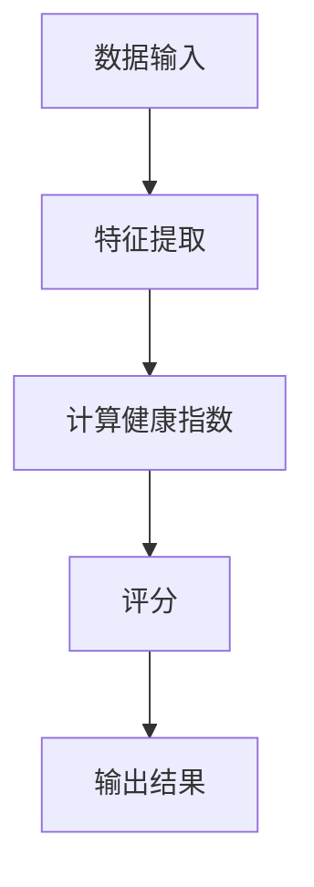
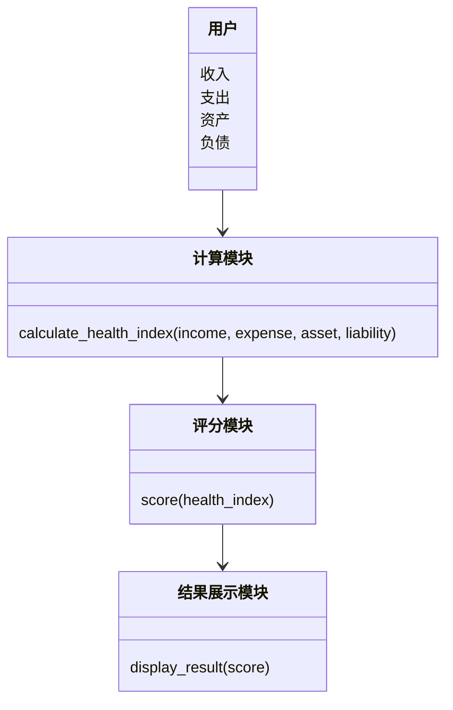
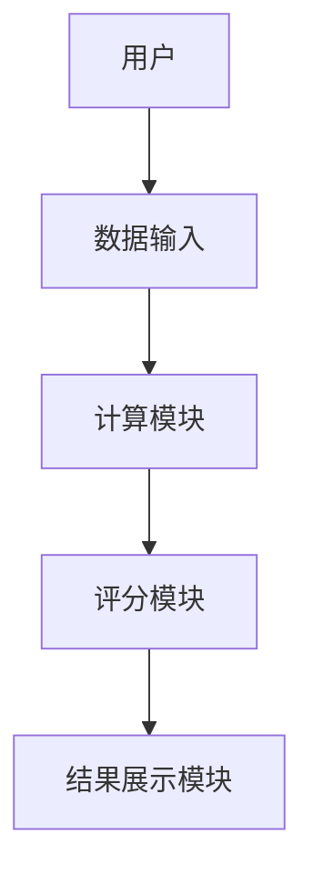
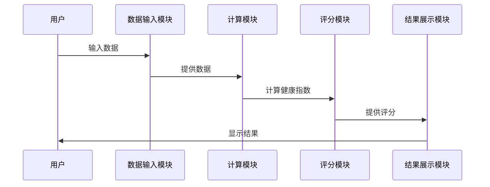

                 


# 个人财务健康指数开发与应用

**关键词：** 个人财务健康指数，算法原理，系统架构，项目实战，财务健康管理

**摘要：**  
本文详细探讨了个人财务健康指数的开发与应用，从背景分析、核心概念、算法原理到系统架构设计、项目实战，再到最佳实践，为读者提供全面的技术解读和实用指导。

---

# 第一部分: 个人财务健康指数的背景与核心概念

## 第1章: 个人财务健康指数的背景与问题描述

### 1.1 个人财务健康指数的定义与意义

#### 1.1.1 什么是个人财务健康指数
个人财务健康指数是一种量化评估个人财务状况的指标，综合考虑收入、支出、资产和负债等因素，帮助个人了解自身的财务健康状况。

#### 1.1.2 财务健康指数的重要性
在当前经济环境下，个人财务管理至关重要。财务健康指数能够帮助个人识别财务问题，优化收支结构，避免潜在的经济危机。

#### 1.1.3 财务健康指数的应用场景
- 个人财务管理工具
- 金融产品的风险评估
- 个人信用评分
- 金融教育与普及

### 1.2 个人财务健康问题的现状

#### 1.2.1 当前个人财务管理的痛点
- 支出超出收入，导致债务累积
- 缺乏预算管理，消费失控
- 投资决策不科学，风险过高

#### 1.2.2 财务问题对个人生活的影响
- 影响信用评分，限制贷款
- 增加经济压力，影响生活质量
- 导致家庭矛盾，影响社会稳定

#### 1.2.3 技术在个人财务管理中的作用
- 数据分析技术帮助优化预算
- 人工智能辅助投资决策
- 区块链技术保障数据安全

### 1.3 个人财务健康指数的开发目标

#### 1.3.1 解决的核心问题
- 提供科学的财务评估方法
- 帮助用户识别财务风险
- 提供个性化的财务管理建议

#### 1.3.2 开发目标的设定
- 开发一个通用的财务健康指数模型
- 提供可扩展的系统架构
- 实现用户友好的交互界面

#### 1.3.3 边界与外延
- 仅评估个人财务，不涉及企业财务
- 不考虑遗产或赠与等特殊财务行为
- 支持多种数据来源和接口

## 第2章: 个人财务健康指数的核心要素与概念结构

### 2.1 核心概念与属性特征

#### 2.1.1 财务健康指数的核心概念
| 概念 | 定义 | 属性 |
|------|------|------|
| 收入 | 个人获得的总收入 | 稳定性、多样性、可预测性 |
| 支出 | 个人的总支出 | 必要性、合理性、可调整性 |
| 资产 | 个人拥有的资产 | 流动性、安全性、收益性 |
| 负债 | 个人的债务 | 到期时间、偿还能力、利率 |

#### 2.1.2 实体关系图

```mermaid
erd
  id: user
  entity: 用户
  entity: 收入
  entity: 支出
  entity: 资产
  entity: 负债
  id: income
  id: expense
  id: asset
  id: liability
  relation: 用户拥有收入、支出、资产和负债。
```

### 2.2 财务健康指数的计算模型

#### 2.2.1 计算模型

$$健康指数 = \frac{(收入 - 支出) \times 资产}{负债}$$

其中，收入和支出是月收入和月支出，资产是个人资产总值，负债是个人负债总值。

#### 2.2.2 模型的输入输出关系
- 输入：收入、支出、资产、负债
- 输出：健康指数，范围为1到100，1表示非常不健康，100表示非常健康。

---

# 第二部分: 个人财务健康指数的算法原理与实现

## 第3章: 财务健康指数的算法原理

### 3.1 财务健康指数的评分模型

#### 3.1.1 模型的输入特征
- 收入：月收入
- 支出：月支出
- 资产：总资产
- 负债：总负债

#### 3.1.2 模型的输出结果
- 健康指数评分：1-100分

#### 3.1.3 模型的评分标准
| 评分范围 | 评语 |
|----------|------|
| 1-30     | 不健康 |
| 31-60    | 一般 |
| 61-85    | 良好 |
| 86-100   | 优秀 |

### 3.2 算法实现的流程图



```python
def calculate_health_index(income, expense, asset, liability):
    health_index = (income - expense) * asset / liability
    return health_index

def main():
    income = float(input("请输入月收入："))
    expense = float(input("请输入月支出："))
    asset = float(input("请输入总资产："))
    liability = float(input("请输入总负债："))
    
    health_index = calculate_health_index(income, expense, asset, liability)
    
    if health_index < 30:
        print("评分：不健康，得分为", health_index)
    elif 30 <= health_index < 60:
        print("评分：一般，得分为", health_index)
    elif 60 <= health_index < 85:
        print("评分：良好，得分为", health_index)
    else:
        print("评分：优秀，得分为", health_index)

if __name__ == "__main__":
    main()
```

### 3.3 算法实现的数学模型

$$健康指数 = \frac{(收入 - 支出) \times 资产}{负债}$$

其中，收入和支出是月收入和月支出，资产是个人资产总值，负债是个人负债总值。

---

## 第4章: 财务健康指数的数学模型与公式

### 4.1 财务健康指数的数学模型

健康指数的数学模型可以表示为：

$$健康指数 = \frac{(收入 - 支出) \times 资产}{负债}$$

其中，收入和支出是月收入和月支出，资产是个人资产总值，负债是个人负债总值。

### 4.2 财务健康指数的评分公式

评分公式为：

$$评分 = \begin{cases}
1-30 & \text{不健康} \\
31-60 & \text{一般} \\
61-85 & \text{良好} \\
86-100 & \text{优秀}
\end{cases}$$

---

# 第三部分: 个人财务健康指数的系统分析与架构设计

## 第5章: 财务健康指数系统的需求分析

### 5.1 项目背景与目标

#### 5.1.1 项目背景
随着经济的发展，个人财务管理变得越来越复杂，需要一种科学的方法来评估财务健康状况。

#### 5.1.2 项目目标
- 开发一个能够评估个人财务健康指数的系统
- 提供个性化的财务管理建议
- 实现用户友好的交互界面

### 5.2 系统功能设计

#### 5.2.1 系统功能模块
- 数据输入模块
- 计算模块
- 评分模块
- 结果展示模块

#### 5.2.2 领域模型类图



### 5.3 系统架构设计

#### 5.3.1 系统架构图



#### 5.3.2 系统接口设计



---

# 第四部分: 个人财务健康指数的项目实战

## 第6章: 财务健康指数的项目实战

### 6.1 环境安装

#### 6.1.1 安装Python和必要的库
- Python 3.x
- NumPy
- Pandas
- Matplotlib

### 6.2 核心代码实现

#### 6.2.1 数据预处理

```python
import pandas as pd

data = {
    '收入': [30000, 40000, 50000],
    '支出': [20000, 25000, 30000],
    '资产': [100000, 150000, 200000],
    '负债': [50000, 70000, 90000]
}

df = pd.DataFrame(data)
```

#### 6.2.2 模型训练

```python
def calculate_health_index(income, expense, asset, liability):
    return (income - expense) * asset / liability

results = []
for index, row in df.iterrows():
    health_index = calculate_health_index(row['收入'], row['支出'], row['资产'], row['负债'])
    results.append(health_index)

df['健康指数'] = results
df['评分'] = df['健康指数'].apply(lambda x: '优秀' if x >= 86 else ('良好' if x >= 61 else ('一般' if x >= 31 else '不健康')))
```

#### 6.2.3 结果分析

```python
print(df)
```

### 6.3 案例分析

#### 6.3.1 案例背景
假设一个用户的月收入为50000元，月支出为30000元，总资产为200000元，总负债为90000元。

#### 6.3.2 数据计算

```python
income = 50000
expense = 30000
asset = 200000
liability = 90000

health_index = (income - expense) * asset / liability
print(f"健康指数：{health_index}")
```

#### 6.3.3 结果展示

健康指数为80，评分良好。建议优化支出结构，减少不必要的开支，增加储蓄。

---

# 第五部分: 个人财务健康指数的应用与优化

## 第7章: 财务健康指数的最佳实践

### 7.1 小结

个人财务健康指数是一个重要的工具，能够帮助个人科学地评估和管理财务状况。

### 7.2 注意事项

- 数据隐私保护
- 定期更新财务数据
- 结合实际情况调整评分标准

### 7.3 拓展阅读

- 《个人财务管理入门》
- 《Python金融数据分析》
- 《机器学习在金融中的应用》

---

作者：AI天才研究院/AI Genius Institute & 禅与计算机程序设计艺术 /Zen And The Art of Computer Programming

---

通过本文，读者可以深入了解个人财务健康指数的开发与应用，掌握从理论到实践的完整流程，为个人财务管理提供科学的指导和实践参考。

