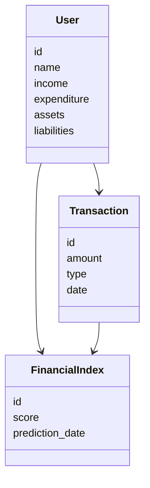
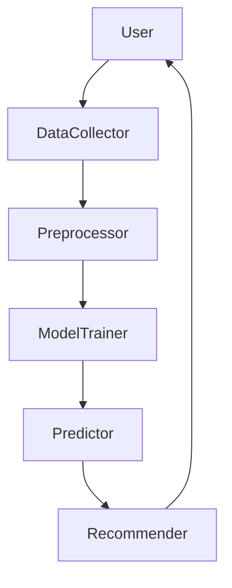

                 


# 《个人财务健康指数预测与改善系统》

> 关键词：个人财务健康指数、财务预测、机器学习、数据分析、系统设计

> 摘要：本文系统地介绍了个人财务健康指数预测与改善系统的构建过程。通过数据分析和机器学习技术，结合领域知识，提出了财务健康指数的计算模型，并设计了完整的系统架构。文章详细讲解了系统的实现过程，包括数据采集、模型训练、系统设计和实际案例分析，为个人财务管理提供了科学的解决方案。

---

# 第一部分: 财务健康指数预测与改善系统概述

## 第1章: 背景与问题分析

### 1.1 财务健康指数的核心概念

#### 1.1.1 财务健康指数的定义
财务健康指数是衡量个人财务状况健康程度的综合指标，结合收入、支出、资产和负债等多维度数据，评估个人的财务风险和收益能力。

#### 1.1.2 财务健康指数的背景与意义
随着经济全球化和金融市场的复杂化，个人财务管理的重要性日益凸显。传统的财务管理方式难以应对复杂的经济环境，亟需借助技术手段实现智能化管理。

#### 1.1.3 个人财务健康指数的边界与外延
- **边界**：主要关注个人的财务数据，不涉及企业或机构的财务信息。
- **外延**：通过预测和改善建议，帮助个人优化财务结构，降低风险。

### 1.2 个人财务健康指数的组成要素

#### 1.2.1 收入与支出分析
- 收入来源：工资、投资收益等。
- 支出项目：日常生活开支、债务还款等。

#### 1.2.2 资产与负债评估
- 资产：现金、存款、投资、房产等。
- 负债：信用卡欠款、贷款等。

#### 1.2.3 财务风险与收益平衡
- 风险评估：通过资产与负债的比率判断财务风险。
- 收益与风险平衡：优化资产配置，实现收益与风险的最佳平衡。

---

## 第2章: 财务健康指数预测的核心概念与联系

### 2.1 核心概念原理

#### 2.1.1 财务健康指数的数学模型
财务健康指数（FHI）的计算公式如下：
$$ FHI = \frac{收入 - 支出}{(资产 - 负债)} \times 100 $$

其中：
- 收入与支出的差值反映个人的净收入能力。
- 资产与负债的差值反映个人的净资产状况。

#### 2.1.2 财务健康指数的预测方法
- 线性回归模型：用于预测未来的财务健康指数变化。
- 机器学习模型：如随机森林、支持向量机等，用于分类和预测。

#### 2.1.3 财务健康指数的改善策略
- 提高收入：优化职业发展，增加副业收入。
- 降低支出：精简非必要开支，优化消费结构。
- 优化资产配置：合理分配资金，降低投资风险。

### 2.2 实体关系图（ER图）

```mermaid
erd
    title 财务健康指数实体关系图
    User {
        id: int
        name: varchar
        income: decimal
        expenditure: decimal
        assets: decimal
        liabilities: decimal
    }
    FinancialIndex {
        id: int
        user_id: int
        score: decimal
        prediction_date: date
    }
    Transaction {
        id: int
        user_id: int
        amount: decimal
        type: varchar
        date: date
    }
```

### 2.3 领域模型图



---

## 第3章: 财务健康指数预测的算法原理

### 3.1 算法选择与实现

#### 3.1.1 线性回归模型
线性回归模型用于预测财务健康指数的变化趋势。公式如下：
$$ y = a x + b $$
其中：
- $y$ 表示预测的财务健康指数。
- $x$ 表示时间或相关变量。
- $a$ 和 $b$ 是模型的参数，通过训练数据拟合得到。

#### 3.1.2 机器学习模型
随机森林算法用于分类问题，判断财务健康指数的健康状态。公式如下：
$$ \text{预测结果} = \text{随机森林模型}(\text{输入特征}) $$

### 3.2 数学模型与公式推导

#### 3.2.1 财务健康指数的数学模型
$$ FHI = \frac{\sum_{i=1}^{n} (收入_i - 支出_i)}{\sum_{j=1}^{m} (资产_j - 负债_j)} \times 100 $$

#### 3.2.2 线性回归模型的损失函数
$$ \text{损失函数} = \sum_{i=1}^{n} (y_i - (a x_i + b))^2 $$

---

## 第4章: 财务健康指数预测系统的架构设计

### 4.1 系统功能设计

#### 4.1.1 数据采集模块
- 数据来源：用户输入、银行流水、交易记录等。
- 数据清洗：去除异常值，处理缺失数据。

#### 4.1.2 预测模块
- 模型训练：使用历史数据训练机器学习模型。
- 预测输出：生成财务健康指数和风险等级。

#### 4.1.3 改善建议模块
- 根据预测结果，提供个性化的财务优化建议。

### 4.2 系统架构设计



---

## 第5章: 系统实现与项目实战

### 5.1 环境安装

#### 5.1.1 安装Python与依赖库
- Python：3.8+
- 库：pandas、numpy、scikit-learn、matplotlib

### 5.2 核心代码实现

#### 5.2.1 数据预处理代码

```python
import pandas as pd
import numpy as np

# 加载数据
data = pd.read_csv('financial_data.csv')

# 数据清洗
data.dropna(inplace=True)
data = pd.get_dummies(data, columns=['支出类型'])
```

#### 5.2.2 模型训练代码

```python
from sklearn.model import LinearRegression

# 训练线性回归模型
model = LinearRegression()
model.fit(X_train, y_train)

# 预测
y_pred = model.predict(X_test)
```

### 5.3 实际案例分析

#### 5.3.1 案例背景
某用户的财务数据如下：
- 收入：30,000元/月
- 支出：20,000元/月
- 资产：1,000,000元
- 负债：500,000元

#### 5.3.2 预测结果
财务健康指数为70，属于健康状态，但存在一定的偿债压力。

#### 5.3.3 改善建议
- 优化支出结构，减少不必要的开支。
- 增加高流动性资产，降低负债比例。

---

## 第6章: 最佳实践与注意事项

### 6.1 最佳实践
- 定期更新财务数据，保持模型准确性。
- 结合个人实际情况，灵活调整财务策略。

### 6.2 小结
本文详细介绍了个人财务健康指数预测与改善系统的构建过程，结合技术与实际应用，为个人财务管理提供了科学的解决方案。

### 6.3 注意事项
- 数据隐私保护：确保用户数据的安全性。
- 模型更新：定期更新模型，适应经济环境的变化。

---

# 作者：AI天才研究院/AI Genius Institute & 禅与计算机程序设计艺术 /Zen And The Art of Computer Programming

