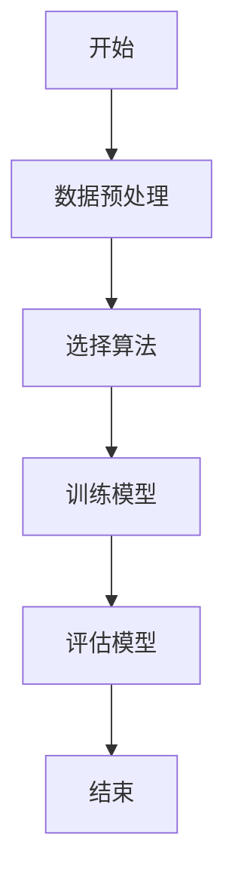

                 


# 个人财务健康评分系统设计

> 关键词：个人财务健康评分系统，财务评分模型，评分算法，系统架构设计，Python实现

> 摘要：本文详细探讨了个人财务健康评分系统的设计与实现。从背景与概念出发，深入分析了评分模型的核心要素与算法原理，结合系统架构设计与项目实战，给出了完整的解决方案。文章还提供了最佳实践、注意事项与拓展阅读建议，帮助读者全面理解和应用该系统。

---

# 第一部分: 背景与概念

# 第1章: 个人财务健康评分系统背景与意义

## 1.1 问题背景

### 1.1.1 个人财务管理的重要性

现代生活中，个人财务管理变得越来越复杂。随着收入来源多样化、支出项目增加，个人需要有效管理财务状况，以确保财务安全和实现财务目标。然而，许多人缺乏专业的财务知识，难以准确评估自己的财务健康状况。

### 1.1.2 财务健康评分的定义与目标

财务健康评分是通过量化指标，评估个人或家庭的财务状况健康程度的一种方法。其目标是帮助用户清晰了解自身财务状况，提供改善建议，并为金融机构提供风险评估依据。

### 1.1.3 当前现状与发展趋势

随着大数据和人工智能技术的发展，个人财务评分系统逐渐从简单的财务指标分析，向智能化、个性化方向发展。通过机器学习算法，系统能够更精准地评估财务健康状况。

## 1.2 核心概念与边界

### 1.2.1 核心概念

财务健康评分系统通过收集和分析用户的收入、支出、资产和负债等数据，结合评分模型，生成一个综合评分，反映用户的财务健康状况。评分模型通常包括多个指标，每个指标赋予不同的权重，最终计算出综合评分。

### 1.2.2 系统边界

财务健康评分系统的边界包括输入数据的范围、评分模型的适用场景以及系统的功能范围。系统通常不涉及具体的投资建议或税务筹划，而是专注于财务健康状况的评估。

## 1.3 章节小结

本章介绍了个人财务健康评分系统的重要性、核心概念和边界，为后续章节奠定了基础。

---

# 第2章: 财务健康评分的核心要素

## 2.1 收入与支出分析

### 2.1.1 收入稳定性

收入稳定性是评估财务健康的重要指标。收入波动大的用户，其财务风险较高。系统通过分析用户的收入来源和稳定性，评估其收入的可靠性。

### 2.1.2 支出合理性

支出合理性是指用户的支出是否与其收入相匹配。系统通过分析用户的日常支出、储蓄率和债务情况，评估其支出的合理性。

## 2.2 资产与负债评估

### 2.2.1 资产配置

资产配置是指用户在不同资产类别（如现金、股票、房地产等）上的分配情况。合理的资产配置能够降低风险，提高收益。

### 2.2.2 负债情况

负债情况包括用户的贷款、信用卡欠款等。系统通过分析用户的负债率和偿债能力，评估其财务负担是否合理。

## 2.3 财务目标与规划

### 2.3.1 财务目标设定

用户需要设定明确的财务目标，如买房、子女教育、退休计划等。系统通过分析用户的目标与当前财务状况，评估其实现目标的可能性。

### 2.3.2 财务规划合理性

财务规划合理性是指用户的财务计划是否可行。系统通过分析用户的储蓄、投资和支出计划，评估其财务规划的合理性。

## 2.4 核心指标对比表

下表对比了不同财务指标的重要性及其权重：

| 指标 | 重要性 | 权重 |
|------|--------|------|
| 收入稳定性 | 高 | 30% |
| 支出合理性 | 中 | 25% |
| 资产配置 | 高 | 25% |
| 负债情况 | 中 | 15% |
| 财务目标与规划 | 中 | 5% |

## 2.5 本章小结

本章详细分析了财务健康评分的核心要素，包括收入与支出、资产与负债、财务目标与规划等方面，并通过对比表明确了各指标的权重。

---

# 第3章: 财务健康评分模型的设计与实现

## 3.1 模型选择与原理

### 3.1.1 线性回归模型

线性回归模型是一种常用的数据分析方法，适用于预测连续型变量。在财务评分系统中，线性回归可以用于预测用户的综合评分。

### 3.1.2 支持向量机模型

支持向量机（SVM）是一种监督学习算法，适用于分类和回归问题。在评分系统中，SVM可以用于对用户的财务状况进行分类，如健康、亚健康、不健康。

## 3.2 模型实现步骤

### 3.2.1 数据预处理

数据预处理是模型实现的重要步骤，包括数据清洗、特征提取和数据标准化。

```python
import pandas as pd
from sklearn.preprocessing import StandardScaler

# 数据加载
data = pd.read_csv('financial_data.csv')

# 数据清洗
data.dropna()

# 特征提取
X = data[['income', 'expenses', 'assets', ' liabilities']]

# 数据标准化
scaler = StandardScaler()
X_scaled = scaler.fit_transform(X)
```

### 3.2.2 模型训练

使用训练数据对模型进行训练，调整模型参数，使其达到最佳性能。

```python
from sklearn.linear_model import LinearRegression

# 模型训练
model = LinearRegression()
model.fit(X_scaled, data['score'])
```

### 3.2.3 模型评估

通过交叉验证和评估指标（如均方误差、R²）来评估模型的性能。

```python
from sklearn.metrics import mean_squared_error, r2_score

# 模型预测
predicted_score = model.predict(X_scaled)

# 模型评估
mse = mean_squared_error(data['score'], predicted_score)
r2 = r2_score(data['score'], predicted_score)

print(f'Mean Squared Error: {mse}')
print(f'R² Score: {r2}')
```

## 3.3 算法流程图



## 3.4 本章小结

本章详细介绍了财务健康评分模型的设计与实现，包括模型选择、数据预处理、模型训练和评估等步骤，并通过代码示例展示了实现过程。

---

# 第4章: 系统架构设计与实现

## 4.1 系统功能设计

### 4.1.1 用户界面

用户界面包括数据输入、评分结果展示和财务建议等功能。

### 4.1.2 后台处理

后台处理包括数据存储、模型调用和结果生成等功能。

## 4.2 系统架构图

```mermaid
graph LR
    User-->Input: 输入数据
    Input-->DataProcessing: 数据处理
    DataProcessing-->Model: 调用模型
    Model-->Result: 生成评分
    Result-->Output: 输出结果
```

## 4.3 接口设计

### 4.3.1 API接口

系统提供RESTful API接口，供其他系统调用。

### 4.3.2 数据接口

数据接口用于与第三方数据源（如银行、支付宝）进行数据交互。

## 4.4 本章小结

本章详细介绍了系统的架构设计与实现，包括功能设计、架构图和接口设计。

---

# 第5章: 项目实战与案例分析

## 5.1 项目环境安装

### 5.1.1 安装Python环境

使用Anaconda安装Python环境，并配置Jupyter Notebook。

```bash
conda install -n financial_score python=3.8
```

### 5.1.2 安装依赖库

安装所需的第三方库，如Pandas、Scikit-learn等。

```bash
pip install pandas scikit-learn
```

## 5.2 核心代码实现

### 5.2.1 数据加载与预处理

```python
import pandas as pd
from sklearn.preprocessing import StandardScaler

# 数据加载
data = pd.read_csv('financial_data.csv')

# 数据清洗
data = data.dropna()

# 特征提取
X = data[['income', 'expenses', 'assets', 'liabilities']]

# 数据标准化
scaler = StandardScaler()
X_scaled = scaler.fit_transform(X)
```

### 5.2.2 模型训练与评估

```python
from sklearn.linear_model import LinearRegression
from sklearn.metrics import mean_squared_error, r2_score

# 模型训练
model = LinearRegression()
model.fit(X_scaled, data['score'])

# 模型预测
predicted_score = model.predict(X_scaled)

# 模型评估
mse = mean_squared_error(data['score'], predicted_score)
r2 = r2_score(data['score'], predicted_score)

print(f'Mean Squared Error: {mse}')
print(f'R² Score: {r2}')
```

## 5.3 案例分析

### 5.3.1 案例一

假设用户A的收入为30000元，支出为15000元，资产为100000元，负债为30000元。系统生成的评分为75分，属于健康状态。

### 5.3.2 案例二

用户B的收入为20000元，支出为10000元，资产为50000元，负债为20000元。系统生成的评分为60分，属于亚健康状态。

## 5.4 本章小结

本章通过实际案例分析，展示了系统的功能与实现过程。

---

# 第6章: 最佳实践与注意事项

## 6.1 最佳实践

### 6.1.1 数据更新频率

建议定期更新财务数据，保持评分的准确性。

### 6.1.2 模型优化

根据用户反馈和数据变化，定期优化模型，提高评分准确性。

## 6.2 注意事项

### 6.2.1 数据隐私

在处理用户数据时，需严格遵守数据隐私保护规定，确保用户信息的安全。

### 6.2.2 模型局限性

评分模型可能存在局限性，如忽视某些特殊财务情况。用户需结合实际情况，综合评估财务健康状况。

## 6.3 拓展阅读

### 6.3.1 财务管理书籍

推荐阅读《富爸爸穷爸爸》等书籍，深入了解个人财务管理知识。

### 6.3.2 机器学习算法

深入学习机器学习算法，如随机森林、XGBoost等，提高模型性能。

## 6.4 本章小结

本章总结了系统的最佳实践、注意事项和拓展阅读建议，帮助用户更好地应用系统。

---

# 作者：AI天才研究院 & 禅与计算机程序设计艺术

---

通过以上目录，您可以逐步展开每个章节的内容，构建完整的个人财务健康评分系统设计方案。

