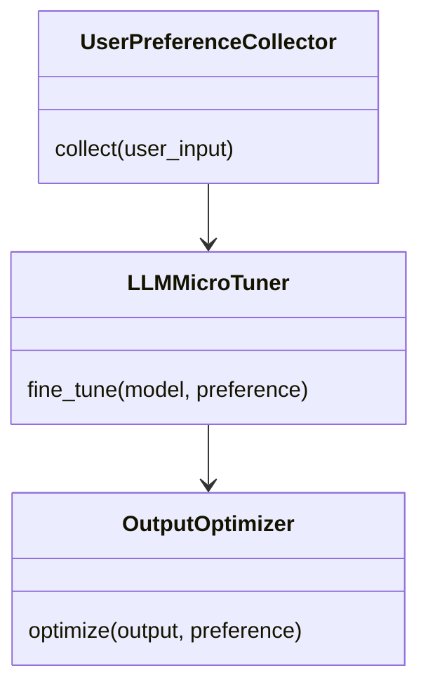
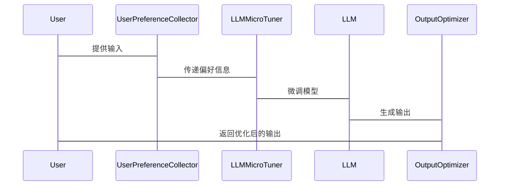

                 


---

# 《个性化AI Agent：根据用户偏好定制LLM》

> 关键词：个性化AI Agent，用户偏好，LLM，定制化，机器学习，人工智能，自然语言处理

> 摘要：个性化AI Agent是根据用户的具体需求和偏好定制大型语言模型（LLM）的关键技术。本文从背景、原理、算法、系统设计、项目实战到最佳实践，全面解析如何根据用户偏好定制LLM，涵盖从基础理论到实际应用的完整流程。

---

# 第一部分: 个性化AI Agent的背景与概念

## 第1章: 个性化AI Agent的背景介绍

### 1.1 问题背景与用户需求

#### 1.1.1 传统LLM的局限性
传统的大型语言模型（LLM）虽然在自然语言处理任务中表现出色，但存在以下问题：
- 输出结果缺乏针对性，无法完全满足用户的个性化需求。
- 无法根据用户的具体偏好动态调整输出内容。
- 对于特定领域或用户的独特需求，模型的适应性较弱。

#### 1.1.2 用户对个性化LLM的需求
用户对个性化LLM的需求主要体现在以下几个方面：
- 根据用户的语言习惯和风格生成更自然的文本。
- 根据用户的偏好调整模型输出的内容和语气。
- 在特定场景下（如医疗、法律、金融等）提供更精准的服务。

#### 1.1.3 个性化LLM的核心价值
个性化LLM的核心价值在于：
- 提高用户体验，使模型输出更贴近用户的实际需求。
- 提高模型的实用性，使其能够在更多场景下发挥作用。
- 为垂直领域提供更专业化的服务。

### 1.2 个性化LLM的技术基础

#### 1.2.1 大型语言模型（LLM）的概述
大型语言模型（LLM）是一种基于深度学习的自然语言处理模型，通常采用Transformer架构。其核心思想是通过自注意力机制（Self-Attention）捕捉文本中的长距离依赖关系，并通过解码器（Decoder）生成目标文本。

#### 1.2.2 个性化LLM的必要性
个性化LLM的必要性主要体现在以下几个方面：
- 用户需求的多样性：不同用户有不同的语言习惯和偏好。
- 任务的多样性：模型需要在多种场景下使用，如对话、文本生成、机器翻译等。
- 数据的多样性：用户提供的输入数据可能具有特定领域或风格的特点。

#### 1.2.3 用户偏好分析的挑战
用户偏好分析的挑战主要在于：
- 用户偏好的多样性和动态性：用户的偏好可能会随时间变化。
- 数据的稀疏性：某些用户的偏好可能无法通过数据充分反映。
- 数据隐私问题：用户偏好的分析需要处理敏感数据，需要注意隐私保护。

---

## 第2章: 个性化AI Agent的核心概念

### 2.1 个性化LLM的定义与特点

#### 2.1.1 个性化LLM的定义
个性化LLM是指根据用户的具体需求和偏好，对通用大型语言模型进行调整和优化，使其能够生成更符合用户期望的文本。

#### 2.1.2 个性化LLM的核心特点
个性化LLM的核心特点包括：
- **定制化**：根据用户需求调整模型的输出风格和内容。
- **动态性**：能够根据用户的实时反馈动态调整模型输出。
- **适应性**：能够在不同场景和领域中灵活应用。

#### 2.1.3 个性化LLM与通用LLM的对比
个性化LLM与通用LLM的主要区别在于：
- **目标**：通用LLM的目标是提高整体的自然语言处理能力，而个性化LLM的目标是根据用户需求生成更精准的输出。
- **输入**：个性化LLM需要额外的用户偏好信息作为输入。
- **输出**：个性化LLM的输出更贴近用户的特定需求。

### 2.2 用户偏好的建模与分析

#### 2.2.1 用户偏好的基本属性
用户偏好的基本属性包括：
- **语言风格**：如正式、口语化、简洁等。
- **主题倾向**：如偏好技术类、娱乐类、教育类等。
- **内容深度**：如浅显易懂或深度分析。

#### 2.2.2 用户偏好分析的数学模型
用户偏好分析的数学模型可以采用以下几种形式：
- **基于频率的模型**：通过统计用户输入文本中的关键词频率来推断用户的偏好。
- **基于概率的模型**：利用概率论的方法，如贝叶斯分类，对用户的偏好进行建模。
- **基于深度学习的模型**：如循环神经网络（RNN）或Transformer模型，用于捕捉用户的语言习惯和风格。

#### 2.2.3 用户偏好与LLM输出的关联
用户偏好与LLM输出的关联主要体现在以下几个方面：
- **语言风格**：模型生成的文本风格需要与用户的偏好一致。
- **内容方向**：模型生成的内容需要围绕用户的偏好主题展开。
- **反馈机制**：用户对模型输出的反馈可以用于进一步调整模型的输出偏好。

---

## 第3章: 个性化LLM的实现原理

### 3.1 LLM的内部工作机制

#### 3.1.1 注意力机制（Attention Mechanism）
注意力机制是Transformer模型的核心组件之一。其基本思想是计算输入序列中每个位置的权重，并根据权重生成输出。

公式表示为：
$$
\text{Attention}(Q, K, V) = \text{softmax}\left(\frac{QK^T}{\sqrt{d_k}}\right)V
$$

其中：
- $Q$ 是查询（Query）。
- $K$ 是键（Key）。
- $V$ 是值（Value）。
- $d_k$ 是键的维度。

#### 3.1.2 解码器结构（Decoder Structure）
解码器是Transformer模型中用于生成目标文本的组件。其主要由自注意力机制（Self-Attention）和前馈神经网络（FFN）组成。

#### 3.1.3 激励函数的作用
激励函数的作用是将模型的输出映射到一个特定的范围，如ReLU函数将输出映射到非负数范围。

### 3.2 个性化LLM的实现原理

#### 3.2.1 用户偏好分析模块
用户偏好分析模块的主要功能是根据用户的输入数据（如文本、行为数据等）推断出用户的偏好。

#### 3.2.2 LLM微调模块
LLM微调模块是对通用LLM进行调整，使其能够根据用户的偏好生成更精准的输出。

#### 3.2.3 输出优化模块
输出优化模块是对模型生成的文本进行进一步优化，以确保其符合用户的偏好。

---

## 第4章: 个性化LLM的算法与实现

### 4.1 基于用户反馈的LLM微调算法

#### 4.1.1 反馈机制
用户反馈机制是指根据用户的实时反馈调整模型的输出偏好。具体步骤如下：
1. 用户输入查询。
2. 模型生成输出。
3. 用户对输出进行反馈（如评分、选择偏好选项）。
4. 根据反馈调整模型参数。

#### 4.1.2 强化学习算法
强化学习是一种通过奖励机制优化模型行为的算法。在个性化LLM中，可以利用强化学习对模型的输出进行优化。

#### 4.1.3 算法实现
以下是一个基于用户反馈的强化学习算法的伪代码示例：

```python
def train_model(user_feedback):
    for epoch in epochs:
        for batch in batches:
            input = generate_input(batch)
            output = model.generate(input)
            reward = calculate_reward(output, user_feedback)
            update_model_parameters(reward)
    return model
```

---

## 第5章: 系统分析与架构设计

### 5.1 系统功能设计

#### 5.1.1 用户偏好收集模块
用户偏好收集模块的主要功能是收集用户的偏好信息，如语言风格、主题倾向等。

#### 5.1.2 LLM微调模块
LLM微调模块是对通用LLM进行微调，使其能够根据用户偏好生成更精准的输出。

#### 5.1.3 输出优化模块
输出优化模块是对模型生成的文本进行进一步优化，确保其符合用户的偏好。

### 5.2 系统架构设计

#### 5.2.1 系统类图
以下是一个系统类图的Mermaid示例：



#### 5.2.2 系统交互图
以下是一个系统交互图的Mermaid示例：



---

## 第6章: 项目实战与案例分析

### 6.1 项目实战

#### 6.1.1 环境安装
以下是安装Python和相关库的代码示例：

```python
pip install torch transformers
```

#### 6.1.2 核心代码实现
以下是一个基于用户反馈的微调算法的Python代码示例：

```python
import torch
from transformers import AutoTokenizer, AutoModelForCausalLM

def fine_tune(model, tokenizer, preference, num_epochs=1):
    optimizer = torch.optim.Adam(model.parameters(), lr=1e-5)
    for epoch in range(num_epochs):
        for batch in batches:
            inputs = tokenizer(batch, return_tensors="pt")
            outputs = model.generate(inputs.input_ids, max_length=50)
            # 根据用户反馈调整模型参数
            loss = calculate_loss(outputs, preference)
            loss.backward()
            optimizer.step()
    return model
```

---

## 第7章: 最佳实践与总结

### 7.1 最佳实践

#### 7.1.1 关键点总结
- 在个性化LLM的设计中，用户偏好分析是关键。
- 模型微调和优化是实现个性化输出的核心。
- 反馈机制的引入能够显著提高模型的适应性。

#### 7.1.2 注意事项
- 数据隐私问题需要注意。
- 模型的实时性和响应速度可能会影响用户体验。
- 模型的泛化能力需要在微调过程中进行平衡。

#### 7.1.3 拓展阅读
- 《Attention Is All You Need》
- 《Transformers Are Universal》
- 《Fine-tuning LLMs for Specific Tasks》

### 7.2 小结

个性化LLM是一种能够根据用户偏好生成更精准文本的技术。通过本文的介绍，读者可以了解到个性化LLM的核心概念、实现原理以及实际应用。未来，随着技术的发展，个性化LLM将在更多领域展现出其巨大的潜力。

---

# 作者：AI天才研究院/AI Genius Institute & 禅与计算机程序设计艺术 /Zen And The Art of Computer Programming

---

以上是《个性化AI Agent：根据用户偏好定制LLM》的技术博客文章的完整目录大纲和部分核心内容。希望对您有所帮助！

