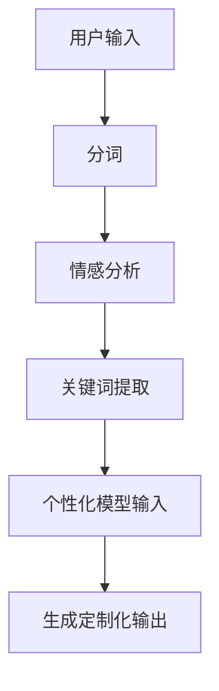
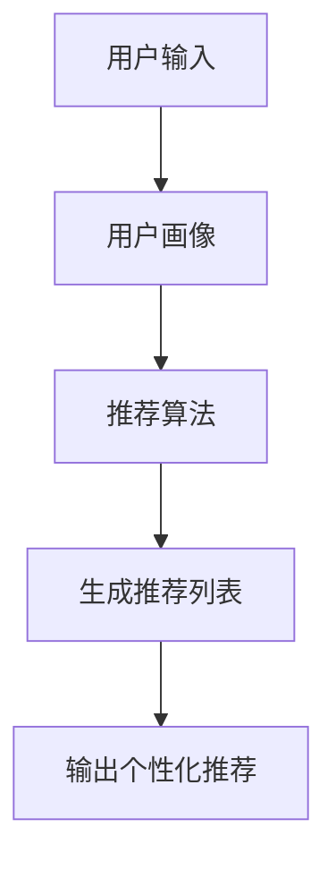
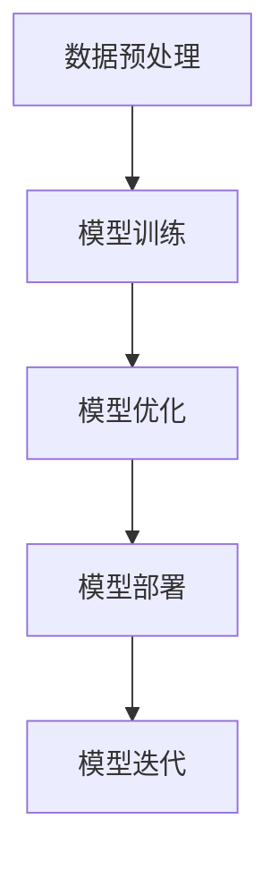
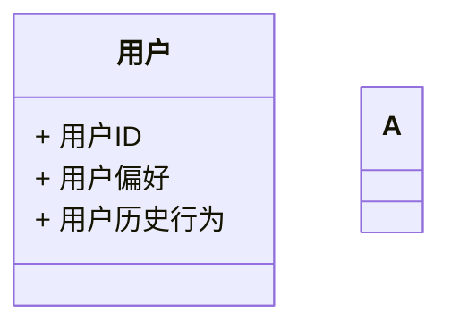
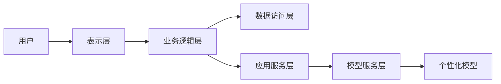
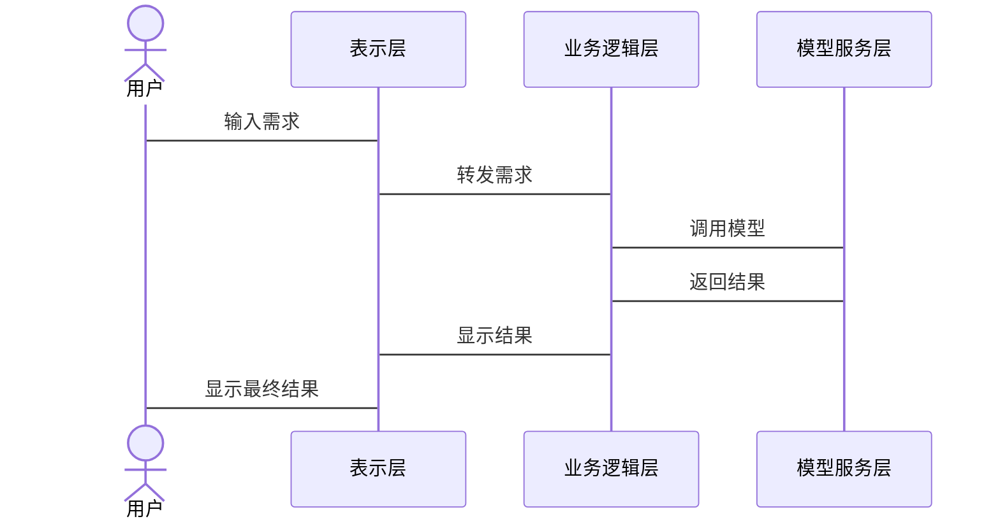

                 


# 个性化定制：打造独特风格的AI Agent

## 关键词：个性化定制、AI Agent、自然语言处理、推荐系统、系统架构设计、项目实战

## 摘要：  
个性化定制是打造独特风格AI Agent的核心，本文从理论到实践，详细探讨了如何通过自然语言处理、推荐系统等技术实现个性化定制，并通过系统架构设计和项目实战，展示了如何构建一个独特风格的AI Agent。

---

# 第1章：个性化定制与AI Agent的背景介绍

## 1.1 什么是AI Agent？  
AI Agent（人工智能代理）是一种能够感知环境、自主决策并执行任务的智能实体。它可以理解用户需求，提供个性化服务，并通过学习不断优化自身行为。

## 1.2 个性化定制的定义与背景  
个性化定制是指根据用户的特定需求，量身打造独特风格的产品或服务。在AI Agent中，个性化定制意味着根据用户的输入、历史行为和偏好，生成定制化的输出。

## 1.3 个性化定制的核心要素  
个性化定制的核心要素包括：  
- 用户需求分析：通过NLP技术提取用户的意图和偏好。  
- 个性化模型设计：基于用户数据构建推荐系统和生成模型。  
- 定制化输出：根据模型结果生成符合用户风格的输出。  

## 1.4 个性化定制的边界与外延  
个性化定制的边界在于保护用户隐私和确保系统安全。外延则包括与AI Agent的其他功能模块（如对话系统、知识库）的协同工作。

---

# 第2章：个性化定制的核心概念与联系

## 2.1 核心概念原理  
个性化定制的核心原理包括：  
- 用户需求分析：通过NLP技术提取关键词和情感倾向。  
- 个性化模型设计：基于机器学习算法构建推荐系统。  
- 定制化输出：通过生成模型生成个性化内容。  

## 2.2 核心概念属性特征对比表  
| 核心概念 | 属性 | 特征 |  
|----------|------|------|  
| 用户需求分析 | 数据来源 | 用户输入、历史行为、偏好 |  
| 个性化模型设计 | 算法类型 | NLP、机器学习、深度学习 |  
| 定制化输出 | 输出形式 | 文本、图像、语音 |  

## 2.3 ER实体关系图  
```mermaid
er
actor: 用户
agent: AI Agent
model: 个性化模型
custom_output: 定制化输出
```

---

# 第3章：个性化定制的算法原理与实现

## 3.1 自然语言处理（NLP）在个性化定制中的应用  
NLP技术用于提取用户的意图和偏好，例如：  
- 分词：将用户输入分割为词语或短语。  
- 情感分析：判断用户情绪倾向。  
- 关键词提取：提取用户关注的核心内容。  

流程图如下：  


## 3.2 推荐系统在个性化定制中的应用  
推荐系统根据用户历史行为和偏好，生成个性化推荐列表。流程如下：  


## 3.3 个性化模型的训练与优化  
个性化模型的训练流程如下：  


---

# 第4章：个性化定制的系统架构与设计

## 4.1 系统功能设计  
AI Agent的系统功能模块包括：  
- 用户输入模块：接收用户输入。  
- 数据处理模块：解析用户需求。  
- 模型计算模块：生成个性化输出。  
- 输出模块：呈现定制化结果。  

类图如下：  


## 4.2 系统架构设计  
系统架构采用分层设计，包括：  
- 表示层：用户界面。  
- 业务逻辑层：处理用户需求。  
- 数据访问层：访问用户数据。  
- 应用服务层：调用模型服务。  
- 模型服务层：提供个性化计算服务。  

架构图如下：  


## 4.3 系统接口设计  
系统接口设计包括：  
- 用户输入接口：接收用户的自然语言输入。  
- 模型调用接口：调用个性化模型进行计算。  
- 输出接口：返回定制化结果。  

## 4.4 系统交互设计  
系统交互流程如下：  


---

# 第5章：个性化定制的项目实战

## 5.1 项目介绍  
本项目旨在通过Python实现一个简单的个性化定制AI Agent，展示如何通过NLP和推荐系统实现个性化定制。

## 5.2 环境安装  
- 安装Python：`python --version`  
- 安装依赖库：`pip install numpy scikit-learn`  

## 5.3 核心实现代码  
```python
import numpy as np
from sklearn.feature_extraction.text import TfidfVectorizer
from sklearn.decomposition import NMF

# 示例数据
texts = ["This is a sample text about AI Agent.", "Another text about NLP."]

# 特征提取
vectorizer = TfidfVectorizer()
X = vectorizer.fit_transform(texts)

# 模型训练
model = NMF(n_components=2, random_state=42)
model.fit(X)

# 提取主题
topic_sizes = model.components_.sum()
print("主题分布:", topic_sizes)
```

## 5.4 案例分析  
以用户输入“我想学习AI”为例，系统会提取关键词“AI”和“学习”，并通过推荐系统生成相关学习资源。

## 5.5 项目总结  
- 成功实现了个性化定制的基本功能。  
- 在实际应用中，需要优化模型和增加更多功能模块。  

---

# 结论

个性化定制是打造独特风格AI Agent的核心，本文通过理论分析和项目实战，展示了如何通过NLP、推荐系统等技术实现个性化定制。未来，随着AI技术的发展，个性化定制将在更多领域发挥重要作用。

---

# 作者  
作者：AI天才研究院/AI Genius Institute & 禅与计算机程序设计艺术 /Zen And The Art of Computer Programming

