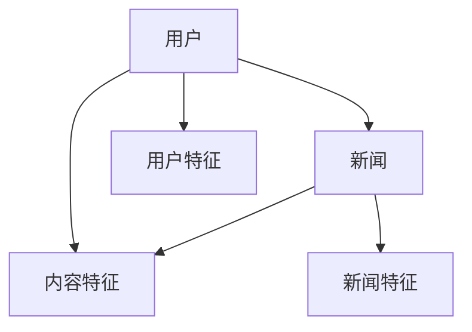
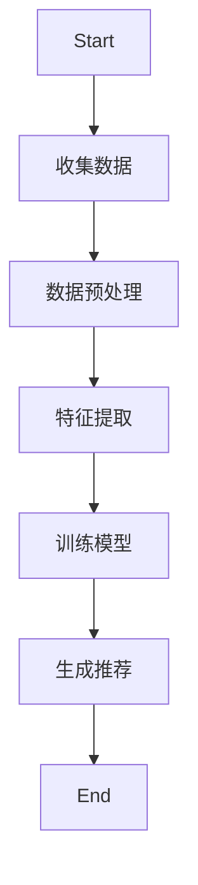
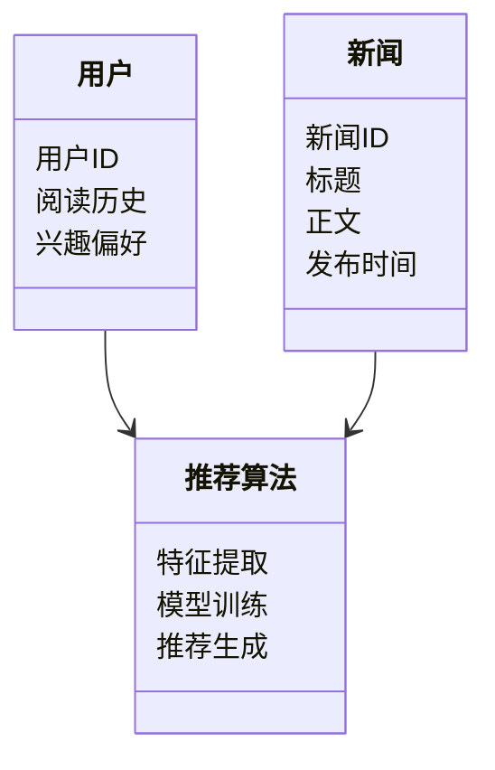
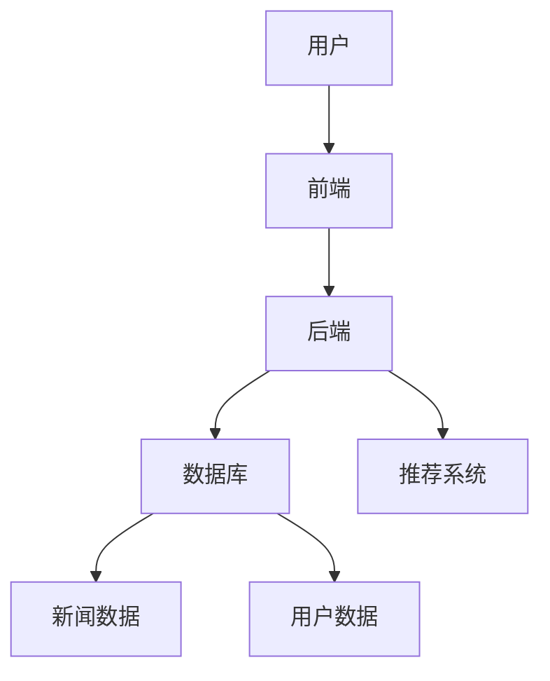

                 


# 个性化新闻推送：AI Agent的内容筛选

## 关键词：个性化新闻推送，AI Agent，内容筛选，推荐算法，用户特征，自然语言处理

## 摘要：个性化新闻推送是通过AI Agent对新闻内容进行智能化筛选和推荐的过程。本文详细分析了AI Agent在内容筛选中的核心概念、算法原理、系统架构，并结合实际案例，探讨了如何利用自然语言处理和用户行为分析实现精准的新闻推荐。

---

# 第一部分: 个性化新闻推送的背景与概念

## 第1章: 个性化新闻推送的背景与问题背景

### 1.1 个性化新闻推送的背景

#### 1.1.1 传统新闻推送的局限性
传统新闻推送通常基于固定的分类标签（如体育、娱乐、科技）进行内容筛选，无法满足用户的个性化需求。用户可能只对特定领域感兴趣，而传统推送方式缺乏灵活性。

#### 1.1.2 个性化推送的需求驱动
随着用户对信息获取的需求日益多样化，个性化新闻推送成为提升用户体验的重要手段。用户希望看到与自己兴趣相关的内容，而非泛泛而谈的通用新闻。

#### 1.1.3 AI技术在新闻推送中的应用
AI技术（特别是机器学习和自然语言处理）为个性化新闻推送提供了技术支持。通过分析用户的阅读历史、行为数据和新闻内容，AI Agent能够实现精准的内容筛选和推荐。

### 1.2 个性化新闻推送的核心问题

#### 1.2.1 用户需求的多样性
每个用户的兴趣点可能完全不同，如何准确识别并满足这些需求是个性化新闻推送的核心挑战。

#### 1.2.2 内容筛选的复杂性
新闻内容可能涉及多个主题和情感倾向，如何有效提取内容特征并匹配用户需求是技术难点。

#### 1.2.3 推送效果的评估与优化
如何衡量推送内容的效果（如点击率、用户留存率）并进行实时优化是个性化新闻推送的关键问题。

### 1.3 个性化新闻推送的边界与外延

#### 1.3.1 边界：推送的内容范围
个性化新闻推送主要关注新闻内容的筛选和推荐，其边界包括内容的来源、类型和推送频率。

#### 1.3.2 外延：推送的场景与用户群体
个性化新闻推送可以应用于多个场景（如新闻客户端、社交媒体、邮件订阅），针对不同用户群体（如年轻人、中老年）提供定制化服务。

#### 1.3.3 核心要素：用户特征、内容特征、推送策略
个性化新闻推送的核心要素包括用户的兴趣偏好、新闻内容的特征（如关键词、主题）、以及推送策略（如协同过滤、深度学习模型）。

### 1.4 本章小结
个性化新闻推送的目标是通过AI技术实现精准的内容筛选和推荐，解决传统推送方式的局限性，满足用户的多样化需求。

---

# 第二部分: AI Agent在内容筛选中的核心概念

## 第2章: AI Agent的基本原理与核心概念

### 2.1 AI Agent的基本原理

#### 2.1.1 什么是AI Agent
AI Agent（智能体）是一种能够感知环境并采取行动以实现目标的智能系统。在新闻推送场景中，AI Agent通过分析用户行为和内容特征，生成个性化推荐。

#### 2.1.2 AI Agent的核心功能
- 数据收集与分析：收集用户的阅读历史、点击行为、偏好信息。
- 内容特征提取：通过NLP技术提取新闻内容的关键词、主题、情感倾向。
- 推送决策：基于用户特征和内容特征，匹配推送内容。

#### 2.1.3 AI Agent与传统算法的区别
AI Agent不仅仅是算法的实现，它是一个动态优化的系统，能够根据实时数据调整推荐策略。

### 2.2 内容筛选的核心概念

#### 2.2.1 内容特征提取
通过NLP技术提取新闻内容的关键词、主题、情感倾向等特征，为内容匹配提供依据。

#### 2.2.2 用户特征分析
分析用户的阅读历史、点击行为、兴趣偏好，构建用户画像。

#### 2.2.3 内容与用户的匹配策略
基于用户特征和内容特征，采用协同过滤、深度学习模型等方法进行内容匹配。

### 2.3 AI Agent在内容筛选中的工作流程

#### 2.3.1 数据收集与预处理
收集用户行为数据（如点击、阅读时间）和新闻内容数据（如标题、正文），进行数据清洗和特征提取。

#### 2.3.2 特征提取与建模
通过NLP技术提取内容特征和用户特征，构建推荐模型（如协同过滤、深度学习模型）。

#### 2.3.3 内容匹配与推送决策
基于推荐模型生成推荐列表，并根据用户实时行为调整推送策略。

### 2.4 核心概念对比表

| 概念 | 属性 | 描述 |
|------|------|------|
| 内容特征 | 文本特征 | 包括关键词、主题、情感倾向等 |
| 用户特征 | 兴趣偏好 | 包括用户的阅读历史、点击行为等 |
| 匹配策略 | 算法模型 | 包括协同过滤、深度学习模型等 |

### 2.5 ER实体关系图



### 2.6 本章小结
AI Agent通过感知环境和动态调整策略，实现个性化新闻推送的核心目标。

---

# 第三部分: 个性化新闻推送的算法原理

## 第3章: 推荐算法原理与实现

### 3.1 协同过滤算法

#### 3.1.1 基于用户的协同过滤
基于用户的协同过滤通过分析用户的相似性，推荐相似用户的喜欢内容。

#### 3.1.2 基于物品的协同过滤
基于物品的协同过滤通过分析内容的相似性，推荐相关的内容。

#### 3.1.3 协同过滤的实现流程
1. 数据预处理：构建用户-内容矩阵。
2. 计算相似度：使用余弦相似度计算用户或内容的相似度。
3. 生成推荐列表：基于相似度排序，生成推荐内容。

#### 3.1.4 协同过滤的公式
$$相似度 = \frac{\sum_{i=1}^{n} (u_i - \bar{u})(v_i - \bar{v})}{\sqrt{\sum_{i=1}^{n} (u_i - \bar{u})^2} \cdot \sqrt{\sum_{i=1}^{n} (v_i - \bar{v})^2}}$$

### 3.2 深度学习模型

#### 3.2.1 基于神经网络的推荐模型
使用神经网络（如RNN、CNN）对新闻内容进行特征提取，并生成推荐列表。

#### 3.2.2 基于注意力机制的推荐模型
通过注意力机制，聚焦于重要的新闻内容特征，提升推荐的准确性。

#### 3.2.3 深度学习模型的实现流程
1. 数据预处理：将新闻内容转换为向量表示。
2. 模型训练：使用神经网络对内容特征进行学习。
3. 生成推荐列表：基于模型预测结果，生成推荐内容。

#### 3.2.4 深度学习模型的数学公式
$$p(y|c) = \sigma(w \cdot c + b)$$
其中，$c$ 是内容向量，$w$ 是权重，$b$ 是偏置，$\sigma$ 是sigmoid函数。

### 3.3 算法流程图



### 3.4 本章小结
个性化新闻推送的核心是推荐算法，协同过滤和深度学习模型是实现个性化推荐的两种主要方法。

---

# 第四部分: 个性化新闻推送的系统架构设计

## 第4章: 系统分析与架构设计方案

### 4.1 问题场景介绍

#### 4.1.1 用户场景
用户通过新闻客户端或网站查看新闻，系统根据用户行为和内容特征推荐相关新闻。

#### 4.1.2 系统功能
- 数据采集：收集用户行为和新闻内容数据。
- 特征提取：提取内容和用户特征。
- 推荐生成：基于推荐算法生成推荐列表。
- 推送展示：将推荐内容展示给用户。

### 4.2 领域模型设计



### 4.3 系统架构设计



### 4.4 接口设计

#### 4.4.1 API接口
- `/api/users`：获取用户信息
- `/api/news`：获取新闻内容
- `/api/recommend`：生成推荐列表

#### 4.4.2 接口交互流程
1. 用户请求推荐内容。
2. 前端调用推荐接口。
3. 后端调用推荐算法生成推荐列表。
4. 返回推荐结果。

### 4.5 本章小结
系统架构设计是实现个性化新闻推送的基础，需要合理设计数据流和接口交互。

---

# 第五部分: 个性化新闻推送的项目实战

## 第5章: 项目实战与案例分析

### 5.1 环境安装与配置

#### 5.1.1 Python环境
安装Python 3.x，确保安装了Pip。

#### 5.1.2 安装依赖库
使用Pip安装以下库：
- `numpy`
- `pandas`
- `scikit-learn`
- `nltk`

#### 5.1.3 环境配置
设置虚拟环境，确保所有依赖库版本一致。

### 5.2 核心代码实现

#### 5.2.1 数据预处理
```python
import pandas as pd
import numpy as np

def preprocess(data):
    # 假设data是一个包含用户行为和新闻内容的DataFrame
    # 提取用户ID和新闻ID
    users = data['user_id'].unique()
    news = data['news_id'].unique()
    return users, news
```

#### 5.2.2 特征提取
```python
from sklearn.feature_extraction.text import TfidfVectorizer

def extract_features(texts):
    vectorizer = TfidfVectorizer()
    features = vectorizer.fit_transform(texts)
    return features
```

#### 5.2.3 协同过滤实现
```python
from sklearn.metrics.pairwise import cosine_similarity

def collaborative_filtering(user_features, item_features):
    similarity = cosine_similarity(user_features, item_features)
    return similarity
```

### 5.3 代码应用解读

#### 5.3.1 数据预处理
用户ID和新闻ID的提取为后续的特征提取和模型训练提供了基础数据。

#### 5.3.2 特征提取
使用TF-IDF方法提取新闻内容的特征，为协同过滤提供向量表示。

#### 5.3.3 协同过滤实现
计算用户和新闻之间的相似度，生成推荐列表。

### 5.4 实际案例分析

#### 5.4.1 案例背景
假设用户A经常阅读科技新闻，系统通过协同过滤推荐与科技相关的新闻。

#### 5.4.2 案例分析
通过特征提取和相似度计算，系统推荐了与用户A兴趣相似的新闻。

### 5.5 本章小结
通过实际项目案例，展示了个性化新闻推送的实现过程和技术细节。

---

# 第六部分: 个性化新闻推送的最佳实践

## 第6章: 最佳实践与经验分享

### 6.1 小结

#### 6.1.1 核心知识点总结
- 用户特征提取
- 内容特征提取
- 推荐算法实现

#### 6.1.2 本章重点回顾
- 协同过滤和深度学习模型的应用
- 系统架构设计与实现
- 项目实战与案例分析

### 6.2 注意事项

#### 6.2.1 数据质量问题
确保数据的准确性和完整性，避免噪声数据影响推荐效果。

#### 6.2.2 模型调优
通过A/B测试和实时反馈优化推荐算法。

#### 6.2.3 用户隐私保护
确保用户数据的安全性和隐私性，遵守相关法律法规。

### 6.3 拓展阅读

#### 6.3.1 推荐系统领域
- 《推荐系统实践》
- 《机器学习实战》

#### 6.3.2 自然语言处理领域
- 《自然语言处理入门》
- 《深度学习自然语言处理》

### 6.4 本章小结
个性化新闻推送是一个复杂但有趣的领域，通过不断学习和实践，可以提升推荐系统的性能和用户体验。

---

# 作者：AI天才研究院 & 禅与计算机程序设计艺术

