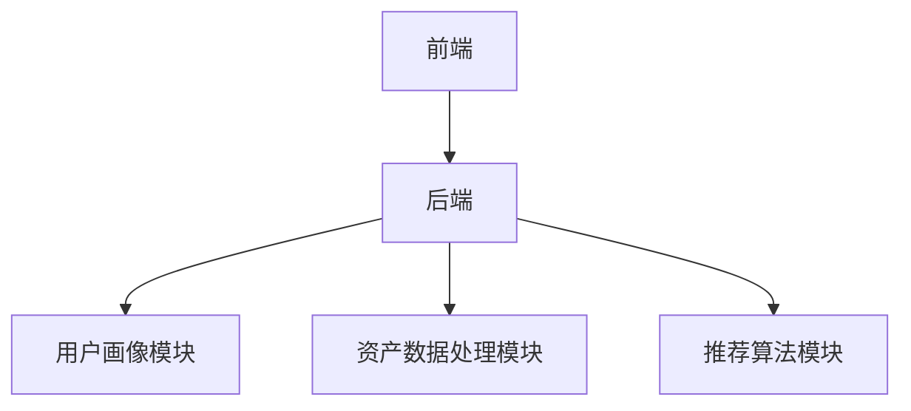

                 


# 个性化理财建议生成算法：原理与实现

---

**关键词**：个性化理财，算法，用户画像，理财目标，风险偏好，优化模型

**摘要**：个性化理财是现代金融领域的重要方向，通过算法生成个性化的理财建议可以帮助用户实现财富最大化。本文从个性化理财的核心概念出发，详细分析了算法的实现原理，包括用户画像、理财目标建模、风险偏好分析等关键步骤。同时，本文探讨了基于协同过滤和内容推荐的混合算法实现，并结合实际案例，详细讲解了系统设计与实现过程。最后，本文总结了个性化理财算法的应用前景，并提出了未来研究的方向。

---

# 第一部分: 个性化理财建议生成算法背景与核心概念

## 第1章: 个性化理财建议生成算法概述

### 1.1 个性化理财的背景与意义

个性化理财是指根据用户的财务状况、风险偏好、理财目标等因素，量身定制理财方案的过程。传统理财方式往往采用统一的策略，难以满足不同用户的需求。随着人工智能和大数据技术的发展，个性化理财逐渐成为现代金融的重要方向。

#### 1.1.1 传统理财方式的局限性

传统的理财方式通常基于固定的产品推荐，忽视了用户的个性化需求。例如，银行理财产品往往按照固定的风险等级进行分类，无法根据用户的实际需求动态调整推荐策略。

#### 1.1.2 个性化理财的需求驱动

随着用户对理财需求的多样化和个性化，传统的理财方式已无法满足市场需求。用户希望得到个性化的理财建议，以实现财富最大化和风险最小化。

#### 1.1.3 算法在个性化理财中的作用

算法在个性化理财中的作用主要体现在以下几个方面：
1. 数据收集与处理：通过收集用户的财务数据、行为数据等，构建用户画像。
2. 需求建模：将用户的理财需求转化为数学模型，以便算法处理。
3. 推荐策略优化：基于用户画像和需求模型，优化理财产品的推荐策略。

### 1.2 理财建议生成算法的核心问题

个性化理财建议生成算法的核心问题包括：
1. 用户需求的识别与建模。
2. 多目标优化问题的复杂性。
3. 数据驱动与模型驱动的结合。

### 1.3 算法实现的关键挑战

个性化理财算法的实现面临以下关键挑战：
1. 数据获取与处理的难度：用户数据的隐私性导致数据获取困难，且数据清洗和预处理需要大量工作。
2. 模型泛化能力的平衡：如何在保证模型准确性的前提下，提升模型的泛化能力。
3. 用户行为预测的不确定性：用户行为受到多种因素的影响，难以准确预测。

### 1.4 本章小结

本章主要介绍了个性化理财的背景与意义，分析了算法的核心问题和实现中的关键挑战，为后续章节的展开奠定了基础。

---

## 第2章: 个性化理财的核心概念与联系

### 2.1 用户画像与需求建模

用户画像是个性化理财的第一步，它通过收集用户的基本信息、财务状况、消费习惯等数据，构建用户的立体画像。

#### 2.1.1 用户画像的构建方法

用户画像是通过收集以下数据构建的：
1. 用户基本信息：年龄、性别、职业等。
2. 财务状况：收入、资产、负债等。
3. 消费习惯：消费金额、消费方式等。
4. 风险偏好：用户对风险的承受能力。

#### 2.1.2 需求建模的特征分析

需求建模需要对用户的需求进行深入分析，包括：
1. 理财目标：短期目标、中期目标、长期目标。
2. 风险偏好：保守型、稳健型、进取型。
3. 投资期限：长期投资、短期投资。

#### 2.1.3 用户画像与需求模型的关系

用户画像是需求模型的基础，需求模型是用户画像的延伸。需求模型基于用户画像中的特征，通过数学模型进行建模，为推荐算法提供依据。

### 2.2 理财目标与风险偏好分析

理财目标与风险偏好是个性化理财的核心要素，它们直接决定了理财方案的设计。

#### 2.2.1 理财目标的分类与层次

理财目标可以分为以下几类：
1. 短期目标：应急资金、短期投资。
2. 中期目标：购房、购车、旅游等。
3. 长期目标：退休计划、遗产规划。

#### 2.2.2 风险偏好的量化方法

风险偏好可以通过以下方式量化：
1. 风险承受能力：根据用户的财务状况和心理承受能力，量化其风险偏好。
2. 风险评估问卷：通过问卷调查的方式，评估用户的风险偏好。

#### 2.2.3 目标与偏好的关联分析

理财目标与风险偏好密切相关。例如，长期目标通常需要较高的风险承受能力，而短期目标则需要较低的风险偏好。

### 2.3 个性化理财算法的核心要素

个性化理财算法的核心要素包括：
1. 数据源的多样性。
2. 算法的可解释性。
3. 推荐结果的动态调整能力。

### 2.4 核心概念的ER实体关系图

以下是一个简单的ER实体关系图，展示了用户、资产和推荐的关系：

```mermaid
er
    User {
        id
        name
        age
        income
        riskPreference
    }
    Asset {
        id
        name
        type
        riskLevel
        returnRate
    }
    Recommendation {
        id
        userId
        assetId
        recommendationScore
    }
```

### 2.5 本章小结

本章详细介绍了个性化理财的核心概念，包括用户画像、需求建模、理财目标与风险偏好分析等内容，并通过ER图展示了核心概念之间的关系。

---

## 第3章: 个性化理财建议生成算法原理

### 3.1 基于用户画像的推荐算法

推荐算法是个性化理财的核心，常用的推荐算法包括协同过滤和内容推荐。

#### 3.1.1 基于协同过滤的推荐

协同过滤是一种基于用户相似性推荐算法，主要包括以下步骤：
1. 计算用户相似性：基于用户的购买记录、浏览记录等数据，计算用户的相似性。
2. 生成推荐列表：根据相似用户的偏好，推荐相似的理财产品。

#### 3.1.2 基于内容的推荐

内容推荐是一种基于产品特征的推荐算法，主要包括以下步骤：
1. 提取产品特征：提取理财产品的特征，如风险等级、收益类型等。
2. 计算相似度：根据用户的偏好，推荐相似的产品。

#### 3.1.3 混合推荐模型的构建

混合推荐模型结合了协同过滤和内容推荐的优点，具有较高的准确性和多样性。

### 3.2 理财目标优化的数学模型

理财目标优化可以通过数学模型实现，常用的方法包括线性规划和非线性规划。

#### 3.2.1 多目标优化的数学表达

多目标优化的数学表达如下：
$$ \min_w \sum_{i=1}^n \lambda_i f_i(w) $$
其中，$w$ 是优化变量，$f_i(w)$ 是目标函数，$\lambda_i$ 是权重系数。

#### 3.2.2 基于拉格朗日乘数的优化方法

拉格朗日乘数法是一种常用的优化方法，适用于有约束条件的优化问题。

### 3.3 风险控制与收益平衡的数学公式

风险控制与收益平衡可以通过以下公式实现：
$$ \text{风险} = \text{标准差}(r) $$
$$ \text{收益} = \text{期望收益}(r) $$

### 3.4 本章小结

本章详细讲解了个性化理财建议生成算法的原理，包括推荐算法和优化模型，并通过数学公式和图表展示了算法的核心思想。

---

## 第4章: 系统分析与架构设计

### 4.1 问题场景介绍

个性化理财系统的应用场景包括银行、证券公司、第三方理财平台等。

### 4.2 系统功能设计

系统功能设计包括用户画像构建、资产数据处理、推荐算法实现等模块。

#### 4.2.1 用户画像构建模块

用户画像构建模块负责收集和处理用户数据，构建用户画像。

#### 4.2.2 资产数据处理模块

资产数据处理模块负责处理理财产品的数据，提取特征。

#### 4.2.3 推荐算法模块

推荐算法模块根据用户画像和资产数据，生成推荐列表。

### 4.3 系统架构设计

系统架构设计包括前端和后端两部分，前端负责用户交互，后端负责数据处理和算法实现。

#### 4.3.1 系统架构图

以下是一个简单的系统架构图：



### 4.4 系统接口设计

系统接口设计包括用户登录、数据获取、推荐结果返回等接口。

### 4.5 系统交互序列图

以下是一个简单的系统交互序列图：

```mermaid
sequenceDiagram
    user ->+> 系统: 登录
    系统 ->+> 用户: 登录成功
    user ->+> 系统: 请求推荐
    系统 ->+> 用户: 返回推荐列表
```

### 4.6 本章小结

本章详细介绍了个性化理财系统的架构设计和接口设计，为后续的实现奠定了基础。

---

## 第5章: 项目实战

### 5.1 环境安装

个性化理财系统的开发需要以下环境：
1. Python 3.8+
2. 数据库：MySQL
3. 开发工具：PyCharm

### 5.2 系统核心实现源代码

以下是一个简单的推荐算法实现代码：

```python
def user_based_collaborative_filtering(user_id, user_similarity):
    similar_users = user_similarity[user_id].sort_values(ascending=False)
    recommended_assets = []
    for user in similar_users.index:
        recommended_assets.extend(recommendations[user])
    return recommended_assets
```

### 5.3 代码应用解读与分析

代码解读：
1. `user_based_collaborative_filtering` 函数实现了基于用户的协同过滤算法。
2. `user_similarity` 是用户相似性矩阵。
3. `recommendations` 是推荐列表。

### 5.4 实际案例分析

以下是一个实际案例分析：
1. 用户画像是一个30岁的上班族，收入稳定，风险偏好为稳健型。
2. 根据协同过滤算法，推荐低风险、中等收益的理财产品。

### 5.5 本章小结

本章通过实际案例，详细讲解了个性化理财系统的实现过程。

---

## 第6章: 总结与展望

### 6.1 本章总结

个性化理财算法通过用户画像和需求建模，结合推荐算法和优化模型，为用户提供个性化的理财建议。

### 6.2 未来研究方向

未来的研究方向包括：
1. 更加复杂的优化模型。
2. 更加智能化的推荐算法。
3. 数据隐私保护。

### 6.3 最佳实践 tips

1. 数据隐私保护是个性化理财系统的重要组成部分。
2. 算法的可解释性是用户信任的重要基础。
3. 系统的动态调整能力是实现个性化理财的核心。

### 6.4 本章小结

本章总结了个性化理财算法的应用前景，并提出了未来的研究方向。

---

**作者：AI天才研究院/AI Genius Institute & 禅与计算机程序设计艺术 /Zen And The Art of Computer Programming**

