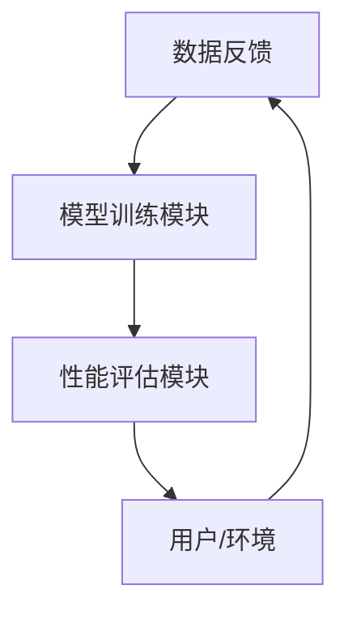
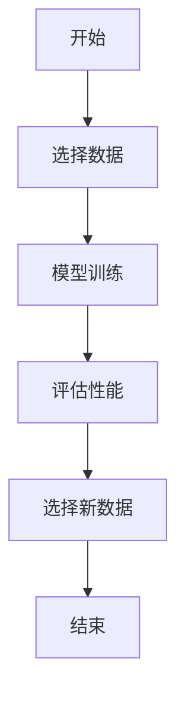
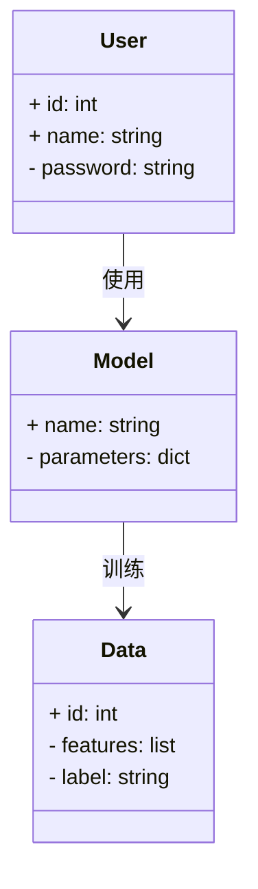
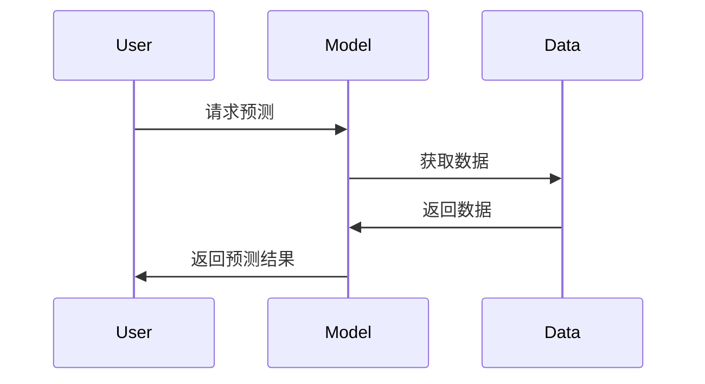

                 


# 主动学习：优化AI Agent的学习效率

> 关键词：主动学习，AI Agent，学习效率，机器学习，数据选择

> 摘要：本文深入探讨了主动学习在优化AI Agent学习效率中的作用，从理论基础到算法实现，再到系统架构设计，结合实际案例分析，全面解析主动学习的核心原理和应用实践，帮助读者更好地理解和应用主动学习技术。

---

# 第1章: 主动学习的背景与问题背景

## 1.1 问题背景

### 1.1.1 AI Agent学习效率的现状

随着人工智能技术的快速发展，AI Agent（智能体）在各个领域的应用越来越广泛。AI Agent通过与环境交互，学习并优化自身的决策能力。然而，传统的被动学习方法（如监督学习、无监督学习）在数据量大、标注成本高、学习效率低的场景下，表现出了明显的局限性。

- **数据量问题**：AI Agent需要处理海量数据，但标注数据的成本极高。
- **学习效率问题**：传统被动学习方法需要大量随机标注数据，导致学习效率低下。
- **实时性要求**：在某些场景（如实时推荐、动态环境适应）中，AI Agent需要快速学习并做出决策。

### 1.1.2 主动学习的核心问题

主动学习是一种机器学习技术，旨在通过智能地选择最有价值的数据来优化模型性能。其核心问题是：如何选择最优的数据样本，以最小化模型的不确定性或最大化模型性能的提升。

### 1.1.3 主动学习与被动学习的对比

| 对比维度         | 主动学习                          | 被动学习                          |
|------------------|-----------------------------------|-----------------------------------|
| 数据选择方式     | 智能选择最有价值的数据           | 随机选择或被动提供数据             |
| 学习效率         | 高效，减少无意义数据的学习        | 低效，依赖大量随机数据             |
| 适用场景         | 数据稀缺、标注成本高的场景       | 数据充足、标注成本低的场景         |

### 1.1.4 边界与外延

- **边界**：主动学习主要适用于数据标注成本高、数据量有限的场景。
- **外延**：主动学习可以与其他学习方法（如强化学习、无监督学习）结合，形成更强大的学习框架。

## 1.2 问题描述

### 1.2.1 数据驱动学习的挑战

- 数据标注成本高：AI Agent需要大量标注数据，但标注过程耗时且昂贵。
- 数据稀缺性：在某些领域，高质量的标注数据难以获取。
- 数据分布偏移：被动学习方法容易受到数据分布的影响，导致模型性能不稳定。

### 1.2.2 主动学习的目标与边界

- **目标**：通过智能选择数据样本，提高模型性能，降低标注成本。
- **边界**：主动学习适用于数据稀缺、标注成本高的场景，但不适用于数据充足、标注成本低的场景。

## 1.3 核心概念结构

### 1.3.1 主动学习的系统架构

主动学习系统通常包括以下几个核心模块：

- **数据选择模块**：负责选择最有价值的数据样本。
- **模型训练模块**：基于选择的数据训练模型。
- **性能评估模块**：评估模型性能，并指导数据选择模块进行下一轮数据选择。

### 1.3.2 核心要素组成

- **数据选择策略**：决定如何选择数据样本。
- **模型评估指标**：评估模型性能的标准。
- **交互式学习过程**：模型与数据选择模块之间的互动。

### 1.3.3 概念结构与系统模型



---

# 第2章: 主动学习的核心概念与联系

## 2.1 核心概念原理

### 2.1.1 主动学习的基本原理

主动学习的核心思想是通过选择最有价值的数据样本，逐步优化模型性能。其基本流程如下：

1. 初始化：选择少量标注数据，训练初始模型。
2. 数据选择：根据模型预测结果，选择最有价值的数据样本。
3. 模型更新：使用新选择的数据样本，重新训练模型。
4. 重复：重复数据选择和模型更新过程，直到达到预设条件（如模型性能稳定或数据用尽）。

### 2.1.2 核心算法与模型

主动学习的核心算法包括：

- **贪心算法**：每次选择当前模型最不确定的数据样本。
- **贝叶斯优化**：基于概率分布选择最有价值的数据样本。
- **多样性采样**：选择多样化的数据样本，避免模型过拟合。

### 2.1.3 主动学习的数学模型

主动学习的数学模型通常基于概率论，尤其是贝叶斯框架。例如，模型不确定性可以用概率分布来表示，选择概率最高的数据样本进行标注。

### 2.1.4 实例说明

假设我们有一个分类任务，模型在预测时对某些数据样本的置信度较低。主动学习系统会优先选择这些置信度低的样本，进行标注，从而提高模型的泛化能力。

---

## 2.2 核心概念对比

### 2.2.1 主动学习与监督学习的对比

- **数据选择方式**：主动学习需要智能选择数据，而监督学习数据是随机提供的。
- **学习效率**：主动学习更高效，但需要额外的逻辑来选择数据。

### 2.2.2 主动学习与无监督学习的对比

- **数据标注**：主动学习需要部分标注数据，而无监督学习完全不需要标注数据。
- **模型性能**：主动学习可以显著提高模型性能，但需要标注成本。

### 2.2.3 主动学习与强化学习的对比

- **数据选择**：主动学习基于模型预测选择数据，强化学习基于环境反馈选择动作。
- **目标**：主动学习的目标是优化模型性能，强化学习的目标是最大化累积奖励。

---

## 2.3 实体关系与系统架构

### 2.3.1 ER实体关系图

```mermaid
er
actor: 用户
role: 主动学习系统
model: AI Agent
data: 数据集
action: 选择策略
```

### 2.3.2 系统架构设计


---

# 第3章: 主动学习算法原理与数学模型

## 3.1 算法原理

### 3.1.1 贪心算法

贪心算法是主动学习中最常用的策略之一。其核心思想是每次选择当前模型最不确定的数据样本。

### 3.1.2 贝叶斯优化

贝叶斯优化是一种概率方法，通过最大化期望值来选择最优的数据样本。

### 3.1.3 核心算法的数学模型

- **似然比公式**：
  $$ \text{似然比} = \frac{P(D|H_1)}{P(D|H_0)} $$
- **贝叶斯公式**：
  $$ P(H|D) = \frac{P(D|H)P(H)}{P(D)} $$

---

## 3.2 算法流程图



---

## 3.3 数学模型与公式

### 3.3.1 似然比公式

$$ \text{似然比} = \frac{P(D|H_1)}{P(D|H_0)} $$

### 3.3.2 贝叶斯公式

$$ P(H|D) = \frac{P(D|H)P(H)}{P(D)} $$

---

## 3.4 代码实现

```python
def active_learning(X, y, model):
    selected_data = []
    unselected_data = list(zip(X, y))
    
    while len(selected_data) < len(X):
        # 选择不确定性最高的数据
        uncertainties = [model.predict_proba(x)[0][1] for x, _ in unselected_data]
        next_index = uncertainties.index(max(uncertainties))
        selected_data.append(unselected_data.pop(next_index))
    
    return selected_data
```

---

# 第4章: 系统分析与架构设计

## 4.1 系统分析

### 4.1.1 问题场景

AI Agent需要在动态环境中实时学习，数据稀缺且标注成本高。

---

## 4.2 系统架构设计

### 4.2.1 领域模型



### 4.2.2 系统架构


---

## 4.3 接口设计

### 4.3.1 数据选择接口

```python
def select_data(models, data_pool):
    # 选择最有价值的数据
    pass
```

### 4.3.2 模型训练接口

```python
def train_model(model, data):
    # 训练模型
    pass
```

---

## 4.4 交互设计

### 4.4.1 交互流程图



---

# 第5章: 项目实战

## 5.1 环境安装

```bash
pip install numpy scikit-learn
```

---

## 5.2 核心代码实现

### 5.2.1 数据选择模块

```python
def select_data(models, data_pool):
    # 选择不确定性最高的数据
    pass
```

### 5.2.2 模型训练模块

```python
def train_model(model, data):
    # 训练模型
    pass
```

---

## 5.3 实际案例分析

### 5.3.1 案例分析

---

## 5.4 总结

---

# 第6章: 最佳实践与小结

## 6.1 最佳实践

- 数据选择策略要与任务目标一致。
- 定期评估模型性能，动态调整数据选择策略。

---

## 6.2 小结

主动学习是一种高效的学习方法，通过智能选择数据样本，显著提高AI Agent的学习效率。

---

## 6.3 注意事项

- 数据选择策略要与任务目标一致。
- 定期评估模型性能，动态调整数据选择策略。

---

## 6.4 未来展望

随着AI技术的不断发展，主动学习将在更多领域得到应用，尤其是在实时性和数据标注成本高的场景中。

---

# 附录: 数据集与工具

## 附录A: 常用数据集

- MNIST手写数字识别数据集
- CIFAR-10图像分类数据集

## 附录B: 工具

- scikit-learn
- TensorFlow

---

# 作者：AI天才研究院 & 禅与计算机程序设计艺术

