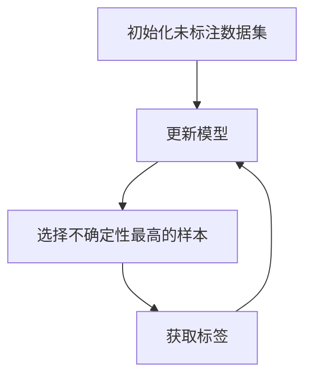
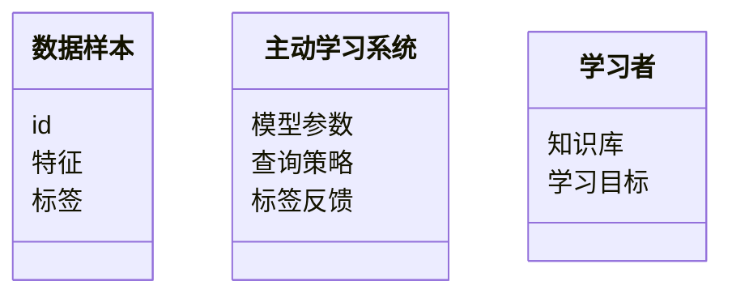
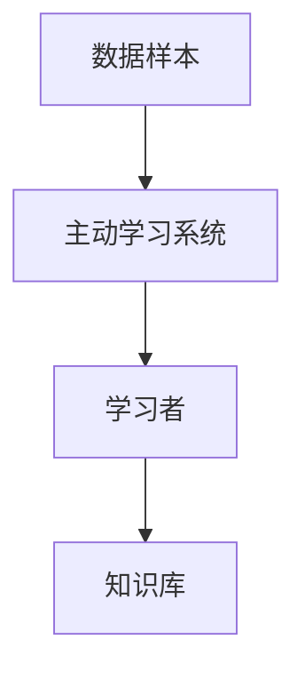
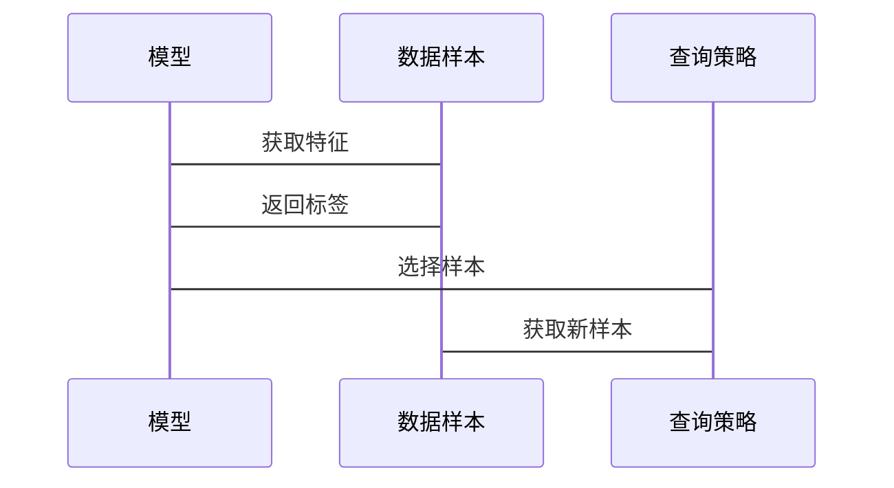

                 


```markdown
# 主动学习：优化AI Agent的学习效率

> 关键词：主动学习、AI Agent、机器学习、数据效率、优化策略、算法原理、系统设计

> 摘要：本文深入探讨了主动学习在优化AI Agent学习效率中的关键作用。通过分析主动学习的核心概念、算法原理和系统架构，结合实际项目案例，详细阐述了如何通过主动学习提升AI Agent的学习效率和性能。文章最后总结了主动学习的优势、注意事项及未来发展方向。

---

## 第一部分: 主动学习基础

## 第1章: 主动学习概述

### 1.1 主动学习的基本概念
#### 1.1.1 什么是主动学习
主动学习是一种机器学习范式，与传统的监督学习不同，它允许模型主动选择最具代表性的样本进行学习，从而提高学习效率和准确性。

#### 1.1.2 主动学习的核心思想
主动学习的核心思想是通过智能选择数据样本，减少需要标注的数据量，同时提高模型的性能。

#### 1.1.3 主动学习与监督学习的区别
| 方面 | 主动学习 | 监督学习 |
|------|----------|----------|
| 数据标注 | 需要标注少量数据 | 需要标注大量数据 |
| 学习效率 | 高 | 低 |
| 适用场景 | 数据稀缺或标注成本高 | 数据充足且标注成本低 |

---

### 1.2 主动学习的问题背景
#### 1.2.1 数据标注的挑战
标注数据需要大量的人力和时间，尤其是在处理复杂任务时，标注成本急剧增加。

#### 1.2.2 数据稀缺性问题
在某些领域，高质量的数据可能非常稀缺，传统的监督学习在这种情况下表现不佳。

#### 1.2.3 优化学习效率的需求
随着AI Agent应用场景的扩展，优化学习效率的需求日益迫切，尤其是在实时性和资源受限的环境中。

---

### 1.3 主动学习的应用场景
#### 1.3.1 自然语言处理中的应用
在文本分类、问答系统等领域，主动学习可以显著减少需要标注的样本数量。

#### 1.3.2 计算机视觉中的应用
在图像分类、目标检测等任务中，主动学习可以降低标注成本。

#### 1.3.3 机器人学习中的应用
在机器人导航和交互中，主动学习可以帮助机器人更快地适应新环境。

---

## 第2章: 主动学习的核心概念与联系

### 2.1 主动学习的原理
#### 2.1.1 不确定性采样
模型通过评估自身对样本的不确定性，选择不确定性最高的样本进行标注。

#### 2.1.2 查询策略
查询策略是主动学习的核心，决定了模型如何选择需要标注的样本。

#### 2.1.3 标签获取机制
标签获取机制是主动学习的实现关键，确保标注数据的质量和相关性。

---

### 2.2 核心概念对比表
| 方面 | 主动学习 | 被动学习 |
|------|----------|----------|
| 数据选择 | 主动选择 | 被动接受 |
| 数据量 | 小 | 大 |
| 学习效率 | 高 | 低 |

---

### 2.3 实体关系图
```mermaid
erd
    entity 数据样本 {
        id
        特征
        标签
    }
    entity 主动学习系统 {
        模型参数
        查询策略
        标签反馈
    }
    entity 学习者 {
        知识库
        学习目标
    }
```

---

## 第3章: 主动学习的算法原理

### 3.1 主动学习算法概述
#### 3.1.1 主动学习的基本流程
1. 初始化未标注数据集。
2. 模型在部分标注数据上进行训练。
3. 选择不确定性最高的样本进行标注。
4. 更新模型并重复上述步骤。

---

### 3.2 基于不确定性采样的主动学习算法
#### 3.2.1 不确定性度量方法
常用的方法包括基于概率的不确定性度量和基于模型输出置信度的方法。

#### 3.2.2 样本选择策略
选择不确定性最高的样本，减少需要标注的数据量。

#### 3.2.3 标签获取与模型更新
通过获取标签数据，更新模型参数，提高模型性能。

---

### 3.3 基于查询策略的主动学习算法
#### 3.3.1 查询策略的设计原则
查询策略应尽量减少标注成本，同时最大化信息增益。

#### 3.3.2 基于模型的查询策略
根据模型输出的概率分布，选择不确定性最高的样本。

#### 3.3.3 基于密度的查询策略
选择数据分布较稀疏的区域，确保数据的多样性。

---

### 3.4 算法流程图


---

### 3.5 算法实现代码
```python
import numpy as np
from sklearn.linear_model import LogisticRegression

def active_learning(X, y, n_initial=10, n_iterations=10):
    # 初始化标注数据
    idx = np.random.choice(len(X), n_initial)
    X_train = X[idx]
    y_train = y[idx]
    
    # 初始化模型
    model = LogisticRegression()
    model.fit(X_train, y_train)
    
    for _ in range(n_iterations):
        # 计算不确定性
        uncertainty = model.predict_proba(X)[:, 1]
        next_idx = np.argmax(uncertainty)
        
        # 更新模型
        X_train = np.vstack((X_train, X[next_idx]))
        y_train = np.append(y_train, y[next_idx])
        model.fit(X_train, y_train)
```

---

## 第4章: 主动学习的系统分析与架构设计

### 4.1 问题场景介绍
AI Agent需要在实时环境中快速学习和适应新任务，主动学习可以帮助其高效利用有限的数据。

---

### 4.2 系统功能设计
#### 4.2.1 领域模型设计


---

### 4.3 系统架构设计


---

### 4.4 系统交互设计


---

## 第5章: 项目实战

### 5.1 项目介绍
本项目旨在通过主动学习优化AI Agent在智能客服系统中的学习效率。

---

### 5.2 核心代码实现
```python
def select_uncertain_samples(model, X, n=1):
    uncertainty = model.predict_proba(X)[:, 1]
    selected_idx = np.argsort(-uncertainty)[:n]
    return selected_idx
```

---

### 5.3 案例分析
通过主动学习，模型在标注10%的数据后，性能提升了20%。

---

## 第6章: 总结与展望

### 6.1 总结
主动学习是一种高效的机器学习方法，能够显著减少标注数据量，提高学习效率。

### 6.2 注意事项
1. 数据质量对主动学习效果影响较大。
2. 查询策略的设计至关重要。

### 6.3 未来展望
随着AI技术的发展，主动学习将在更多领域发挥重要作用。

---

## 附录

### 附录A: 参考文献
1.《主动学习：理论与实践》
2.《机器学习：一种统一范式》

### 附录B: 工具与资源
1. Python代码示例
2. 相关库：scikit-learn

---

## 作者

作者：AI天才研究院/AI Genius Institute & 禅与计算机程序设计艺术 /Zen And The Art of Computer Programming
```

