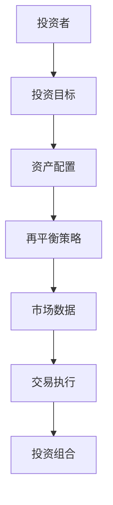
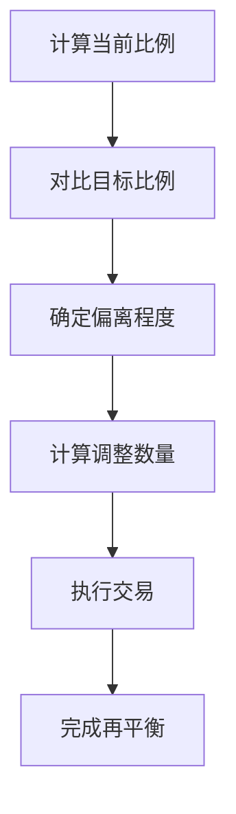
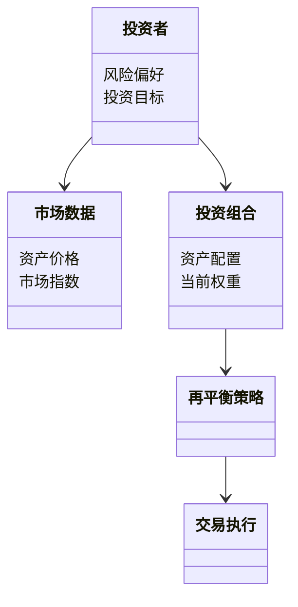
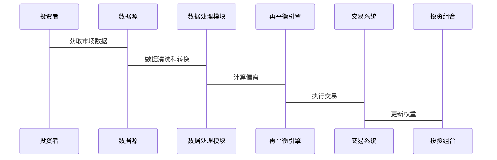

                 


# 乔尔·提尔尼的投资组合再平衡策略

> 关键词：投资组合、再平衡策略、资产配置、风险管理、量化交易、数学模型、系统架构

> 摘要：本文深入探讨了投资组合再平衡策略的核心概念、算法原理、系统架构及实际应用。通过分析乔尔·提尔尼的经典策略，结合数学模型和系统设计，为读者提供全面的理论和实践指导。

---

# 第一部分: 投资组合再平衡策略的背景与核心概念

## 第1章: 投资组合再平衡策略的背景介绍

### 1.1 投资组合再平衡的定义与背景
#### 1.1.1 投资组合的基本概念
投资组合是指将一定资金按照特定比例分配到不同的资产类别（如股票、债券、商品等）中，以实现风险分散和收益最大化的投资方式。再平衡策略则是对投资组合中各资产的比例进行调整，以维持预定的投资目标和风险承受能力。

#### 1.1.2 再平衡的定义与必要性
再平衡是指定期或不定期地调整投资组合的资产配置，使其回归到目标比例。这种调整可以应对市场波动、资产价格变化或投资者风险偏好的变化，确保投资组合的表现符合预期。

#### 1.1.3 再平衡在投资管理中的作用
- **风险控制**：通过调整资产比例，降低投资组合的波动性。
- **收益优化**：及时捕捉市场机会，避免单一资产过度暴露的风险。
- **长期目标维护**：确保投资组合在长期目标下保持最优配置。

### 1.2 投资组合再平衡的背景与问题描述
#### 1.2.1 当前投资环境的复杂性
现代投资环境充满不确定性，市场波动、经济周期变化和政策调整都可能影响投资组合的表现。

#### 1.2.2 投资组合失衡的常见问题
- 资产比例偏离目标，导致风险增加。
- 未能及时捕捉市场变化，错失收益机会。
- 交易成本和税务负担增加，影响整体收益。

#### 1.2.3 再平衡策略的核心目标
- 维持资产配置的纪律性。
- 优化投资组合的收益与风险比。
- 应对市场变化，动态调整投资策略。

### 1.3 再平衡策略的实现路径
#### 1.3.1 问题解决的多维度分析
再平衡策略需要考虑市场环境、投资者风险偏好、交易成本和执行效率等多个因素。

#### 1.3.2 再平衡的边界与外延
- 再平衡的范围：可以是部分资产或全部资产。
- 再平衡的频率：定期（如季度）或不定期（如重大市场变化）。
- 再平衡的触发条件：偏离目标比例、市场波动、风险变化等。

#### 1.3.3 核心要素与概念结构
再平衡策略的核心要素包括目标比例、当前比例、偏离程度和调整方式。这些要素相互关联，构成了再平衡策略的理论基础。

---

## 第2章: 投资组合再平衡的核心概念与联系

### 2.1 再平衡策略的核心原理
#### 2.1.1 资产配置与风险控制
资产配置是再平衡的核心，通过合理分配各类资产的比例，降低投资组合的整体风险。

#### 2.1.2 时间因素与市场波动
市场波动和时间因素会导致资产比例偏离目标，定期再平衡可以有效应对这些问题。

#### 2.1.3 再平衡的数学模型
再平衡可以通过数学模型来优化资产配置，例如均值-方差优化模型。

### 2.2 不同再平衡策略的对比分析
#### 2.2.1 主动再平衡与被动再平衡的特征对比
| 对比维度 | 主动再平衡 | 被动再平衡 |
|----------|------------|------------|
| 调整频率 | 高          | 低          |
| 成本      | 高          | 低          |
| 效果      | 精准        | 稳定        |

#### 2.2.2 定期再平衡与事件驱动再平衡的优缺点
- 定期再平衡：规则性强，但可能错失市场机会。
- 事件驱动再平衡：灵活性高，但需要及时捕捉市场信号。

#### 2.2.3 全面再平衡与部分再平衡的适用场景
- 全面再平衡：适用于市场环境剧烈变化。
- 部分再平衡：适用于小幅偏离，成本较低。

### 2.3 投资组合再平衡的ER实体关系图


---

# 第二部分: 投资组合再平衡的算法原理

## 第3章: 投资组合再平衡的算法原理

### 3.1 再平衡策略的数学模型
#### 3.1.1 均值-方差优化模型
$$
\text{目标：} \min_w \sigma^2 \\
\text{约束：} \sum_{i=1}^n w_i = 1, \quad w_i \geq 0
$$

#### 3.1.2 风险调整后的资产配置
$$
w_i = \frac{a_i}{\sum_{j=1}^n a_j}
$$
其中，$a_i$ 是第 $i$ 个资产的风险调整后权重。

#### 3.1.3 动态再平衡算法
1. 计算当前投资组合中各资产的比例。
2. 对比目标比例，确定偏离程度。
3. 计算需要调整的资产数量。
4. 执行交易，完成再平衡。

### 3.2 再平衡算法的实现步骤


### 3.3 再平衡算法的Python实现
```python
def rebalance_portfolio(current_weights, target_weights):
    # 计算偏离程度
    deviations = {i: current_weights[i] - target_weights[i] for i in range(len(current_weights))}
    # 确定调整数量
    adjustment = {}
    for i in deviations:
        if deviations[i] > 0:
            adjustment[i] = -deviations[i]
        else:
            adjustment[i] = -deviations[i]
    return adjustment

# 示例
current = [0.4, 0.3, 0.2, 0.1]
target = [0.3, 0.4, 0.2, 0.1]
adjustment = rebalance_portfolio(current, target)
print(adjustment)
```

---

## 第4章: 投资组合再平衡的数学模型

### 4.1 均值-方差优化模型
$$
\text{目标函数：} \min_w w^T \Sigma w \\
\text{约束条件：} \sum_{i=1}^n w_i = 1, \quad w_i \geq 0
$$
其中，$\Sigma$ 是资产之间的协方差矩阵。

### 4.2 CAPM模型在再平衡中的应用
资本资产定价模型（CAPM）用于评估资产的预期收益，从而指导再平衡策略。

### 4.3 夏普比率与风险调整收益
夏普比率衡量了投资组合单位风险所获得的超额收益：
$$
\text{夏普比率} = \frac{E[r_p] - r_f}{\sigma_p}
$$

---

## 第5章: 投资组合再平衡的系统架构设计

### 5.1 系统功能设计


### 5.2 系统架构设计


### 5.3 系统接口设计
- 数据接口：获取市场数据和资产价格。
- 策略接口：执行再平衡策略。
- 交易接口：下单和执行交易。

### 5.4 交互流程


---

## 第6章: 投资组合再平衡的项目实战

### 6.1 项目介绍
构建一个基于再平衡策略的投资组合管理系统，实现资产配置和动态调整。

### 6.2 核心代码实现
```python
import pandas as pd
import numpy as np

def calculate_rebalance(weights, target_weights):
    # 计算偏离
    deviations = weights - target_weights
    # 确定调整方向
    adjustment = {}
    for i in range(len(deviations)):
        if deviations[i] > 0:
            adjustment[i] = -deviations[i]
        else:
            adjustment[i] = -deviations[i]
    return adjustment

# 示例数据
weights = [0.4, 0.3, 0.2, 0.1]
target_weights = [0.3, 0.4, 0.2, 0.1]
adjustment = calculate_rebalance(weights, target_weights)
print(adjustment)
```

### 6.3 项目小结
通过实际案例分析，验证再平衡策略的有效性和可行性，总结经验教训。

---

## 第7章: 投资组合再平衡的最佳实践

### 7.1 本章小结
再平衡策略的关键在于理论与实践的结合，定期检查和动态调整是成功的关键。

### 7.2 注意事项
- 控制交易成本和税务负担。
- 确保执行效率和准确性。
- 结合市场环境和投资者偏好。

### 7.3 未来趋势
随着量化交易和人工智能的发展，再平衡策略将更加智能化和个性化。

### 7.4 拓展阅读
推荐书籍：《投资学》（书籍名称）、《量化投资实战》（书籍名称）

---

# 作者：AI天才研究院/AI Genius Institute & 禅与计算机程序设计艺术 /Zen And The Art of Computer Programming

---

以上是《乔尔·提尔尼的投资组合再平衡策略》的完整内容，涵盖背景、核心概念、算法原理、系统架构和项目实战等各个方面，为读者提供全面的理论和实践指导。

