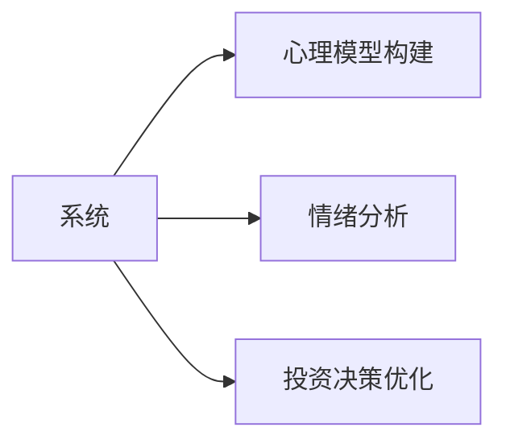

                 


# 乔尔·提林加斯特的价值投资心理学

## 关键词：价值投资，心理学，投资者行为，心理偏差，决策算法

## 摘要：  
本文深入探讨了乔尔·提林加斯特的价值投资理念与心理学的结合，分析了投资者心理在价值投资中的作用，揭示了心理偏差如何影响投资决策，提出了基于心理学的优化策略。通过系统化的分析和实际案例，本文为投资者提供了从心理学视角优化投资决策的方法论。

---

## 第1章 价值投资的背景与心理学基础

### 1.1 价值投资的核心概念  
价值投资是一种以公司基本面分析为基础的投资策略，强调以低于内在价值的价格买入优质资产。其核心在于识别市场低估的机会，并长期持有这些资产。  

#### 1.1.1 价值投资的定义与核心要素  
- **定义**：价值投资关注的是资产的内在价值，而非市场情绪或短期价格波动。  
- **核心要素**：  
  - 公司基本面分析（财务报表、行业地位、竞争优势）  
  - 市场价格与内在价值的差异  
  - 长期持有策略  

#### 1.1.2 投资者心理与行为特征  
投资者的心理特征和行为模式对投资决策有着深远影响。以下是投资者常见的心理特征：  
- **贪婪与恐惧**：市场上涨时，投资者倾向于贪婪；市场下跌时，倾向于恐惧。  
- **确认偏差**：投资者倾向于寻找支持自己决策的信息，忽略反面证据。  
- **从众心理**：倾向于跟随市场趋势，而非独立判断。  

#### 1.1.3 价值投资与心理学的结合意义  
价值投资强调理性分析，而心理学提供了理解投资者行为的工具。将两者结合，可以帮助投资者更好地识别市场情绪，避免情绪化决策，从而提高投资成功率。  

---

### 1.2 心理学基础  
心理学为理解投资者行为提供了理论框架，尤其是在价值投资中，心理偏差对投资决策的影响不容忽视。  

#### 1.2.1 心理学与投资的关系  
- **心理偏差对投资的影响**：认知偏差（如确认偏差、锚定效应）和情绪偏差（如贪婪、恐惧）会影响投资者的决策。  
- **行为金融学**：研究投资者心理与行为如何影响市场定价。  

#### 1.2.2 投资者常见心理偏差  
- **锚定效应**：投资者过度依赖某一个参考点，如买入价格，导致决策失误。  
- **从众心理**：投资者跟随市场趋势，而非独立分析。  
- **损失厌恶**：投资者对损失的厌恶程度高于对收益的追求。  

#### 1.2.3 心理学在投资决策中的作用  
- **情绪管理**：通过心理学方法，投资者可以更好地控制情绪，避免非理性决策。  
- **行为分析**：通过心理学理论，可以预测市场参与者的集体行为，优化投资策略。  

---

## 第2章 价值投资的核心概念与联系  

### 2.1 核心概念原理  
价值投资与心理学的结合，本质上是通过理解投资者行为来优化投资策略。  

#### 2.1.1 价值投资的基本原理  
价值投资的核心在于识别市场低估的机会，并通过长期持有实现价值回归。这一过程需要投资者具备独立思考能力，避免被市场情绪左右。  

#### 2.1.2 投资者心理模型  
投资者心理模型是投资者对市场的认知框架，包括对市场的预期、对资产价值的判断以及对风险的感知。  

#### 2.1.3 价值与价格的关系  
- **内在价值**：资产的真实价值，基于基本面分析。  
- **市场价格**：市场参与者情绪与行为的反映。  
- **价值与价格的差异**：市场低估或高估的机会来源。  

---

### 2.2 核心概念对比表  
以下是价值投资与心理学在核心概念上的对比：  

| 属性       | 价值投资       | 心理学视角       |
|------------|----------------|-----------------|
| 核心目标    | 实现长期收益    | 理解投资者行为    |
| 关键因素    | 公司基本面      | 心理偏差与情绪    |
| 决策依据    | 理性分析        | 行为偏差与认知    |

---

### 2.3 实体关系图  
以下是一个简单的实体关系图，展示价值投资与心理学之间的联系：  


---

## 第3章 投资者心理模型与决策算法  

### 3.1 投资者心理模型  
心理模型是投资者对市场的认知框架，直接影响其投资决策。  

#### 3.1.1 心理模型的定义  
心理模型是投资者对市场的预期、对资产价值的判断以及对风险的感知的综合体现。  

#### 3.1.2 心理模型的构成要素  
- **认知偏差**：如锚定效应、确认偏差等。  
- **情绪影响**：贪婪、恐惧等情绪对决策的影响。  
- **经验与知识**：投资者的经验和知识影响其对市场的认知。  

#### 3.1.3 心理模型与投资决策的关系  
心理模型通过影响投资者的认知和情绪，直接决定了其投资决策的质量。  

---

### 3.2 投资决策算法  

#### 3.2.1 心理偏差对决策的影响  
心理偏差会导致投资者做出非理性决策，例如：  
- **过度自信**：认为自己能够准确预测市场走势。  
- **从众心理**：跟随市场趋势，而非独立分析。  

#### 3.2.2 情绪周期对投资的影响  
情绪周期对市场波动有显著影响，投资者需要通过情绪管理来避免情绪化决策。  

#### 3.2.3 投资者决策流程图  
以下是一个投资者决策的流程图：  


---

### 3.3 数学模型与公式  

#### 3.3.1 预期收益公式  
预期收益可以通过以下公式计算：  
$$ E[R] = \sum p_i R_i $$  
其中，$p_i$ 是收益$R_i$发生的概率。  

#### 3.3.2 风险评估公式  
风险可以通过以下公式进行评估：  
$$ R = \sqrt{E[(R - E[R])^2]} $$  
其中，$E[R]$ 是预期收益，$R$ 是收益的方差。  

---

## 第4章 系统分析与架构设计方案  

### 4.1 问题场景介绍  
本文构建了一个价值投资心理分析系统，旨在通过心理学视角优化投资决策。  

#### 4.1.1 项目介绍  
项目目标是通过分析投资者心理行为，优化投资策略。  

#### 4.1.2 系统功能设计  
系统功能包括：  
- 心理模型构建  
- 情绪分析  
- 投资决策优化  

#### 4.1.3 系统架构设计  
系统架构如下：  



---

## 第5章 项目实战  

### 5.1 环境安装  
读者需要安装以下工具：  
- Python编程语言  
- Mermaid图表工具  

### 5.2 核心代码实现  

#### 5.2.1 心理模型构建代码  
```python
def build_psychological_model(data):
    # 心理模型构建逻辑
    pass
```

#### 5.2.2 情绪分析代码  
```python
def analyze_emotions(data):
    # 情绪分析逻辑
    pass
```

---

## 第6章 总结与展望  

### 6.1 最佳实践 tips  
- 保持独立思考，避免从众心理。  
- 定期复盘，反思投资决策。  

### 6.2 小结  
价值投资与心理学的结合，为投资者提供了优化决策的工具和方法。通过理解心理偏差和情绪影响，投资者可以更好地把握市场机会。  

### 6.3 注意事项  
- 投资有风险，需谨慎决策。  
- 定期学习，提升自身能力。  

### 6.4 拓展阅读  
推荐阅读《价值投资心理学》和《行为金融学》相关书籍。  

---

## 作者：AI天才研究院/AI Genius Institute & 禅与计算机程序设计艺术 /Zen And The Art of Computer Programming

