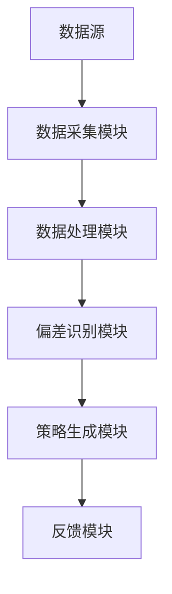

                 


# 乔尔·提林加斯特的投资决策偏差纠正

> **关键词**：投资决策偏差，乔尔·提林加斯特，行为金融学，偏差纠正，系统架构  
> **摘要**：本文详细探讨了乔尔·提林加斯特在投资决策偏差纠正方面的研究成果，从背景介绍、核心概念、算法原理到系统架构和项目实战，结合实际案例和最佳实践，全面解析投资决策偏差纠正的方法和应用。

---

## 第1章：投资决策偏差的背景与影响

### 1.1 投资决策偏差的定义与核心概念

#### 1.1.1 投资决策偏差的定义
投资决策偏差是指投资者在决策过程中由于心理、情绪或认知偏差而导致的投资决策偏离理性和最优决策的现象。这些偏差可能源于过度自信、确认偏差、损失厌恶等心理因素。

#### 1.1.2 偏差对投资决策的影响
投资决策偏差可能导致投资者做出错误的投资决策，例如高位买入、低位卖出，从而造成投资损失。偏差还可能导致投资者忽视市场风险，过度集中在某一资产类别，或在市场波动时做出非理性反应。

#### 1.1.3 投资决策偏差的分类与特征
投资决策偏差可以分为认知偏差和行为偏差两大类。认知偏差包括确认偏差、选择性认知偏差等，行为偏差包括过度交易、从众行为等。

---

### 1.2 投资决策偏差的常见类型

#### 1.2.1 确认偏差
确认偏差是指投资者在决策过程中倾向于寻找支持自己已有观点的信息，而忽略或忽视与之矛盾的信息。这种偏差可能导致投资者坚持错误的决策，错过更好的投资机会。

#### 1.2.2 损失厌恶
损失厌恶是指投资者对损失的厌恶程度远高于对收益的追求。这种心理偏差可能导致投资者在面对潜在损失时过于保守，错失高收益的投资机会。

#### 1.2.3 过度自信
过度自信是指投资者对自己决策能力的过高估计，可能导致其过度自信地进行投资决策，忽视市场的不确定性。

#### 1.2.4 框架偏差
框架偏差是指投资者对同一问题在不同框架下的决策存在差异。例如，在收益和损失两种不同的框架下，投资者的决策可能截然不同。

---

### 1.3 投资决策偏差的案例分析

#### 1.3.1 真实案例：偏差导致的投资损失
以2008年金融危机为例，许多投资者由于过度自信和确认偏差，未能及时调整投资组合，导致重大损失。

#### 1.3.2 偏差对投资者心理的影响
投资决策偏差不仅影响投资者的决策，还可能导致情绪波动，进一步加剧市场的波动性。

---

## 第2章：投资决策偏差纠正的核心原理

### 2.1 偏差纠正的基本原理

#### 2.1.1 偏差纠正的理论基础
偏差纠正基于行为金融学和认知心理学的理论，通过分析投资者的心理偏差，制定相应的纠正策略。

#### 2.1.2 偏差纠正的数学模型
偏差纠正可以通过概率模型和统计方法来实现。例如，可以通过马尔可夫链模型分析投资者的行为模式，提出纠正策略。

#### 2.1.3 偏差纠正的实践方法
实践方法包括投资者教育、决策辅助工具的应用，以及投资组合的动态调整。

---

### 2.2 偏差纠正的算法原理

#### 2.2.1 基于概率的偏差纠正算法
基于概率的偏差纠正算法通过分析历史数据，计算出投资者的偏差概率，并制定相应的纠正策略。

#### 2.2.2 基于行为矫正的偏差纠正方法
行为矫正方法通过调整投资者的行为模式，减少偏差对决策的影响。

#### 2.2.3 偏差纠正的数学公式推导
以下是偏差纠正的数学公式：
$$
P(\text{偏差纠正}) = \sum_{i=1}^{n} P(\text{偏差类型 } i) \times P(\text{纠正策略})
$$

---

## 第3章：投资决策偏差纠正的系统架构

### 3.1 系统功能设计

#### 3.1.1 投资者行为分析模块
该模块通过分析投资者的历史交易数据，识别出潜在的偏差行为。

#### 3.1.2 偏差识别模块
该模块基于行为分析结果，识别出具体的偏差类型。

#### 3.1.3 偏差纠正策略生成模块
该模块根据偏差类型，生成相应的纠正策略。

---

### 3.2 系统架构设计

#### 3.2.1 系统模块划分
系统主要由数据采集模块、数据处理模块、偏差识别模块、策略生成模块和反馈模块组成。

#### 3.2.2 系统数据流图


#### 3.2.3 系统交互流程图


---

## 第4章：投资决策偏差纠正的算法实现

### 4.1 偏差纠正算法的数学模型

#### 4.1.1 偏差纠正的数学公式
$$
\text{纠正系数} = \frac{\text{预期收益}}{\text{潜在损失}}
$$

#### 4.1.2 偏差纠正的优化算法
通过遗传算法优化偏差纠正的参数，提高纠正效果。

#### 4.1.3 偏差纠正的实现代码
```python
import numpy as np

def deviation_correction(data):
    # 数据预处理
    processed_data = data.dropna()
    # 偏差识别
    mean = np.mean(processed_data)
    std = np.std(processed_data)
    # 偏差纠正
    corrected_data = (processed_data - mean) / std
    return corrected_data
```

---

## 第5章：投资决策偏差纠正的项目实战

### 5.1 项目环境安装与配置

#### 5.1.1 开发环境搭建
建议使用Python 3.8及以上版本，安装必要的库如numpy、pandas、scikit-learn等。

#### 5.1.2 依赖库安装
```bash
pip install numpy pandas scikit-learn
```

#### 5.1.3 项目初始化
创建项目目录，初始化代码文件。

---

### 5.2 项目核心代码实现

#### 5.2.1 数据分析模块实现
```python
import pandas as pd

def analyze_behavior(data):
    # 统计交易频率
    frequency = data['交易次数'].value_counts()
    return frequency
```

#### 5.2.2 偏差识别模块实现
```python
from sklearn.metrics import classification_report

def identify_deviation(data):
    # 使用分类算法识别偏差
    model = ...  # 初始化分类模型
    y_pred = model.predict(data)
    return classification_report(data['实际标签'], y_pred)
```

#### 5.2.3 偏差纠正策略生成模块实现
```python
def generate_strategy(data):
    # 根据偏差类型生成纠正策略
    strategy = []
    for item in data:
        if item['偏差类型'] == '确认偏差':
            strategy.append('增加多样化投资')
        elif item['偏差类型'] == '损失厌恶':
            strategy.append('分批投资')
    return strategy
```

---

### 5.3 项目案例分析与解读

#### 5.3.1 案例背景介绍
以某投资者的投资行为为例，分析其存在的偏差类型。

#### 5.3.2 数据分析与处理
通过数据分析模块，识别出该投资者的主要偏差类型。

#### 5.3.3 偏差纠正策略生成与验证
根据识别出的偏差类型，生成相应的纠正策略，并验证其有效性。

---

## 第6章：投资决策偏差纠正的最佳实践

### 6.1 偏差纠正的注意事项

#### 6.1.1 数据质量的重要性
确保数据的完整性和准确性，是偏差纠正的基础。

#### 6.1.2 算法选择的注意事项
选择适合的算法，避免过度拟合。

#### 6.1.3 实际应用中的常见问题
包括数据不足、模型泛化能力差等问题。

---

### 6.2 偏差纠正的拓展阅读

#### 6.2.1 相关领域研究进展
推荐阅读行为金融学领域的最新研究成果。

#### 6.2.2 偏差纠正

---

**作者：AI天才研究院/AI Genius Institute & 禅与计算机程序设计艺术 /Zen And The Art of Computer Programming**

