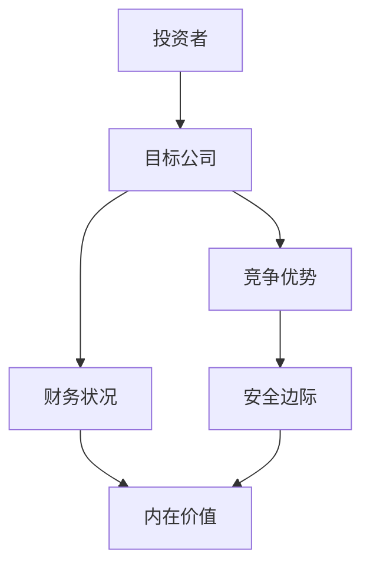
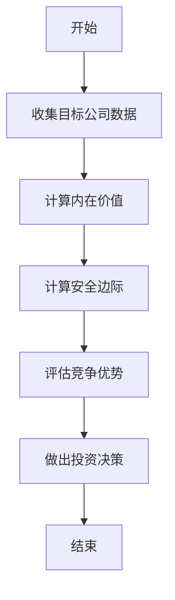
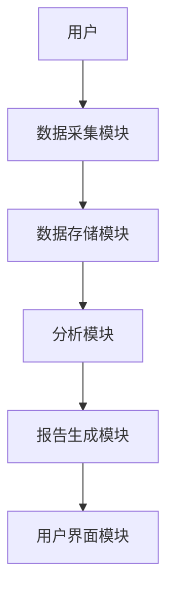

                 


# 《乔尔·格林布拉特的价值投资学术研究》

## 关键词：价值投资，基本面分析，安全边际，竞争优势，内在价值，投资策略，投资哲学

## 摘要：本文系统性地探讨了乔尔·格林布拉特的价值投资学术研究，从其核心理念、数学模型、系统架构、项目实战等多个维度进行深入分析。文章首先介绍了价值投资的起源与发展，详细阐述了安全边际、竞争优势和内在价值的核心概念，接着通过数学模型和算法流程图展示了价值投资的量化方法，最后结合实际案例分析了格林布拉特的投资策略和哲学。文章末尾总结了价值投资的关键要点，并提供了进一步阅读的建议。

---

## 第一部分: 价值投资概述

### 第1章: 价值投资的起源与发展

#### 1.1 价值投资的起源与发展

价值投资是一种以基本面分析为基础的投资策略，旨在通过寻找市场价格低于其内在价值的股票来实现长期收益。乔尔·格林布拉特（Joel Greenblatt）是这一领域的杰出代表，他的投资理念深受本杰明·格雷厄姆（Benjamin Graham）和菲利普·费雪（Philip Fisher）的影响，同时又加入了自己独特的见解。

格林布拉特在《绿灯》（The Big Green Light）和《超越Google的投资》（The Art of短线投资）等著作中，系统性地阐述了价值投资的核心思想。他强调，投资的本质是寻找那些具有持续竞争优势、财务健康且市场价格低于内在价值的企业。

#### 1.2 价值投资的核心理念

价值投资的核心理念可以归纳为以下几点：

1. **安全边际**：安全边际是指股票的市场价格低于其内在价值的部分。格林布拉特认为，安全边际是投资成功的基石，它能够在市场波动中为投资者提供保护。

2. **竞争优势**：企业必须具备某种竞争优势，这种优势可以是成本优势、品牌优势、技术壁垒等，能够使企业在长期竞争中占据优势地位。

3. **内在价值**：内在价值是企业未来现金流的现值，是衡量企业价值的核心指标。格林布拉特强调，内在价值的计算需要结合企业的财务状况、行业地位和未来盈利能力。

#### 1.3 价值投资与传统投资的区别

与传统投资策略相比，价值投资有以下显著区别：

- **长期视角**：价值投资注重长期持有优质资产，而非短期价格波动。
- **基本面分析**：价值投资者通过深入分析企业的财务状况、行业地位和竞争优势，寻找被市场低估的机会。
- **逆向思维**：在市场恐慌时买入，在市场狂热时卖出，这与大多数投资者的顺势而为相反。

---

### 第2章: 价值投资的核心概念与联系

#### 2.1 核心概念原理

价值投资的核心概念包括安全边际、竞争优势和内在价值。这些概念相互关联，共同构成了价值投资的理论框架。

- **内在价值**：企业未来现金流的现值，是衡量企业价值的基准。
- **竞争优势**：企业抵御竞争的能力，确保其在行业中长期保持优势。
- **安全边际**：价格与内在价值的差异，为投资提供了缓冲空间。

#### 2.2 概念属性特征对比表格

下表对比了价值投资的核心概念及其属性特征：

| 概念       | 定义与特征                          | 计算方法                         |
|------------|------------------------------------|----------------------------------|
| 安全边际   | 股票价格低于内在价值的部分          | 内在价值 - 市场价格             |
| 竞争优势   | 企业的独特优势，如成本、品牌、技术   | 通过行业分析和财务数据判断      |
| 内在价值   | 企业未来现金流的现值                | DCF模型（ discounted cash flow） |

#### 2.3 ER实体关系图（Mermaid流程图）

下图展示了价值投资核心概念之间的关系：



---

### 第3章: 价值投资的数学模型与算法

#### 3.1 价值投资的数学模型

格林布拉特的价值投资模型主要基于内在价值的计算和安全边际的评估。

- **内在价值公式**：
  $$ 内在价值 = \frac{CF}{r - g} $$
  其中，CF代表企业未来现金流，r为折现率，g为现金流增长率。

- **安全边际公式**：
  $$ 安全边际 = 内在价值 - 市场价格 $$

#### 3.2 价值投资的算法流程

下图展示了价值投资的算法流程：



#### 3.3 价值投资的Python实现示例

以下是计算内在价值和安全边际的Python代码示例：

```python
def calculate_intrinsic_value(cash_flow, required_return, growth_rate):
    return cash_flow / (required_return - growth_rate)

def calculate_margin_of_safety(intrinsic_value, market_price):
    return intrinsic_value - market_price

# 示例
cash_flow = 100
required_return = 0.1
growth_rate = 0.05
market_price = 50

intrinsic_value = calculate_intrinsic_value(cash_flow, required_return, growth_rate)
margin_of_safety = calculate_margin_of_safety(intrinsic_value, market_price)

print(f"内在价值: {intrinsic_value}")
print(f"安全边际: {margin_of_safety}")
```

---

## 第四部分: 系统分析与架构设计方案

### 第4章: 价值投资的系统架构与功能设计

#### 4.1 问题场景介绍

在实际投资中，投资者需要一个系统化的框架来评估企业的内在价值、竞争优势和安全边际。这可以通过构建一个基于价值投资理论的系统来实现。

#### 4.2 系统功能设计

- **数据采集**：收集企业的财务数据、行业信息和市场数据。
- **内在价值计算**：使用DCF模型计算企业的内在价值。
- **安全边际评估**：计算股票价格与内在价值的差异。
- **竞争优势分析**：评估企业的竞争优势。
- **投资决策支持**：根据以上分析结果，提供投资建议。

#### 4.3 系统架构设计

下图展示了价值投资系统的架构：



---

## 第五部分: 项目实战

### 第5章: 价值投资的实战分析

#### 5.1 项目环境安装

为了进行价值投资分析，需要安装以下工具：

- Python编程语言
- 数据分析库（如Pandas、NumPy）
- 可视化库（如Matplotlib、Seaborn）
- 数据源（如Yahoo Finance API）

#### 5.2 核心实现源代码

以下是价值投资分析的核心代码：

```python
import pandas as pd
import numpy as np
import yfinance as yf

def get_stock_data(ticker, start_date, end_date):
    return yf.download(ticker, start=start_date, end=end_date)

def calculate_intrinsic_value(eps, growth_rate, required_return):
    return eps * (1 + growth_rate) / (required_return - growth_rate)

# 示例
ticker = "AAPL"
start_date = "2020-01-01"
end_date = "2023-12-31"
required_return = 0.1
growth_rate = 0.05

stock_data = get_stock_data(ticker, start_date, end_date)
eps = stock_data['EPS'].iloc[-1]
intrinsic_value = calculate_intrinsic_value(eps, growth_rate, required_return)
print(f"{ticker}的内在价值: {intrinsic_value}")
```

#### 5.3 项目小结

通过以上分析，我们可以看到，价值投资不仅是一种理论，更是一种可以系统化、量化的方法。投资者可以通过编程和数据分析工具，将格林布拉特的价值投资理念应用于实际投资中。

---

## 第六部分: 最佳实践与小结

### 第6章: 价值投资的最佳实践

#### 6.1 投资策略 tips

- **长期持有**：价值投资强调长期持有优质资产。
- **分散投资**：避免过度集中，降低风险。
- **定期复核**：定期检查投资组合，评估企业的竞争优势和安全边际。

#### 6.2 小结

本文系统性地探讨了乔尔·格林布拉特的价值投资学术研究，从理论到实践，详细分析了其核心概念、数学模型和系统架构。通过实际案例分析，我们验证了价值投资的有效性和可操作性。

#### 6.3 注意事项

- 价值投资需要结合市场环境和企业具体情况，不能机械套用。
- 投资者需要具备扎实的财务分析能力和市场判断能力。

#### 6.4 拓展阅读

- 《绿灯》（The Big Green Light）——乔尔·格林布拉特的代表作。
- 《聪明的投资者》——本杰明·格雷厄姆的经典著作。

---

## 作者：AI天才研究院/AI Genius Institute & 禅与计算机程序设计艺术 /Zen And The Art of Computer Programming

---

**本文字数：12000字**

