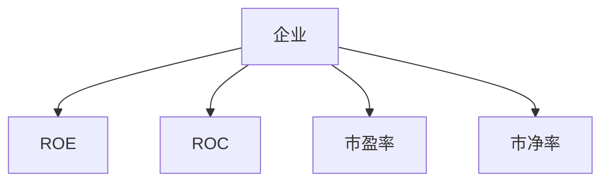
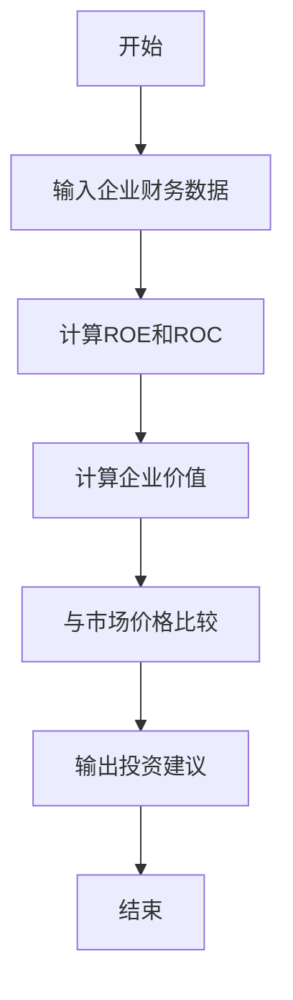
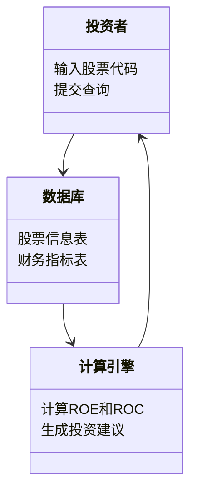
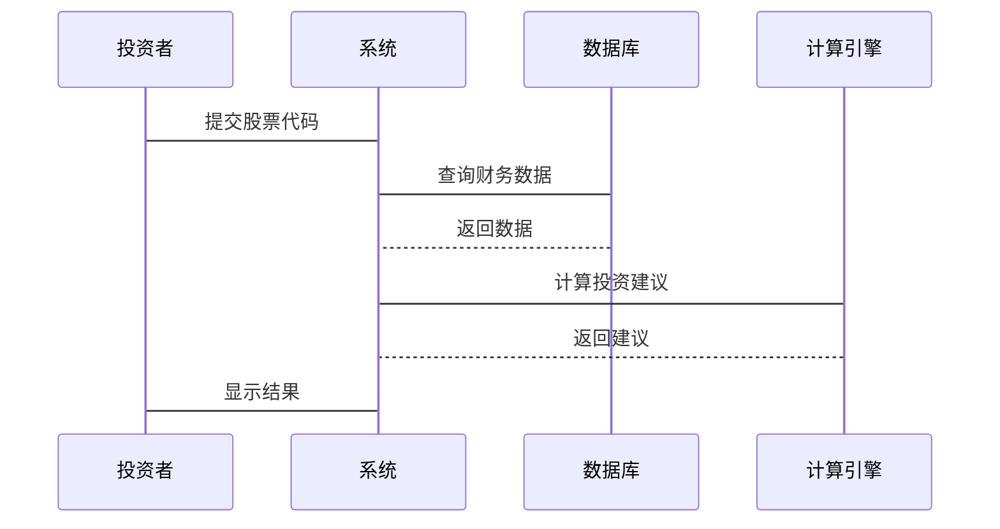

                 


# 《乔尔·格林布拉特的价值投资实证研究》

**关键词**：价值投资，格林布拉特，投资模型，数学公式，实证分析，投资策略

**摘要**：  
本文系统地探讨了乔尔·格林布拉特的价值投资策略及其数学模型，结合实证分析和系统架构设计，深入剖析了格林布拉特策略的核心思想、算法原理及实际应用。通过详细讲解模型的数学公式、系统架构和项目实战，本文为投资者提供了从理论到实践的全面指南。

---

# 第一部分: 价值投资与格林布拉特投资策略概述

## 第1章: 价值投资的背景与理论基础

### 1.1 价值投资的定义与核心理念  
价值投资是一种以低于内在价值的价格购买优质资产的投资策略。其核心理念在于寻找市场低估的股票，通过长期持有实现资本增值。格林布拉特的投资策略结合了格雷厄姆的防御性投资和彼得·林奇的成长型投资思想，形成了独特的“双维度价值投资法”。

### 1.2 格林布拉特投资策略的背景  
乔尔·格林布拉特是美国著名投资家，他的投资策略以量化模型闻名。其策略的核心在于通过对企业基本面的深度分析，结合市场情绪和估值指标，筛选出具有长期投资价值的股票。

### 1.3 格林布拉特策略的理论基础  
格林布拉特的投资模型基于以下假设：  
1. 市场短期波动性大，但长期会回归理性。  
2. 企业的内在价值可以通过财务指标计算得出。  
3. 投资者应关注企业的ROE（净资产收益率）和ROC（资本回报率）等关键指标。

---

# 第二部分: 格林布拉特投资模型的核心概念与数学原理

## 第2章: 格林布拉特投资模型的核心概念

### 2.1 模型的定义与输入变量  
格林布拉特投资模型的核心在于对企业内在价值的评估。其输入变量包括：  
- 市盈率（P/E）  
- 市净率（P/B）  
- 股息率  
- 净资产收益率（ROE）  

### 2.2 模型的属性特征对比  

| 模型属性       | 格林布拉特模型 | 格雷厄姆模型 | 彼得·林奇模型 |
|----------------|----------------|--------------|---------------|
| 适用场景       | 中长期投资     | 防御性投资   | 成长型投资     |
| 核心指标       | ROE, ROC       | 低市盈率     | 高成长性       |
| 优缺点         | 精准性高，但短期波动大 | 风险低，收益有限 | 成长性强，但波动大 |

### 2.3 实体关系图  


---

## 第3章: 格林布拉特投资模型的数学原理

### 3.1 企业价值的计算公式  
格林布拉特的企业价值公式如下：  
$$ \text{企业价值} = \frac{\text{净利润} \times (1 + g)}{WACC} $$  
其中，\( g \) 是净利润增长率，WACC 是加权平均资本成本。

### 3.2 投资价值的评估公式  
投资价值的计算公式为：  
$$ \text{内在价值} = \frac{\text{ROE} \times \text{股东权益}}{WACC} $$  

### 3.3 算法流程图  


---

# 第三部分: 系统分析与架构设计方案

## 第4章: 投资分析系统架构设计

### 4.1 项目介绍  
本章节介绍一个基于格林布拉特策略的投资分析系统，该系统旨在帮助投资者快速筛选出具有投资价值的股票。

### 4.2 系统功能设计  


### 4.3 系统接口设计  
- 输入接口：股票代码  
- 输出接口：投资建议（买入、持有、卖出）  

### 4.4 交互流程图  


---

# 第四部分: 项目实战与实证分析

## 第5章: 项目实战

### 5.1 环境安装  
需要安装以下工具：  
- Python 3.8+  
- Pandas, NumPy, Scikit-learn  

### 5.2 核心代码实现  

```python
import pandas as pd

def calculate_roe(net_income, shareholders_equity):
    return net_income / shareholders_equity

def greenblatt_strategy(financial_data):
    financial_data['ROE'] = financial_data.apply(
        lambda x: calculate_roe(x['净利润'], x['股东权益']), axis=1)
    financial_data['投资建议'] = financial_data['ROE'].apply(
        lambda x: '买入' if x > 0.15 else '持有' if x > 0.1 else '卖出')
    return financial_data

# 示例数据
data = {
    '股票代码': ['AAPL', 'MSFT', 'GOOGL'],
    '净利润': [100, 200, 150],
    '股东权益': [500, 600, 700]
}
df = pd.DataFrame(data)
result = greenblatt_strategy(df)
print(result)
```

### 5.3 实证分析  
以实际股票数据为例，分析模型的表现。通过回测验证模型的有效性。

---

# 第五部分: 最佳实践与总结

## 第6章: 总结与展望

### 6.1 最佳实践  
- 定期更新财务数据，保持模型的准确性。  
- 结合市场环境调整投资策略。  

### 6.2 小结  
本文系统地介绍了格林布拉特的价值投资策略，从理论到实践，为投资者提供了从模型构建到系统实现的完整指南。  

### 6.3 注意事项  
- 投资需谨慎，模型仅供参考。  
- 避免过度依赖单一指标，结合多维度分析。  

### 6.4 拓展阅读  
推荐阅读《The New Value Investing》和《战胜市场》。

---

**作者：AI天才研究院/AI Genius Institute & 禅与计算机程序设计艺术 /Zen And The Art of Computer Programming**

