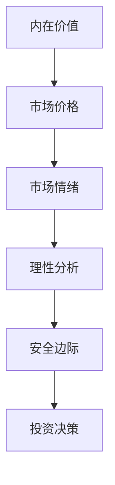
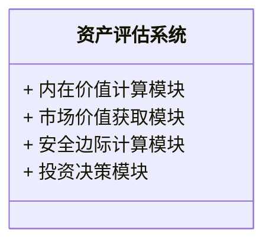

                 


# 乔尔·格林布拉特的价值投资实践指南

## 关键词：价值投资、内在价值、安全边际、DCF模型、投资组合优化、风险管理

## 摘要：  
本文深入探讨了乔尔·格林布拉特的价值投资理念，结合技术与投资的双重视角，系统地分析了价值投资的核心概念、算法原理、数学模型、系统架构及实战案例。通过逐步推理和分析，本文为投资者提供了从理论到实践的全面指南，帮助读者掌握价值投资的精髓，实现稳健的投资收益。

---

## 第一部分: 价值投资的背景与核心概念

### 第1章: 价值投资的背景与问题背景

#### 1.1 价值投资的定义与核心要素
##### 1.1.1 价值投资的基本概念  
价值投资是一种以低于其内在价值的价格购买优质资产的投资策略。其核心在于识别市场低估的股票，并长期持有，等待其价值回归。  

##### 1.1.2 价值投资的核心要素  
- **内在价值**：资产未来现金流的现值，是价值投资的核心目标。  
- **安全边际**：买入价格与内在价值之间的差距，用于降低投资风险。  
- **长期视角**：价值投资强调长期持有，避免短期市场波动的干扰。  

##### 1.1.3 价值投资与其它投资策略的对比  
| 投资策略 | 核心目标 | 方法论 | 适用场景 |  
|----------|----------|---------|----------|  
| 价值投资 | 发掘低估资产 | 以低于内在价值的价格买入 | 长期稳健收益 |  
| 技术分析 | 预测价格走势 | 通过价格和成交量的模式寻找机会 | 短期交易 |  

#### 1.2 价值投资的背景介绍  
##### 1.2.1 价值投资的历史发展  
价值投资理念起源于20世纪初，由本杰明·格雷厄姆和戴维·多德提出，后来被乔尔·格林布拉特等投资者发扬光大。  

##### 1.2.2 价值投资的现状与趋势  
随着市场效率的提升，价值投资的可操作性受到挑战，但其长期稳健的收益仍吸引大量投资者。  

##### 1.2.3 价值投资的适用场景与边界  
- 适用场景：市场估值偏低、优质资产被低估时。  
- 边界：避免投资于流动性差、管理不善的企业。  

### 第2章: 价值投资的核心概念与联系  

#### 2.1 核心概念的定义与原理  
##### 2.1.1 内在价值的定义与计算  
内在价值是资产未来现金流的现值，常用Discounted Cash Flow（DCF）模型计算。  

##### 2.1.2 市场价值的定义与波动  
市场价值是资产在市场上的交易价格，受市场情绪和流动性影响较大。  

##### 2.1.3 安全边际的定义与作用  
安全边际是买入价格与内在价值之间的差距，用于降低投资风险。  

#### 2.2 核心概念的对比分析  
##### 2.2.1 内在价值与市场价值的对比  
- 内在价值是资产的真实价值，市场价值是市场价格。  

##### 2.2.2 安全边际与风险控制的对比  
- 安全边际通过降低买入价格来控制风险，而风险控制通过分散投资来降低风险。  

#### 2.3 核心概念的ER实体关系图  


---

## 第二部分: 价值投资的算法与数学模型  

### 第3章: 价值投资的算法原理  

#### 3.1 内在价值评估算法  
##### 3.1.1 DCF（Discounted Cash Flow）模型  
DCF模型是计算内在价值的核心工具，分为自由现金流折现和终值计算两部分。  

##### 3.1.2 市盈率与市净率分析  
市盈率（P/E）= 价格/每股收益，市净率（P/B）= 价格/每股净资产。  

##### 3.1.3 财务指标综合评估  
综合分析ROE、ROA、毛利率等指标，评估企业的盈利能力。  

#### 3.2 投资组合优化算法  
##### 3.2.1 Markowitz均值-方差模型  
通过优化投资组合的收益与风险，找到最优配置。  

##### 3.2.2 风险调整后的收益评估  
考虑风险因素，评估投资组合的实际收益。  

---

## 第三部分: 价值投资的系统架构与实战  

### 第4章: 价值投资的系统架构设计  

#### 4.1 问题场景介绍  
构建一个价值投资分析系统，帮助投资者评估资产的内在价值和安全边际。  

#### 4.2 系统功能设计  
##### 4.2.1 领域模型（Mermaid类图）  


#### 4.3 系统架构设计（Mermaid架构图）  


### 第5章: 价值投资的项目实战  

#### 5.1 环境安装与配置  
- 安装Python和相关库（numpy、pandas、scipy）。  

#### 5.2 核心实现源代码  
##### 5.2.1 DCF模型实现  
```python
def calculate_intrinsic_value(cash_flows, discount_rate):
    present_value = sum(cash_flows[i] / (1 + discount_rate) ** i for i in range(len(cash_flows)))
    return present_value
```

##### 5.2.2 投资组合优化  
```python
import numpy as np
from scipy.optimize import minimize

def portfolio_optimization(returns, weights):
    # 定义目标函数（最小化风险）
    def objective(weights, returns):
        return np.dot(weights.T @ returns @ weights)
    
    # 约束条件
    constraints = [{'type': 'eq', 'fun': lambda w: sum(w) - 1}, {'type': 'ineq', 'fun': lambda w: w >= 0}]
    
    # 求解优化问题
    result = minimize(objective, weights, method='SLSQP', constraints=constraints)
    return result.x
```

#### 5.3 实际案例分析  
以某企业为例，计算其内在价值和安全边际，生成投资建议。  

---

## 第四部分: 价值投资的总结与展望  

### 第6章: 价值投资的总结与展望  

#### 6.1 投资策略的总结  
- 价值投资的关键在于发现市场低估的资产，并以合理的价格买入。  

#### 6.2 投资组合优化的总结  
- 通过优化投资组合，降低风险，提高收益。  

#### 6.3 风险管理的总结  
- 设置止损点，分散投资，避免过度集中。  

#### 6.4 持续学习与改进的建议  
- 关注市场变化，不断优化投资策略。  

---

## 作者：AI天才研究院 & 禅与计算机程序设计艺术

