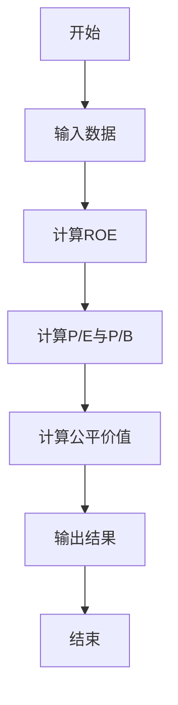
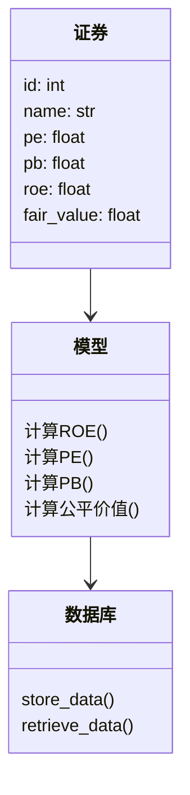
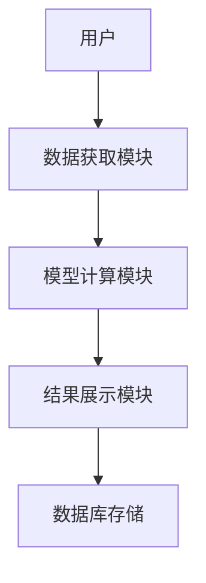
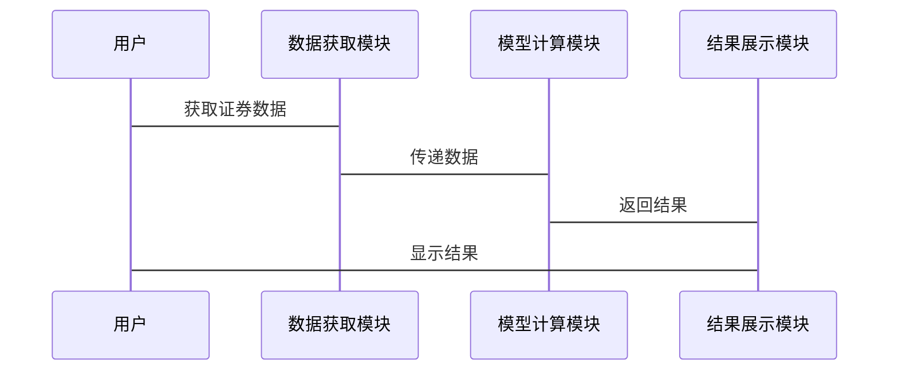

                 


# 《乔尔·格林布拉特的价值投资量化方法》

---

## 关键词：  
价值投资、量化方法、格林布拉特、套利模型、企业价值评估、投资策略、量化投资

---

## 摘要：  
本文深入探讨了乔尔·格林布拉特的价值投资量化方法，结合其经典的套利模型，详细分析了该方法的核心思想、数学原理、算法实现以及实际应用。通过理论与实践相结合的方式，本文帮助读者理解如何将价值投资的理念转化为可量化的投资策略，并通过具体案例展示了该方法在实际投资中的应用效果。

---

## 目录大纲  

# 第一部分: 价值投资与量化方法概述

# 第1章: 价值投资与量化方法的背景  

## 1.1 价值投资的核心概念  

### 1.1.1 价值投资的定义与历史发展  
价值投资是一种以基本面分析为基础的投资策略，其核心在于寻找市场价格低于其内在价值的证券。本文从价值投资的基本概念出发，梳理其历史发展脉络，重点介绍了其在现代金融中的地位与作用。  

### 1.1.2 量化方法在投资中的应用  
量化方法通过数学模型和算法，将复杂的金融现象转化为可计算的指标，从而帮助投资者更高效地做出决策。本文分析了量化方法在现代投资中的重要性，及其与传统价值投资的结合方式。  

### 1.1.3 乔尔·格林布拉特的贡献与影响力  
乔尔·格林布拉特是将价值投资理念与量化方法结合的先驱之一。本文介绍了他的生平及其在投资领域的贡献，重点分析了其量化方法的核心思想与实际效果。  

## 1.2 乔尔·格林布拉特的生平与投资理念  

### 1.2.1 乔尔·格林布拉特的背景介绍  
乔尔·格林布拉特是一位著名投资专家，以其独特的量化价值投资方法闻名。本文简要介绍了他的学术背景、职业经历及其在投资领域的成就。  

### 1.2.2 格林布拉特的投资哲学与方法  
格林布拉特的投资哲学强调基本面分析与量化模型的结合。本文详细阐述了其核心思想，即通过量化方法筛选出具有长期投资价值的证券。  

### 1.2.3 格林布拉特量化方法的核心思想  
格林布拉特的量化方法以套利模型为基础，通过对企业基本面的深入分析，量化评估企业的内在价值，并结合市场价格进行投资决策。本文总结了其方法的核心要素与创新点。  

## 1.3 价值投资与量化方法的结合  

### 1.3.1 传统价值投资的局限性  
传统价值投资依赖于分析师的主观判断，存在效率低、覆盖面窄等问题。本文分析了传统价值投资的局限性，并探讨了量化方法如何弥补这些缺陷。  

### 1.3.2 量化方法的优势与适用场景  
量化方法通过计算机算法快速筛选海量数据，具有高效、客观、可重复的特点。本文总结了量化方法的优势，并分析了其在价值投资中的适用场景。  

### 1.3.3 格林布拉特方法的独特性  
格林布拉特的量化方法结合了传统价值投资的核心理念与现代量化技术，形成了独特的投资策略。本文通过对比分析，突出了其方法的独特性与创新性。  

## 1.4 本章小结  
本章从价值投资与量化方法的背景出发，介绍了乔尔·格林布拉特的生平及其投资理念，重点分析了其量化方法的核心思想与独特性。通过对比传统价值投资与量化方法的优缺点，本文为后续的详细分析奠定了基础。

---

# 第2章: 格林布拉特投资模型的核心要素  

## 2.1 格林布拉特套利模型的原理  

### 2.1.1 套利模型的基本假设  
套利模型假设市场是有效的，即证券的市场价格最终会反映其内在价值。本文通过数学公式与图表，详细阐述了套利模型的基本假设与逻辑关系。  

### 2.1.2 模型的输入变量与输出结果  
套利模型的输入变量包括企业基本面指标（如ROE、P/E等），输出结果为企业的公平价值。本文通过公式推导与实例分析，展示了模型的输入与输出关系。  

### 2.1.3 模型的核心公式与计算步骤  
套利模型的核心公式为：  
$$ E = r \times D $$  
其中，$E$ 表示企业的公平价值，$r$ 表示资本成本，$D$ 表示企业净资产。本文通过详细推导，展示了公式的具体含义与计算步骤。  

## 2.2 企业价值评估的关键指标  

### 2.2.1 市盈率（P/E）与市净率（P/B）  
市盈率与市净率是衡量企业价值的重要指标。本文通过公式与图表，分析了这两个指标的定义、计算方法及其在投资中的应用。  

### 2.2.2 股东权益收益率（ROE）  
ROE是衡量企业盈利能力的关键指标。本文通过公式与实例，展示了ROE的计算方法及其在价值投资中的作用。  

### 2.2.3 股息率与股息支付率  
股息率与股息支付率是衡量企业分红能力的重要指标。本文通过公式与图表，分析了这两个指标的定义、计算方法及其在投资中的应用。  

## 2.3 格林布拉特模型的优缺点分析  

### 2.3.1 模型的优点  
格林布拉特模型的优势在于其简单高效、可量化、可重复性强。本文通过对比分析，总结了模型的主要优点。  

### 2.3.2 模型的局限性  
格林布拉特模型的局限性在于其假设条件的严格性与数据依赖性。本文通过实例分析，探讨了模型在实际应用中的潜在问题。  

### 2.3.3 改善模型的建议  
针对模型的局限性，本文提出了若干改进建议，包括引入更多的基本面指标、动态调整参数等。  

## 2.4 本章小结  
本章详细分析了格林布拉特套利模型的核心要素，包括其基本假设、输入变量与输出结果、核心公式及其优缺点。通过对模型的深入探讨，本文为后续的算法实现与实际应用奠定了基础。

---

# 第3章: 格林布拉特量化方法的数学模型  

## 3.1 套利模型的数学公式  

### 3.1.1 公式推导与解释  
套利模型的数学公式可以通过对企业基本面的分析，量化评估企业的内在价值。本文通过详细推导，展示了公式的具体含义与应用。  

### 3.1.2 公式中的变量与参数  
套利模型的变量与参数包括企业净资产、资本成本等。本文通过公式与图表，分析了这些变量的定义、计算方法及其在模型中的作用。  

### 3.1.3 公式的实际应用案例  
本文通过具体案例，展示了套利模型的实际应用过程，包括数据获取、公式计算与结果解读。  

## 3.2 企业价值评估的数学模型  

### 3.2.1 企业价值的计算公式  
企业价值的计算公式为：  
$$ V = \sum_{t=1}^{n} \frac{CF_t}{(1 + r)^t} $$  
其中，$V$ 表示企业价值，$CF_t$ 表示第 $t$ 年的现金流，$r$ 表示资本成本。本文通过公式推导与实例分析，展示了公式的具体含义与应用。  

### 3.2.2 相关指标的计算方法  
本文通过公式与图表，分析了市盈率、市净率等指标的计算方法及其在企业价值评估中的作用。  

### 3.2.3 模型的验证与优化  
本文通过实例分析，展示了如何通过实证检验优化套利模型的参数与假设条件。  

## 3.3 格林布拉特模型的数学实现  

### 3.3.1 算法流程图  
以下为格林布拉特套利模型的算法流程图：  


### 3.3.2 Python源代码实现  
以下是套利模型的Python实现代码：  
```python
def greenblatt_model(roe, pe, pb):
    # 计算公平价值
    fair_value = roe * (pe + pb) / 2
    return fair_value

# 示例数据
roe = 0.15
pe = 12
pb = 2.5

# 计算结果
fv = greenblatt_model(roe, pe, pb)
print(f"公平价值为：{fv}")
```

### 3.3.3 算法实现的步骤与解读  
本文通过代码与注释，详细解读了格林布拉特模型的算法实现过程，包括输入数据、计算ROE与估值指标、输出结果等步骤。  

## 3.4 本章小结  
本章通过数学公式与算法流程图，详细分析了格林布拉特套利模型的实现过程。通过对模型的深入探讨，本文为后续的系统分析与实际应用奠定了基础。

---

# 第4章: 系统分析与架构设计方案  

## 4.1 问题场景介绍  

### 4.1.1 价值投资中的问题与挑战  
传统价值投资依赖于人工分析，存在效率低、覆盖面窄等问题。本文通过案例分析，展示了量化方法在解决这些问题中的重要作用。  

### 4.1.2 格林布拉特方法的系统化应用  
格林布拉特方法通过系统化的企业价值评估，帮助投资者快速筛选出具有投资价值的证券。本文通过实例分析，展示了该方法的系统化应用过程。  

## 4.2 系统功能设计  

### 4.2.1 领域模型类图  
以下为领域模型类图：  


### 4.2.2 系统架构设计  
以下为系统架构设计图：  


### 4.2.3 系统接口设计  
系统接口包括数据获取接口、模型计算接口与结果展示接口。本文通过详细描述，展示了各接口的功能与交互流程。  

### 4.2.4 系统交互序列图  
以下为系统交互序列图：  


## 4.3 本章小结  
本章通过系统分析与架构设计，展示了如何将格林布拉特量化方法应用于实际投资系统中。通过对系统功能、架构与接口的详细设计，本文为后续的项目实现奠定了基础。

---

# 第5章: 项目实战与应用案例  

## 5.1 环境安装与配置  

### 5.1.1 Python环境的安装  
本文推荐使用Anaconda作为Python环境，并安装必要的第三方库，如Pandas、NumPy与Matplotlib。  

### 5.1.2 数据获取工具的安装  
本文推荐使用Yahoo Finance API获取股票数据，并安装相应的Python库。  

## 5.2 系统核心实现  

### 5.2.1 数据获取与预处理  
本文通过Python代码展示了如何获取股票数据并进行预处理，包括清洗与特征提取。  

### 5.2.2 模型计算与结果展示  
本文通过Python代码展示了如何实现格林布拉特模型的计算，并通过可视化工具展示结果。  

## 5.3 实际案例分析  

### 5.3.1 案例背景与数据来源  
本文以某具体股票为例，展示了如何通过格林布拉特模型进行价值评估。  

### 5.3.2 模型计算与结果解读  
通过具体计算与结果展示，本文详细解读了模型的输出结果及其投资意义。  

## 5.4 项目小结  

### 5.4.1 项目总结  
本文通过具体案例展示了格林布拉特量化方法的实际应用过程，包括数据获取、模型计算与结果展示。  

### 5.4.2 项目经验与启示  
本文总结了项目实施中的经验与教训，并提出了改进建议。  

## 5.5 本章小结  
本章通过项目实战与案例分析，展示了格林布拉特量化方法的实际应用过程。通过对具体案例的详细分析，本文帮助读者更好地理解其方法的实际效果与投资价值。

---

# 第6章: 最佳实践与小结  

## 6.1 格林布拉特方法的最佳实践  

### 6.1.1 数据质量的重要性  
本文强调了数据质量对模型准确性的影响，并提出了数据清洗与特征选择的建议。  

### 6.1.2 模型优化的策略  
本文提出了若干模型优化策略，包括引入更多的基本面指标、动态调整参数等。  

### 6.1.3 风险管理的重要性  
本文强调了风险管理在投资中的重要性，并提出了相应的风险管理策略。  

## 6.2 本章小结  
本章总结了格林布拉特量化方法的最佳实践，并提出了若干改进建议。通过对模型优缺点的全面分析，本文为读者提供了更为全面的投资策略。

---

## 作者：AI天才研究院/AI Genius Institute & 禅与计算机程序设计艺术 /Zen And The Art of Computer Programming

