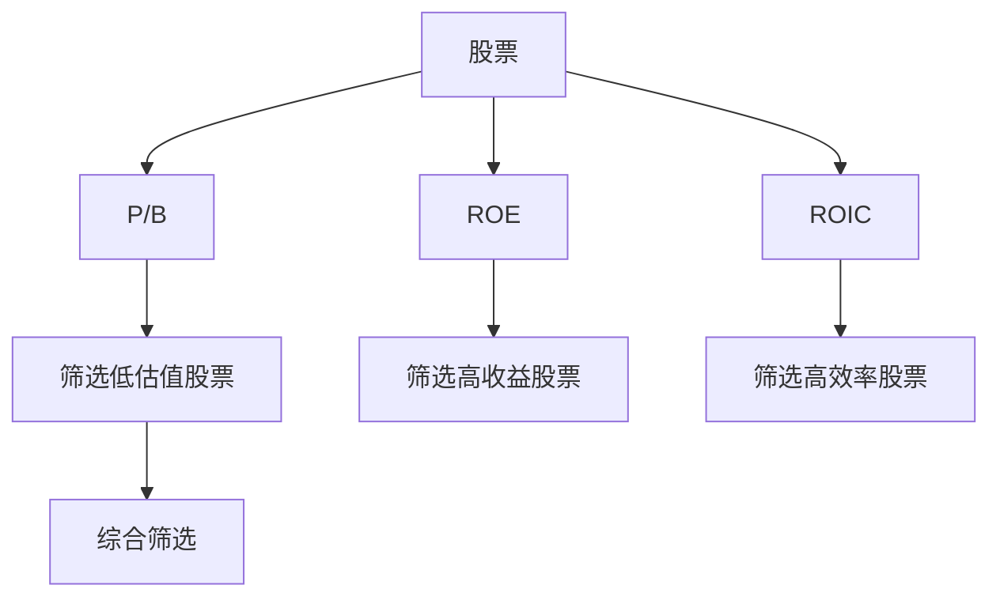
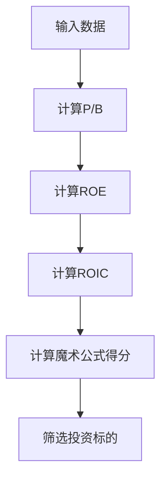
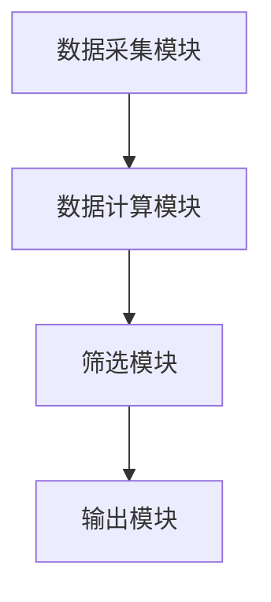
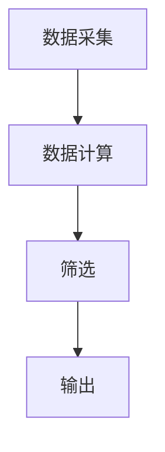

                 


# 乔尔·格林布拉特的魔术公式投资法

> 关键词：乔尔·格林布拉特，魔术公式，投资法，价值投资，成长投资，数学模型，算法实现，系统架构，项目实战

> 摘要：本文深入探讨了乔尔·格林布拉特的魔术公式投资法，从其背景、核心概念、数学模型、算法实现、系统架构到项目实战，结合技术语言和逻辑推理，为读者提供了全面的分析和解读。本文适合对投资方法和量化分析感兴趣的读者阅读。

---

## 第一部分: 魔术公式投资法的背景与基础

### 第1章: 魔术公式投资法概述

#### 1.1 乔尔·格林布拉特与魔术公式

##### 1.1.1 乔尔·格林布拉特的背景介绍
乔尔·格林布拉特（Joel Greenblatt）是美国著名投资家，以其独特的“魔术公式”投资法闻名。他在投资领域有着丰富的实战经验，并著有《股市稳赚》（The New York Times Bestseller）一书，系统地阐述了这一投资方法。格林布拉特的投资理念结合了价值投资和成长投资的精髓，主张通过量化指标筛选出具有高投资价值的公司。

##### 1.1.2 魔术公式投资法的核心理念
魔术公式投资法的核心在于通过量化指标（如ROE、ROIC等）筛选出具有高收益、低估值的公司。这种方法既考虑了公司的盈利能力（成长性），又考虑了其估值的合理性，是一种典型的“双因子”投资策略。

##### 1.1.3 魔术公式在投资领域的地位与影响
魔术公式投资法自提出以来，因其简单实用、易于量化的特点，受到广大投资者的关注。尤其是在量化投资领域，这种方法为投资者提供了一种高效的选股工具。

---

### 第2章: 魔术公式的构成与核心概念

#### 2.1 魔术公式的核心因子

##### 2.1.1 股价与账面价值比率（P/B）
P/B比率是股价与每股账面价值的比率，用于衡量公司股价是否被低估。公式为：
$$ P/B = \frac{股票价格}{每股账面价值} $$

##### 2.1.2 收益率（ROE）
ROE是公司净利润与股东权益的比率，衡量公司盈利能力。公式为：
$$ ROE = \frac{净利润}{股东权益} $$

##### 2.1.3 投资资本回报率（ROIC）
ROIC是公司息税前利润与投资资本的比率，衡量公司使用资本的效率。公式为：
$$ ROIC = \frac{EBIT}{投资资本} $$

##### 2.1.4 其他辅助因子
包括市盈率（P/E）、股息率等，用于进一步筛选和验证。

#### 2.2 魔术公式的核心概念与联系

##### 2.2.1 核心概念原理
魔术公式通过结合P/B和ROE/ROIC等指标，筛选出具有高收益、低估值的公司。其核心在于平衡成长性和估值的合理性。

##### 2.2.2 核心概念属性特征对比表格
以下是一个对比表格，展示了P/B、ROE和ROIC的主要特征：

| 指标 | 特征                   |
|------|------------------------|
| P/B  | 衡量股价与账面价值的比值，低值可能表示低估 |
| ROE  | 衡量净利润与股东权益的比值，高值表示高收益 |
| ROIC | 衡量EBIT与投资资本的比值，高值表示高效率 |

##### 2.2.3 ER实体关系图架构（Mermaid流程图）


---

### 第3章: 魔术公式的数学模型与公式

#### 3.1 魔术公式的基本公式

##### 3.1.1 魔术公式的核心公式
魔术公式的最终得分计算如下：
$$ 魔术公式得分 = \frac{ROE}{P/B} $$

##### 3.1.2 公式中的变量与参数
- ROE：公司过去几年的平均ROE
- P/B：当前股价与每股账面价值的比率

##### 3.1.3 公式的数学推导与验证
通过历史数据验证，魔术公式得分高的公司往往具有较高的投资回报率。

---

#### 3.2 魔术公式的数学模型

##### 3.2.1 模型的构建过程
1. 收集公司财务数据
2. 计算P/B、ROE、ROIC等指标
3. 计算魔术公式得分
4. 根据得分筛选投资标的

##### 3.2.2 模型的输入与输出
- 输入：公司股价、账面价值、净利润、股东权益、投资资本、EBIT
- 输出：魔术公式得分

##### 3.2.3 模型的优化与改进
根据实际效果，可以引入更多的因子（如市盈率）进行优化。

---

## 第4章: 魔术公式的算法原理与实现

### 4.1 魔术公式的算法原理

#### 4.1.1 算法的逻辑流程


#### 4.1.2 算法的输入与输出
- 输入：公司财务数据
- 输出：魔术公式得分和投资标的列表

---

### 4.2 魔术公式的算法实现

#### 4.2.1 算法实现的步骤
1. 收集公司数据
2. 计算P/B、ROE、ROIC
3. 计算魔术公式得分
4. 筛选得分高的公司

#### 4.2.2 算法实现的代码示例
```python
def calculate_magic_formula_score(stock_data):
    p_b = stock_data['股价'] / stock_data['账面价值']
    roe = stock_data['净利润'] / stock_data['股东权益']
    roic = stock_data['EBIT'] / stock_data['投资资本']
    magic_formula_score = roe / p_b
    return magic_formula_score
```

#### 4.2.3 算法实现的优化与改进
通过并行计算和数据预处理优化算法效率。

---

## 第5章: 魔术公式的系统分析与架构设计

### 5.1 魔术公式的系统架构

#### 5.1.1 系统架构的设计思路
系统分为数据采集、计算、筛选和输出四个模块。

#### 5.1.2 系统架构的模块划分


#### 5.1.3 系统架构的流程图（Mermaid）


---

## 第6章: 魔术公式的项目实战

### 6.1 项目环境的安装与配置

#### 6.1.1 环境搭建的步骤
1. 安装Python和必要的库（如Pandas、NumPy）
2. 下载公司财务数据

#### 6.1.2 环境搭建的注意事项
确保数据来源可靠，避免数据偏差。

#### 6.1.3 环境搭建的代码示例
```python
import pandas as pd
import numpy as np
```

### 6.2 项目核心实现的代码分析

#### 6.2.1 核心代码的编写
```python
def main():
    stock_data = pd.read_csv('company_data.csv')
    scores = calculate_magic_formula_score(stock_data)
    selected_stocks = stock_data[scores > threshold]
    print(selected_stocks)

if __name__ == "__main__":
    main()
```

#### 6.2.2 核心代码的解读
1. 读取数据
2. 计算得分
3. 筛选股票
4. 输出结果

#### 6.2.3 核心代码的优化
优化数据读取和计算效率。

---

## 第7章: 魔术公式的最佳实践与小结

### 7.1 小结
魔术公式投资法是一种高效的投资策略，通过量化指标筛选出具有高投资价值的公司。本文从背景、核心概念、数学模型、算法实现到项目实战，全面解读了这种方法。

### 7.2 注意事项
- 数据来源必须可靠
- 需要定期更新和调整模型
- 魔术公式只是一个筛选工具，需结合其他因素进行综合判断

### 7.3 拓展阅读
建议阅读《股市稳赚》深入理解魔术公式。

---

作者：AI天才研究院/AI Genius Institute & 禅与计算机程序设计艺术 /Zen And The Art of Computer Programming

