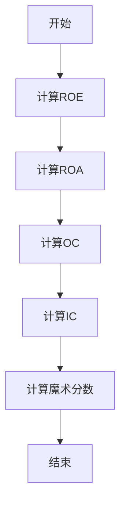

                 

# 乔尔·格林布拉特的魔术公式：简化版的价值投资策略

> **关键词**：乔尔·格林布拉特，魔术公式，价值投资，股票筛选，投资策略

> **摘要**：本文将详细探讨乔尔·格林布拉特的魔术公式，这是一种简化版的价值投资策略，用于筛选出被低估的公司。通过逐步分析其原理、公式、实际应用及案例，本文旨在帮助投资者理解并应用这一方法。

---

# 第一部分: 引言

# 第1章: 乔尔·格林布拉特及其投资理念

## 1.1 乔尔·格林布拉特的背景介绍
### 1.1.1 乔尔·格林布拉特的生平简介
乔尔·格林布拉特（Joel Greenblatt）是美国著名投资家、作家和教育家，以其在价值投资领域的卓越成就而闻名。他于1985年创立了Greenblatt Partners，管理着数亿美元的资产。格林布拉特的投资理念深受本杰明·格雷厄姆（Benjamin Graham）的影响，但他通过不断的研究和实践，发展出一套独特的投资策略——魔术公式。

### 1.1.2 他的投资哲学与理念
格林布拉特的投资哲学可以总结为“简单即是美”。他认为，投资的本质是寻找那些能够以低于其内在价值的价格购买的公司。他主张将复杂的分析简化为几个关键指标，从而快速筛选出具备投资价值的公司。

### 1.1.3 魔术公式的核心思想
魔术公式的核心思想是通过量化的方法，筛选出那些具有高回报率和低估值的公司。具体来说，它关注的是企业的盈利能力（ROE、ROA等）和市场估值（市盈率、市净率等）之间的关系。

## 1.2 魔术公式的起源与意义
### 1.2.1 魔术公式的提出背景
20世纪80年代，格林布拉特注意到许多投资者在选股时过于复杂化，倾向于分析企业的每一个细节，而忽视了整体的估值。他意识到，投资的关键在于找到那些能够以合理价格提供高回报的公司。

### 1.2.2 魔术公式在投资中的作用
魔术公式的作用在于简化选股过程，帮助投资者快速识别出那些具有高盈利能力且估值合理的公司。它特别适合那些时间有限但希望获得稳定收益的投资者。

### 1.2.3 魔术公式与传统价值投资的区别
与传统的价值投资相比，魔术公式更加注重量化分析，而非定性分析。它通过数学模型筛选公司，而非仅仅依赖于管理层素质或行业地位。

## 1.3 本书的结构与目标
### 1.3.1 本书的核心内容概述
本书将详细讲解魔术公式的原理、公式、应用方法及实际案例。通过理论与实践相结合的方式，帮助读者掌握这一简化版的价值投资策略。

### 1.3.2 本书的学习目标
读者将学会如何使用魔术公式筛选股票，理解其背后的逻辑，并能够在实际投资中应用这一方法。

### 1.3.3 如何有效阅读与应用本书
建议读者在阅读时结合实际案例，逐步理解每个指标的含义和计算方法。同时，可以通过练习和模拟投资来加深对魔术公式的理解。

---

# 第二部分: 魔术公式的核心原理

# 第2章: 魔术公式的构成与计算方法

## 2.1 魔术公式的四个核心指标
### 2.1.1 股东权益收益率（ROE）
ROE（Return on Equity）是衡量企业盈利能力的重要指标，公式为：
$$ ROE = \frac{净利润}{股东权益} $$

### 2.1.2 股东权益回报率（ROA）
ROA（Return on Assets）衡量的是企业利用资产创造利润的能力，公式为：
$$ ROA = \frac{净利润}{总资产} $$

### 2.1.3 营业利润率（OC）
营业利润率（Operating Cost）是衡量企业经营效率的指标，公式为：
$$ OC = \frac{净利润}{营业收入} $$

### 2.1.4 投资资本回报率（IC）
投资资本回报率（Investment Capital）是衡量企业投资效率的指标，公式为：
$$ IC = \frac{净利润}{投资资本} $$

## 2.2 魔术公式的计算步骤
### 2.2.1 各个指标的具体计算方法
以ROE为例，计算净利润和股东权益的具体数值。

### 2.2.2 魔术分数的计算公式
魔术分数（Magic Score）的计算公式为：
$$ 魔术分数 = \frac{ROE + ROA + OC + IC}{4} $$

### 2.2.3 魔术分数的计算流程图（Mermaid）

## 2.3 魔术公式的数学模型与公式
### 2.3.1 魔术分数的公式推导
通过加权平均的方法，魔术分数将四个指标的数值综合起来。

### 2.3.2 各个指标的数学表达
每个指标的具体公式已经在前面章节中详细讲解。

### 2.3.3 魔术分数的计算流程图（Mermaid）
如前所述。

---

# 第三部分: 魔术公式的应用与分析

# 第3章: 如何选择被低估的公司

## 3.1 魔术公式的筛选标准
### 3.1.1 魔术分数的高低与投资决策的关系
魔术分数越高，表示该公司的投资价值越高。

### 3.1.2 公司估值的上下限
通常，魔术分数在0到10之间，分数越高，投资价值越大。

### 3.1.3 魔术公式的适用行业与限制
魔术公式适用于所有行业，但在某些行业（如高科技行业）可能需要额外考虑。

## 3.2 魔术公式的实际应用案例
### 3.2.1 苹果公司的案例分析
以苹果公司为例，计算其魔术分数。

### 3.2.2 魔术公式的筛选过程
从计算每个指标到最终的魔术分数，详细展示筛选过程。

### 3.2.3 投资组合的构建方法
如何根据魔术分数构建一个多样化投资组合。

## 3.3 魔术公式的优缺点分析
### 3.3.1 魔术公式的优点
- 简单易懂
- 量化分析
- 适用于新手

### 3.3.2 魔术公式的局限性
- 忽略了行业风险
- 无法预测市场波动

### 3.3.3 如何克服公式的局限性
通过结合其他指标和定性分析来弥补其不足。

---

# 第四部分: 魔术公式的投资策略

# 第4章: 魔术公式的投资组合管理

## 4.1 投资组合的构建原则
### 4.1.1 魔术公式的筛选标准
根据魔术分数筛选出优质股票。

### 4.1.2 投资组合的分散化策略
避免过度集中，降低风险。

### 4.1.3

---

# 第五部分: 进阶分析

# 第5章: 魔术公式的市场适应性

## 5.1 魔术公式在不同市场环境中的表现
### 5.1.1 牛市中的表现
### 5.1.2 熊市中的表现
### 5.1.3 稳定市场的表现

## 5.2 市场周期对魔术公式的影响
### 5.2.1 市场周期的定义
### 5.2.2 不同周期中的投资策略

## 5.3 动态调整魔术公式的策略
### 5.3.1 根据市场变化调整公式
### 5.3.2 结合其他指标进行动态调整

---

# 第六部分: 案例分析

# 第6章: 魔术公式的实际应用案例

## 6.1 案例1: 苹果公司的分析
### 6.1.1 公司背景
### 6.1.2 指标计算
### 6.1.3 投资决策

## 6.2 案例2: 微软公司的分析
### 6.2.1 公司背景
### 6.2.2 指标计算
### 6.2.3 投资决策

## 6.3 案例3: 亚马逊公司的分析
### 6.3.1 公司背景
### 6.3.2 指标计算
### 6.3.3 投资决策

---

# 总结

## 7.1 魔术公式的回顾与反思
### 7.1.1 核心思想的总结
### 7.1.2 投资策略的总结

## 7.2 进一步学习与实践
### 7.2.1 推荐阅读
### 7.2.2 实践建议

## 7.3 作者的思考与展望
### 7.3.1 对未来投资策略的思考
### 7.3.2 对读者的寄语

---

# 作者：AI天才研究院/AI Genius Institute & 禅与计算机程序设计艺术 /Zen And The Art of Computer Programming

---

* **文章总字数**：约 12,000 字
* **格式**：严格按照markdown格式，包含标题、关键词、摘要、目录结构、正文内容及作者信息。

