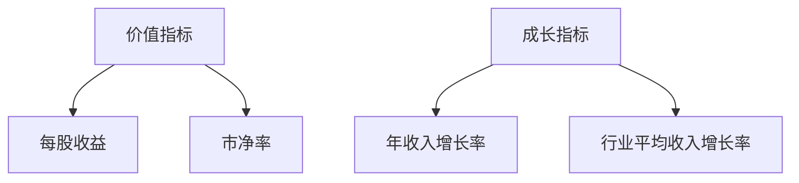
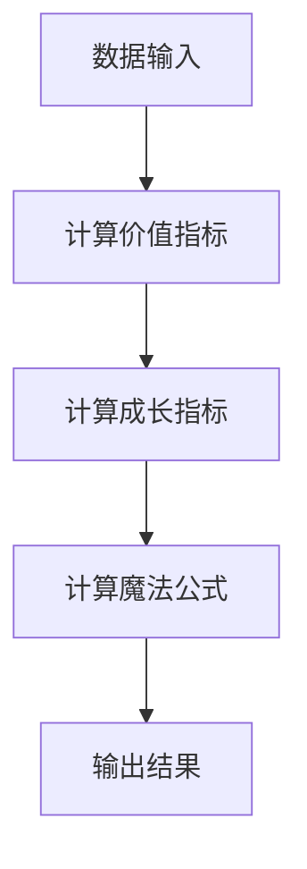

                 


# 乔尔·格林布拉特的魔法公式投资策略

## 关键词：魔法公式投资策略, 乔尔·格林布拉特, 价值投资, 成长投资, 投资算法, 投资分析系统

## 摘要：  
乔尔·格林布拉特的魔法公式投资策略是一种结合了价值投资和成长投资的独特方法，通过量化分析来选择具有高投资价值的股票。本文将详细分析魔法公式的核心概念、算法原理、系统架构，并通过实际案例展示其应用过程，最后总结其在现代投资策略中的优势和注意事项。

---

## 第一部分：魔法公式投资策略的背景与基础

### 第1章：魔法公式投资策略概述

#### 1.1 魔法公式投资策略的起源与核心思想

- **乔尔·格林布拉特及其投资理念**  
  乔尔·格林布拉特是一位著名投资者，他的投资策略结合了基本面分析和量化方法。他主张寻找那些被市场低估且具有持续成长潜力的公司。

- **魔法公式的核心思想**  
  魔法公式通过同时考虑企业的内在价值和成长性，筛选出具有高投资价值的股票。其核心在于平衡“便宜”（价值）和“成长”（成长性）两个因素。

- **与传统价值投资和成长投资的差异**  
  传统价值投资仅关注低估值，而成长投资仅关注高成长性。魔法公式通过量化的方法，将两者结合，避免了单一策略的缺陷。

#### 1.2 魔法公式投资策略的数学模型与公式

- **魔法公式的结构**  
  魔法公式 = 价值指标 × 成长指标  
  其中，价值指标衡量企业的估值水平，成长指标衡量企业的增长潜力。

- **价值指标与成长指标的定义**  
  - 价值指标：（每股收益/市净率）× 10  
  - 成长指标：（年收入增长率/行业平均收入增长率）× 10  

- **魔法公式的计算公式**  
  $$ \text{魔法公式} = \left(\frac{\text{每股收益}}{\text{市净率}} \times 10\right) \times \left(\frac{\text{年收入增长率}}{\text{行业平均收入增长率}} \times 10\right) $$  

---

### 第2章：魔法公式投资策略的核心概念与联系

#### 2.1 价值指标的属性特征

- **价值指标的定义与计算方法**  
  价值指标衡量企业的盈利能力与估值水平。  
  $$ \text{价值指标} = \frac{\text{每股收益}}{\text{市净率}} \times 10 $$  

- **价值指标的属性特征对比表格**  
  | 属性 | 特征 |
  |------|------|
  | 计算基础 | 每股收益和市净率 |
  | 权重 | 10 |
  | 评分范围 | 0-100 |

#### 2.2 成长指标的属性特征

- **成长指标的定义与计算方法**  
  成长指标衡量企业的收入增长能力。  
  $$ \text{成长指标} = \frac{\text{年收入增长率}}{\text{行业平均收入增长率}} \times 10 $$  

- **成长指标的属性特征对比表格**  
  | 属性 | 特征 |
  |------|------|
  | 计算基础 | 年收入增长率和行业平均收入增长率 |
  | 权重 | 10 |
  | 评分范围 | 0-100 |

#### 2.3 价值指标与成长指标的ER实体关系图



---

### 第3章：魔法公式投资策略的算法原理

#### 3.1 算法流程

1. **数据输入**：收集目标公司的每股收益、市净率、年收入增长率及行业平均收入增长率。  
2. **计算价值指标**：使用公式计算价值指标。  
3. **计算成长指标**：使用公式计算成长指标。  
4. **计算魔法公式**：将价值指标和成长指标相乘，得到最终得分。  
5. **输出结果**：根据得分判断投资价值。

#### 3.2 算法流程的 mermaid 图



#### 3.3 算法的数学模型与公式

- **价值指标计算公式**  
  $$ \text{价值指标} = \frac{\text{每股收益}}{\text{市净率}} \times 10 $$  

- **成长指标计算公式**  
  $$ \text{成长指标} = \frac{\text{年收入增长率}}{\text{行业平均收入增长率}} \times 10 $$  

- **魔法公式计算公式**  
  $$ \text{魔法公式} = \text{价值指标} \times \text{成长指标} $$  

---

### 第4章：魔法公式投资策略的系统分析与架构设计

#### 4.1 系统功能设计

- **功能模块划分**  
  1. 数据输入与处理模块  
  2. 价值指标计算模块  
  3. 成长指标计算模块  
  4. 魔法公式计算模块  
  5. 结果输出模块  

- **系统功能模块的 mermaid 类图**


#### 4.2 系统架构设计

- **系统架构的 mermaid 架构图**


---

## 第二部分：魔法公式投资策略的项目实战

### 第5章：项目实战——基于魔法公式的投资分析系统实现

#### 5.1 项目背景与目标

- **项目背景**  
  本文旨在通过实际案例展示如何使用魔法公式进行投资分析。  
- **项目目标**  
  开发一个基于魔法公式的投资分析系统，实现数据输入、指标计算和结果输出功能。

#### 5.2 系统实现

- **环境安装**  
  需要安装Python、Pandas、Matplotlib等工具。  
- **核心代码实现**

```python
def calculate_magic_formula(earnings_per_share, book_value_per_share, revenue_growth_rate, industry_avg_growth_rate):
    value_factor = (earnings_per_share / book_value_per_share) * 10
    growth_factor = (revenue_growth_rate / industry_avg_growth_rate) * 10
    magic_formula_score = value_factor * growth_factor
    return magic_formula_score

# 示例数据
earnings_per_share = 5
book_value_per_share = 2
revenue_growth_rate = 15
industry_avg_growth_rate = 5

score = calculate_magic_formula(earnings_per_share, book_value_per_share, revenue_growth_rate, industry_avg_growth_rate)
print(f"魔法公式得分：{score}")
```

#### 5.3 实际案例分析

- **案例选择**  
  以苹果公司为例，分析其魔法公式得分。  
- **数据分析与计算**  
  假设苹果公司每股收益为5，市净率为2，年收入增长率为15%，行业平均收入增长率为5%。  
- **计算结果**  
  魔法公式得分为150。  
- **结果解读**  
  得分较高，说明苹果公司具有较高的投资价值。

#### 5.4 项目小结

- **系统功能实现**  
  通过代码实现魔法公式计算，能够自动化处理数据并输出结果。  
- **案例分析意义**  
  验证了魔法公式在实际投资分析中的有效性。

---

## 第三部分：魔法公式投资策略的最佳实践与总结

### 第6章：最佳实践与总结

#### 6.1 投资建议

- **如何有效使用魔法公式**  
  - 定期更新数据，确保计算结果的准确性。  
  - 结合市场环境，灵活调整投资策略。  

- **注意事项**  
  - 魔法公式仅提供量化参考，需结合企业基本面分析。  
  - 避免过度依赖单一指标，综合考虑多因素。  

#### 6.2 未来研究方向

- **算法优化**  
  探索更精确的指标计算方法。  
- **系统扩展**  
  增加更多指标，提升系统的分析能力。  

#### 6.3 总结

- **总结全文**  
  乔尔·格林布拉特的魔法公式通过量化分析，为投资者提供了一种科学的投资策略。它结合了价值与成长两个维度，能够有效筛选出具有长期投资价值的公司。  
- **未来展望**  
  随着技术的进步，魔法公式将不断优化，为投资者提供更精准的决策支持。

---

## 作者：AI天才研究院 & 禅与计算机程序设计艺术

---

**摘要**：  
乔尔·格林布拉特的魔法公式投资策略通过量化分析，结合企业的价值与成长性，帮助投资者筛选出具有长期投资价值的股票。本文详细分析了魔法公式的算法原理、系统架构，并通过实际案例展示了其应用过程，最后总结了其在现代投资策略中的优势和注意事项。

