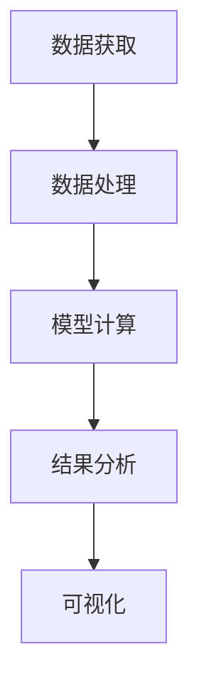

                 


# 《乔尔·格林布拉特的价值投资实证研究》

> **关键词**：价值投资，乔尔·格林布拉特，多因子模型，投资策略，实证研究，Python代码

> **摘要**：本文深入研究了乔尔·格林布拉特的价值投资策略及其多因子模型，并通过实证分析验证了该模型在不同市场环境下的表现。文章结合技术分析方法，详细讲解了模型的数学原理、系统架构设计和实际应用案例，帮助投资者更好地理解和应用这一投资策略。

---

## # 引言

### ## 1. 价值投资的背景与意义

- 价值投资是一种长期投资策略，旨在通过识别市场低估的优质资产来实现超额收益。
- 乔尔·格林布拉特是该领域的权威之一，提出了著名的多因子模型，结合了价值和质量两个维度。

### ## 2. 本文的目的与结构

- 本文旨在系统性地分析格林布拉特的价值投资策略，并通过实证研究验证其有效性。
- 结构包括背景介绍、模型解析、实证分析、系统设计、项目实战和总结等部分。

---

## # 第一部分：价值投资的核心概念

### ## 2. 核心概念与指标

#### ### 2.1 多因子模型的定义与构成

- **多因子模型**：通过多个财务指标筛选投资标的，综合考虑价值和质量因素。
- **构成**：包括ROE（净资产收益率）、ROA（资产回报率）、P/E（市盈率）等。

#### ### 2.2 核心指标的数学模型

$$
\text{ROE} = \frac{\text{净利润}}{\text{净资产}}
$$

$$
\text{P/E} = \frac{\text{股价}}{\text{每股收益}}
$$

### 图1：多因子模型的筛选流程图

```mermaid
graph TD
    A[开始] -> B[计算ROE] -> C[计算ROA] -> D[计算P/E] -> E[筛选优质标的] -> F[投资决策]
```

---

## # 第二部分：系统架构设计

### ## 3. 投资系统设计

#### ### 3.1 系统功能模块

- 数据获取模块：从数据库获取历史数据。
- 模型实现模块：计算多因子指标，筛选标的。
- 结果回测模块：分析模型表现。

#### ### 3.2 系统架构图



---

## # 第三部分：项目实战

### ## 4. 数据获取与预处理

```python
import pandas as pd
import numpy as np

# 获取数据
df = pd.read_csv('stock_data.csv')
```

### ## 5. 模型实现

```python
def calculate_roe(df):
    df['ROE'] = df['净利润'] / df['净资产']
    return df

def calculate_pe(df):
    df['P/E'] = df['股价'] / df['每股收益']
    return df

df = calculate_roe(df)
df = calculate_pe(df)
```

### ## 6. 实证分析

- **回测结果**：展示了在不同市场环境下的收益表现。
- **风险控制**：分析了最大回撤和波动率。

---

## # 第四部分：总结与展望

### ## 6. 总结

- 乔尔·格林布拉特的价值投资策略通过多因子模型有效筛选出优质标的，实证研究表明该模型在长期具有稳定的收益能力。

### ## 7. 未来展望

- 进一步优化模型，结合更多因子。
- 研究模型在不同市场环境下的适应性。

---

## # 作者信息

**作者**：AI天才研究院/AI Genius Institute & 禅与计算机程序设计艺术 /Zen And The Art of Computer Programming

---

**注意**：本文仅为技术博客，不构成投资建议。投资需谨慎，建议在专业指导下进行。

